3Blue1Brown视频[《线性代数的本质》](https://www.bilibili.com/video/BV1ys411472E)的笔记。从空间变化理解线性代数。

- [向量](#向量)
  - [向量的几何意义](#向量的几何意义)
  - [向量的加法](#向量的加法)
  - [向量的数乘](#向量的数乘)
  - [向量的线性组合](#向量的线性组合)
  - [向量张成的空间](#向量张成的空间)
  - [线性相关和线性无关](#线性相关和线性无关)
  - [线性变换](#线性变换)
  - [向量补充](#向量补充)
      - [向量的长度](#向量的长度)
      - [向量点积性质](#向量点积性质)
      - [向量点积应用](#向量点积应用)
        - [计算向量a在b上的投影向量](#计算向量a在b上的投影向量)
        - [判断两个向量是否同向](#判断两个向量是否同向)
      - [向量叉积补充](#向量叉积补充)
        - [三维下产生向量的模等于二者模的乘积与夹角正弦值乘积](#三维下产生向量的模等于二者模的乘积与夹角正弦值乘积)
        - [向量叉积应用](#向量叉积应用)
          - [两个向量叉乘可以产生垂直于二者的法向量](#两个向量叉乘可以产生垂直于二者的法向量)
          - [判断点是否在三角形内](#判断点是否在三角形内)
      - [Span补充](#Span补充)
- [矩阵](#矩阵)
  - [复合变换](#复合变换)
  - [矩阵乘法](#矩阵乘法)
  - [矩阵行列式](#矩阵行列式)
  - [线性方程组](#线性方程组)
  - [秩和列空间](#秩和列空间)
  - [矩阵补充](#矩阵补充)
    - [什么是矩阵](#什么是矩阵)
    - [单位矩阵](#单位矩阵)
    - [矩阵加法](#矩阵加法)
    - [矩阵乘法规则](#矩阵乘法规则)
    - [矩阵转置](#矩阵转置)
    - [逆矩阵](#逆矩阵)
    - [行列式图](#行列式图)
    - [任意轴旋转推导](#任意轴旋转推导)
- [向量点积](#向量点积)
- [向量叉积](#向量叉积)
- [基变换](#基变换)
  - [使用不同的基向量](#使用不同的基向量)
  - [如何在不同坐标系之间进行转化](#如何在不同坐标系之间进行转化)
  - [基向量切换导致矩阵表示改变](#基向量切换导致矩阵表示改变)
  - [相似矩阵](#相似矩阵)
- [特征向量与特征值](#特征向量与特征值)
  - [特征值与特征向量的用途](#特征值与特征向量的用途)
  - [特征值与特征向量的求解](#特征值与特征向量的求解)
  - [二维线性变化不一定有特征向量](#二维线性变化不一定有特征向量)
  - [只有一个特征值存在多个特征向量](#只有一个特征值存在多个特征向量)
  - [特征基](#特征基)
  - [矩阵对角化](#矩阵对角化)

### 向量

三种不同视角看待向量：
1. 物理学视角：空间中的**箭头**，由长度和方向决定一个向量(arrows pointing in space)，向量平移不变
2. 数学视角：向量(a vector can be anything)，只要能保证相加和与数字相乘是有意义的即可，太抽象了
3. 计算机视角：向量等同于有序的数字**列表**(ordered list of numbers)
   
#### 向量的几何意义

和物理专业的看法有一定出入的是，线性代数中的**向量往往以坐标原点起始**。

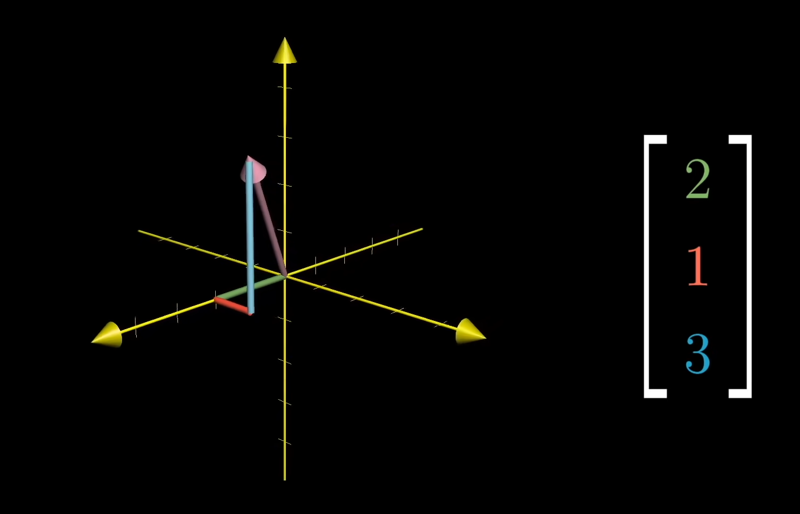

#### 向量的加法

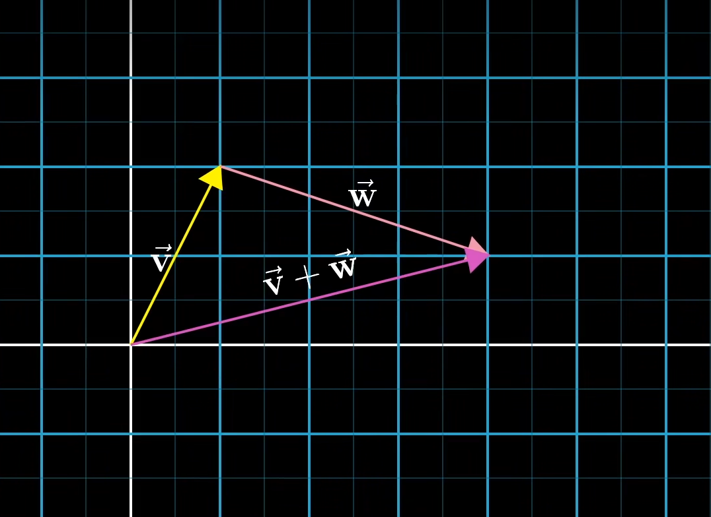

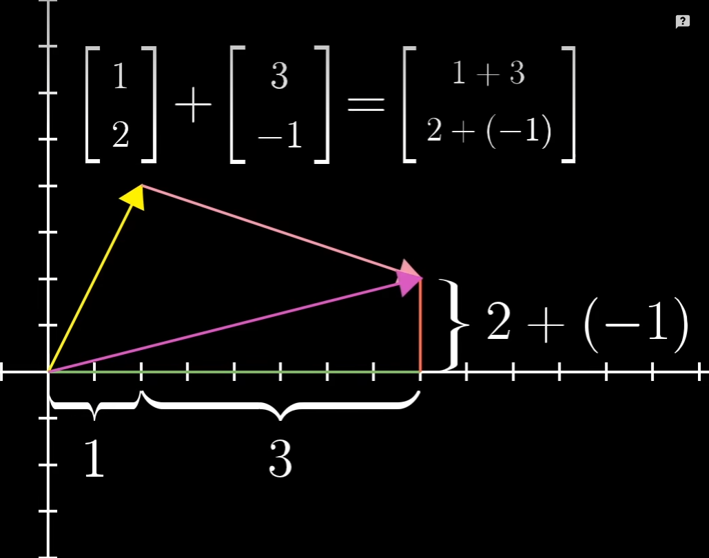

以$\vec{v} + \vec{w}$为例，即将$\vec{v}$平移，使其起点对准$\vec{w}$的终点，最终画一条从$\vec{v}$起点指向$\vec{w}$终点的向量

$\left[\begin{array}{c} 1 \\ 2 \end{array}\right] + \left[\begin{array}{c} 3 \\ -1 \end{array}\right] = \left[\begin{array}{c} 4 \\ 1 \end{array}\right]$

#### 向量的数乘

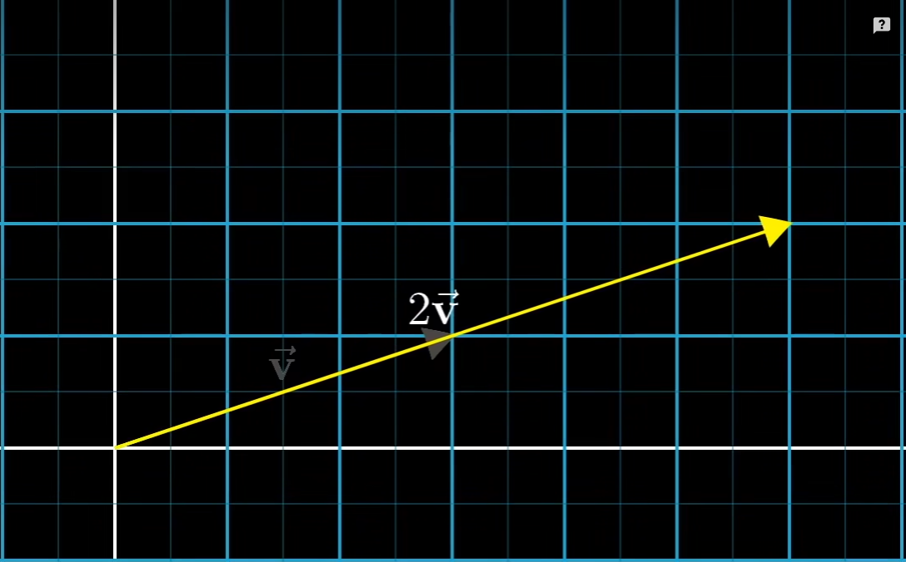

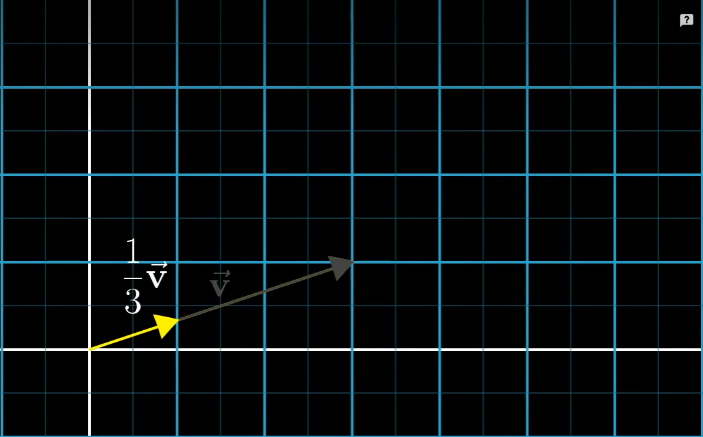

$2 \cdot \left[\begin{array}{c} 3 \\ 1 \end{array}\right] = \left[\begin{array}{c} 6 \\ 2 \end{array}\right]$

#### 向量的线性组合

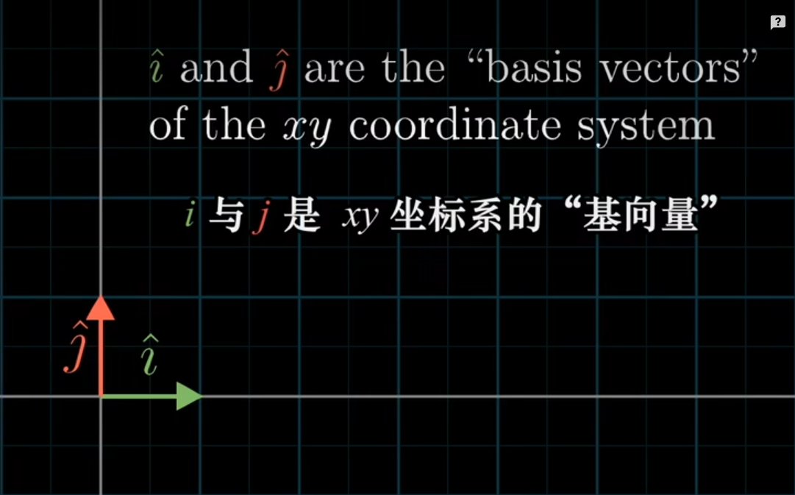

在xy坐标系中有两个特殊含义的向量

1. x轴上的单位向量$\hat{i}$ ，也被叫做i帽(i-hat)      
2. y轴上的单位向量$\hat{j}$ ，也被叫做j帽(j-hat)
  
这些单位向量被叫做坐标系的基向量

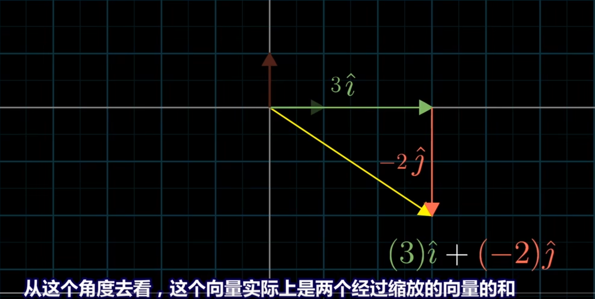

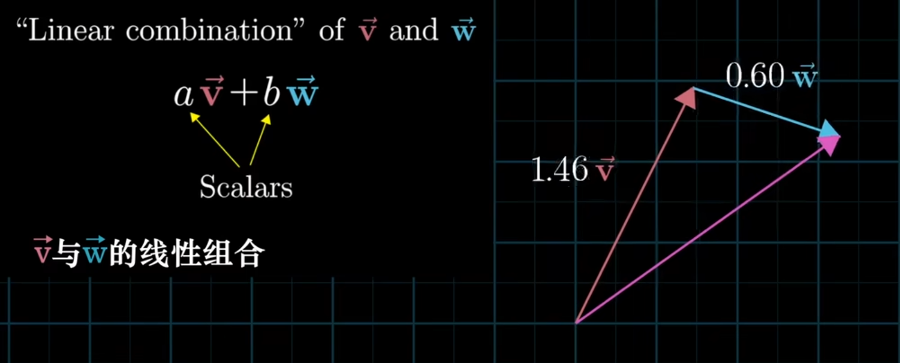

把向量看成是基向量**缩放后相加**的结果

$\left[\begin{array}{c} 3 \\ -2 \end{array}\right] = 3 \cdot \hat{i} - 2 \cdot \hat{j}$

这种向量的**缩放后相加**实际上就是**线性组合**(Linear Combination)。也就是说，向量可以理解成基向量的线性组合。

#### 向量张成的空间

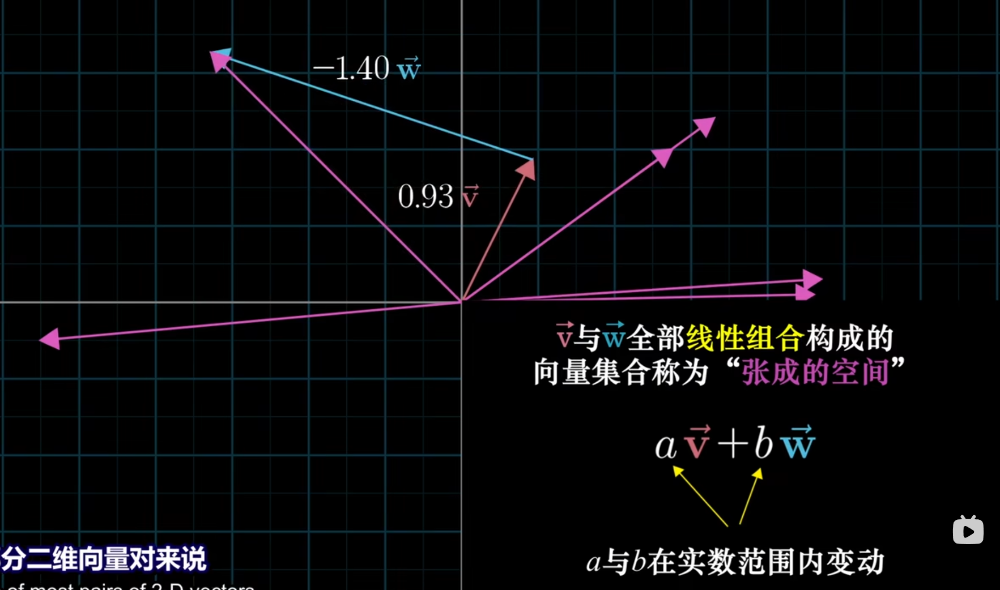

1. 一组基向量的线性组合所能到达的点的集合就是该组基向量**张成的空间**(Span)。
2. 在二维情况下，只要基向量不共线，它们张成的空间就覆盖平面上所有的点。
3. 如果基向量共线，它们张成的空间就只有一条线；
4. 如果基向量都是零向量，它们张成的空间就只有一个点。

#### 线性相关和线性无关

我们在向量的线性组合中添加了一个向量，但是并没有扩展这个线性组合张成的空间，这个时候这些向量被称作**线性相关**(Linearly Dependent)；如果一组向量中每一组向量都为这个线性组合扩展了新的维度， 这个时候这些向量被称作**线性无关**(Linearly Independent)。

#### 线性变换

线性变换(Linear Transformation): 接受一个向量并输出一个向量的变换。
1. 线性(Linear)指空间中的所有直线在变换后仍然是直线，且原点的位置没有发生改变，并且网格线平行且等距分布。
2. 变换(Transformation)本质上是函数(function)，但与函数不同的是，变换暗示你可以用可视化的运动来思考这个过程。
   
比如下面就不是:

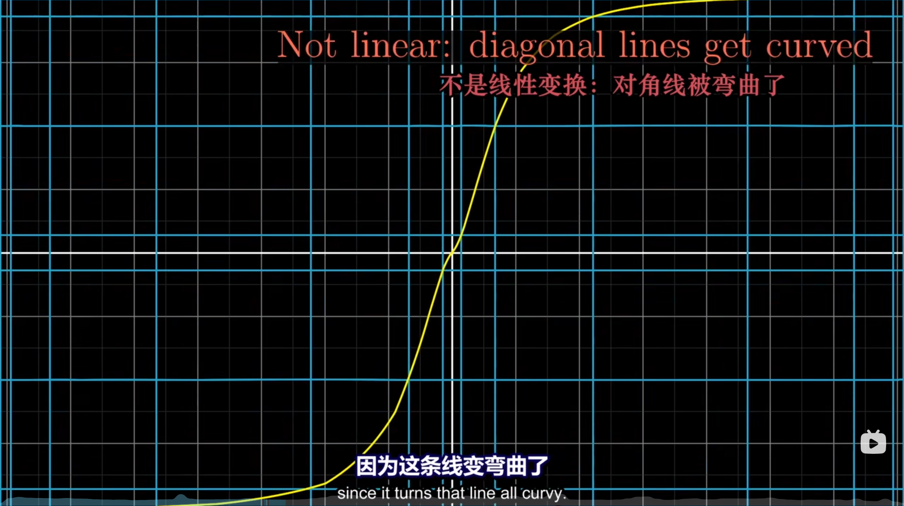

在线性变换中，只要确定基向量的变换后位置，就能确定其他所有向量的变换后位置。

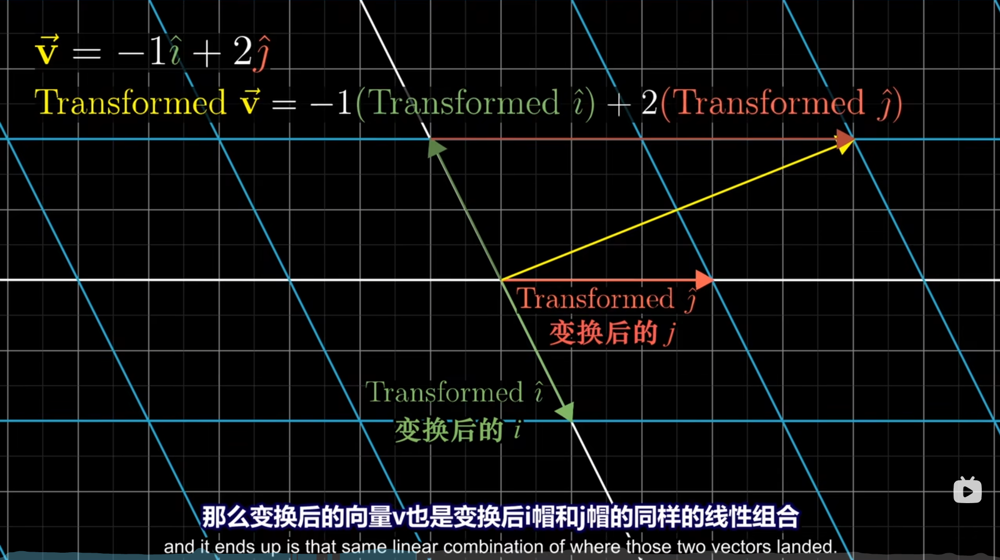

举例来说，对于向量

$
\vec{v} = \left[\begin{array}{c} x \\ y \end{array}\right] = x \cdot \hat{i} + y \cdot \hat{j}
$

变化后

$
\vec{v'} = x \cdot \hat{i'} + y \cdot \hat{j'}
$

例如:

$
\hat{i'} = \begin{bmatrix} 1 \\ -2 \end{bmatrix}, \quad \hat{j'} = \begin{bmatrix} 3 \\ 0 \end{bmatrix}
$

得出:

$
\begin{aligned}
\vec{v'} &= x \cdot \hat{i'} + y \cdot \hat{j'} \\
&= x \begin{bmatrix} 1 \\ -2 \end{bmatrix} + y \begin{bmatrix} 3 \\ 0 \end{bmatrix} \\
&= \begin{bmatrix} x + 3y \\ -2x \end{bmatrix}
\end{aligned}
$

把基向量变换后的向量作为列排成 $2 \times 2$ 的矩阵 $\begin{bmatrix} 1 & 3 \\ -2 & 0 \end{bmatrix}$，此时矩阵乘以向量 $\vec{v} = \begin{bmatrix} x \\ y \end{bmatrix}$，就是

$
\begin{bmatrix} 1 & 3 \\ -2 & 0 \end{bmatrix}
\begin{bmatrix} x \\ y \end{bmatrix}
= \begin{bmatrix} x + 3y \\ -2x \end{bmatrix}
= \vec{v'}
$

**矩阵本质上是对空间操纵的描述，用于定义一个线性变换的函数**。

**矩阵中的各列依次代表线性变换中，各基向量在变换后的结果(位置)**。矩阵对应的线性变换将**原基向量张成的空间**映射(求函数)到**变换后基向量张成的空间**。

### 向量补充

#### 向量的长度 

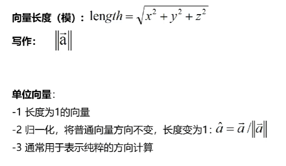

#### 向量点积性质

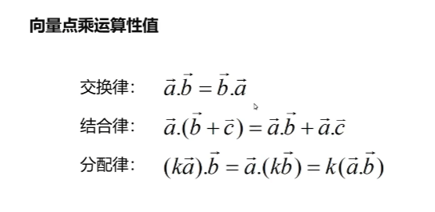

#### 向量点积应用

##### 计算向量a在b上的投影向量

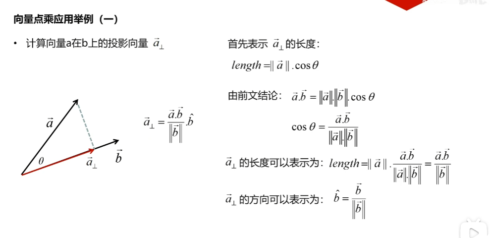

##### 判断两个向量是否同向

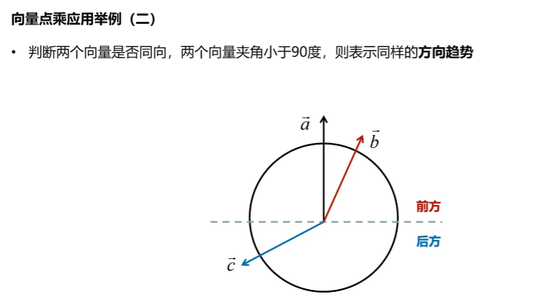

#### 向量叉积补充

##### 三维下产生向量的模等于二者模的乘积与夹角正弦值乘积

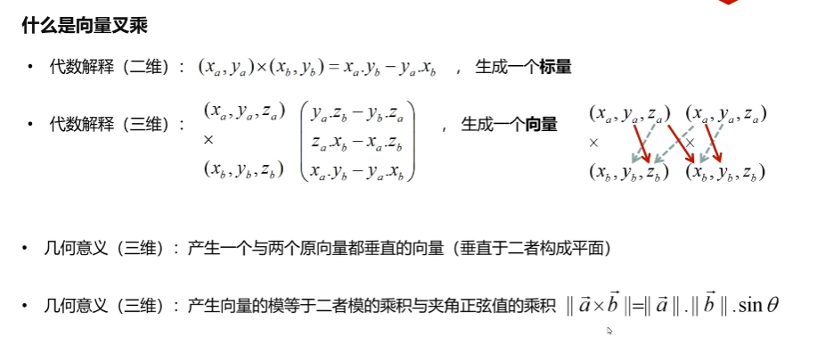

#### 向量叉积应用

##### 两个向量叉乘可以产生垂直于二者的法向量

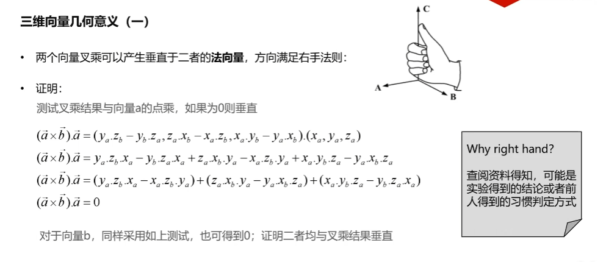

##### 判断点是否在三角形内

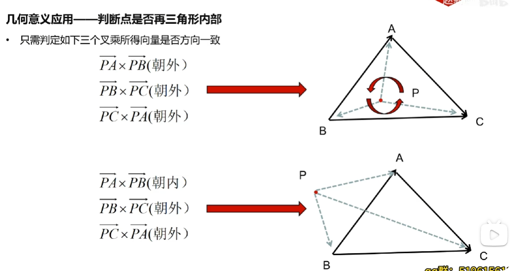

#### Span补充

Span 并不局限于“两个”向量，它可以针对任意数量的向量集合（哪怕只有 1 个向量，甚至 0 个向量）。

什么是单向量的 Span？

对于单个非零向量 $\mathbf{v}$，它的 Span（张成空间） 定义为该向量的所有标量乘积（线性组合）组成的集合：

$$\text{Span}(\mathbf{v}) = \{ c \cdot \mathbf{v} \mid c \in \mathbb{R} \}$$

几何意义：标量 $c$ 在实数范围内任意变动时，向量 $c \cdot \mathbf{v}$ 的终点就会在空间中拉伸、缩放、反向，从而延伸出一条穿过原点和该向量尖端的直线。

不同数量向量的 Span 几何直观：

### 2. 不同数量向量的 Span 几何直观

| 向量集合 | 几何特征（二维/三维空间中） | 说明 |
| :--- | :--- | :--- |
| **单个零向量** $\{\mathbf{0}\}$ | **原点**（单点） | $c \cdot \mathbf{0} = \mathbf{0}$，只能停在原点。 |
| **单个非零向量** $\{\mathbf{v}\}$ | **穿过原点的直线** | 图中的情况，缩放该向量得到一条线。 |
| **两个线性无关的二维向量** $\{\mathbf{v}_1, \mathbf{v}_2\}$ | **整个二维平面** | $c_1\mathbf{v}_1 + c_2\mathbf{v}_2$ 可以到达平面内的任意一点。 |
| **两个共线的向量** | **穿过原点的直线** | 因为它们方向相同或相反，组合起来依然跑不出那条直线。 |

### 矩阵

#### 复合变换

矩阵是对空间线性变换的描述函数，依次两个线性变换称为**复合变换**(Composition of Transformations)。

一个向量依次经历两个矩阵的线性变换得到的结果，等价于其经过一个复合变换的结果，如下图所示:

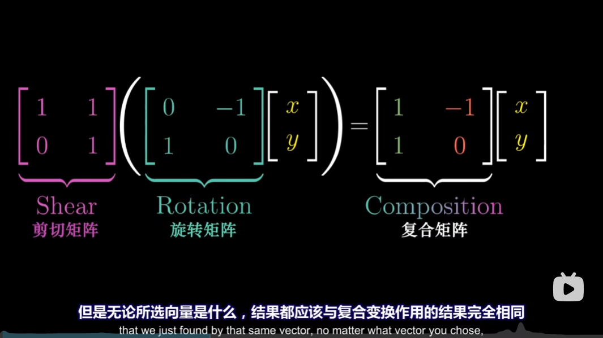

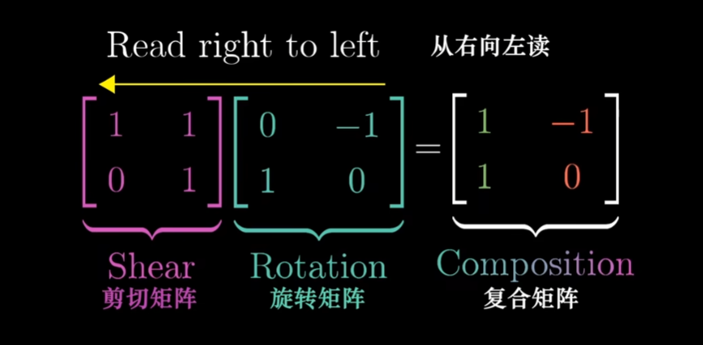

#### 矩阵乘法

我的理解，i帽和j帽经过M1线性变化后对应的是M1矩阵第一列和第二列，同理，再次经过M2线性变化，i帽撇为:

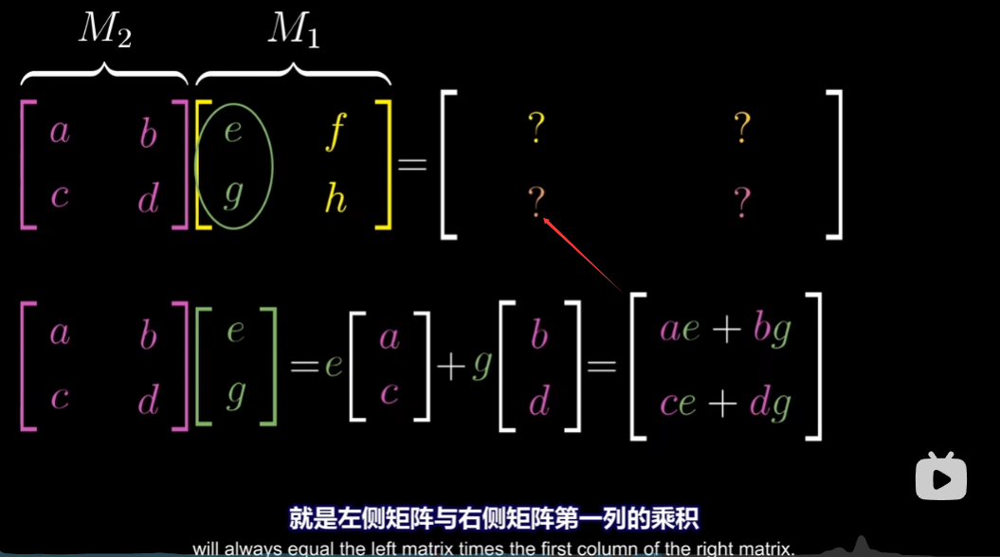

j帽撇为:

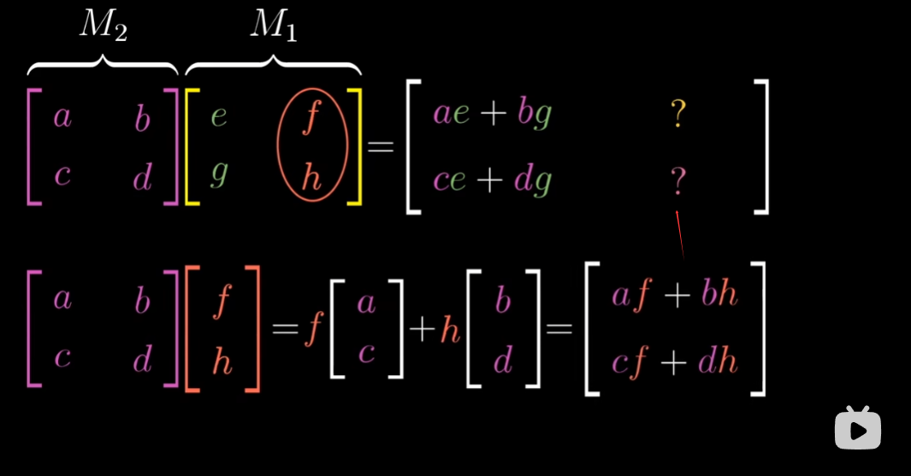

性质:

1. 矩阵乘法不满足交换律，即 $AB \neq BA$

旋转矩阵 $R$ 为：$$R = \begin{bmatrix} 0 & -1 \\ 1 & 0 \end{bmatrix}$$

剪切矩阵 $S$ 为：$$S = \begin{bmatrix} 1 & 1 \\ 0 & 1 \end{bmatrix}$$

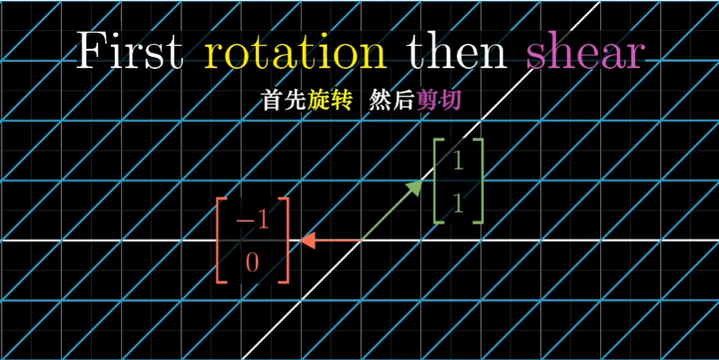

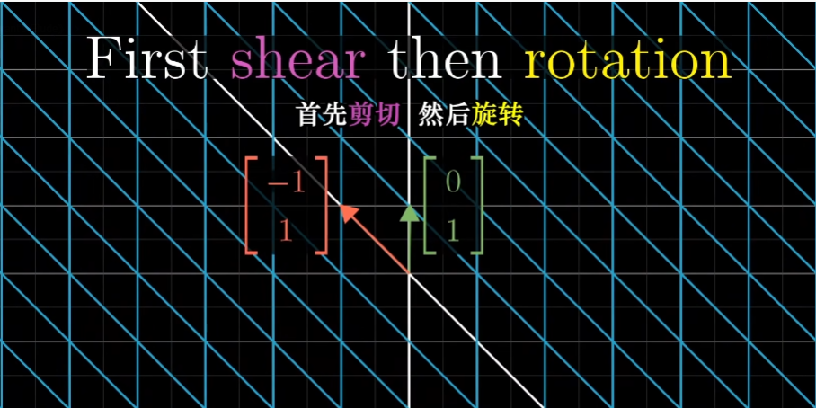

2. 矩阵乘法满足结合律，即 $(AB)C = A(BC)$
  
**只从线性变换的角度上思考，两个公式本质上都描述了先进行C变换，再进行B变换，最后进行A变换，因此没有区别**。

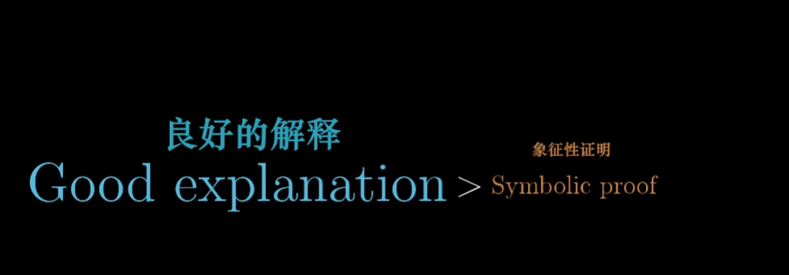

#### 矩阵行列式

**行列式**(Determinant)是线性变换后相比变换前空间中体积(二维情况下的面积)的**缩放比例**(Scaling Factor)。

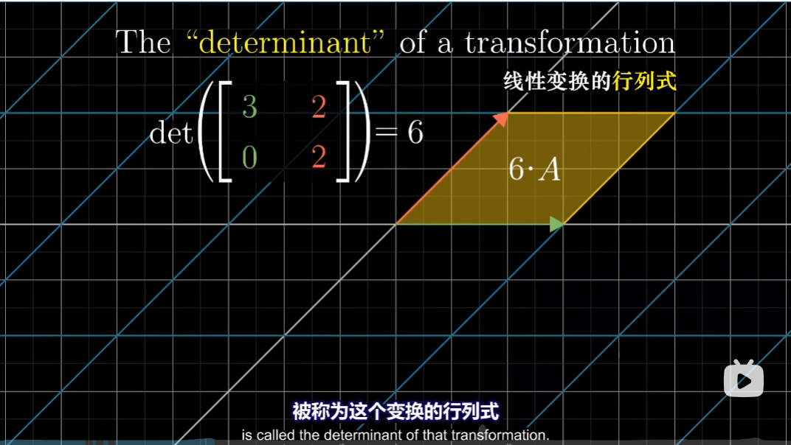

**行列式为负数**的意义，当空间**定向发生改变**时，行列式为负数，但是行列式的**绝对值**依然表示区域面积的缩放比例。

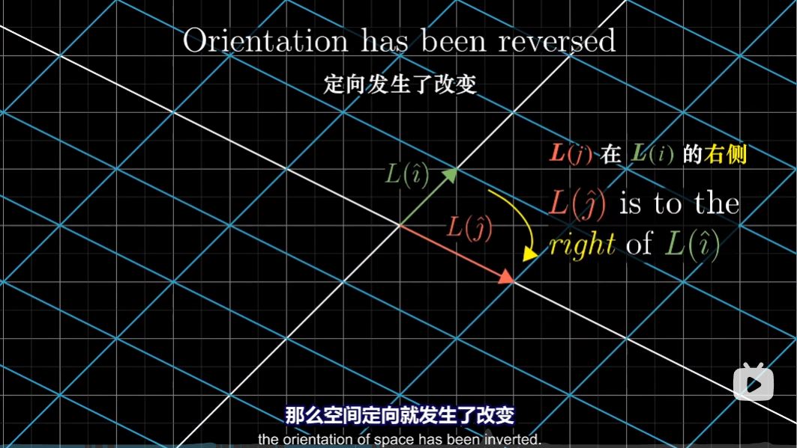

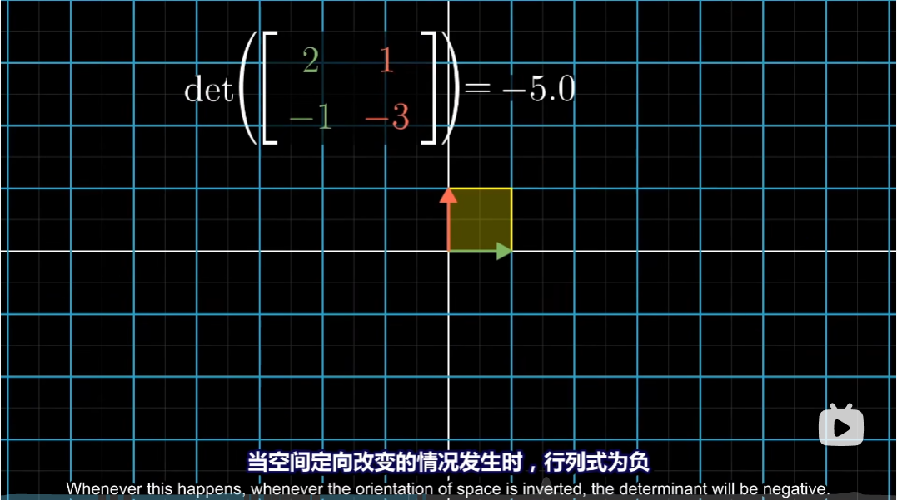

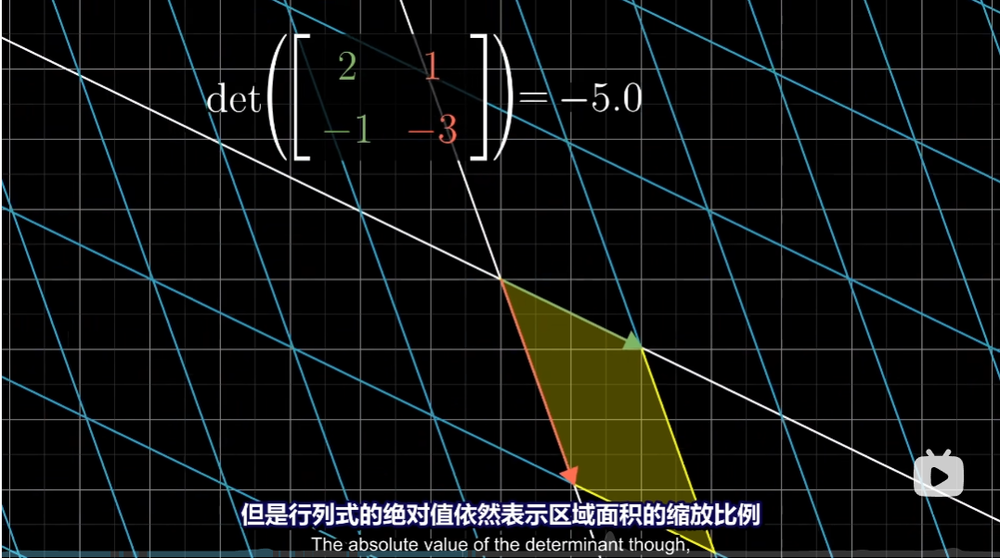

在三维空间中行列式的正负号通过**右手法则**确定，如果在变化后，还可以用右手法则表示，行列式为正。否则，如果在变化后你只能用**左手法则**表示，行列式为负。

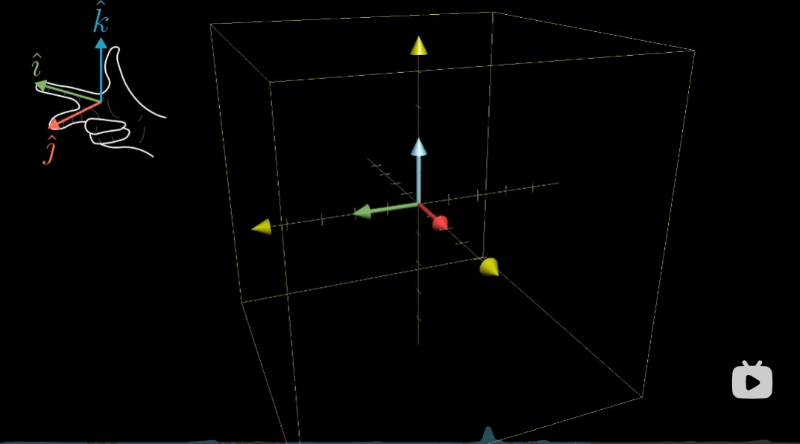

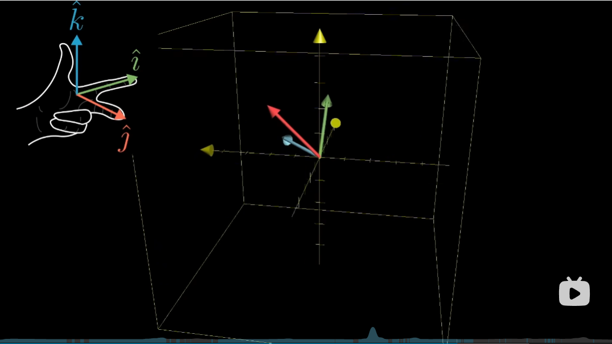

二阶矩阵行列式的计算公式:

$
\det \begin{pmatrix} 
a & b \\ 
c & d 
\end{pmatrix} 
= ad - bc
$

三阶矩阵行列式的计算公式:

$
\det \begin{pmatrix} 
a & b & c \\ 
d & e & f \\ 
g & h & i 
\end{pmatrix} 
= a \cdot \det \begin{pmatrix} e & f \\ h & i \end{pmatrix} - b \cdot \det \begin{pmatrix} d & f \\ g & i \end{pmatrix} + c \cdot \det \begin{pmatrix} d & e \\ g & h \end{pmatrix}
$

复合变化的行列式:

$
\det (M1 \cdot M2) = \det (M1) \cdot \det (M2)
$

这个公式从数学角度上推导相当困难，但是类似矩阵乘法的结合律，可以从几何角度去思考这个问题：当进行了线性变换M2后，区域的面积变为了原来的$\det (M2)$倍，再进行了线性变换M1后，区域的面积在此基础上又变为了刚才的$\det (M1)$倍

#### 线性方程组

形如:

$
\begin{cases}
2x + 5y + 3z = -3 \\
4x + 0y + 8z = 0 \\
1x + 3y + 0z = 2
\end{cases}
$

的方程组叫做线性方程组

不难注意到，你可以将上述方程组写成矩阵和向量乘法的形式：

$
\begin{bmatrix} 2 & 5 & 3 \\ 4 & 0 & 8 \\ 1 & 3 & 0 \end{bmatrix}
\begin{bmatrix} x \\ y \\ z \end{bmatrix} = \begin{bmatrix} -3 \\ 0 \\ 2 \end{bmatrix}
$

将该式子展开后得到的方程组和上面的方程组完全相同

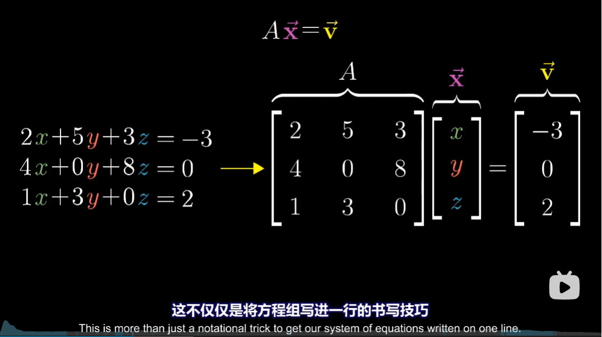

我们求解该线性方程组的几何意义变为了：给定一个线性变换A和一个向量 $\vec{v}$，要找到一个向量 $\vec{x}$，使之经过该线性变换后与向量 $\vec{v}$ 重合。

在A的行列式不为0的情况下，我们可以找到一个唯一的向量 $\vec{x}$ 在经过变换后与 $\vec{v}$ 重合 —— 只需要对向量A进行该线性变换的逆向变换即可。

$
\vec{x} = A^{-1} \vec{v}
$

如果**A的行列式为零**，该矩阵将原空间压缩到一个低维空间里(如二维空间压缩到一条直线或者三维空间压缩到一个平面，更甚者压缩到一个点)，则不存在逆变换，因为不存在一个“函数”，可以将一个值映射到多个值。

如果**A的行列式为零**，只有当 $\vec{v}$ 恰好处在那个被压缩后的低维空间里，原方程组才有解（且有无穷多个解），否则没有解。

#### 秩和列空间

**秩**(Rank)是矩阵对应的线性变换所输出空间的维度。这里，输出空间其实就是矩阵的每一列作为向量所**张成的空间**(一组基向量的线性组合所能到达的点的集合就是该组基向量**张成的空间**(Span))，被称为**列空间**(Column Space)。一个矩阵的秩的最大可能取值就是其列数，只有取到该最大值时，行列式才不为零，此时被称为**满秩**(Full Rank)；当秩小于列数时，行列式为零。

我的理解就是，对于3阶矩阵而言，行列式不为零，说明该矩阵对应的空间线性变化没有降低维度，也就是满秩。对应的列空间就是3维空间中所有的向量集合。

当矩阵满秩时，只有零向量会被映射为零向量。当矩阵不满秩时，意味着有些非零向量被映射成零向量，这些原空间中的非零向量张成的空间被称为**零空间**(Null Space)或者**核**(Kernel)。

#### 矩阵补充

##### 什么是矩阵

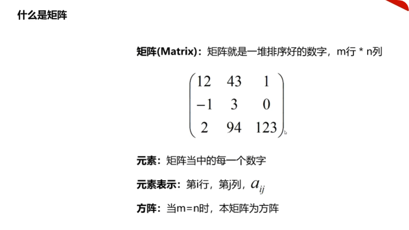

##### 单位矩阵

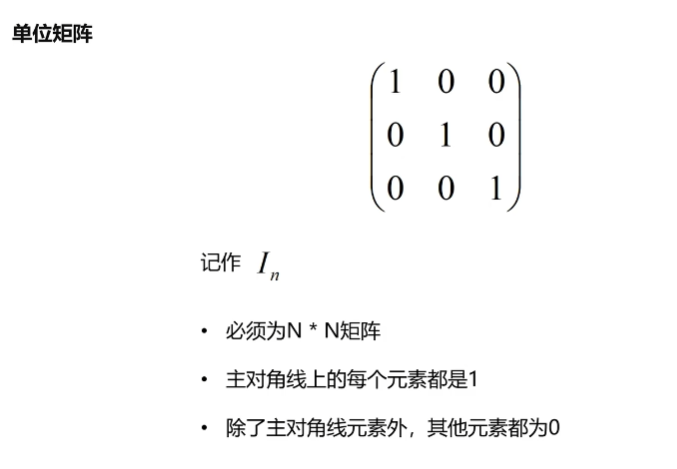

##### 矩阵加法

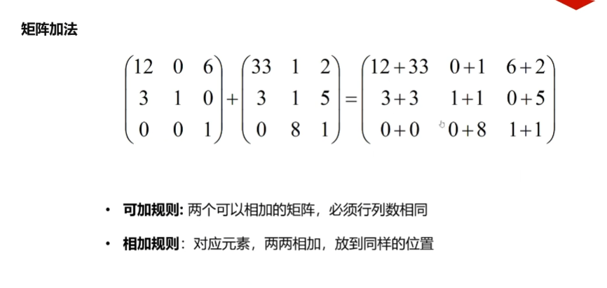

##### 矩阵乘法规则

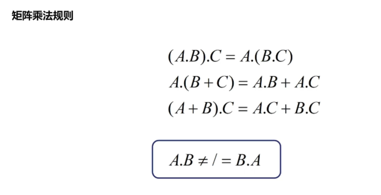

##### 矩阵转置

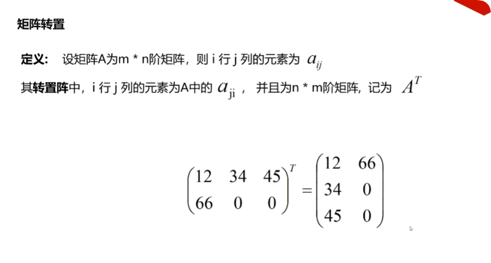

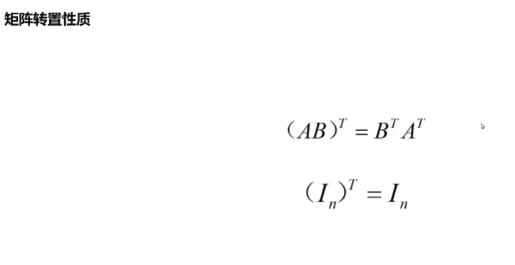

##### 逆矩阵

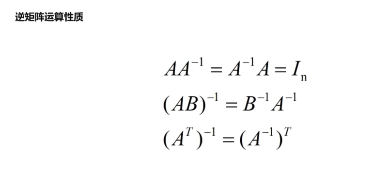

##### 行列式图

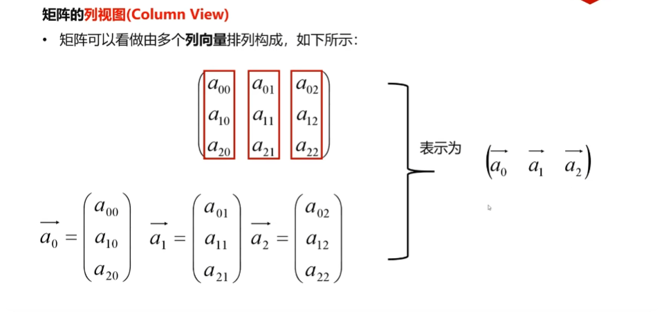

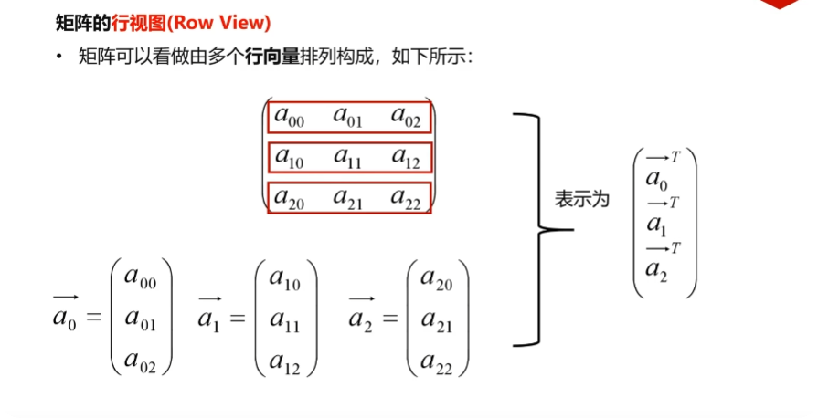

##### 任意轴旋转推导

已知任意旋转轴 $\hat{\mathbf{u}}$，$\vec{v}$ 围绕其旋转 $\theta$ 角度，求旋转后的向量 $\vec{v}'$。如下图所示:

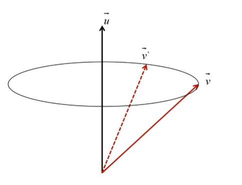

(1) 把 $\vec{v}$ 分解为 $\vec{v} = \vec{v}\parallel + \vec{v}\perp$，其中 $\vec{v}\parallel$ 是 $\vec{v}$ 投影到 $\hat{\mathbf{u}}$ 上的向量，$\vec{v}\perp$ 是 $\vec{v}$ 投影到 $\hat{\mathbf{u}}$ 垂直的向量。 如下图所示：

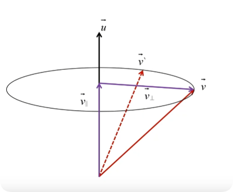

(2) 对 $\vec{v}\perp$ 进行旋转 $\theta$ 角度，得到 $\vec{v}\perp'$。

(3) $\vec{v}\parallel$ + $\vec{v}\perp'$ 就是旋转后的向量 $\vec{v}'$。如下图所示：

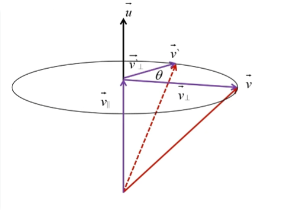

$$
\vec{v}\parallel = (\vec{v} \cdot \hat{\mathbf{u}}) \cdot \hat{\mathbf{u}}
$$

$$
\vec{v}\perp = \vec{v} - (\vec{v} \cdot \hat{\mathbf{u}}) \cdot \hat{\mathbf{u}}
$$

$$
可以理解为，任意旋转轴 \hat{\mathbf{u}} 视为z轴，垂直于任意旋转轴的向量 \vec{v}\perp 视为x轴，构建出一个 \vec{w} 视为y轴。
$$

$$
\vec{w} = \hat{\mathbf{u}} \times \vec{v}\perp
$$

$$
\|\vec{w}\| = \|\hat{\mathbf{u}}\| \cdot \|\vec{v}\perp\| \cdot \sin\theta = \|\vec{v}\perp\| \cdot \sin\theta = \|\vec{v}\perp\|
$$

$$
在由 \vec{v}\perp 和 \hat{\mathbf{u}} 张成的平面内，\vec{v}\perp 绕  \hat{\mathbf{u}} 逆时针旋转 θ 角度，得到的  \vec{v}\perp'
可以通过这两个正交向量的线性组合来表达：
$$

$$
\vec{v}\perp' = a \cdot \vec{v}\perp + b \cdot \vec{w} = \cos\theta \cdot \vec{v}\perp + \sin\theta \cdot \vec{w}
= \cos\theta \cdot \vec{v}\perp + \sin\theta \cdot (\hat{\mathbf{u}} \times \vec{v}\perp)
$$

$$
如下图所示：
$$

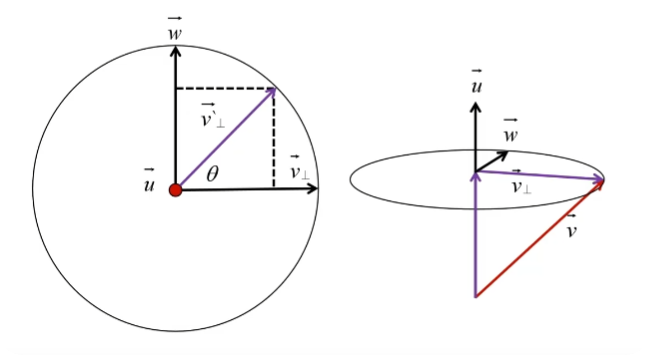

$$
\vec{v}\perp' = a \cdot \vec{v}\perp + b \cdot \vec{w} = \cos\theta \cdot \vec{v}\perp + \sin\theta \cdot \vec{w}
= 
\cos\theta \cdot \vec{v}\perp + \sin\theta \cdot (\hat{\mathbf{u}} \times \vec{v}\perp)
$$

$$
\vec{v}\perp' = a \cdot \vec{v}\perp + b \cdot \vec{w} = \cos\theta \cdot \vec{v}\perp + \sin\theta \cdot \vec{w}
= 
\cos\theta \cdot \vec{v}\perp + \sin\theta \cdot (\hat{\mathbf{u}} \times (\vec{v} - \vec{v}\parallel))
$$

$$
\vec{v}\perp' = a \cdot \vec{v}\perp + b \cdot \vec{w} = \cos\theta \cdot \vec{v}\perp + \sin\theta \cdot \vec{w}
=
\cos\theta \cdot \vec{v}\perp + \sin\theta \cdot (\hat{\mathbf{u}} \times \vec{v} - \hat{\mathbf{u}} \times \vec{v}\parallel)
$$

$$ 
\hat{\mathbf{u}} 和 \vec{v}\parallel 平行的，叉乘结果为零向量
$$

$$
\vec{v}\perp' = a \cdot \vec{v}\perp + b \cdot \vec{w} = \cos\theta \cdot \vec{v}\perp + \sin\theta \cdot \vec{w}
=
\cos\theta \cdot \vec{v}\perp + \sin\theta \cdot (\hat{\mathbf{u}} \times \vec{v})
$$

$$
求出\vec{v}'
$$

$$
\vec{v}' = \vec{v}\parallel + \vec{v}\perp' 
= 
(\vec{v} \cdot \hat{\mathbf{u}}) \cdot \hat{\mathbf{u}} +
\cos\theta \cdot \vec{v}\perp + \sin\theta \cdot (\hat{\mathbf{u}} \times \vec{v})
=
(\vec{v} \cdot \hat{\mathbf{u}}) \cdot \hat{\mathbf{u}} + \cos\theta \cdot (\vec{v} - (\vec{v} \cdot \hat{\mathbf{u}}) \cdot \hat{\mathbf{u}}) + \sin\theta \cdot (\hat{\mathbf{u}} \times \vec{v})
$$

$$
整理：
$$

$$
\vec{v}' = \cos\theta \cdot (\vec{v} - (\vec{v} \cdot \hat{\mathbf{u}}) \cdot \hat{\mathbf{u}}) + \sin\theta \cdot (\hat{\mathbf{u}} \times \vec{v}) + (\vec{v} \cdot \hat{\mathbf{u}}) \cdot \hat{\mathbf{u}}
$$

$$
其实就是罗德里格旋转公式(Rodrigues' Rotation Formula)
$$

我们知道矩阵是对空间线性变换的描述函数，第一列是变换后的基向量i，第二列是变换后的基向量j，第三列是变换后的基向量k。根据上面的罗德里格旋转公式，依次计算出旋转后的向量i', j', k'。

已知旋转轴 $\hat{\mathbf{u}}$, $\vec{v}$ 围绕其旋转 $ \theta $ 角度，对应的旋转矩阵：

$$
\mathbf{R}(\hat{\mathbf{u}}, \theta) =
\begin{pmatrix}
\cos\theta + u_x^2 (1 - \cos\theta) & u_x u_y (1 - \cos\theta) - u_z \sin\theta & u_x u_z (1 - \cos\theta) + u_y \sin\theta \\
u_y u_x (1 - \cos\theta) + u_z \sin\theta & \cos\theta + u_y^2 (1 - \cos\theta) & u_y u_z (1 - \cos\theta) - u_x \sin\theta \\
u_z u_x (1 - \cos\theta) - u_y \sin\theta & u_z u_y (1 - \cos\theta) + u_x \sin\theta & \cos\theta + u_z^2 (1 - \cos\theta)
\end{pmatrix}
$$

### 向量点积

$\vec{v}$ 和 $\vec{w}$ 的**点积**(dot products)，在几何上等价于先将 $\vec{w}$ 投影(Project)到 $\vec{v}$ 的方向上，然后投影得到的长度乘以 $\vec{v}$ 的长度。

$
\vec{v} \cdot \vec{w} = \|\vec{v}\| \|\vec{w}\| \cos\theta = \sum_{i=1}^n v_i w_i
$

求模公式: 

$
\|\vec{v}\| = \sqrt{v_1^2 + v_2^2 + \cdots + v_n^2}
$

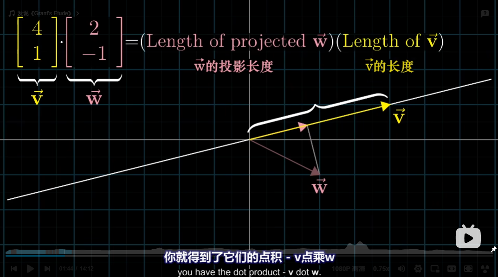

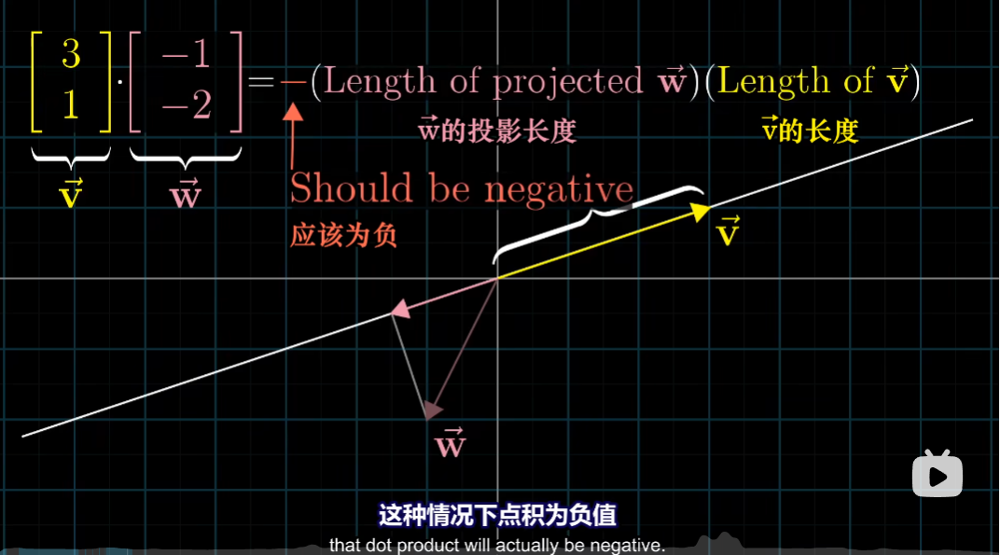

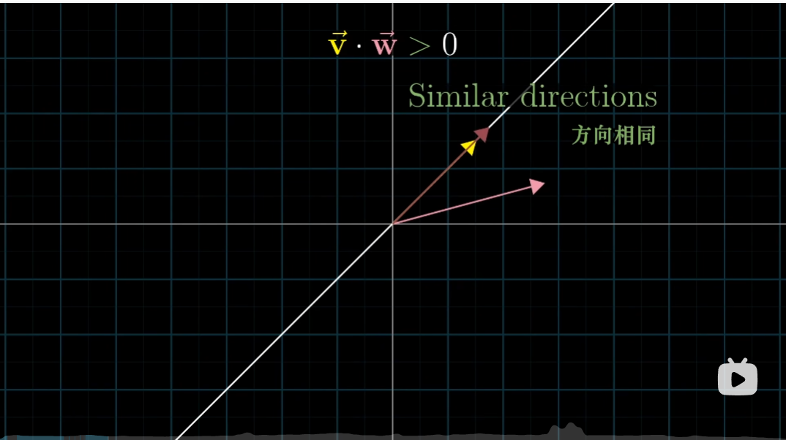

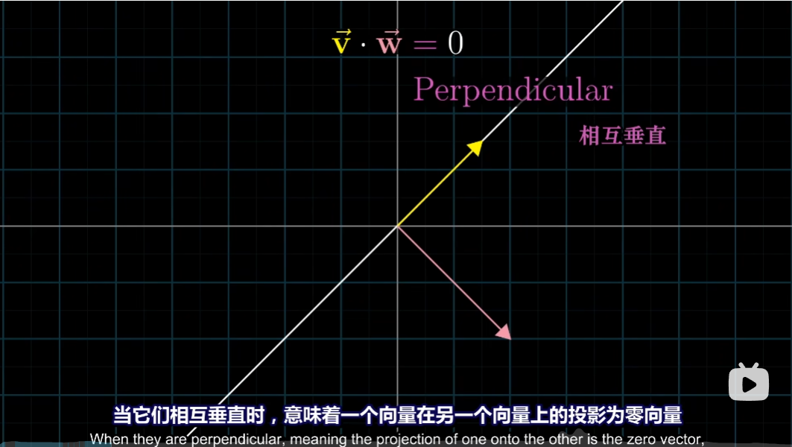

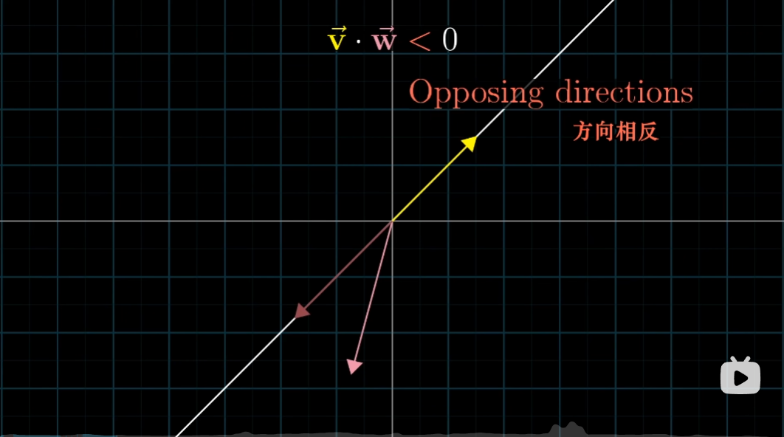

**点积的结果和顺序无关**

$
\vec{v} \cdot \vec{w} = \vec{w} \cdot \vec{v}
$


### 向量叉积

$\vec{v} \times \vec{w}$ 叉积，在几何上是向量张成的平行四边形的面积，其符号当 $\vec{v}$ 在  $\vec{w}$ 的右侧时数值为正，反之则为负


和点积不同的是，叉积的数值是不满足交换律的，有 

$
\vec{v} \times \vec{w} = - \vec{w} \times \vec{v}
$


**对于二维空间，叉积的计算方式和行列式的计算方式类似，结果应该是一个标量**，如下公式：

$
\begin{bmatrix} a \\ b \end{bmatrix}
\times
\begin{bmatrix} c \\ d \end{bmatrix}
= \det \begin{bmatrix} a & c \\ b & d \end{bmatrix}
= ad - bc
$

写作如下形式也是可以的，因为矩阵的转置并不会改变行列式的值：

$
\begin{bmatrix} a \\ c \end{bmatrix}
\times
\begin{bmatrix} b \\ d \end{bmatrix}
= \det \begin{bmatrix} a & b \\ c & d \end{bmatrix}
= ad - bc
$

你可以认为 $\begin{bmatrix} a \\ b \end{bmatrix}$ 和 $\begin{bmatrix} c \\ d \end{bmatrix}$ 是基向量 $\begin{bmatrix} 0 \\ 1 \end{bmatrix}$ 和 $\begin{bmatrix} 1 \\ 0 \end{bmatrix}$ 经过某线性变换之后得到的向量，那么此时，如果我们专注于 $\begin{bmatrix} 0 \\ 1 \end{bmatrix}$ 和 $\begin{bmatrix} 1 \\ 0 \end{bmatrix}$ 围成的平行四边形的面积 —— 变换前为1，而变换后为 ，此时该线性变换的面积就是行列式 ，其正负号与行列式一章中行列式的正负号含义一致。


**对于三维空间，叉积的结果是一个向量，该向量垂直于 $\vec{v}$ 和 $\vec{w}$ 张成的平面，方向根据右手定则确定，长度等于 $\vec{v}$ 和 $\vec{w}$ 张成的面积。**


计算公式：

$
\begin{bmatrix} v1 \\ v2 \\ v3 \end{bmatrix}
\times
\begin{bmatrix} w1 \\ w2 \\ w3 \end{bmatrix}
= \begin{bmatrix} v2 w3 - w2 v3 \\ v3 w1 - w3 v1 \\ v1 w2 - w1 v2 \end{bmatrix}
$

该公式可以写作一个更易于记忆的行列式写法：

$
\begin{bmatrix} v1 \\ v2 \\ v3 \end{bmatrix}
\times
\begin{bmatrix} w1 \\ w2 \\ w3 \end{bmatrix}
= \begin{bmatrix} \hat i & v1 & w1 \\ \hat j & v2 & w2 \\ \hat k & v3 & w3 \end{bmatrix}
$

同样地，写作如下形式也是可以的，因为矩阵的转置并不会改变行列式的值：

$
\begin{bmatrix} v1 \\ v2 \\ v3 \end{bmatrix}
\times
\begin{bmatrix} w1 \\ w2 \\ w3 \end{bmatrix}
= \begin{bmatrix} \hat i & \hat j & \hat k \\ v1 & v2 & v3 \\ w1 & w2 & w3 \end{bmatrix}
$

展开行列式：

$
\det \begin{pmatrix} 
\hat i & v1 & w1 \\ 
\hat j & v2 & w2 \\ 
\hat k & v3 & w3 
\end{pmatrix} 
= \hat i \cdot \det \begin{pmatrix} v2 & w2 \\ v3 & w3 \end{pmatrix} - \hat j \cdot \det \begin{pmatrix} v1 & w1 \\ v3 & w3 \end{pmatrix} + \hat k \cdot \det \begin{pmatrix} v1 & w1 \\ v2 & w2 \end{pmatrix}
= \hat i (v2 w3 - w2 v3) - \hat j (v3 w1 - w3 v1) + \hat k (v1 w2 - w1 v2)
$


### 基变换


#### 使用不同的基向量


#### 如何在不同坐标系之间进行转化

网格：

1. 网格只是一个框架，提供了一种将坐标系可视化的途径。
2. 因此它依赖于我们对基的选择
3. 空间本身没有网格
4. 不同坐标系的基不同，原点可以重合，因为大家在坐标（0，0）的含义上达成了共识。它就是任何向量乘以0时你所得到的坐标。


一个矩阵的列为詹妮弗的基向量，这个矩阵可以看作一个线性变换。

它将我们的基向量i帽和j帽，也就是我们眼中的（1，0）和（0，1）变换为詹妮弗的基向量，也就是她眼中的（1，0）和（0，1）。


简单来说，中间这个矩阵 $P = \begin{bmatrix} 2 & -1 \\ 1 & 1 \end{bmatrix}$ 是一台“语言翻译机”。   

1. 矩阵里的数字是哪里来的？矩阵的每一列，其实是用我们的标准坐标系（Our language）去描述詹妮弗（Jennifer）的基向量：   
  - 第一列 $\begin{bmatrix} 2 \\ 1 \end{bmatrix}$：詹妮弗的第一个基向量 $\vec{b}_1$，在我们的坐标系里看，是向右 2、向上 1。   
  - 第二列 $\begin{bmatrix} -1 \\ 1 \end{bmatrix}$：詹妮弗的第二个基向量 $\vec{b}_2$，在我们的坐标系里看，是向左 1、向上 1。   

2. 为什么说它是“翻译机”？（看图中的箭头方向）重点看图中的箭头：詹妮弗的语言 $\longrightarrow$ 我们的语言。如果你把詹妮弗坐标系下的向量（比如上一图求出的 $\begin{bmatrix} -1 \\ 2 \end{bmatrix}$）乘以这个矩阵：$$\begin{bmatrix} 2 & -1 \\ 1 & 1 \end{bmatrix} \begin{bmatrix} -1 \\ 2 \end{bmatrix} = -1 \cdot \begin{bmatrix} 2 \\ 1 \end{bmatrix} + 2 \cdot \begin{bmatrix} -1 \\ 1 \end{bmatrix} = \begin{bmatrix} -4 \\ 1 \end{bmatrix}$$
  - 输入：詹妮弗语言里的坐标 $\begin{bmatrix} -1 \\ 2 \end{bmatrix}$。   
  - 输出：在我们语言里的坐标 $\begin{bmatrix} -4 \\ 1 \end{bmatrix}$。   

3. 一句话总结矩阵的作用：
  - 把“詹妮弗坐标系下的坐标”翻译成“我们标准坐标系下的坐标”。   
  - 构造方法：只需把对方的基向量写在我们坐标系下的数值，依次拼成矩阵的每一列即可。  

上面是输入詹妮弗语言里的坐标 转化成 在我们语言里的坐标。

那如何把我们的语言里的坐标 转化成 在詹妮弗语言里的坐标。


#### 基向量切换导致矩阵表示改变


#### 相似矩阵

简单来说，相似矩阵（Similar Matrices）的几何本质就是：

**同一个线性变换，在不同坐标系(不同基向量视角)下的不同矩阵描述。**

1. 用生活中的“语言翻译”来理解
  - 想象你和詹妮弗（Jennifer）在同一个房间里，房间中央有一个物体需要“顺时针旋转 90 度”：
    - 几何现实：旋转这个物体是一个客观存在的物理动作，无论谁来看，动作本身都一样。
    - 你的语言：在你习惯的直角坐标系（以你的东西南北为基向量）下，这个旋转动作可以用矩阵 $A$ 来描述。
    - 詹妮弗的语言：詹妮弗坐在房间斜对角，她的坐标轴是斜着的（以她的视角为基向量）。在她的坐标系下，同一个旋转动作记录下来叫矩阵 $B$。
  - 虽然矩阵 $A$ 和矩阵 $B$ 里面的数字完全不一样，但它们本质上是在描述同一个几何动作。这时，我们就说 **矩阵 $A$ 与 矩阵 $B$ 相似（记作 $A \sim B$）**。

2. 代数上的定义：$B = P^{-1} A P$，要证明 $A$ 和 $B$ 描述的是同一个变换，就必须存在一个“坐标翻译官”矩阵 $P$（把詹妮弗的坐标系翻译成你的坐标系）：$$B = P^{-1} A P$$这个“夹心饼干”结构的代数含义是：
  - $P$：把詹妮弗视角下的向量，翻译成你的视角。
  - $A$：用你的矩阵 $A$，在你的视角下执行变换。
  - $P^{-1}$：把变换后的结果，逆翻译回詹妮弗的视角。这一套组合拳做完，效果就完全等同于詹妮弗直接用她的矩阵 $B$ 执行变换。

### 特征向量与特征值


图中各部分的逻辑拆解如下：

1. 矩阵（线性变换），左上角给出的矩阵是：$$A = \begin{bmatrix} 0.5 & -1.0 \\ -1.0 & 0.5 \end{bmatrix}$$ 矩阵在线性代数里代表一个空间变换（比如拉伸、翻折或旋转）。大部分向量在乘以这个矩阵后，方向都会发生偏转。   

2. 黄色向量（特征向量），图中黄色的向量是 $\mathbf{v} = \begin{bmatrix} 1 \\ 1 \end{bmatrix}$。当我们把这个向量代入矩阵乘以向量的计算：$$A \mathbf{v} = \begin{bmatrix} 0.5 & -1.0 \\ -1.0 & 0.5 \end{bmatrix} \begin{bmatrix} 1 \\ 1 \end{bmatrix} = \begin{bmatrix} 0.5 - 1.0 \\ -1.0 + 0.5 \end{bmatrix} = \begin{bmatrix} -0.5 \\ -0.5 \end{bmatrix}$$

3. 特征值 $-\frac{1}{2}$ 的几何含义比较变换前后的向量：$$\begin{bmatrix} -0.5 \\ -0.5 \end{bmatrix} = -\frac{1}{2} \cdot \begin{bmatrix} 1 \\ 1 \end{bmatrix}$$
  - 什么是特征向量：黄色向量经过矩阵变换后，依然停留在原本贯穿它的那条粉红色斜线上（方向没有偏离这条直线）。这种在变换中“保持在原直线上”的向量就叫特征向量。   
  - 什么是特征值（$-\frac{1}{2}$）：它代表了这个向量在变换过程中的缩放倍数。 
    - 负号（$-$）：代表向量被调转了方向（原本指向右上角，变换后指到了左下角）。   
    - 数值（$\frac{1}{2}$）：代表向量长度被压缩为原来的 $1/2$。   
  
这正是底部字幕所解释的：“意味着这个向量被反向，并且被压缩为原来的 1/2”。   

#### 特征值与特征向量的用途


三维旋转变换中特征向量与特征值的几何本质！

结合刚才讨论的三维空间必有实特征向量的规律，拆解如下：

1. 旋转轴就是“特征向量”，在三维空间中，无论你如何绕着原点旋转这个立方体：
  - 立方体上的绝大多数点（向量）在旋转后，方向都发生了改变。
  - 唯独沿着“旋转轴（粉色粉红箭头方向）”上的所有向量，在旋转过程中方向完全没有被偏转！
  - 因为它们始终留在原本的那条直线上，所以旋转轴的方向恰好就是该旋转变换的特征向量。

2. 特征值是多少？因为旋转轴上的向量不仅方向没变，长度也完全没有发生变化（没有被缩放或反向）：
  - 变换前后的关系是 $A\mathbf{v} = 1 \cdot \mathbf{v}$。
  - 所以，对于三维旋转变换，旋转轴对应的特征值就是 $\lambda = 1$。

3. 一句话总结，如果你计算一个三维旋转矩阵的特征值和特征向量，解出来特征值 $\lambda = 1$ 对应的那个特征向量，在几何上就是这个旋转动作的“旋转轴”！


为什么在求解特征值时，必须把标量 $\lambda$ 改写成矩阵 $\lambda I$。拆解其核心逻辑如下：

1. 矛盾点：矩阵和标量不能直接相减，在特征向量定义式 $A\vec{v} = \lambda\vec{v}$ 中：
  - 左边是矩阵乘以向量 $A\vec{v}$ 
  - 右边是标量（纯数）乘以向量 $\lambda\vec{v}$   
  - 如果我们想把右项移到左边变成 $(A - \lambda)\vec{v} = \vec{0}$，在数学上是无效的——因为一个矩阵 $A$ 不能直接减去一个纯数 $\lambda$！
  
2. 图中的提问：“与数 $\lambda$ 相乘”等价于“与哪个矩阵相乘”？图中问的就是：如何把“乘以标量 $\lambda$”这个动作，包装成一个矩阵？
  - 标量乘法 $\lambda\vec{v}$ 的几何意义：把空间里的每一个基向量都均匀拉伸（或缩放）$\lambda$ 倍。
  - 构造对应的矩阵（正如底部字幕所说：“这个矩阵的列代表着变换后的基向量”）：
    - 第 1 个基向量 $\begin{bmatrix} 1 \\ 0 \\ 0 \end{bmatrix}$ 变成了 $\begin{bmatrix} \lambda \\ 0 \\ 0 \end{bmatrix}$
    - 第 2 个基向量 $\begin{bmatrix} 0 \\ 1 \\ 0 \end{bmatrix}$ 变成了 $\begin{bmatrix} 0 \\ \lambda \\ 0 \end{bmatrix}$
    - 第 3 个基向量 $\begin{bmatrix} 0 \\ 0 \\ 1 \end{bmatrix}$ 变成了 $\begin{bmatrix} 0 \\ 0 \\ \lambda \end{bmatrix}$   
    - 所以，填满图中带问号的矩阵后，得到的就是对角矩阵：$$\begin{bmatrix} \lambda & 0 & 0 \\ 0 & \lambda & 0 \\ 0 & 0 & \lambda \end{bmatrix} = \lambda \cdot I$$

3. 最终目的，把 $\lambda$ 转化为缩放矩阵 $\lambda I$ 后，定义式就可以规范地写作：$$A\vec{v} = (\lambda I)\vec{v} \implies (A - \lambda I)\vec{v} = \vec{0}$$   这样一来，矩阵 $A$ 减去的也是同维度的矩阵 $\lambda I$，代数运算完全合理，随后就能通过求 $\det(A - \lambda I) = 0$ 来计算特征值了！


把这个过程拆解开来，逻辑是这样的：

1. 目标：找到一个“非零”的特征向量 $\vec{v}$，在方程 $(A - \lambda I)\vec{v} = \vec{0}$ 中：   
  - 如果 $\vec{v} = \vec{0}$（零向量），那么无论 $\lambda$ 是什么，等式永远成立（因为任何矩阵乘以零向量都是零向量）。
  - 但零向量没有几何意义，我们需要的是一个非零向量 $\vec{v} \neq \vec{0}$。   

2. 几何思考：什么情况下“非零向量”乘以矩阵会变成“零向量”？看一下这个方程的含义：
  - 把一个非零向量 $\vec{v}$，经过矩阵 $(A - \lambda I)$ 变换后，结果变成了零向量 $\vec{0}$。   
  - 如果矩阵没有压缩空间（即行列式 $\det \neq 0$）：
    - 变换是可逆的，空间里的每一个点都和变换后的点一一对应。只有原点 $\vec{0}$ 会留在原点，任何非零向量变换后都不可能变成零向量。此时方程只有唯一零解 $\vec{v} = \vec{0}$。
  - 如果矩阵把空间压缩到了低维（即行列式 $\det = 0$）：
    - 如底部字幕所说：“当且仅当矩阵所代表的变换将空间压缩到更低的维度时”，原本非零的一些向量，会在压缩过程中“挤压”掉，落到原点 $\vec{0}$ 上。

3. 结论：必须令 $\det(A - \lambda I) = 0$，为了确保存在非零向量 $\vec{v}$ 被压成零向量，矩阵 $(A - \lambda I)$ 必须具有压缩空间的能力。在线性代数中，“把空间压缩到更低维度”的数学充要条件就是：$$\det(A - \lambda I) = 0$$，这就是图中气泡里写着 “我们需要 $\det(A - \lambda I) = 0$” 的真正原因！通过解这个关于 $\lambda$ 的方程，我们就能算出特征值 $\lambda$，进而求出对应的特征向量 $\vec{v}$。


#### 特征值与特征向量的求解


在已知特征值 $\lambda = 2$ 后，具体求解对应特征向量 $\vec{v}$ 的最后一步。

它把代数方程组的解与几何图像完全对应了起来，逻辑拆解如下：

1. 代数过程：代入 $\lambda = 2$ 算矩阵，假设原矩阵是 $A = \begin{bmatrix} 3 & 1 \\ 0 & 2 \end{bmatrix}$。当我们求出特征值 $\lambda = 2$ 后，将其代入方程 $(A - \lambda I)\vec{v} = \vec{0}$：$$\begin{bmatrix} 3-\mathbf{2} & 1 \\ 0 & 2-\mathbf{2} \end{bmatrix} \begin{bmatrix} x \\ y \end{bmatrix} = \begin{bmatrix} 0 \\ 0 \end{bmatrix} \implies \begin{bmatrix} 1 & 1 \\ 0 & 0 \end{bmatrix} \begin{bmatrix} x \\ y \end{bmatrix} = \begin{bmatrix} 0 \\ 0 \end{bmatrix}$$ 展开得到方程：$$1 \cdot x + 1 \cdot y = 0 \implies x = -y$$这个方程有无数组解，只要满足 $x$ 和 $y$ 互为相反数 即可，比如 $\begin{bmatrix} -1 \\ 1 \end{bmatrix}$、$\begin{bmatrix} -2 \\ 2 \end{bmatrix}$、$\begin{bmatrix} 1.5 \\ -1.5 \end{bmatrix}$ 等等。

2. 几何过程：张成的特征空间（Eigenspace）
  - 解的几何轨迹：所有满足 $x = -y$ 的向量（解），在平面直角坐标系中画出来，正好就是过原点、倾角为 $135^\circ$ 的斜对角线（也就是图中黄色箭头所在的橙色直线）。
  - 张成（Span）的含义：正如底部字幕所说，“所有的解全部落在由向量 $(-1, 1)$ 张成的对角线上”。这意味着只要确定了一个基础特征向量 $\begin{bmatrix} -1 \\ 1 \end{bmatrix}$，沿这条直线上的任何非零向量全都是特征值 $\lambda = 2$ 对应的特征向量！   

3. 一句话总结这张图演示了如何把解出来的特征值 $\lambda$ 代回方程，通过解齐次线性方程组，在几何上找到整条由特征向量组成的特征直线（特征空间）。

#### 二维线性变化不一定有特征向量


#### 只有一个特征值存在多个特征向量


任意形如 $\begin{bmatrix} c & 0 \\ 0 & c \end{bmatrix}$ 的缩放矩阵（比如你说的 $\begin{bmatrix} n & 0 \\ 0 & n \end{bmatrix}$，其中 $c, n \neq 0$），全平面的每一个非零向量都是它的特征向量。

缩放矩阵：$\begin{bmatrix} k & 0 \\ 0 & k \end{bmatrix}$（$k$ 为任意实数）

对于矩阵 $A = \begin{bmatrix} k & 0 \\ 0 & k \end{bmatrix}$：它的作用：

1. 把平面上的所有向量统一沿原方向伸缩 $k$ 倍（即均匀缩放）。   
2. 特征值：解方程 $\det(A - \lambda I) = (k - \lambda)^2 = 0$，得到重特征值 $\lambda = k$（单特征值）。
3. 特征向量：因为对于平面上任意非零向量 $\mathbf{v}$，都有：$$A \mathbf{v} = k \mathbf{v}$$这意味着整个二维平面上的所有方向全都是特征方向！它的特征空间（Eigen-space）是整个二维平面。所以无论是 $\begin{bmatrix} 2 & 0 \\ 0 & 2 \end{bmatrix}$、$\begin{bmatrix} 5 & 0 \\ 0 & 5 \end{bmatrix}$ 还是 $\begin{bmatrix} -3 & 0 \\ 0 & -3 \end{bmatrix}$，道理完全一致。

#### 特征基


这张图引出了线性代数里极其重要的一个概念——对角化（Diagonalization）。

视频通过“提出一个假设”来展示特征向量最完美的理想状态，拆解如下：

1. 假设：如果坐标轴的基向量本身就是特征向量？一般情况下，基向量 $\hat{i}$ 和 $\hat{j}$ 经过矩阵变换后会偏折到奇怪的位置。但如果坐标系的基向量刚好就是特征向量：
  - 第一个基向量 $\hat{i}$：变换后只在原来的水平线上伸缩或反向（比如图中的绿箭头被反向变成了 $-1$ 倍，即变成 $\begin{bmatrix} -1 \\ 0 \end{bmatrix}$）。
  - 第二个基向量 $\hat{j}$：变换后只在原来的垂直线上伸缩（比如图中的红箭头被拉伸成了 $2$ 倍，即变成 $\begin{bmatrix} 0 \\ 2 \end{bmatrix}$）。

2. 这个矩阵会变成什么样？把变换后的基向量按列写成矩阵：$$\begin{bmatrix} \mathbf{-1} & 0 \\ 0 & \mathbf{2} \end{bmatrix}$$ 你会发现：这个矩阵变成了一个对角矩阵（Diagonal Matrix）！
  - 非对角线元素全为 $0$。
  - 对角线上的数值，正好就是各自的特征值（$\lambda_1 = -1, \lambda_2 = 2$）！

3. 为什么对角矩阵是“终极梦想”？对角矩阵是线性代数里最容易计算的矩阵：
  - 几何上：变换极度简单，只是单纯地沿着各个坐标轴方向进行独立拉伸/反向，没有任何倾斜或旋转。   
  - 计算上：如果要算矩阵的高次方（比如 $A^{100}$），普通的矩阵非常难算，而对角矩阵只需把对角线上的数字直接乘方：$$\begin{bmatrix} -1 & 0 \\ 0 & 2 \end{bmatrix}^{100} = \begin{bmatrix} (-1)^{100} & 0 \\ 0 & 2^{100} \end{bmatrix}$$
  
**一句话总结“如果基向量都是特征向量，描述这个变换的矩阵就会变成对角矩阵，对角线上的数字就是特征值。”**

#### 基向量都是特征向量必然是对角矩阵

这是线性代数里一个严密的逻辑闭环，我们可以从 “矩阵的列代表什么” 这个最基础的几何定义直接推出来：

1. 为什么“必然”是对角矩阵？回忆一下矩阵的构造逻辑：一个矩阵的第 $j$ 列，记录的就是第 $j$ 个基向量在变换后的新坐标。假设在一个 $n$ 维空间中，我们挑选了一组基向量 $\{\vec{e}_1, \vec{e}_2, \dots, \vec{e}_n\}$。如果这组基向量每一个都是特征向量，意味着它们经过矩阵 $A$ 变换后，只会被各自的特征值 $\lambda_i$ 缩放，方向完全不会偏离自身坐标轴：

  - 第 1 个基向量 $\vec{e}_1 = \begin{bmatrix} 1 \\ 0 \\ \vdots \\ 0 \end{bmatrix}$ 变换后变成 $\lambda_1 \vec{e}_1 = \begin{bmatrix} \mathbf{\lambda_1} \\ 0 \\ \vdots \\ 0 \end{bmatrix}$（这就是矩阵的第 1 列）
  - 第 2 个基向量 $\vec{e}_2 = \begin{bmatrix} 0 \\ 1 \\ \vdots \\ 0 \end{bmatrix}$ 变换后变成 $\lambda_2 \vec{e}_2 = \begin{bmatrix} 0 \\ \mathbf{\lambda_2} \\ \vdots \\ 0 \end{bmatrix}$（这就是矩阵的第 2 列）
  - $\dots$
  - 第 $n$ 个基向量 $\vec{e}_n = \begin{bmatrix} 0 \\ 0 \\ \vdots \\ 1 \end{bmatrix}$ 变换后变成 $\lambda_n \vec{e}_n = \begin{bmatrix} 0 \\ 0 \\ \vdots \\ \mathbf{\lambda_n} \end{bmatrix}$（这就是矩阵的第 $n$ 列）
  - 把这些变换后的列向量拼在一起：$$A = \begin{bmatrix}  \lambda_1 & 0 & \dots & 0 \\  0 & \lambda_2 & \dots & 0 \\  \vdots & \vdots & \ddots & \vdots \\  0 & 0 & \dots & \lambda_n  \end{bmatrix}$$除了主对角线上的元素是各个特征值 $\lambda_i$ 之外，所有非对角线元素必然全为 $0$。在定义上，这样的矩阵就必定是对角矩阵。
  
2. 反过来推也成立（充要条件），这个结论是双向成立的（当且仅当）：
  - 正向：如果你选用的基向量全都是特征向量 $\implies$ 该坐标系下的变换矩阵必然是对角矩阵。
  - 反向：如果一个变换矩阵在某个坐标系下表现为对角矩阵 $\implies$ 这个坐标系的各个基向量必然是该变换的特征向量。

如果原本的坐标系不是这样也没关系——我们只需要选择特征向量作为新的基向量（建立新坐标系），就能把复杂的矩阵转化为极致简便的对角矩阵，这就是矩阵对角化！


#### 矩阵对角化

矩阵对角化（Diagonalization），本质上就是：找到一个最优雅的视角（坐标系），让复杂的矩阵变换退化成最简单的“沿坐标轴缩放”。

**能否成功进行“矩阵对角化”的核心前提条件：特征向量必须能够张成全空间（Eigenvectors span space）。**


这幅图的几何含义和代数逻辑如下：

1. 图中的几何关系矩阵，$A = \begin{bmatrix} 3 & 1 \\ 0 & 2 \end{bmatrix}$ 在这个二维平面上有两条非常特殊的特征直线：
  - 水平 $X$ 轴（绿色箭头）：
    - 对应特征值 $\lambda_1 = 3$。
    - 沿着 $X$ 轴的所有向量，经过变换后都停留在 $X$ 轴上，只是被放大了 3 倍。   
  - 斜对角线（黄色/橙色箭头）：
    - 对应特征值 $\lambda_2 = 2$（也就是我们刚才算过的 $x = -y$ 那条线）。   
    - 沿着这条斜线的所有向量，经过变换后都停留在斜线上，只是被放大了 2 倍。   

2. 为什么说“能张成全空间”？
  - 不共线：绿色直线（$X$ 轴）和橙色斜线不平行/不共线。
  - 组合出整个平面：从这两条线上各挑选出一个基础特征向量（比如 $\vec{v}_1 = \begin{bmatrix} 1 \\ 0 \end{bmatrix}$ 和 $\vec{v}_2 = \begin{bmatrix} -1 \\ 1 \end{bmatrix}$），这两个向量线性无关，它们的线性组合可以覆盖（张成）整个 2D 平面的任意一点。   

3. 这意味着什么？（承上启下），因为这两个特征向量能张成全空间，我们就可以把它们选作新的“基向量”（建立新坐标系）：   
  - 在原本的标准坐标系里：描述变换的矩阵是带有非对角元素的 $A = \begin{bmatrix} 3 & 1 \\ 0 & 2 \end{bmatrix}$。   
  - 在以特征向量为基的新坐标系里：变换矩阵就会变成极致简单的对角矩阵 $\begin{bmatrix} 3 & 0 \\ 0 & 2 \end{bmatrix}$！   
  - 这就是著名的相似对角化公式：$$P^{-1} A P = D = \begin{bmatrix} \lambda_1 & 0 \\ 0 & \lambda_2 \end{bmatrix}$$ 其中 $P$ 的每一列就是这两个能张成全空间的特征向量 $\begin{bmatrix} \vec{v}_1 & \vec{v}_2 \end{bmatrix}$。  

看 $D = P^{-1} A P$ 的本质逻辑：

$$D = \mathbf{P^{-1}} \cdot \mathbf{A} \cdot \mathbf{P}$$

1. 坐标系 1：旧坐标系 / 参照坐标系（通常是标准直角坐标系）。
2. 坐标系 2：新坐标系 / 目标视角（由一组任意线性无关的新基向量构成）。
3. 矩阵 $P$：坐标转换矩阵（列向量就是坐标系 2 的基向量在坐标系 1 下的坐标）。
4. 矩阵 $A$：线性变换在坐标系 1 下的描述矩阵。
5. 矩阵 $D$：同一个线性变换在坐标系 2 下的描述矩阵。
6. $AP$ 相当于“以坐标系 1 的视角，直接对坐标系 2 的所有基向量执行一次变换 $A$”。
  - 如果把 $AP$ 作用在一个向量 $\vec{x}_2$（即坐标系 2 视角下的坐标）上：$$(AP)\vec{x}_2$$我们可以从右往左看它的逻辑流：
    - 先算 $P \vec{x}_2$：$P$ 接收的输入必须是坐标系 2 视角下的坐标 $\vec{x}_2$，把它翻译成坐标系 1 视角下的坐标。
    - 再算 $A (P \vec{x}_2)$：$A$ 接收翻译后的坐标，在坐标系 1 里执行实际的几何变换。
7. 最左边的 $P^{-1}$：把变换后的结果，逆翻译回坐标系 2。
  - $$D \vec{x}_2 = \mathbf{P^{-1}} \cdot (AP \vec{x}_2)$$
    - 输入：坐标系 2 的向量 $\vec{x}_2$。
    - 中间过程 ($AP$)：翻译到坐标系 1 并完成变换，得到坐标系 1 下的新坐标。
    - 最后一步 ($P^{-1}$)：把这个新坐标重新逆翻译回坐标系 2。
    - 输出：坐标系 2 视角下的最终新坐标。


**并非所有矩阵都能对角化**

对角化的充要条件

$n\times n$ 矩阵 $A$ 可对角化 $\iff$ 有 $n$ 个线性无关的特征向量

**把向量从标准坐标系（$A$）转换到特征基坐标系（$D$），最后还要再用逆矩阵 $P$ 转换回来，绕这么一大圈到底有什么意义**

**核心：中间运算被极大简化**

如果目标是只算一次 $Av$，那确实没必要绕——直接 $Av$ 更快。

但实际应用中常常要算的是 $A^k v$、$e^{At}$、$A^{100}$、解递推/微分方程​ 这类反复对 $A$ 做幂/指数运算的事。

1. 直接算：$A^{100}$ 要做 99 次矩阵乘法，$O(n^3\cdot 100)$，且数值可能爆炸难处理。
2. 对角化后：$A^k = P D^k P^{-1}$，而 $D^k$ 只需把对角元各自取 $k$ 次幂，几乎免费！
3. $$\begin{bmatrix}\lambda_1&0\\0&\lambda_2\end{bmatrix}^k = \begin{bmatrix}\lambda_1^k&0\\0&\lambda_2^k\end{bmatrix}$$
4. 然后左右各乘一次 $P,P^{-1}$（常数代价）。把昂贵的“幂运算”变成对角元各自的标量幂。
