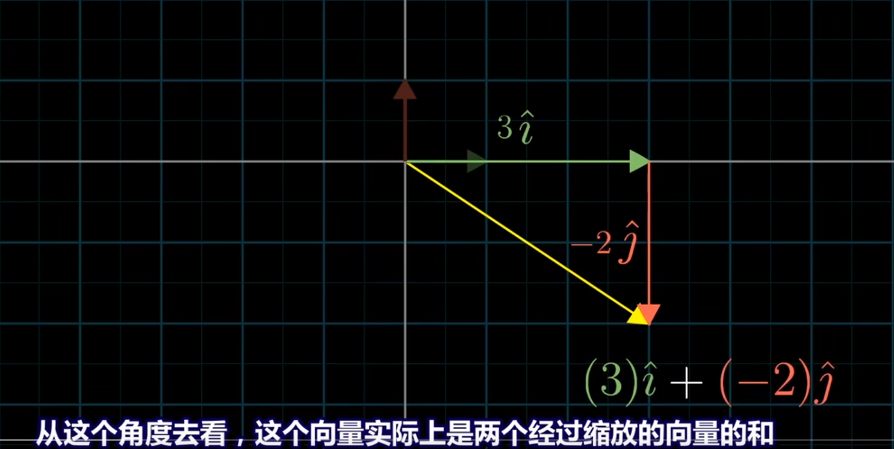

3Blue1Brown视频[《线性代数的本质》](https://www.bilibili.com/video/BV1ys411472E)的笔记。从空间变化理解线性代数。

- [向量](#向量)
  - [向量的几何意义](#向量的几何意义)
  - [向量的加法](#向量的加法)
  - [向量的数乘](#向量的数乘)
  - [向量的线性组合](#向量的线性组合)
  - [向量张成的空间](#向量张成的空间)
  - [线性相关和线性无关](#线性相关和线性无关)
  - [线性变换](#线性变换)
  - [向量补充](#向量补充)
      - [向量的长度](#向量的长度)
      - [向量点积性质](#向量点积性质)
      - [向量点积应用](#向量点积应用)
        - [计算向量a在b上的投影向量](#计算向量a在b上的投影向量)
        - [判断两个向量是否同向](#判断两个向量是否同向)
      - [向量叉积补充](#向量叉积补充)
        - [三维下产生向量的模等于二者模的乘积与夹角正弦值乘积](#三维下产生向量的模等于二者模的乘积与夹角正弦值乘积)
        - [向量叉积应用](#向量叉积应用)
          - [两个向量叉乘可以产生垂直于二者的法向量](#两个向量叉乘可以产生垂直于二者的法向量)
          - [判断点是否在三角形内](#判断点是否在三角形内)
- [矩阵](#矩阵)
  - [复合变换](#复合变换)
  - [矩阵乘法](#矩阵乘法)
  - [矩阵行列式](#矩阵行列式)
  - [线性方程组](#线性方程组)
  - [秩和列空间](#秩和列空间)
  - [矩阵补充](#矩阵补充)
    - [什么是矩阵](#什么是矩阵)
    - [单位矩阵](#单位矩阵)
    - [矩阵加法](#矩阵加法)
    - [矩阵乘法规则](#矩阵乘法规则)
    - [矩阵转置](#矩阵转置)
    - [逆矩阵](#逆矩阵)
    - [行列式图](#行列式图)
    - [任意轴旋转推导](#任意轴旋转推导)
- [向量点积](#向量点积)
- [向量叉积](#向量叉积)

### 向量

三种不同视角看待向量：
1. 物理学视角：空间中的**箭头**，由长度和方向决定一个向量(arrows pointing in space)，向量平移不变
2. 数学视角：向量(a vector can be anything)，只要能保证相加和与数字相乘是有意义的即可，太抽象了
3. 计算机视角：向量等同于有序的数字**列表**(ordered list of numbers)
   
#### 向量的几何意义

和物理专业的看法有一定出入的是，线性代数中的**向量往往以坐标原点起始**。

#### 向量的加法

以$\vec{v} + \vec{w}$为例，即将$\vec{v}$平移，使其起点对准$\vec{w}$的终点，最终画一条从$\vec{v}$起点指向$\vec{w}$终点的向量

$\left[\begin{array}{c} 1 \\ 2 \end{array}\right] + \left[\begin{array}{c} 3 \\ -1 \end{array}\right] = \left[\begin{array}{c} 4 \\ 1 \end{array}\right]$

#### 向量的数乘

$2 \cdot \left[\begin{array}{c} 3 \\ 1 \end{array}\right] = \left[\begin{array}{c} 6 \\ 2 \end{array}\right]$

#### 向量的线性组合

在xy坐标系中有两个特殊含义的向量

1. x轴上的单位向量$\hat{i}$ ，也被叫做i帽(i-hat)      
2. y轴上的单位向量$\hat{j}$ ，也被叫做j帽(j-hat)
  
这些单位向量被叫做坐标系的基向量

把向量看成是基向量**缩放后相加**的结果

$\left[\begin{array}{c} 3 \\ -2 \end{array}\right] = 3 \cdot \hat{i} - 2 \cdot \hat{j}$

这种向量的**缩放后相加**实际上就是**线性组合**(Linear Combination)。也就是说，向量可以理解成基向量的线性组合。

#### 向量张成的空间

1. 一组基向量的线性组合所能到达的点的集合就是该组基向量**张成的空间**(Span)。
2. 在二维情况下，只要基向量不共线，它们张成的空间就覆盖平面上所有的点。
3. 如果基向量共线，它们张成的空间就只有一条线；
4. 如果基向量都是零向量，它们张成的空间就只有一个点。

#### 线性相关和线性无关

我们在向量的线性组合中添加了一个向量，但是并没有扩展这个线性组合张成的空间，这个时候这些向量被称作**线性相关**(Linearly Dependent)；如果一组向量中每一组向量都为这个线性组合扩展了新的维度， 这个时候这些向量被称作**线性无关**(Linearly Independent)。

#### 线性变换

线性变换(Linear Transformation): 接受一个向量并输出一个向量的变换。
1. 线性(Linear)指空间中的所有直线在变换后仍然是直线，且原点的位置没有发生改变，并且网格线平行且等距分布。
2. 变换(Transformation)本质上是函数(function)，但与函数不同的是，变换暗示你可以用可视化的运动来思考这个过程。
   
比如下面就不是:

在线性变换中，只要确定基向量的变换后位置，就能确定其他所有向量的变换后位置。

举例来说，对于向量

$
\vec{v} = \left[\begin{array}{c} x \\ y \end{array}\right] = x \cdot \hat{i} + y \cdot \hat{j}
$

变化后

$
\vec{v'} = x \cdot \hat{i'} + y \cdot \hat{j'}
$

例如:

$
\hat{i'} = \begin{bmatrix} 1 \\ -2 \end{bmatrix}, \quad \hat{j'} = \begin{bmatrix} 3 \\ 0 \end{bmatrix}
$

得出:

$
\begin{aligned}
\vec{v'} &= x \cdot \hat{i'} + y \cdot \hat{j'} \\
&= x \begin{bmatrix} 1 \\ -2 \end{bmatrix} + y \begin{bmatrix} 3 \\ 0 \end{bmatrix} \\
&= \begin{bmatrix} x + 3y \\ -2x \end{bmatrix}
\end{aligned}
$

把基向量变换后的向量作为列排成 $2 \times 2$ 的矩阵 $\begin{bmatrix} 1 & 3 \\ -2 & 0 \end{bmatrix}$，此时矩阵乘以向量 $\vec{v} = \begin{bmatrix} x \\ y \end{bmatrix}$，就是

$
\begin{bmatrix} 1 & 3 \\ -2 & 0 \end{bmatrix}
\begin{bmatrix} x \\ y \end{bmatrix}
= \begin{bmatrix} x + 3y \\ -2x \end{bmatrix}
= \vec{v'}
$

**矩阵本质上是对空间操纵的描述，用于定义一个线性变换的函数**。

**矩阵中的各列依次代表线性变换中，各基向量在变换后的结果(位置)**。矩阵对应的线性变换将**原基向量张成的空间**映射(求函数)到**变换后基向量张成的空间**。

### 向量补充

#### 向量的长度 

#### 向量点积性质

#### 向量点积应用

##### 计算向量a在b上的投影向量

##### 判断两个向量是否同向

#### 向量叉积补充

##### 三维下产生向量的模等于二者模的乘积与夹角正弦值乘积

#### 向量叉积应用

##### 两个向量叉乘可以产生垂直于二者的法向量

##### 判断点是否在三角形内

### 矩阵

#### 复合变换

矩阵是对空间线性变换的描述函数，依次两个线性变换称为**复合变换**(Composition of Transformations)。

一个向量依次经历两个矩阵的线性变换得到的结果，等价于其经过一个复合变换的结果，如下图所示:

#### 矩阵乘法

我的理解，i帽和j帽经过M1线性变化后对应的是M1矩阵第一列和M2矩阵线性变化第二列，同理，再次经过M2线性变化，i帽撇为:

j帽撇为:

性质:

1. 矩阵乘法不满足交换律，即 $AB \neq BA$

2. 矩阵乘法满足结合律，即 $(AB)C = A(BC)$
  
**只从线性变换的角度上思考，两个公式本质上都描述了先进行C变换，再进行B变换，最后进行A变换，因此没有区别**。

#### 矩阵行列式

**行列式**(Determinant)是线性变换后相比变换前空间中体积(二维情况下的面积)的**缩放比例**(Scaling Factor)。

**行列式为负数**的意义，当空间**定向发生改变**时，行列式为负数，但是行列式的**绝对值**依然表示区域面积的缩放比例。

在三维空间中行列式的正负号通过**右手法则**确定，如果在变化后，还可以用右手法则表示，行列式为正。否则，如果在变化后你只能用**左手法则**表示，行列式为负。

二阶矩阵行列式的计算公式:

$
\det \begin{pmatrix} 
a & b \\ 
c & d 
\end{pmatrix} 
= ad - bc
$

三阶矩阵行列式的计算公式:

$
\det \begin{pmatrix} 
a & b & c \\ 
d & e & f \\ 
g & h & i 
\end{pmatrix} 
= a \cdot \det \begin{pmatrix} e & f \\ h & i \end{pmatrix} - b \cdot \det \begin{pmatrix} d & f \\ g & i \end{pmatrix} + c \cdot \det \begin{pmatrix} d & e \\ g & h \end{pmatrix}
$

复合变化的行列式:

$
\det (M1 \cdot M2) = \det (M1) \cdot \det (M2)
$

这个公式从数学角度上推导相当困难，但是类似矩阵乘法的结合律，可以从几何角度去思考这个问题：当进行了线性变换M2后，区域的面积变为了原来的$\det (M2)$倍，再进行了线性变换M1后，区域的面积在此基础上又变为了刚才的$\det (M1)$倍

#### 线性方程组

形如:

$
\begin{cases}
2x + 5y + 3z = -3 \\
4x + 0y + 8z = 0 \\
1x + 3y + 0z = 2
\end{cases}
$

的方程组叫做线性方程组

不难注意到，你可以将上述方程组写成矩阵和向量乘法的形式：

$
\begin{bmatrix} 2 & 5 & 3 \\ 4 & 0 & 8 \\ 1 & 3 & 0 \end{bmatrix}
\begin{bmatrix} x \\ y \\ z \end{bmatrix} = \begin{bmatrix} -3 \\ 0 \\ 2 \end{bmatrix}
$

将该式子展开后得到的方程组和上面的方程组完全相同

我们求解该线性方程组的几何意义变为了：给定一个线性变换A和一个向量 $\vec{v}$，要找到一个向量 $\vec{x}$，使之经过该线性变换后与向量 $\vec{v}$ 重合。

在A的行列式不为0的情况下，我们可以找到一个唯一的向量 $\vec{x}$ 在经过变换后与 $\vec{v}$ 重合 —— 只需要对向量A进行该线性变换的逆向变换即可。

$
\vec{x} = A^{-1} \vec{v}
$

如果**A的行列式为零**，该矩阵将原空间压缩到一个低维空间里(如二维空间压缩到一条直线或者三维空间压缩到一个平面，更甚者压缩到一个点)，则不存在逆变换，因为不存在一个“函数”，可以将一个值映射到多个值。

如果**A的行列式为零**，只有当 $\vec{v}$ 恰好处在那个被压缩后的低维空间里，原方程组才有解（且有无穷多个解），否则没有解。

#### 秩和列空间

**秩**(Rank)是矩阵对应的线性变换所输出空间的维度。这里，输出空间其实就是矩阵的每一列作为向量所**张成的空间**(一组基向量的线性组合所能到达的点的集合就是该组基向量**张成的空间**(Span))，被称为**列空间**(Column Space)。一个矩阵的秩的最大可能取值就是其列数，只有取到该最大值时，行列式才不为零，此时被称为**满秩**(Full Rank)；当秩小于列数时，行列式为零。

我的理解就是，对于3阶矩阵而言，行列式不为零，说明该矩阵对应的空间线性变化没有降低维度，也就是满秩。对应的列空间就是3维空间中所有的向量集合。

当矩阵满秩时，只有零向量会被映射为零向量。当矩阵不满秩时，意味着有些非零向量被映射成零向量，这些原空间中的非零向量张成的空间被称为**零空间**(Null Space)或者**核**(Kernel)。

#### 矩阵补充

##### 什么是矩阵

##### 单位矩阵

##### 矩阵加法

##### 矩阵乘法规则

##### 矩阵转置

##### 逆矩阵

##### 行列式图

##### 任意轴旋转推导

已知任意旋转轴 $\hat{\mathbf{u}}$，$\vec{v}$ 围绕其旋转 $\theta$ 角度，求旋转后的向量 $\vec{v}'$。如下图所示:

(1) 把 $\vec{v}$ 分解为 $\vec{v} = \vec{v}\parallel + \vec{v}\perp$，其中 $\vec{v}\parallel$ 是 $\vec{v}$ 投影到 $\hat{\mathbf{u}}$ 上的向量，$\vec{v}\perp$ 是 $\vec{v}$ 投影到 $\hat{\mathbf{u}}$ 垂直的向量。 如下图所示：

(2) 对 $\vec{v}\perp$ 进行旋转 $\theta$ 角度，得到 $\vec{v}\perp'$。

(3) $\vec{v}\parallel$ + $\vec{v}\perp'$ 就是旋转后的向量 $\vec{v}'$。如下图所示：

$$
\vec{v}\parallel = (\vec{v} \cdot \hat{\mathbf{u}}) \cdot \hat{\mathbf{u}}
$$

$$
\vec{v}\perp = \vec{v} - (\vec{v} \cdot \hat{\mathbf{u}}) \cdot \hat{\mathbf{u}}
$$

$$
可以理解为，任意旋转轴 \hat{\mathbf{u}} 视为z轴，垂直于任意旋转轴的向量 \vec{v}\perp 视为x轴，构建出一个 \vec{w} 视为y轴。
$$

$$
\vec{w} = \hat{\mathbf{u}} \times \vec{v}\perp
$$

$$
\|\vec{w}\| = \|\hat{\mathbf{u}}\| \cdot \|\vec{v}\perp\| \cdot \sin\theta = \|\vec{v}\perp\| \cdot \sin\theta = \|\vec{v}\perp\|
$$

$$
在由 \vec{v}\perp 和 \hat{\mathbf{u}} 张成的平面内，\vec{v}\perp 绕  \hat{\mathbf{u}} 逆时针旋转 θ 角度，得到的  \vec{v}\perp'
可以通过这两个正交向量的线性组合来表达：
$$

$$
\vec{v}\perp' = a \cdot \vec{v}\perp + b \cdot \vec{w} = \cos\theta \cdot \vec{v}\perp + \sin\theta \cdot \vec{w}
= \cos\theta \cdot \vec{v}\perp + \sin\theta \cdot (\hat{\mathbf{u}} \times \vec{v}\perp)
$$

$$
如下图所示：
$$

$$
\vec{v}\perp' = a \cdot \vec{v}\perp + b \cdot \vec{w} = \cos\theta \cdot \vec{v}\perp + \sin\theta \cdot \vec{w}
= 
\cos\theta \cdot \vec{v}\perp + \sin\theta \cdot (\hat{\mathbf{u}} \times \vec{v}\perp)
$$

$$
\vec{v}\perp' = a \cdot \vec{v}\perp + b \cdot \vec{w} = \cos\theta \cdot \vec{v}\perp + \sin\theta \cdot \vec{w}
= 
\cos\theta \cdot \vec{v}\perp + \sin\theta \cdot (\hat{\mathbf{u}} \times (\vec{v} - \vec{v}\parallel))
$$

$$
\vec{v}\perp' = a \cdot \vec{v}\perp + b \cdot \vec{w} = \cos\theta \cdot \vec{v}\perp + \sin\theta \cdot \vec{w}
=
\cos\theta \cdot \vec{v}\perp + \sin\theta \cdot (\hat{\mathbf{u}} \times \vec{v} - \hat{\mathbf{u}} \times \vec{v}\parallel)
$$

$$ 
\hat{\mathbf{u}} 和 \vec{v}\parallel 平行的，叉乘结果为零向量
$$

$$
\vec{v}\perp' = a \cdot \vec{v}\perp + b \cdot \vec{w} = \cos\theta \cdot \vec{v}\perp + \sin\theta \cdot \vec{w}
=
\cos\theta \cdot \vec{v}\perp + \sin\theta \cdot (\hat{\mathbf{u}} \times \vec{v})
$$

$$
求出\vec{v}'
$$

$$
\vec{v}' = \vec{v}\parallel + \vec{v}\perp' 
= 
(\vec{v} \cdot \hat{\mathbf{u}}) \cdot \hat{\mathbf{u}} +
\cos\theta \cdot \vec{v}\perp + \sin\theta \cdot (\hat{\mathbf{u}} \times \vec{v})
=
(\vec{v} \cdot \hat{\mathbf{u}}) \cdot \hat{\mathbf{u}} + \cos\theta \cdot (\vec{v} - (\vec{v} \cdot \hat{\mathbf{u}}) \cdot \hat{\mathbf{u}}) + \sin\theta \cdot (\hat{\mathbf{u}} \times \vec{v})
$$

$$
整理：
$$

$$
\vec{v}' = \cos\theta \cdot (\vec{v} - (\vec{v} \cdot \hat{\mathbf{u}}) \cdot \hat{\mathbf{u}}) + \sin\theta \cdot (\hat{\mathbf{u}} \times \vec{v}) + (\vec{v} \cdot \hat{\mathbf{u}}) \cdot \hat{\mathbf{u}}
$$

$$
其实就是罗德里格旋转公式(Rodrigues' Rotation Formula)
$$

我们知道矩阵是对空间线性变换的描述函数，第一列是变换后的基向量i，第二列是变换后的基向量j，第三列是变换后的基向量k。根据上面的罗德里格旋转公式，依次计算出旋转后的向量i', j', k'。

已知旋转轴 $\hat{\mathbf{u}}$, $\vec{v}$ 围绕其旋转 $ \theta $ 角度，对应的旋转矩阵：

$$
\mathbf{R}(\hat{\mathbf{u}}, \theta) =
\begin{pmatrix}
\cos\theta + u_x^2 (1 - \cos\theta) & u_x u_y (1 - \cos\theta) - u_z \sin\theta & u_x u_z (1 - \cos\theta) + u_y \sin\theta \\
u_y u_x (1 - \cos\theta) + u_z \sin\theta & \cos\theta + u_y^2 (1 - \cos\theta) & u_y u_z (1 - \cos\theta) - u_x \sin\theta \\
u_z u_x (1 - \cos\theta) - u_y \sin\theta & u_z u_y (1 - \cos\theta) + u_x \sin\theta & \cos\theta + u_z^2 (1 - \cos\theta)
\end{pmatrix}
$$

### 向量点积

$\vec{v}$ 和 $\vec{w}$ 的**点积**(dot products)，在几何上等价于先将 $\vec{w}$ 投影(Project)到 $\vec{v}$ 的方向上，然后投影得到的长度乘以 $\vec{v}$ 的长度。

$
\vec{v} \cdot \vec{w} = \|\vec{v}\| \|\vec{w}\| \cos\theta = \sum_{i=1}^n v_i w_i
$

求模公式: 

$
\|\vec{v}\| = \sqrt{v_1^2 + v_2^2 + \cdots + v_n^2}
$

**点积的结果和顺序无关**

$
\vec{v} \cdot \vec{w} = \vec{w} \cdot \vec{v}
$

### 向量叉积

$\vec{v} \times \vec{w}$ 叉积，在几何上是向量张成的平行四边形的面积，其符号当 $\vec{v}$ 在  $\vec{w}$ 的右侧时数值为正，反之则为负

和点积不同的是，叉积的数值是不满足交换律的，有 

$
\vec{v} \times \vec{w} = - \vec{w} \times \vec{v}
$

**对于二维空间，叉积的计算方式和行列式的计算方式类似，结果应该是一个标量**，如下公式：

$
\begin{bmatrix} a \\ b \end{bmatrix}
\times
\begin{bmatrix} c \\ d \end{bmatrix}
= \det \begin{bmatrix} a & c \\ b & d \end{bmatrix}
= ad - bc
$

写作如下形式也是可以的，因为矩阵的转置并不会改变行列式的值：

$
\begin{bmatrix} a \\ c \end{bmatrix}
\times
\begin{bmatrix} b \\ d \end{bmatrix}
= \det \begin{bmatrix} a & b \\ c & d \end{bmatrix}
= ad - bc
$

你可以认为 $\begin{bmatrix} a \\ b \end{bmatrix}$ 和 $\begin{bmatrix} c \\ d \end{bmatrix}$ 是基向量 $\begin{bmatrix} 0 \\ 1 \end{bmatrix}$ 和 $\begin{bmatrix} 1 \\ 0 \end{bmatrix}$ 经过某线性变换之后得到的向量，那么此时，如果我们专注于 $\begin{bmatrix} 0 \\ 1 \end{bmatrix}$ 和 $\begin{bmatrix} 1 \\ 0 \end{bmatrix}$ 围成的平行四边形的面积 —— 变换前为1，而变换后为 ，此时该线性变换的面积就是行列式 ，其正负号与行列式一章中行列式的正负号含义一致。

**对于三维空间，叉积的结果是一个向量，该向量垂直于 $\vec{v}$ 和 $\vec{w}$ 张成的平面，方向根据右手定则确定，长度等于 $\vec{v}$ 和 $\vec{w}$ 张成的面积。**

计算公式：

$
\begin{bmatrix} v1 \\ v2 \\ v3 \end{bmatrix}
\times
\begin{bmatrix} w1 \\ w2 \\ w3 \end{bmatrix}
= \begin{bmatrix} v2 w3 - w2 v3 \\ v3 w1 - w3 v1 \\ v1 w2 - w1 v2 \end{bmatrix}
$

该公式可以写作一个更易于记忆的行列式写法：

$
\begin{bmatrix} v1 \\ v2 \\ v3 \end{bmatrix}
\times
\begin{bmatrix} w1 \\ w2 \\ w3 \end{bmatrix}
= \begin{bmatrix} \hat i & v1 & w1 \\ \hat j & v2 & w2 \\ \hat k & v3 & w3 \end{bmatrix}
$

同样地，写作如下形式也是可以的，因为矩阵的转置并不会改变行列式的值：

$
\begin{bmatrix} v1 \\ v2 \\ v3 \end{bmatrix}
\times
\begin{bmatrix} w1 \\ w2 \\ w3 \end{bmatrix}
= \begin{bmatrix} \hat i & \hat j & \hat k \\ v1 & v2 & v3 \\ w1 & w2 & w3 \end{bmatrix}
$

展开行列式：

$
\det \begin{pmatrix} 
\hat i & v1 & w1 \\ 
\hat j & v2 & w2 \\ 
\hat k & v3 & w3 
\end{pmatrix} 
= \hat i \cdot \det \begin{pmatrix} v2 & w2 \\ v3 & w3 \end{pmatrix} - \hat j \cdot \det \begin{pmatrix} v1 & w1 \\ v3 & w3 \end{pmatrix} + \hat k \cdot \det \begin{pmatrix} v1 & w1 \\ v2 & w2 \end{pmatrix}
= \hat i (v2 w3 - w2 v3) - \hat j (v3 w1 - w3 v1) + \hat k (v1 w2 - w1 v2)
$

