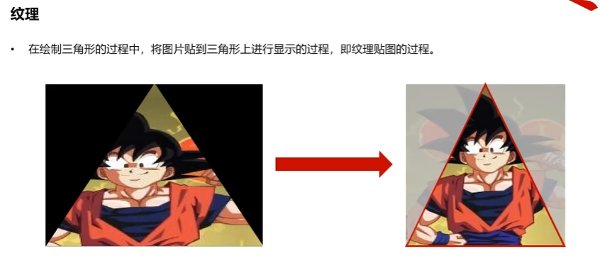
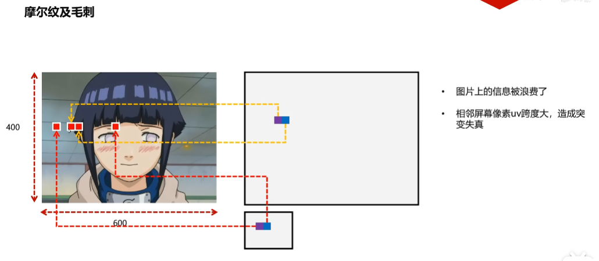
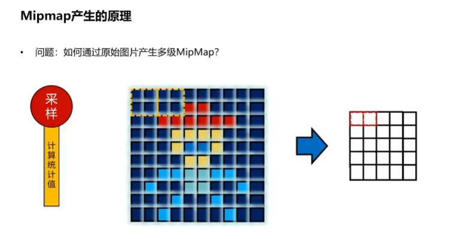

- [OpenGL](#opengl)
- [OpenGL ES](#opengl-es)
- [EGL](#egl)
- [ANGLE](#angle)
- [GLFW](#glfw)
- [SDL](#sdl)
- [GLAD](#glad)
- [GLM](#glm)
- [标准化设备坐标系](#标准化设备坐标系)
- [坐标系](#坐标系)
  - [笛卡尔坐标系](#笛卡尔坐标系)
  - [齐次坐标](#齐次坐标)
  - [概述](#概述)
    - [局部坐标系/物体坐标系](#局部坐标系物体坐标系)
    - [世界坐标系](#世界坐标系)
    - [观察坐标系/视觉坐标系](#观察坐标系视觉坐标系)
    - [裁剪坐标系](#裁剪坐标系)
    - [屏幕坐标系](#屏幕坐标系)
- [网格(Mesh)](#网格mesh)
- [摄像机](#摄像机)
- [视图变换矩阵](#视图变换矩阵)
- [投影](#投影)
  - [正交投影](#正交投影)
  - [正交投影矩阵](#正交投影矩阵)
  - [透视投影](#透视投影)
  - [透视投影矩阵](#透视投影矩阵)
- [渲染管线](#渲染管线)
  - [顶点数据](#顶点数据)
  - [三维变化](#三维变化)
     - [顶点着色器](#顶点着色器)
     - [曲面细分着色器](#曲面细分着色器)
     - [几何着色器](#几何着色器)
  - [图元装配](#图元装配)
  - [剪裁剔除](#剪裁剔除)
  - [光栅化](#光栅化)
  - [片元着色器](#片元着色器)
  - [混合与测试](#混合与测试)
- [GPU工作流程解析](#gpu工作流程解析)
- [VBO](#vbo)
- [VAO](#vao)
- [EBO](#ebo)
- [Shader](#shader)
- [GLSL语言](#glsl语言)
  - [Vertex Shader](#vertex-shader)
  - [Fragment Shader](#fragment-shader)
  - [Shader的编译与链接](#shader的编译与链接)
  - [VBO绘制流程](#vbo绘制流程)
- [EBO](#ebo)
- [GLSL语法](#glsl语法)
    - [变量类型](#变量类型)
    - [向量使用方式](#向量使用方式)
    - [变量分类](#变量分类)
    - [uniform变量](#uniform变量)
- [纹理](#纹理)
    - [UV坐标](#uv坐标)
    - [纹理单元](#纹理单元)
    - [纹理过滤](#纹理过滤)
    - [纹理包裹](#纹理包裹)
    - [纹理混合](#纹理混合)
- [多级渐远纹理](#多级渐远纹理)
    - [多级渐远纹理产生的原理](#多级渐远纹理产生的原理)
       - [滤波](#滤波)
       - [采样](#采样)
    - [OpenGL如何判定使用哪一级Mipmap?](#opengl如何判定使用哪一级mipmap)
    - [手动测试mipmap](#手动测试mipmap)
	- [OpenGL的Mipmap使用](#opengl的mipmap使用)

### OpenGL 

​​`Khronos Group​​`制定和维护`OpenGL`​( ​​Open Graphics Library​​)​规范​​(Specification)，严格定义每个函数的输入、输出和行为。理论上任何人都可以按照这些规范实现一套`OpenGL`库，就像标准`C`库有很多不同的实现一样，比如`SwiftShader`就是一个基于`CPU`的纯软件的`OpenGL`实现。如果要想使用`GPU`硬件，一般是`GPU`设备制造商(NVIDIA, AMD, Intel)来实现这些`API`，这些库也被称为GPU驱动。

`OpenGL`只负责**绘图**，不负责创建程序窗口，不负责处理键盘/鼠标等交互事件，不负责应用应该如何初始化OpenGL上下文。


### OpenGL ES

`OpenGL ES`(OpenGL for Embedded Systems)是三维图形应用程序接口`OpenGL`的**子集**，针对手机、PDA和游戏主机等嵌入式设备而设计。该`API`由​​`Khronos Group​​`制定和维护。

### EGL

`EGL`(Embedded-System Graphics Library)，嵌入式系统图形库，是​`OpenGL ES`渲染`API`与设备原生窗口系统之间的一个中间接口层​​。它主要由系统制造商实现，充当了图形渲染`API`与不同平台本地窗口系统(如 Android、Linux、Windows 等)之间的​​桥梁​

### ANGLE

`ANGLE`的目标是让多个操作系统上的用户能够无缝运行`WebGL`及其他基于`OpenGL ES`的内容，其方式是将`OpenGL ES API`调用转换为该平台硬件所支持的某个底层图形`API`。

`ANGLE`提供了`EGL 1.5`规范的实现。

[懒人win包](https://medium.com/@lag945/egl-angle-windows-3d%E5%BB%BA%E7%BD%AE%E9%96%8B%E7%99%BC%E7%B4%80%E9%8C%84-eb447de17504)

### GLFW

`GLFW`是一个开源的、跨平台库，用于在桌面平台上进行`OpenGL`、`OpenGL ES`和`Vulkan`开发。它提供了一个简单的`API`，用于创建窗口、上下文和表面，以及接收输入和事件。

### SDL

`SDL`(Simple DirectMedia Layer)，直译为**简单直接媒体层库**是一套开放源代码的跨平台多媒体开发库，使用C语言写成。通过OpenGL/Direct3D/Metal/Vulkan接口提供对音频、键盘、鼠标、摇杆及图形硬件的底层访问。

### GLAD

`GLAD`(OpenGL Loader And API for Developers)是一个专门用于​​简化OpenGL函数指针加载过程​​的开源库。它的核心作用是解决不同平台和显卡驱动下OpenGL函数地址的动态获取问题，让你能更轻松、更安全地使用OpenGL进行图形开发。

在现代OpenGL/OpenGL ES编程中，你不能直接调用gl*函数，因为这些函数的实际执行代码位于显卡驱动程序内部，它们的内存地址在程序运行时才能确定。


https://glad.dav1d.de/

### GLM

`GLM`(OpenGL Mathematics)是一个专为OpenGL图形编程设计的C++数学库，它基于OpenGL Shading Language(GLSL)规范。

这个项目不限于GLSL的功能。基于GLSL扩展约定的扩展系统提供扩展能力：矩阵变换，四元数，数据打包，随机数，噪声等等。

https://github.com/g-truc/glm/releases

**GLM标准：所有的变化都是相对于局部坐标系而言的，缩放相对于自身局部坐标系的原点，平移相对于自身局部坐标系的原点。旋转相对于自身局部坐标系的原点。**


**下面这个图用代码来解释一下**


```C++
void DoOnceTransform(glm::mat4& oriM)
{
	// 第一进入这里，oriM是一个4x4的单位矩阵
	oriM = glm::scale(oriM, glm::vec3(0.5f, 1.0f, 1.0f));
	/*
	* [1 0 0 0]  [0.5f 0    0    0]   [0.5 0 0 0]
	* [0 1 0 0]  [0    1.0f 0    0]   [0   1 0 0]
	* [0 0 1 0]  [0    0    1.0f 0]   [0   0 1 0]
	* [0 0 0 1]  [0    0    0    1]   [0   0 0 1]
	*/
}

// 先做一次缩放，再叠加平移 
void DoScaleAndTranslateTransform(glm::mat4& oriM)
{
	static bool isDoOneceTransform = false;
	if (!isDoOneceTransform)
	{
		DoOnceTransform(oriM);
		isDoOneceTransform = true;
	}
	// 第一次进入这里，oriM：
	/*
	* [0.5 0 0 0]
	* [0   1 0 0]
	* [0   0 1 0]
	* [0   0 0 1]
	*/
	oriM = glm::translate(oriM, glm::vec3(0.01f, 0.0f, 0.0f));
	/*
	* [0.5 0 0 0]  [1 0 0 0.01]   [0.5 0 0 0.004999(1*(0.01*0.05f))]
	* [0   1 0 0]  [0 1	0    0]   [0   1 0        0]
	* [0   0 1 0]  [0 0	1    0]   [0   0 1        0]
	* [0   0 0 1]  [0 0	0    1]   [0   0 0        1]
	*/
	/*
	* [0.5 0 0 0.004999]  [1 0 0 0.01]  [0.5 0 0  0.00999999978(2*(0.01f*0.5f))]
	* [0   1 0        0]  [0 1	0   0]  [0   1 0              0]
	* [0   0 1        0]  [0 0	1   0]  [0   0 1              0]
	* [0   0 0        1]  [0 0	0   1]  [0   0 0              1]
	*/
}
```

### 标准化设备坐标系

用户使用的显示器的分辨率未知，所有了标准化设备坐标系(Normalized Device Coordinates, NDC)，用[-1, 1]表示顶点的坐标。本质上就是比例。


**NDC坐标系是三维**的，因为它需要保留深度信息(Z轴)。OpenGL中XYZ轴坐标范围都是[-1, 1]。

**OpenGL是右手坐标系**，但是OpenGL对应的**NDC坐标系是左手坐标系**。

**将[−n,−f] 映射到[−1,1]也就是NDC, -1是近平面，1是远平面。**


### 坐标系

#### 笛卡尔坐标系


坐标系分为两种，一种是左手坐标系，一种是右手坐标系。如下图所示：


左右手坐标系的核心差异：

**这两种坐标系的唯一区别在于：当你确定了 X 轴和 Y 轴的方向后，Z 轴的方向在哪里。**

**OpenGL是右手坐标系**

#### 齐次坐标

[齐次坐标(homogeneous coordinates)视频1](https://www.bilibili.com/video/BV1vi421Y7nP)

[齐次坐标(homogeneous coordinates)视频2](https://www.bilibili.com/video/BV1b34y1y7nF)


#### 概述


1. 模型变化矩阵(Model Matrix)解决了 "物体放在世界的哪个位置"
2. 视图变化矩阵(View Matrix)解决了 "我们从世界的哪个角度和位置观察它"
3. 投影变化矩阵(Projection Matrix)解决了 "将3D空间中的物体投影到2D屏幕上"

##### 局部坐标系/物体坐标系

局部坐标系(Local Coordinate System)，也叫物体坐标系(Object Coordinate System)，是一个以特定物体自身为参考基准的坐标系统。模型的所有顶点都是在局部空间中，它们相对于你的物体来说都是局部的。坐标系的​​原点​​和​​坐标轴方向​​会随着物体的移动、旋转或缩放而**同步变化**。当物体在世界中移动、旋转或变大时，它的局部坐标系也随之整体平移、旋转和缩放。

我的理解：

**物体坐标系中物体的所有顶点坐标都是相对于物体坐标系，在初始默认状态下，其​​原点(0,0,0)和坐标轴方向(X,Y,Z轴的正方向)与世界坐标系原点(0,0,0)和坐标轴方向(X,Y,Z轴的正方向)完全重合的，经过模型矩阵(平移缩放旋转)以后，物体的所有顶点坐标都是相对于世界坐标系了。**

**模型变化矩阵(Model Matrix)解决了 "物体放在世界的哪个位置"**

##### 世界坐标系

世界坐标系(World Coordinate System)是一个全局的坐标系统，用于描述整个场景中的所有物体和点。

##### 观察坐标系/视觉坐标系

观察坐标系(View Coordinate System)，也叫视觉坐标系(Eye Coordinate System)，其实就是摄像机局部坐标系(Camera Local Coordinate System)。摄像机局部坐标系初始状态下，其​​原点(0,0,0)和坐标轴方向(X,Y,Z轴的正方向)与世界坐标系原点(0,0,0)和坐标轴方向(X,Y,Z轴的正方向)完全重合的，摄像机观察方向是-Z轴方向。经过一系列的位移和旋转变化，也就是摄相机模型变换矩阵，而这个矩阵的逆就是观察变化矩阵，作用是，将物体和点的坐标从世界坐标系(World Coordinate System)转换到摄像机局部坐标系(Camera Local Coordinate System)。

**视图变化矩阵(View Matrix)解决了 "我们从世界的哪个角度和位置观察它"** 

##### 裁剪坐标系

无论是正交投影还是透视投影，我们都将观测空间转换成了一个规范立方体(NDC)，同时将转换矩阵应用到空间中的所有物体中。

之后，我们就可以通过规范立方体对空间进行裁剪，只保留规范立方体内的物体，如下所示。很显然，只有在规范立方体中的部分才是我们可以看见的部分。

**投影变化矩阵(Projection Matrix)解决了 "将3D空间中的物体投影到2D屏幕上"**


##### 屏幕坐标系

视口(Viewport)本质上就是我们所说的 2D 画布，即屏幕。我们知道屏幕有各种各样的分辨率，宽高比。为了处理这种情况，我们将 2D 画布抽象成一个[-1, 1]^2的规范平面。然后通过视口变换将它映射到真正的视口中。假设真实视口的宽度是 width ，高度是 height，那么视口变换就是将 [-1, 1]^2 的平面转换成 [0, width] X [0, height] 的平面


### 网格(Mesh)

网格(Mesh): 存储一个模型的几何形状数据。


### 摄像机

[什么是视图变换矩阵？什么是摄像机？](https://www.bilibili.com/video/BV162421P7Mt)

在渲染技术中，如果世界坐标系确定以及物体都已经摆放完毕的情况下，需要确定一台摄像机(Camera)来观察场景中的物体。

摄像机参数：

1. 摄像机在世界坐标系中的位置(Eye Position)
2. 摄像机所注视的目标在世界坐标系中的位置(Look At Position)，normalized(EyeVector - LookAtVector)用来定义摄像机局部坐标系的-Z轴方向
3. 摄像机在世界坐标系中穹顶向量(Up Vector)，就是用来定义摄像机局部坐标系的+Y轴的方向，normalized(cross((EyeVector - LookAtVector), UpVector))用来定义摄像机局部坐标系的+X轴方向

我的理解：

**摄像机初始状态下，其​​原点(0,0,0)和坐标轴方向(X,Y,Z轴的正方向)是与世界坐标系原点(0,0,0)和坐标轴方向(X,Y,Z轴的正方向)完全重合的，摄像机观察方向是-Z轴方向。世界坐标系中某个点P的坐标为(0, 0, 10)，摄像机是观察不到P点**


### 视图变换矩阵

视图矩阵(View Matrix)，作用是将物体和点的坐标从世界坐标系(World Coordinate System)转换到摄像机局部坐标系(Camera Local Coordinate System)，这里的摄像机局部坐标系就是观察坐标系(View Coordinate System)。

摄像机的变化，可以拆分为**旋转**和**平移**。

$
M = T \cdot R
$

$
\mathbf{M}^{-1} = (T \cdot R)^{-1} = R^{-1} \cdot T^{-1}
$

$\mathbf{M}^{-1}$ 叫做视图变换矩阵(View Matrix)

**​​视图矩阵是摄相机模型变换矩阵的逆**，如果理解？

摄像机不做任何旋转和平移，保证了摄像机局部坐标系和世界坐标系原点和各个轴方向完全相同，摄像机观察方向是-Z轴方向，世界坐标系中的所有物体和点做相反的操作，这和移动摄像机是一个道理。所以世界坐标系中的所有物体和点，都可以通过视图变换矩阵，转换到摄像机局部坐标系中。

### 投影

投影(Projection): 三维场景中的物体们，想让我们看到，就必须投影到一块幕布上，显示出来。


无论是正交投影还是透视投影，我们都将观测空间转换成了一个规范立方体(NDC)，同时将转换矩阵应用到空间中的所有物体中。

之后，我们就可以通过规范立方体对空间进行裁剪，只保留规范立方体内的物体，如下所示。很显然，只有在规范立方体中的部分才是我们可以看见的部分。


投影关键字：

1. 近平面near: 观测空间近平面和摄像机的**距离**，正值
2. 远平面far: 观测空间远平面和摄像机的**距离**，正值
3. 近平面left: 观测空间近平面最左边的**X坐标**，可正可负
4. 近平面right: 观测空间近平面最右边的**X坐标**，可正可负
5. 近平面top: 观测空间近平面最上面的**Y坐标**，可正可负
6. 近平面bottom: 观测空间近平面最下面的**Y坐标**，可正可负


#### 正交投影

正交投影(Orthographic Projection): 


#### 正交投影矩阵

正交投影矩阵，将**摄像机局部坐标系(观察坐标系)** 中定义一个长方体**观测空间(View Volumne)**，并将该区域进行平移缩放成**2x2x2 NDC标准系下的立方体**。最终将这个立方体的近平面(Near Plane)经过**裁剪**和**视口变化**绘制到了显示器上。

正交投影矩阵是如何得到？

在将观测空间转换成规范立方体的过程中，我们计算得到了正交投影矩阵。根据相对不变性原理，我们要使用该矩阵对空间中所有物体进行同样的变换。

盒子内的顶点，经过正交投影矩阵变换，会在 2x2x2 NDC标准系下的立方体盒子中。

盒子外的顶点，经过正交投影矩阵变换，不会在 2x2x2 NDC标准系下的立方体盒子中。

为什么要平移？

立方体盒子的中心和观察坐标系的原点一般来说都没有重合，如果不经过平移，仅仅是缩放，立方体中的所有物体和点都会向着观察坐标系的原点进行缩放，最终没法把立方体缩放到[-1, 1]的范围。所以需要平移，将立方体盒子的中心平移到观察坐标系的原点，然后缩放。


正交投影矩阵 = 缩放矩阵 * 平移矩阵

**near 和 far 如果是坐标，可正可负。对应的正交投影矩阵：**

$$
\mathbf{M}_{\text{ortho}} = \mathbf{S}_{\text{ortho}} \mathbf{T}_{\text{ortho}}
=
\begin{pmatrix}
\frac{2}{r-l} & 0 & 0 & 0 \\
0 & \frac{2}{t-b} & 0 & 0 \\
0 & 0 & \frac{2}{n-f} & 0 \\
0 & 0 & 0 & 1
\end{pmatrix}
\cdot
\begin{pmatrix}
1 & 0 & 0 & -\frac{r+l}{2} \\
0 & 1 & 0 & -\frac{t+b}{2} \\
0 & 0 & 1 & -\frac{n+f}{2} \\
0 & 0 & 0 & 1
\end{pmatrix}
=
\begin{pmatrix}
\frac{2}{r-l} & 0 & 0 & -\frac{r+l}{r-l} \\
0 & \frac{2}{t-b} & 0 & -\frac{t+b}{t-b} \\
0 & 0 & \frac{2}{n-f} & -\frac{n+f}{n-f} \\
0 & 0 & 0 & 1
\end{pmatrix}
$$

**near 和 far 如果是距离，正数。对应的正交投影矩阵：**

$$
\mathbf{M}_{\text{ortho}} = \mathbf{S}_{\text{ortho}} \mathbf{T}_{\text{ortho}}
=
\begin{pmatrix}
1& 0 & 0 & 0 \\
0 & 1 & 0 & 0 \\
0 & 0 & -1 & 0 \\
0 & 0 & 0 & 1
\end{pmatrix}
\cdot
\begin{pmatrix}
\frac{2}{r-l} & 0 & 0 & 0 \\
0 & \frac{2}{t-b} & 0 & 0 \\
0 & 0 & \frac{2}{f-n} & 0 \\
0 & 0 & 0 & 1
\end{pmatrix}
\cdot
\begin{pmatrix}
1 & 0 & 0 & -\frac{r+l}{2} \\
0 & 1 & 0 & -\frac{t+b}{2} \\
0 & 0 & 1 & \frac{f+n}{2} \\
0 & 0 & 0 & 1
\end{pmatrix}
=
\begin{pmatrix}
1& 0 & 0 & 0 \\
0 & 1 & 0 & 0 \\
0 & 0 & -1 & 0 \\
0 & 0 & 0 & 1
\end{pmatrix}
\cdot
\begin{pmatrix}
\frac{2}{r-l} & 0 & 0 & -\frac{r+l}{r-l} \\
0 & \frac{2}{t-b} & 0 & -\frac{t+b}{t-b} \\
0 & 0 & \frac{2}{f-n} & \frac{f+n}{f-n} \\
0 & 0 & 0 & 1
\end{pmatrix}
=
\begin{pmatrix}
\frac{2}{r-l} & 0 & 0 & -\frac{r+l}{r-l} \\
0 & \frac{2}{t-b} & 0 & -\frac{t+b}{t-b} \\
0 & 0 & -\frac{2}{f-n} & -\frac{f+n}{f-n} \\
0 & 0 & 0 & 1
\end{pmatrix}
$$

**上面-1的目的是将[−n,−f] 映射到[−1,1]也就是NDC**

**无论哪一种，最终NDC都是左手坐标系，-1是近平面，1是远平面。**

#### 透视投影

透视投影(Perspective Projection): 


#### 透视投影矩阵

透视投影借鉴了正交投影的做法，只不过相对而言，它多了一步压缩过程，也就是说，透视投影 = 压缩 + 正交投影。即：

1. 将​​视锥体(Frustum)​​"压缩"成一个​​长方体(Cuboid）)​​
2. 将这个长方体经过平移缩放到​​归一化设备坐标(NDC)的标准立方体中

什么是压缩？

**要把视锥体转化成长方体**，其实就是把远平面(x,y,z)转成(x',y',z)，利用的就是相似三角平行原理。从下面图中推导出计算公式，可以看出压缩之后的y'坐标与距离(-z)成反比关系。x'也是一样的道理。这也从直观上解释了为什么透视投影中，距离越远，物体看起来越小。


透视投影矩阵，将**摄像机局部坐标系(观察坐标系)** 中定义一个视锥体**观测空间(View Volumne)**，并将该区域进行**压缩**平移缩放成**2x2x2 NDC标准系下的立方体**。最终将这个立方体的近平面(Near Plane)经过**裁剪**和**视口变化**绘制到了显示器上。

透视投影矩阵是如何得到？

在将观测空间转换成规范立方体的过程中，我们计算得到了正交投影矩阵。根据相对不变性原理，我们要使用该矩阵对空间中所有物体进行同样的变换。

[透视投影矩阵的推导](https://www.bilibili.com/video/BV11m411k7ga)

[探秘三维透视投影 - 齐次坐标的妙用](https://www.bilibili.com/video/BV1LS4y1b7xZ)

[计算机图形学基础（3）——观测变换](http://chuquan.me/2024/03/23/foundation-of-computer-graphic-03/#%E5%B1%8F%E5%B9%95%E6%98%A0%E5%B0%84)

**下方计算出的矩阵，本质是压缩矩阵，就是将视锥体压缩成长方体。再将正交投影矩阵作用到其上以后的矩阵就是透视投影矩阵。**

**下面"-"号的原因，n而言是距离，抵消掉z的负数**


**我们知道矩阵做的是对应元素相乘再相加，而这里需要用到除法，所以使用齐次矩阵**


**将矩阵计算之后的坐标表示成之前得出的投影公式**


最后，我们来求解第三行的值。我们基于两个以下两个依据：

1. 近平面上的点的 Z 坐标不会变化，即 2D 画布上的值不变。
2. 远平面上的点 Z 坐标不会变化。

**near 和 far 是距离，正数。对应的压缩矩阵：**

$
\frac{Z'}{ω​'} = \frac{0X + 0Y + KZ + L}{-Z}
$

近平面:

$
\frac{K(-n) + L}{-(-n)} = -n
$

远平面:

$
\frac{K(-f) + L}{-(-f)} = -f
$

求解上述方程，得到：

$
K = n + f
$

$
L = nf
$

最终得到"压缩矩阵"，目的是把视锥体观察区域转成长方体观察区域:

$
\mathbf{M}_{\text{persp->ortho}} =
\begin{pmatrix}
n & 0 & 0 & 0 \\
0 & n & 0 & 0 \\
0 & 0 & n+f & nf \\
0 & 0 & -1 & 0
\end{pmatrix}
$

让我们计算出最终的透视投影矩阵：

$$
\mathbf{M}_{\text{ortho}} = \mathbf{S}_{\text{ortho}} \mathbf{T}_{\text{ortho}}
=
\begin{pmatrix}
1& 0 & 0 & 0 \\
0 & 1 & 0 & 0 \\
0 & 0 & -1 & 0 \\
0 & 0 & 0 & 1
\end{pmatrix}
\cdot
\begin{pmatrix}
\frac{2}{r-l} & 0 & 0 & 0 \\
0 & \frac{2}{t-b} & 0 & 0 \\
0 & 0 & \frac{2}{f-n} & 0 \\
0 & 0 & 0 & 1
\end{pmatrix}
\cdot
\begin{pmatrix}
1 & 0 & 0 & -\frac{r+l}{2} \\
0 & 1 & 0 & -\frac{t+b}{2} \\
0 & 0 & 1 & \frac{f+n}{2} \\
0 & 0 & 0 & 1
\end{pmatrix}
=
\begin{pmatrix}
1& 0 & 0 & 0 \\
0 & 1 & 0 & 0 \\
0 & 0 & -1 & 0 \\
0 & 0 & 0 & 1
\end{pmatrix}
\cdot
\begin{pmatrix}
\frac{2}{r-l} & 0 & 0 & -\frac{r+l}{r-l} \\
0 & \frac{2}{t-b} & 0 & -\frac{t+b}{t-b} \\
0 & 0 & \frac{2}{f-n} & \frac{f+n}{f-n} \\
0 & 0 & 0 & 1
\end{pmatrix}
=
\begin{pmatrix}
\frac{2}{r-l} & 0 & 0 & -\frac{r+l}{r-l} \\
0 & \frac{2}{t-b} & 0 & -\frac{t+b}{t-b} \\
0 & 0 & -\frac{2}{f-n} & -\frac{f+n}{f-n} \\
0 & 0 & 0 & 1
\end{pmatrix}
$$

$$
\mathbf{M}_{\text{persp}} = \mathbf{M}_{\text{ortho}} \mathbf{M}_{\text{persp->ortho}}
=
\begin{pmatrix}
\frac{2}{r-l} & 0 & 0 & -\frac{r+l}{r-l} \\
0 & \frac{2}{t-b} & 0 & -\frac{t+b}{t-b} \\
0 & 0 & -\frac{2}{f-n} & -\frac{f+n}{f-n} \\
0 & 0 & 0 & 1
\end{pmatrix}
\cdot
\begin{pmatrix}
n & 0 & 0 & 0 \\
0 & n & 0 & 0 \\
0 & 0 & n+f & nf \\
0 & 0 & -1 & 0
\end{pmatrix}
= 
\begin{pmatrix}
\frac{2n}{r-l} & 0 & \frac{r+l}{r-l} & 0 \\
0 & \frac{2n}{t-b} & \frac{t+b}{t-b} & 0 \\
0 & 0 & -\frac{f+n}{f-n} & -\frac{2fn}{f-n} \\
0 & 0 & -1 & 0
\end{pmatrix}
$$


### 渲染管线

[渲染管线梳理1](https://www.bilibili.com/video/BV1rV411X7vZ)

[渲染管线梳理2](https://www.bilibili.com/video/BV13T4y1h7HX)

[细说渲染管线](https://positiveczp.github.io/%E7%BB%86%E8%AF%B4%E5%9B%BE%E5%BD%A2%E5%AD%A6%E6%B8%B2%E6%9F%93%E7%AE%A1%E7%BA%BF.pdf)

渲染管线，通过给定虚拟相机、3D场景物体以及光源等场景要素来产生或者渲染一副2D的图像。

渲染管线可以被划分为两个主要部分：第一部分把你的3D坐标转换为2D坐标，第二部分是把2D坐标转变为实际的有颜色的像素。


#### 顶点数据

顶点数据(vertex data)，用来为后面的顶点着色器等阶段提供处理的数据。是渲染管线的数据主要来源。送入到渲染管线的数据包括顶点坐标、纹理坐标、顶点法线和顶点颜色等顶点属性。


#### 三维变化


##### 顶点着色器

顶点着色器(vertex shader)，**可编程​**，主要功能是进行坐标变换。将输入的局部坐标变换到世界坐标、观察坐标和裁剪坐标。虽然我们也会在顶点着色器进行光照计算(称作高洛德着色)，然后经
过光栅化插值得到各个片段的颜色，但由于这种方法得到的光照比较不自然，所以一般在片段着色器进行光照计算。

##### 曲面细分着色器

曲面细分控制着色器 (tessellation control shader)，曲面细分评估着色器 (tessellation evaluation shader)，**可选**，**可编程​**，利用镶嵌化处理技术对三角面进行细分，以此来增加物体表面的三角面的数量。


##### 几何着色器

几何着色器(geometry shader)，**可选**，**可编程​**，核心目的是在GPU上实现几何体的动态、运行时修改和生成，从而提高渲染的灵活性和效率。

#### 图元装配

图元组装(primitive setup)，将输入的顶点组装成指定的图元。


#### 剪裁剔除

剪裁剔除(culling and clipping)，裁剪和背面剔除相关的优化，以减少进入光栅化的图元的数量，加速渲染过程。


#### 光栅化

光栅化(rasterization)，经过图元组装以及屏幕映射阶段后，我们将物体坐标变换到了窗口坐标。光栅化是个离散化的过程，将3D连续的物体转化为离散屏幕像素点的过程。包括三角形组装和三角形遍历两个阶段。光栅化会确定图元所覆盖的片段，利用顶点属性插值得到片段的属性信息。


#### 片元着色器

片元着色(fragment shader)，**可编程​**，用来决定屏幕上像素的最终颜色。在这个阶段会进行光照计算以及阴影处理，是渲染管线高级效果产生的地方。


#### 混合与测试


### GPU工作流程解析

图形渲染本质上，就是CPU端的C++程序控制GPU行为的过程，控制过程包括**数据传输**与**指令发送**


CPU对三角形数据处理，分为**顶点处理**与**片元处理**

顶点与片元处理，统一通过**着色器程序(Shader)**进行; 它是我们自己编写的运行在GPU端的程序。


### VBO

VBO(Vertex Buffer Object)，顶点缓冲对象，表示了在GPU显存上的一段存储空间对象。

VBO在C++中，表现为一个 unsigned int 类型变量，理解为GPU端内存对象的一个ID编号。


### VAO

VAO(Vertex Array Object)，顶点数组对象，用来存储一个Mesh网格所有的**顶点属性描述信息**。


### Shader

Shader(着色器程序)，一种运行在GPU端的程序，用来处理顶点数据以及决定像素片元最终着色。

Shader主要分为顶点着色器(vertex shader)和片元着色器(fragment shader)。


### GLSL语言

GLSL语言(Graphic Library Shader Language)，是OpenGL的着色器语言，用来编写顶点着色器和片元着色器。

1. GLSL程序本质是一种**输入转化为输出**的程序。
2. GLSL程序是一种非常独立的程序，彼此之间**无法通信**，只能通过**输入输出相互承接**。

#### Vertex Shader

下面是一个简单的顶点着色器示例，就是把输入的顶点坐标直接输出，交由图元装配(Primitive Assembly)阶段处理


#### Fragment Shader

下面是一个简单的片元着色器示例，直接将vec4(1.0f, 0.5f, 2.0f, 1.0f)，交由混合与测试(Blend and Test)阶段处理


#### Shader的编译与链接


#### VBO绘制流程


### EBO

EBO(Element/Index Buffer Object)，元素缓冲对象/索引缓冲对象，用来存储**顶点绘制顺序索引号**的GPU显存区域。


#### EBO的绘制流程


### GLSL语法

#### 变量类型


#### 向量使用方式


#### 变量分类


#### uniform变量


### 纹理

纹理(Texture)，在绘制三角形的过程中，将图片贴到三角形上进行显示的过程，即纹理贴图的过程。



#### UV坐标

UV坐标是二维纹理映射坐标系，以U(水平)、V(垂直)轴定位图像像素并将其映射至三维模型表面，其坐标范围通常标准化为[0,1]。

我们通常在I**三角形的顶点**上规定uv坐标具体数值，作为**顶点属性**，通过**插值算法**到达每个片元像素。


#### 纹理单元


#### 纹理过滤

采样(Sampling)： 动作。是从纹理或场景中读取一个或多个点的数据的过程。

过滤(Filtering)： 方法/处理。是根据采样的点和预设的算法（如平均、插值）来计算出一个最终颜色的过程。


#### 纹理包裹


#### 纹理混合


黑白图中，每个像素的R,G,B分量数值相等，即灰度值，混合在一起永远是中性色（即灰色），不会产生任何色相。

当你看到一个物体从RGB(0,0,0)变化到RGB(255,255,255)，你看到的就是一个黑灰白的过程。

上图的意思就是说可以把噪声图(黑白图)中任意分量作为权重，来混合两种纹理。

### 多级渐远纹理

多级渐远纹理(Mipmap)，是一种**纹理优化技术**，用于在渲染过程中根据物体与相机的距离，自动选择不同级别的纹理进行渲染。

下图应该用的是**GL_LINEAR**过滤方式





#### 多级渐远纹理产生的原理


1. 产生同样大小图片的滤波图片
2. 采样成不同大小的图片

##### 滤波

均值滤波(Mean Filter)，通过计算一个像素周围邻域内(比如周围9个像素)所有像素的平均值，并将这个平均值作为该像素新的颜色或亮度值。


高斯滤波(Gaussian Filter)， 核心思想是用**正态分(Normal Distribution)**，即高斯函数，来定义一个加权平均的模板。它也被广泛称为**高斯模糊(Gaussian Blur)**。

中心权重最大： 距离中心像素越近的像素，在计算平均值时所占的权重越大。

边缘权重最小： 距离中心像素越远的像素，权重呈指数级衰减，对结果的影响越小。


##### 采样

二分下采样(Decimation by Two)，它的核心目的是减小图像或纹理的尺寸，通常用于生成Mipmap的下一级纹理。


计算统计值采样



#### OpenGL如何判定使用哪一级Mipmap?

通过GLSL中的**求偏导函数**计算变化量决定使用哪一级Mipmap。


我的理解：

现代GPU不是一次处理一个像素，而是将屏幕空间划分为2×2或4×4的块进行并行处理。

片段0：位于(x,y)

片段1：位于(x+1,y)（x方向相邻）

片段2：位于(x,y+1)（y方向相邻）

片段3：位于(x+1,y+1)

**上图中和左边图理解：**

**上图就是假设FS每次只处理2x2片元，片段0和片段1而言，只关注uv属性，片段0/片段1的uv肯定是x在[0,1]范围内的数值，y在[0,1]范围内的数值，并且两者y相同。记作Puv0Vec2和Puv1Vec2，求出对应到纹理坐标的uv值，记作Tuv0Vec2和Tuv1Vec2，同样两者y相同。片段0和片段2一样的道理。总结来说，就是当我们沿着屏幕x轴和y轴精确移动1个像素时，纹理坐标(uv)在u和v方向上移动了多少。这个值就是纹理在当前屏幕区域的拉伸或压缩程度变化率，也就是偏导数**

**上图中和右边图理解：**

**GPU使用偏导数来近似计算屏幕像素在纹理上覆盖的面积，并用这个面积来决定使用哪个Mipmap级别LOD(Level of Detail，细节级别)。**

**LOD ≈ log2​(max(∣dFdx(uv)∣,∣dFdy(uv)∣))**

**dFdx(test)=dFdx(uv×2.0)=dFdx(uv)×2.0，L≈log2​(2R)=log2​(2)+log2​(R)=1+log2​(R)，乘以2.0的目的就是校正Mipmap级别。它告诉GPU："这个纹理坐标已经人为地被缩放了2倍，请你将正常的Mipmap 级别再往上(更模糊)推一级(L→L+1)，才能成功地平滑(消除了)重复贴图所引入的额外高频细节，从而消除了远处纹理的闪烁和走样问题(摩尔纹)。"**

LOD(Level of Detail)和Mipmap是概念与实现的关系。LOD是一个概念或目标，而Mipmap是在纹理领域实现这个目标的一种具体技术。

下面这个图很少的说明了上图


 
```GLSL
// fragment shader

// vec2 - 包含2个float分量的向量
// textureWidth - 纹理宽度
// textureHeight - 纹理高度
// uv - 插值得到的纹理坐标[0,1]^2
// 计算得出
// location - 实际纹理坐标[x[0,textureWidth-1], y[0,textureHeight-1]]
vec2 location = uv * vec2(textureWidth, textureHeight);

// 以location当前像素为中心，向它的水平方向跨出一步(2x2片元)对应的像素location'，可以计算出location处的偏导数(变化率)
// 本质：在屏幕上水平移动1步，纹理上水平移动了多少步(偏导数，变化率，以纹理像素为单位)，它表示纹理坐标在u和v两个方向上同时发生的变化率。如果斜着贴纹理，u和v方向上的变化率都存在。
vec2 dx = dFdx(location);
// 同上
vec2 dy = dFdy(location);

// dot(dx,dx) - |dx|^2 = dx.x^2 + dx.y^2 - 向量到标量，为什么要dot呢，有可能同时有u和v两个方向上的变化率，点积目的把方向扔掉，只留大小
// dot(dy,dy) - |dy|^2 = dy.x^2 + dy.y^2 - 向量到标量，同上
// 找出最大
// 开方 - 得到最大的变化率
// 本质：当前屏幕像素移动1步(水平或垂直的方向)，在纹理空间(水平或者垂直的方向)中 覆盖的最长边有多长 (最大变化率，以纹理像素为单位)
float maxDelta = sqrt(max(dot(dx,dx), dot(dy,dy)));
// 取对数 - 得到LOD(Level of Detail)
float L = log2(maxDelta);

// maxDelta < 1 => L < 0，取LOD0 => 屏幕像素 > 纹理像素，纹理图片被放大，那就选择该纹理，GL_LINEAR滤波方式
// 1 < maxDelta < 2 => 0 < L < 1，L > 0.5，就取LOD1，L < 0.5，就取LOD0。
// 
// maxDelta = 2 => L = 1, 取LOD1 => 屏幕1x1像素2x2纹理像素，选择LOD1对应纹理
// ...
// maxDelta = 8 => L = 3，取LOD3 => 屏幕1x1像素8x8纹理像素，选择LOD3对应纹理
// 
// 就上面规范，L大于xxx.5, 就取xxx+1，否则就取xxx
int level = max(int(L+0.5), 0);
FragColor = textureLod(Sampler, uv, level);
```


#### 手动测试mipmap


```C++
Texture::Texture(const std::string& path, unsigned int unit) 
{
	m_unit = unit;

	int channels;
	// 反转y轴
	stbi_set_flip_vertically_on_load(true);
	unsigned char* data = stbi_load(path.c_str(), &m_width, &m_height, &channels, STBI_rgb_alpha);
	if (!data)
	{
		SDL_Log("stbi_load error,%s,%s", stbi_failure_reason(), path.c_str());
		return;
	}

	// 创建纹理对象
	glGenTextures(1, &m_texture);
	// 激活纹理单元
	glActiveTexture(GL_TEXTURE0 + m_unit);
	// 绑定纹理对象
	glBindTexture(GL_TEXTURE_2D, m_texture);
	// 纹理对象m_texture就被对应到了纹理单元GL_TEXTURE0+m_unit
	// 开辟显存，并上传数据
	// glTexImage2D(GL_TEXTURE_2D, 0, GL_RGBA, m_width, m_height, 0, GL_RGBA, GL_UNSIGNED_BYTE, data);

	int width = m_width, height = m_height;
	// 遍历每个mipmap的层级，为每个级别的mipmap填充图片数据
	for (int level = 0; true; ++level) 
	{
		// 1.将当前级别的mipmap对应的数据发往gpu端
		glTexImage2D(GL_TEXTURE_2D, level, GL_RGBA, width, height, 0, GL_RGBA, GL_UNSIGNED_BYTE, data);

		// 2.判断是否退出循环
		if (width == 1 && height == 1) 
		{
			break;
		}

		// 3.计算下一次循环的宽度/高度，除以2
		width = width > 1 ? width / 2 : 1;
		height = height > 1 ? height / 2 : 1;
	}

	// 释放数据
	stbi_image_free(data);

	// 设置纹理的过滤方式
	// 采样(Sampling)： 动作。是从纹理或场景中读取一个或多个点的数据的过程。
	// 过滤(Filtering)： 方法/处理。是根据采样的点和预设的算法（如平均、插值）来计算出一个最终颜色的过程。
	// 
	// GL_TEXTURE_MAG_FILTER (放大过滤)
	// 发生时机：屏幕像素 > 纹理像素 (纹理被拉伸)
	// 描述：屏幕上需要的像素比实际纹理对象像素多，采用线性过滤
	glTexParameteri(GL_TEXTURE_2D, GL_TEXTURE_MAG_FILTER, GL_LINEAR);
	// GL_TEXTURE_MIN_FILTER (缩小过滤)
	// 发生时机：屏幕像素 < 纹理像素 (纹理被压缩)
	// 描述：屏幕上需要的像素比实际纹理对象像素少，采用临近过滤
	// glTexParameteri(GL_TEXTURE_2D, GL_TEXTURE_MIN_FILTER, GL_NEAREST);
	// GL_LINEAR_MIPMAP_LINEAR: 在单个mipmap上采用线性采样，在两层mipmap LOD之间(比如L=1.3,L1,L2之间)采用线性过滤来获取纹理像素
	// GL_NEAREST_MIPMAP_NEAREST: 在单个mipmap上采用临近采样，在两层mipmap LOD之间(比如L=1.3,L1,L2之间)采用临近过滤来获取纹理像素
	// 还有其他的组合方式，比如GL_LINEAR_MIPMAP_NEAREST，GL_NEAREST_MIPMAP_LINEAR等
	// glTexParameteri(GL_TEXTURE_2D, GL_TEXTURE_MIN_FILTER, GL_LINEAR_MIPMAP_LINEAR);
	// 注释掉上面的目的是，我们将在fs中手动实现自动选择mipmap

	// 设置纹理的包裹方式
	// u纹理坐标超出[0,1]范围，采用重复模式
	glTexParameteri(GL_TEXTURE_2D, GL_TEXTURE_WRAP_S, GL_REPEAT);
	// v纹理坐标超出[0,1]范围，采用重复模式
	glTexParameteri(GL_TEXTURE_2D, GL_TEXTURE_WRAP_T, GL_REPEAT);

	m_initialized = true;
}
```

```GLSL
// fragment shader

#version 460 core
out vec4 FragColor;
in vec3 color;
in vec2 uv;
uniform sampler2D sampler;
uniform float width;
uniform float height;
void main()
{
	// vec2 - 包含2个float分量的向量
	// textureWidth - 纹理宽度
	// textureHeight - 纹理高度
	// uv - 插值得到的纹理坐标[0,1]^2
	// 计算得出
	// location - 实际纹理坐标[x[0,textureWidth-1], y[0,textureHeight-1]]
	vec2 location = uv * vec2(width, height);;

	// 以location当前像素为中心，向它的水平方向跨出一步(2x2片元)对应的像素location'，可以计算出location处的偏导数(变化率)
	// 本质：在屏幕上水平移动1步，纹理上水平移动了多少步(偏导数，变化率，以纹理像素为单位)，它表示纹理坐标在u和v两个方向上同时发生的变化率。如果斜着贴纹理，u和v方向上的变化率都存在。
	vec2 dx = dFdx(location);
	// 同上
	vec2 dy = dFdy(location);

	// dot(dx,dx) - |dx|^2 = dx.x^2 + dx.y^2 - 向量到标量，为什么要dot呢，有可能同时有u和v两个方向上的变化率，点积目的把方向扔掉，只留大小
	// dot(dy,dy) - |dy|^2 = dy.x^2 + dy.y^2 - 向量到标量，同上
	// 找出最大
	// 开方 - 得到最大的变化率
	// 本质：当前屏幕像素移动1步(水平或垂直的方向)，在纹理空间(水平或者垂直的方向)中 覆盖的最长边有多长 (最大变化率，以纹理像素为单位)
	float maxDelta = sqrt(max(dot(dx,dx), dot(dy,dy)));
	// 取对数 - 得到LOD(Level of Detail)
	float L = log2(maxDelta);

	// maxDelta < 1 => L < 0，取LOD0 => 屏幕像素 > 纹理像素，纹理图片被放大，那就选择该纹理，GL_LINEAR滤波方式
	// 1 < maxDelta < 2 => 0 < L < 1，L > 0.5，就取LOD1，L < 0.5，就取LOD0。
	// 
	// maxDelta = 2 => L = 1, 取LOD1 => 屏幕1x1像素2x2纹理像素，选择LOD1对应纹理
	// ...
	// maxDelta = 8 => L = 3，取LOD3 => 屏幕1x1像素8x8纹理像素，选择LOD3对应纹理
	// 
	// 就上面规范，L大于xxx.5, 就取xxx+1，否则就取xxx
	int level = max(int(L + 0.5), 0);
	FragColor = textureLod(sampler, uv, level);
}
```

#### OpenGL的Mipmap使用


