- [OpenGL](#opengl)
- [OpenGL ES](#opengl-es)
- [EGL](#egl)
- [ANGLE](#angle)
- [GLFW](#glfw)
- [SDL](#sdl)
- [GLAD](#glad)
- [GLM](#glm)
- [标准化设备坐标系](#标准化设备坐标系)
- [坐标系](#坐标系)
  - [笛卡尔坐标系](#笛卡尔坐标系)
  - [齐次坐标](#齐次坐标)
  - [概述](#概述)
    - [局部坐标系/物体坐标系](#局部坐标系物体坐标系)
    - [世界坐标系](#世界坐标系)
    - [观察坐标系/视觉坐标系](#观察坐标系视觉坐标系)
    - [裁剪坐标系](#裁剪坐标系)
    - [屏幕坐标系](#屏幕坐标系)
- [网格(Mesh)](#网格mesh)
- [摄像机](#摄像机)
- [视图变换矩阵](#视图变换矩阵)
- [投影](#投影)
  - [正交投影](#正交投影)
  - [正交投影矩阵](#正交投影矩阵)
  - [透视投影](#透视投影)
  - [透视投影矩阵](#透视投影矩阵)
  - [正交投影和透视投影缩放逻辑不同](#正交投影和透视投影缩放逻辑不同)
- [渲染管线](#渲染管线)
  - [顶点数据](#顶点数据)
  - [三维变化](#三维变化)
     - [顶点着色器](#顶点着色器)
     - [曲面细分着色器](#曲面细分着色器)
     - [几何着色器](#几何着色器)
  - [图元装配](#图元装配)
  - [剪裁剔除](#剪裁剔除)
  - [提前深度测试](#提前深度测试)
  - [光栅化](#光栅化)
  - [片元着色器](#片元着色器)
  - [混合与测试](#混合与测试)
	- [像素所有权测试](#像素所有权测试)
	- [剪裁测试](#剪裁测试)
	- [模板测试](#模板测试)
	  - [模板缓存](#模板缓存)
	  - [OpenGL开启模板测试](#opengl开启模板测试)
	- [深度检测](#深度检测)
		- [深度缓存](#深度缓存)
		- [OpenGL开启深度测试](#opengl开启深度测试)
		- [深度数学讨论](#深度数学讨论)
		- [Z-Fighting](#z-fighting)
	- [混合](#混合)
		- [OpenGL开启混合](#opengl开启混合)
		- [颜色混合为什么需要关闭深度写入(不是深度测试)](#颜色混合为什么需要关闭深度写入不是深度测试)
		- [透明度蒙版](#透明度蒙版)
	- [逻辑操作](#逻辑操作)
- [GPU工作流程解析](#gpu工作流程解析)
- [VBO](#vbo)
- [VAO](#vao)
- [EBO](#ebo)
- [FBO](#fbo)
	- [RBO](#rbo)
	- [帧缓冲需求分析](#帧缓冲需求分析)
	- [帧缓冲使用](#帧缓冲使用)
	- [卷积操作](#卷积操作)
- [Shader](#shader)
- [GLSL语言](#glsl语言)
  - [Vertex Shader](#vertex-shader)
  - [Fragment Shader](#fragment-shader)
  - [Shader的编译与链接](#shader的编译与链接)
  - [VBO绘制流程](#vbo绘制流程)
- [EBO](#ebo)
- [GLSL语法](#glsl语法)
    - [变量类型](#变量类型)
    - [向量使用方式](#向量使用方式)
    - [变量分类](#变量分类)
    - [uniform变量](#uniform变量)
- [纹理](#纹理)
    - [UV坐标](#uv坐标)
    - [纹理单元](#纹理单元)
    - [纹理过滤](#纹理过滤)
    - [纹理包裹](#纹理包裹)
    - [纹理混合](#纹理混合)
- [多级渐远纹理](#多级渐远纹理)
    - [多级渐远纹理产生的原理](#多级渐远纹理产生的原理)
       - [滤波](#滤波)
       - [采样](#采样)
    - [OpenGL如何判定使用哪一级Mipmap?](#opengl如何判定使用哪一级mipmap)
    - [手动测试mipmap](#手动测试mipmap)
	- [OpenGL的Mipmap使用](#opengl的mipmap使用)
- [轨迹球相机](#轨迹球相机)
- [视平线与地平线](#视平线与地平线)
- [几何体](#几何体)
	- [球体](#球体)
- [光源](#光源)
	- [平行光](#平行光)
	- [环境光](#环境光)
	- [漫反射](#漫反射)
	- [高光反射](#高光反射)
	- [法线矩阵](#法线矩阵)
- [材质](#材质)
- [高光贴图蒙版](#高光贴图蒙版)
- [点光源](#点光源)
- [聚光灯](#聚光灯)
- [场景](#场景)
- [Assimp](#assimp)
- [面剔除](#面剔除)
	- [OpenGL开启面剔除](#opengl开启面剔除)
- [立方体贴图](#立方体贴图)
	- [立方体贴图实现环境光照](#立方体贴图实现环境光照)
- [球型投影贴图](#球型投影贴图)
- [实例绘制](#实例绘制)
	- [实例绘制API](#实例绘制api)
- [高级数据](#高级数据)
	- [向buffer当中进行定点数据拷贝](#向buffer当中进行定点数据拷贝)
		- [glBufferSubData](#glbuffersubdata)
		- [glMapBuffer](#glmapbuffer)
	- [不同的数据打包方式](#不同的数据打包方式)
	- [在不同的Buffer之间拷贝数据](#在不同的buffer之间拷贝数据)
		- [glCopyBufferSubData](#glcopybuffersubdata)
- [高级GLSL](#高级glsl)
	- [gl_PointSize](#gl_pointsize)
	- [gl_VertexID](#gl_vertexid)
	- [gl_FragCoord](#gl_fragcoord)
	- [gl_FrontFacing](#gl_frontfacing)
	- [gl_FragDepth](#gl_fragdepth)
	- [接口块](#接口块)
	- [UBO](#ubo)
- [抗锯齿](#抗锯齿)
	- [超采样抗锯齿](#超采样抗锯齿)
	- [多重采样抗锯齿](#多重采样抗锯齿)
		- [OpenGL开启多重采样抗锯齿](#opengl开启多重采样抗锯齿)
		- [离屏MSAA](#离屏msaa)
				- [纹理附件](#纹理附件)
				- [渲染缓冲附件](#渲染缓冲附件)
				- [渲染到多重采样帧缓冲](#渲染到多重采样帧缓冲)

### OpenGL 

​​`Khronos Group​​`制定和维护`OpenGL`​( ​​Open Graphics Library​​)​规范​​(Specification)，严格定义每个函数的输入、输出和行为。理论上任何人都可以按照这些规范实现一套`OpenGL`库，就像标准`C`库有很多不同的实现一样，比如`SwiftShader`就是一个基于`CPU`的纯软件的`OpenGL`实现。如果要想使用`GPU`硬件，一般是`GPU`设备制造商(NVIDIA, AMD, Intel)来实现这些`API`，这些库也被称为GPU驱动。

`OpenGL`只负责**绘图**，不负责创建程序窗口，不负责处理键盘/鼠标等交互事件，不负责应用应该如何初始化OpenGL上下文。


### OpenGL ES

`OpenGL ES`(OpenGL for Embedded Systems)是三维图形应用程序接口`OpenGL`的**子集**，针对手机、PDA和游戏主机等嵌入式设备而设计。该`API`由​​`Khronos Group​​`制定和维护。

### EGL

`EGL`(Embedded-System Graphics Library)，嵌入式系统图形库，是​`OpenGL ES`渲染`API`与设备原生窗口系统之间的一个中间接口层​​。它主要由系统制造商实现，充当了图形渲染`API`与不同平台本地窗口系统(如 Android、Linux、Windows 等)之间的​​桥梁​

### ANGLE

`ANGLE`的目标是让多个操作系统上的用户能够无缝运行`WebGL`及其他基于`OpenGL ES`的内容，其方式是将`OpenGL ES API`调用转换为该平台硬件所支持的某个底层图形`API`。

`ANGLE`提供了`EGL 1.5`规范的实现。

[懒人win包](https://medium.com/@lag945/egl-angle-windows-3d%E5%BB%BA%E7%BD%AE%E9%96%8B%E7%99%BC%E7%B4%80%E9%8C%84-eb447de17504)

可以在github上搜索`build angle`

### GLFW

`GLFW`是一个开源的、跨平台库，用于在桌面平台上进行`OpenGL`、`OpenGL ES`和`Vulkan`开发。它提供了一个简单的`API`，用于创建窗口、上下文和表面，以及接收输入和事件。

### SDL

`SDL`(Simple DirectMedia Layer)，直译为**简单直接媒体层库**是一套开放源代码的跨平台多媒体开发库，使用C语言写成。通过OpenGL/Direct3D/Metal/Vulkan接口提供对音频、键盘、鼠标、摇杆及图形硬件的底层访问。

### GLAD

`GLAD`(OpenGL Loader And API for Developers)是一个专门用于​​简化OpenGL函数指针加载过程​​的开源库。它的核心作用是解决不同平台和显卡驱动下OpenGL函数地址的动态获取问题，让你能更轻松、更安全地使用OpenGL进行图形开发。

在现代OpenGL/OpenGL ES编程中，你不能直接调用gl*函数，因为这些函数的实际执行代码位于显卡驱动程序内部，它们的内存地址在程序运行时才能确定。


https://glad.dav1d.de/

### GLM

`GLM`(OpenGL Mathematics)是一个专为OpenGL图形编程设计的C++数学库，它基于OpenGL Shading Language(GLSL)规范。

这个项目不限于GLSL的功能。基于GLSL扩展约定的扩展系统提供扩展能力：矩阵变换，四元数，数据打包，随机数，噪声等等。

https://github.com/g-truc/glm/releases

下面文字和图应该是错误的，我重新解释一下

VS中实际是：单位矩阵 * R旋转矩阵 * T平移矩阵

以自身坐标系先进行平移矩阵，这个时候到了世界坐标系了，再以世界坐标系中的原点做了旋转


**下面这个图用代码来解释一下**


```C++
void DoOnceTransform(glm::mat4& oriM)
{
	// 第一进入这里，oriM是一个4x4的单位矩阵
	oriM = glm::scale(oriM, glm::vec3(0.5f, 1.0f, 1.0f));
	/*
	* [1 0 0 0]  [0.5f 0    0    0]   [0.5 0 0 0]
	* [0 1 0 0]  [0    1.0f 0    0]   [0   1 0 0]
	* [0 0 1 0]  [0    0    1.0f 0]   [0   0 1 0]
	* [0 0 0 1]  [0    0    0    1]   [0   0 0 1]
	*/
}

// 先做一次缩放，再叠加平移 
void DoScaleAndTranslateTransform(glm::mat4& oriM)
{
	static bool isDoOneceTransform = false;
	if (!isDoOneceTransform)
	{
		DoOnceTransform(oriM);
		isDoOneceTransform = true;
	}
	// 第一次进入这里，oriM：
	/*
	* [0.5 0 0 0]
	* [0   1 0 0]
	* [0   0 1 0]
	* [0   0 0 1]
	*/
	oriM = glm::translate(oriM, glm::vec3(0.01f, 0.0f, 0.0f));
	/*
	* [0.5 0 0 0]  [1 0 0 0.01]   [0.5 0 0 0.004999(1*(0.01*0.05f))]
	* [0   1 0 0]  [0 1	0    0]   [0   1 0        0]
	* [0   0 1 0]  [0 0	1    0]   [0   0 1        0]
	* [0   0 0 1]  [0 0	0    1]   [0   0 0        1]
	*/
	/*
	* [0.5 0 0 0.004999]  [1 0 0 0.01]  [0.5 0 0  0.00999999978(2*(0.01f*0.5f))]
	* [0   1 0        0]  [0 1	0   0]  [0   1 0              0]
	* [0   0 1        0]  [0 0	1   0]  [0   0 1              0]
	* [0   0 0        1]  [0 0	0   1]  [0   0 0              1]
	*/
}
```

### 标准化设备坐标系

用户使用的显示器的分辨率未知，所有了标准化设备坐标系(Normalized Device Coordinates, NDC)，用[-1, 1]表示顶点的坐标。本质上就是比例。


**NDC坐标系是三维**的，因为它需要保留深度信息(Z轴)。OpenGL中XYZ轴坐标范围都是[-1, 1]。

**OpenGL是右手坐标系**，但是OpenGL对应的**NDC坐标系是左手坐标系**。


### 坐标系

#### 笛卡尔坐标系


坐标系分为两种，一种是左手坐标系，一种是右手坐标系。如下图所示：


左右手坐标系的核心差异：

**这两种坐标系的唯一区别在于：当你确定了 X 轴和 Y 轴的方向后，Z 轴的方向在哪里。**

**OpenGL是右手坐标系**

#### 齐次坐标

**对于向量，齐次坐标是在向量的末尾添加一个分量0，形成一个新的向量。如果应用了平移方向和大小就发生变化，向量失去了意义啊**
**对于点，齐次坐标是在点的末尾添加一个分量1，形成一个新的点。**

点代表空间中的一个位置。当 4×4 变换矩阵作用于一个点时，我们希望平移分量（矩阵的第四列）能够影响这个点的位置。

向量只有方向和长度，它没有“位置”的概念，因此​​平移它没有任何意义​​。当 4×4 变换矩阵作用于一个向量时，我们希望它只被旋转缩放剪切，而忽略平移。

​​旋转​​：必然会改变向量的方向（除非旋转角是360°的整数倍）。
​​缩放​​：如果是不均匀缩放（即x、y、z方向的缩放系数不同），会改变向量的方向。如果是均匀缩放，则方向不变，只改变长度。
​​剪切​​：是一种会改变向量方向的变换。

[齐次坐标(homogeneous coordinates)视频1](https://www.bilibili.com/video/BV1vi421Y7nP)

[齐次坐标(homogeneous coordinates)视频2](https://www.bilibili.com/video/BV1b34y1y7nF)


#### 概述


1. 模型变化矩阵(Model Matrix)解决了 "物体放在世界的哪个位置"
2. 视图变化矩阵(View Matrix)解决了 "我们从世界的哪个角度和位置观察它"
3. 投影变化矩阵(Projection Matrix)解决了 "将3D空间中的物体投影到2D屏幕上"

##### 局部坐标系/物体坐标系

局部坐标系(Local Coordinate System)，也叫物体坐标系(Object Coordinate System)，是一个以特定物体自身为参考基准的坐标系统。模型的所有顶点都是在局部空间中，它们相对于你的物体来说都是局部的。坐标系的​​原点​​和​​坐标轴方向​​会随着物体的移动、旋转或缩放而**同步变化**。当物体在世界中移动、旋转或变大时，它的局部坐标系也随之整体平移、旋转和缩放。

我的理解：

**物体坐标系中物体的所有顶点坐标都是相对于物体坐标系，在初始默认状态下，其​​原点(0,0,0)和坐标轴方向(X,Y,Z轴的正方向)与世界坐标系原点(0,0,0)和坐标轴方向(X,Y,Z轴的正方向)完全重合的，经过模型矩阵(平移缩放旋转)以后，物体的所有顶点坐标都是相对于世界坐标系了。**

**模型变化矩阵(Model Matrix)解决了 "物体放在世界的哪个位置"**

##### 世界坐标系

世界坐标系(World Coordinate System)是一个全局的坐标系统，用于描述整个场景中的所有物体和点。

##### 观察坐标系/视觉坐标系

观察坐标系(View Coordinate System)，也叫视觉坐标系(Eye Coordinate System)，其实就是摄像机局部坐标系(Camera Local Coordinate System)。摄像机局部坐标系初始状态下，其​​原点(0,0,0)和坐标轴方向(X,Y,Z轴的正方向)与世界坐标系原点(0,0,0)和坐标轴方向(X,Y,Z轴的正方向)完全重合的，摄像机观察方向是-Z轴方向。经过一系列的位移和旋转变化，也就是摄相机模型变换矩阵，而这个矩阵的逆就是观察变化矩阵，作用是，将物体和点的坐标从世界坐标系(World Coordinate System)转换到摄像机局部坐标系(Camera Local Coordinate System)。

**视图变化矩阵(View Matrix)解决了 "我们从世界的哪个角度和位置观察它"** 

##### 裁剪坐标系

**剪裁空间坐标会经历透视除法，将其转换为归一化设备坐标(Normalized Device Coordinates, NDC)**

无论是正交投影还是透视投影，我们都将观测空间转换成了一个规范立方体(NDC)，同时将转换矩阵应用到空间中的所有物体中。

之后，我们就可以通过规范立方体对空间进行裁剪，只保留规范立方体内的物体，如下所示。很显然，只有在规范立方体中的部分才是我们可以看见的部分。

**投影变化矩阵(Projection Matrix)解决了 "将3D空间中的物体投影到2D屏幕上"**


##### 屏幕坐标系

视口(Viewport)本质上就是我们所说的 2D 画布，即屏幕。我们知道屏幕有各种各样的分辨率，宽高比。为了处理这种情况，我们将 2D 画布抽象成一个[-1, 1]^2的规范平面。然后通过视口变换将它映射到真正的视口中。假设真实视口的宽度是 width ，高度是 height，那么视口变换就是将 [-1, 1]^2 的平面转换成 [0, width] X [0, height] 的平面


### 网格(Mesh)

网格(Mesh): 存储一个模型的几何形状数据。


### 摄像机

[什么是视图变换矩阵？什么是摄像机？](https://www.bilibili.com/video/BV162421P7Mt)

在渲染技术中，如果世界坐标系确定以及物体都已经摆放完毕的情况下，需要确定一台摄像机(Camera)来观察场景中的物体。

摄像机参数：

1. 摄像机在世界坐标系中的位置(Eye Position)
2. 摄像机所注视的目标在世界坐标系中的位置(Look At Position)，normalized(EyeVector - LookAtVector)用来定义摄像机局部坐标系的-Z轴方向
3. 摄像机在世界坐标系中穹顶向量(Up Vector)，就是用来定义摄像机局部坐标系的+Y轴的方向，normalized(cross((EyeVector - LookAtVector), UpVector))用来定义摄像机局部坐标系的+X轴方向

我的理解：

**摄像机初始状态下，其​​原点(0,0,0)和坐标轴方向(X,Y,Z轴的正方向)是与世界坐标系原点(0,0,0)和坐标轴方向(X,Y,Z轴的正方向)完全重合的，摄像机观察方向是-Z轴方向。世界坐标系中某个点P的坐标为(0, 0, 10)，摄像机是观察不到P点**


### 视图变换矩阵

视图矩阵(View Matrix)，作用是将物体和点的坐标从世界坐标系(World Coordinate System)转换到摄像机局部坐标系(Camera Local Coordinate System)，这里的摄像机局部坐标系就是观察坐标系(View Coordinate System)。

摄像机的变化，可以拆分为**旋转**和**平移**。

$
M = T \cdot R
$

$
\mathbf{M}^{-1} = (T \cdot R)^{-1} = R^{-1} \cdot T^{-1}
$

$\mathbf{M}^{-1}$ 叫做视图变换矩阵(View Matrix)

**​​视图矩阵是摄相机模型变换矩阵的逆**，如果理解？

摄像机不做任何旋转和平移，保证了摄像机局部坐标系和世界坐标系原点和各个轴方向完全相同，摄像机观察方向是-Z轴方向，世界坐标系中的所有物体和点做相反的操作，这和移动摄像机是一个道理。所以世界坐标系中的所有物体和点，都可以通过视图变换矩阵，转换到摄像机局部坐标系中。

### 投影

投影(Projection): 三维场景中的物体们，想让我们看到，就必须投影到一块幕布上，显示出来。


无论是正交投影还是透视投影，我们都将观测空间转换成了一个规范立方体(NDC)，同时将转换矩阵应用到空间中的所有物体中。

之后，我们就可以通过规范立方体对空间进行裁剪，只保留规范立方体内的物体，如下所示。很显然，只有在规范立方体中的部分才是我们可以看见的部分。


投影关键字：

1. 近平面near: 观测空间近平面和摄像机的**距离**，正值
2. 远平面far: 观测空间远平面和摄像机的**距离**，正值
3. 近平面left: 观测空间近平面最左边的**X坐标**，可正可负
4. 近平面right: 观测空间近平面最右边的**X坐标**，可正可负
5. 近平面top: 观测空间近平面最上面的**Y坐标**，可正可负
6. 近平面bottom: 观测空间近平面最下面的**Y坐标**，可正可负


#### 正交投影

正交投影(Orthographic Projection): 


#### 正交投影矩阵

正交投影矩阵，将**摄像机局部坐标系(观察坐标系)** 中定义一个长方体**观测空间(View Volumne)**，并将该区域进行平移缩放成**2x2x2 NDC标准系下的立方体**。最终将这个立方体的近平面(Near Plane)经过**裁剪**和**视口变化**绘制到了显示器上。

正交投影矩阵是如何得到？

在将观测空间转换成规范立方体的过程中，我们计算得到了正交投影矩阵。根据相对不变性原理，我们要使用该矩阵对空间中所有物体进行同样的变换。

盒子内的顶点，经过正交投影矩阵变换，会在 2x2x2 NDC标准系下的立方体盒子中。

盒子外的顶点，经过正交投影矩阵变换，不会在 2x2x2 NDC标准系下的立方体盒子中。

为什么要平移？

立方体盒子的中心和观察坐标系的原点一般来说都没有重合，如果不经过平移，仅仅是缩放，立方体中的所有物体和点都会向着观察坐标系的原点进行缩放，最终没法把立方体缩放到[-1, 1]的范围。所以需要平移，将立方体盒子的中心平移到观察坐标系的原点，然后缩放。


正交投影矩阵 = 缩放矩阵 * 平移矩阵

**near 和 far 如果是坐标，可正可负。对应的正交投影矩阵：**

$$
\mathbf{M}_{\text{ortho}} = \mathbf{S}_{\text{ortho}} \mathbf{T}_{\text{ortho}}
=
\begin{pmatrix}
\frac{2}{r-l} & 0 & 0 & 0 \\
0 & \frac{2}{t-b} & 0 & 0 \\
0 & 0 & \frac{2}{n-f} & 0 \\
0 & 0 & 0 & 1
\end{pmatrix}
\cdot
\begin{pmatrix}
1 & 0 & 0 & -\frac{r+l}{2} \\
0 & 1 & 0 & -\frac{t+b}{2} \\
0 & 0 & 1 & -\frac{n+f}{2} \\
0 & 0 & 0 & 1
\end{pmatrix}
=
\begin{pmatrix}
\frac{2}{r-l} & 0 & 0 & -\frac{r+l}{r-l} \\
0 & \frac{2}{t-b} & 0 & -\frac{t+b}{t-b} \\
0 & 0 & \frac{2}{n-f} & -\frac{n+f}{n-f} \\
0 & 0 & 0 & 1
\end{pmatrix}
$$

**near 和 far 如果是距离，正数。摄像机位于原点，看向-Z轴方向，对应的正交投影矩阵：**

$$
\mathbf{M}_{\text{ortho}} = \mathbf{S}_{\text{ortho}} \mathbf{T}_{\text{ortho}}
=
\begin{pmatrix}
1& 0 & 0 & 0 \\
0 & 1 & 0 & 0 \\
0 & 0 & -1 & 0 \\
0 & 0 & 0 & 1
\end{pmatrix}
\cdot
\begin{pmatrix}
\frac{2}{r-l} & 0 & 0 & 0 \\
0 & \frac{2}{t-b} & 0 & 0 \\
0 & 0 & \frac{2}{f-n} & 0 \\
0 & 0 & 0 & 1
\end{pmatrix}
\cdot
\begin{pmatrix}
1 & 0 & 0 & -\frac{r+l}{2} \\
0 & 1 & 0 & -\frac{t+b}{2} \\
0 & 0 & 1 & \frac{f+n}{2} \\
0 & 0 & 0 & 1
\end{pmatrix}
=
\begin{pmatrix}
1& 0 & 0 & 0 \\
0 & 1 & 0 & 0 \\
0 & 0 & -1 & 0 \\
0 & 0 & 0 & 1
\end{pmatrix}
\cdot
\begin{pmatrix}
\frac{2}{r-l} & 0 & 0 & -\frac{r+l}{r-l} \\
0 & \frac{2}{t-b} & 0 & -\frac{t+b}{t-b} \\
0 & 0 & \frac{2}{f-n} & \frac{f+n}{f-n} \\
0 & 0 & 0 & 1
\end{pmatrix}
=
\begin{pmatrix}
\frac{2}{r-l} & 0 & 0 & -\frac{r+l}{r-l} \\
0 & \frac{2}{t-b} & 0 & -\frac{t+b}{t-b} \\
0 & 0 & -\frac{2}{f-n} & -\frac{f+n}{f-n} \\
0 & 0 & 0 & 1
\end{pmatrix}
$$

**上面-1的目的是将[−n,−f] 映射到[−1,1]也就是NDC**

**前者最终近平面映射到了1，远平面映射到了-1。后者近平面映射到了-1，远平面映射到1**

#### 透视投影

透视投影(Perspective Projection): 


#### 透视投影矩阵

透视投影借鉴了正交投影的做法，只不过相对而言，它多了一步压缩过程，也就是说，透视投影 = 压缩 + 正交投影。即：

1. 将​​视锥体(Frustum)​​"压缩"成一个​​长方体(Cuboid）)​​
2. 将这个长方体经过平移缩放到​​归一化设备坐标(NDC)的标准立方体中

什么是压缩？

**要把视锥体转化成长方体**，其实就是把远平面(x,y,z)转成(x',y',z)，利用的就是相似三角平行原理。从下面图中推导出计算公式，可以看出压缩之后的y'坐标与距离(-z)成反比关系。x'也是一样的道理。这也从直观上解释了为什么透视投影中，距离越远，物体看起来越小。


透视投影矩阵，将**摄像机局部坐标系(观察坐标系)** 中定义一个视锥体**观测空间(View Volumne)**，并将该区域进行**压缩**平移缩放成**2x2x2 NDC标准系下的立方体**。最终将这个立方体的近平面(Near Plane)经过**裁剪**和**视口变化**绘制到了显示器上。

透视投影矩阵是如何得到？

在将观测空间转换成规范立方体的过程中，我们计算得到了正交投影矩阵。根据相对不变性原理，我们要使用该矩阵对空间中所有物体进行同样的变换。

[透视投影矩阵的推导](https://www.bilibili.com/video/BV11m411k7ga)

[探秘三维透视投影 - 齐次坐标的妙用](https://www.bilibili.com/video/BV1LS4y1b7xZ)

[计算机图形学基础（3）——观测变换](http://chuquan.me/2024/03/23/foundation-of-computer-graphic-03/#%E5%B1%8F%E5%B9%95%E6%98%A0%E5%B0%84)

**下方计算出的矩阵，本质是压缩矩阵，就是将视锥体压缩成长方体。再将正交投影矩阵作用到其上以后的矩阵就是透视投影矩阵。**

**下面"-"号的原因，n而言是距离，抵消掉z的负数**


**我们知道矩阵做的是对应元素相乘再相加，而这里需要用到除法，所以使用齐次矩阵**


**将矩阵计算之后的坐标表示成之前得出的投影公式**


最后，我们来求解第三行的值。我们基于两个以下两个依据：

1. 近平面上的点的 Z 坐标不会变化，即 2D 画布上的值不变。
2. 远平面上的点 Z 坐标不会变化。

**near 和 far 是距离，正数。摄像机位于原点，看向-Z轴方向，对应的压缩矩阵：**

$
\frac{Z'}{ω​'} = \frac{0X + 0Y + KZ + L}{-Z}
$

近平面:

$
\frac{K(-n) + L}{-(-n)} = -n
$

远平面:

$
\frac{K(-f) + L}{-(-f)} = -f
$

求解上述方程，得到：

$
K = n + f
$

$
L = nf
$

最终得到"压缩矩阵"，目的是把视锥体观察区域转成长方体观察区域:

$
\mathbf{M}_{\text{persp->ortho}} =
\begin{pmatrix}
n & 0 & 0 & 0 \\
0 & n & 0 & 0 \\
0 & 0 & n+f & nf \\
0 & 0 & -1 & 0
\end{pmatrix}
$

让我们计算出最终的透视投影矩阵：

$$
\mathbf{M}_{\text{ortho}} = \mathbf{S}_{\text{ortho}} \mathbf{T}_{\text{ortho}}
=
\begin{pmatrix}
1& 0 & 0 & 0 \\
0 & 1 & 0 & 0 \\
0 & 0 & -1 & 0 \\
0 & 0 & 0 & 1
\end{pmatrix}
\cdot
\begin{pmatrix}
\frac{2}{r-l} & 0 & 0 & 0 \\
0 & \frac{2}{t-b} & 0 & 0 \\
0 & 0 & \frac{2}{f-n} & 0 \\
0 & 0 & 0 & 1
\end{pmatrix}
\cdot
\begin{pmatrix}
1 & 0 & 0 & -\frac{r+l}{2} \\
0 & 1 & 0 & -\frac{t+b}{2} \\
0 & 0 & 1 & \frac{f+n}{2} \\
0 & 0 & 0 & 1
\end{pmatrix}
=
\begin{pmatrix}
1& 0 & 0 & 0 \\
0 & 1 & 0 & 0 \\
0 & 0 & -1 & 0 \\
0 & 0 & 0 & 1
\end{pmatrix}
\cdot
\begin{pmatrix}
\frac{2}{r-l} & 0 & 0 & -\frac{r+l}{r-l} \\
0 & \frac{2}{t-b} & 0 & -\frac{t+b}{t-b} \\
0 & 0 & \frac{2}{f-n} & \frac{f+n}{f-n} \\
0 & 0 & 0 & 1
\end{pmatrix}
=
\begin{pmatrix}
\frac{2}{r-l} & 0 & 0 & -\frac{r+l}{r-l} \\
0 & \frac{2}{t-b} & 0 & -\frac{t+b}{t-b} \\
0 & 0 & -\frac{2}{f-n} & -\frac{f+n}{f-n} \\
0 & 0 & 0 & 1
\end{pmatrix}
$$

$$
\mathbf{M}_{\text{persp}} = \mathbf{M}_{\text{ortho}} \mathbf{M}_{\text{persp->ortho}}
=
\begin{pmatrix}
\frac{2}{r-l} & 0 & 0 & -\frac{r+l}{r-l} \\
0 & \frac{2}{t-b} & 0 & -\frac{t+b}{t-b} \\
0 & 0 & -\frac{2}{f-n} & -\frac{f+n}{f-n} \\
0 & 0 & 0 & 1
\end{pmatrix}
\cdot
\begin{pmatrix}
n & 0 & 0 & 0 \\
0 & n & 0 & 0 \\
0 & 0 & n+f & nf \\
0 & 0 & -1 & 0
\end{pmatrix}
= 
\begin{pmatrix}
\frac{2n}{r-l} & 0 & \frac{r+l}{r-l} & 0 \\
0 & \frac{2n}{t-b} & \frac{t+b}{t-b} & 0 \\
0 & 0 & -\frac{f+n}{f-n} & -\frac{2fn}{f-n} \\
0 & 0 & -1 & 0
\end{pmatrix}
$$


#### 正交投影和透视投影缩放逻辑不同


### 渲染管线

[渲染管线梳理1](https://www.bilibili.com/video/BV1rV411X7vZ)

[渲染管线梳理2](https://www.bilibili.com/video/BV13T4y1h7HX)

[细说渲染管线](https://positiveczp.github.io/%E7%BB%86%E8%AF%B4%E5%9B%BE%E5%BD%A2%E5%AD%A6%E6%B8%B2%E6%9F%93%E7%AE%A1%E7%BA%BF.pdf)

渲染管线，通过给定虚拟相机、3D场景物体以及光源等场景要素来产生或者渲染一副2D的图像。

渲染管线可以被划分为两个主要部分：第一部分把你的3D坐标转换为2D坐标，第二部分是把2D坐标转变为实际的有颜色的像素。


#### 顶点数据

顶点数据(vertex data)，用来为后面的顶点着色器等阶段提供处理的数据。是渲染管线的数据主要来源。送入到渲染管线的数据包括顶点坐标、纹理坐标、顶点法线和顶点颜色等顶点属性。


#### 三维变化


##### 顶点着色器

顶点着色器(vertex shader)，**可编程​**，主要功能是进行坐标变换。将输入的局部坐标变换到世界坐标、观察坐标和裁剪坐标。虽然我们也会在顶点着色器进行光照计算(称作高洛德着色)，然后经
过光栅化插值得到各个片段的颜色，但由于这种方法得到的光照比较不自然，所以一般在片段着色器进行光照计算。

##### 曲面细分着色器

曲面细分控制着色器 (tessellation control shader)，曲面细分评估着色器 (tessellation evaluation shader)，**可选**，**可编程​**，利用镶嵌化处理技术对三角面进行细分，以此来增加物体表面的三角面的数量。


#### 图元装配

图元组装(primitive setup)，将输入的顶点组装成指定的图元。


##### 几何着色器

几何着色器(geometry shader)，**可选**，**可编程​**，核心目的是在GPU上实现几何体的动态、运行时修改和生成，从而提高渲染的灵活性和效率。


`gl_in`是GLSL几何着色器(Geometry Shader)中一个特殊的内置输入变量。它代表了从管线的上一个阶段(图元装配)传递给几何着色器的完整图元数据。

```glsl
#version 330 core
// 声明输入图元类型为点 (points)。这意味着 gl_in 数组长度为 1。
layout (points) in;
// 声明输出图元类型为线带 (line_strip)，并且最大输出顶点数为 2。
layout (line_strip, max_vertices = 2) out;

void main() {    
    // ---------------------- 1. 生成线段的起点 ----------------------
    // 取出输入的唯一顶点的裁剪空间位置 (gl_in[0].gl_Position)。
    // 将其在 X 轴上向左平移 0.1 个单位（在裁剪空间内）。
    gl_Position = gl_in[0].gl_Position + vec4(-0.1, 0.0, 0.0, 0.0); 
    
    // 提交第一个顶点，作为线段的起点。
    EmitVertex();

    // ---------------------- 2. 生成线段的终点 ----------------------
    // 将输入的顶点位置在 X 轴上向右平移 0.1 个单位。
    gl_Position = gl_in[0].gl_Position + vec4( 0.1, 0.0, 0.0, 0.0);
    
    // 提交第二个顶点，作为线段的终点。
    EmitVertex();

    // ---------------------- 3. 结束图元 ----------------------
    // 通知管线：一个完整的图元（线段）已生成并结束。
    EndPrimitive();
}
// **功能总结:** 该着色器将 CPU 传入的每一个点，都转换成一条以该点为中心、总长度为 0.2 个裁剪空间单位的水平线段。
```

这个输入布局修饰符可以从顶点着色器接收下列任何一个图元值：
1. points：绘制GL_POINTS图元时（1）。
2. lines：绘制GL_LINES或GL_LINE_STRIP时（2）
3. lines_adjacency：GL_LINES_ADJACENCY或GL_LINE_STRIP_ADJACENCY（4）
4. triangles：GL_TRIANGLES、GL_TRIANGLE_STRIP或GL_TRIANGLE_FAN（3）
5. triangles_adjacency：GL_TRIANGLES_ADJACENCY或GL_TRIANGLE_STRIP_ADJACENCY（6）

输出布局修饰符也可以接受几个图元值：
1. points
2. line_strip
3. triangle_strip

#### 剪裁剔除

剪裁剔除(culling and clipping)，裁剪和背面剔除相关的优化，以减少进入光栅化的图元的数量，加速渲染过程。


#### 光栅化

光栅化(rasterization)，经过图元组装以及屏幕映射阶段后，我们将物体坐标变换到了窗口坐标。光栅化是个离散化的过程，将3D连续的物体转化为离散屏幕像素点的过程。包括三角形组装和三角形遍历两个阶段。光栅化会确定图元所覆盖的片段，利用顶点属性插值得到片段的属性信息。


#### 提前深度测试

现在大部分的GPU都提供一个叫做提前深度测试(Early Depth Testing)的硬件特性。提前深度测试允许深度测试在片段着色器之前运行。只要我们清楚一个片段永远不会是可见的（它在其他物体之后），我们就能提前丢弃这个片段。

我们在片段着色器中对gl_FragDepth进行写入，OpenGL就会禁用所有的提前深度测试(Early Depth Testing)。它被禁用的原因是，OpenGL无法在片段着色器运行之前得知片段将拥有的深度值，因为片段着色器可能会完全修改这个深度值。

然而，从OpenGL 4.2起，我们仍可以对两者进行一定的调和，在片段着色器的顶部使用深度条件(Depth Condition)重新声明gl_FragDepth变量：

```glsl
// FS
layout (depth_<condition>) out float gl_FragDepth;
```
condition可以为下面的值：
1. any，默认值。提前深度测试是禁用的，你会损失很多性能
2. greater，你只能让深度值比gl_FragCoord.z更大
3. less，你只能让深度值比gl_FragCoord.z更小
4. unchanged，如果你要写入gl_FragDepth，你将只能写入gl_FragCoord.z的值

#### 片元着色器

片元着色(fragment shader)，**可编程​**，用来决定屏幕上像素的最终颜色。在这个阶段会进行光照计算以及阴影处理，是渲染管线高级效果产生的地方。


#### 混合与测试

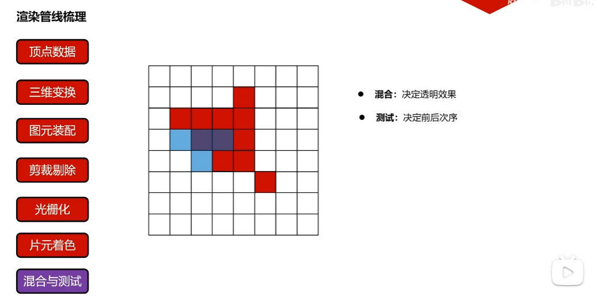

##### 像素所有权测试

像素所有权测试(Pixel Ownership Test)，由操作系统/窗口管理器执行，判断当前 GPU 是否有权限修改这个像素（例如，是否被另一个窗口覆盖）。如果失败，片段被丢弃。

##### 剪裁测试

剪裁测试(Scissor Test)，检查像素是否在 glScissor 定义的矩形区域内。如果失败，片段被丢弃。

##### 模板测试

当片段着色器处理完一个片段之后，模板测试(Stencil Test)会开始执行，和深度测试一样，它也可能会丢弃片段。接下来，被保留的片段会进入深度测试，它可能会丢弃更多的片段。模板测试是根据又一个缓冲来进行的，它叫做模板缓冲(Stencil Buffer)，我们可以在渲染的时候更新它来获得一些很有意思的效果。

一个模板缓冲中，（通常）每个模板值(Stencil Value)是8位的。所以每个像素/片段一共能有256种不同的模板值。我们可以将这些模板值设置为我们想要的值，然后当某一个片段有某一个模板值的时候，我们就可以选择丢弃或是保留这个片段了。


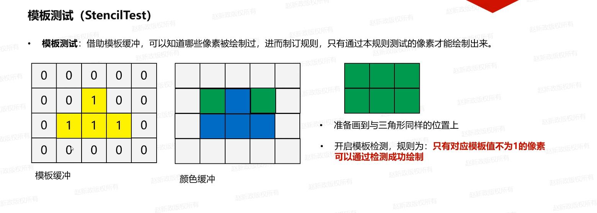

###### opengl开启模板测试

如果mask是1

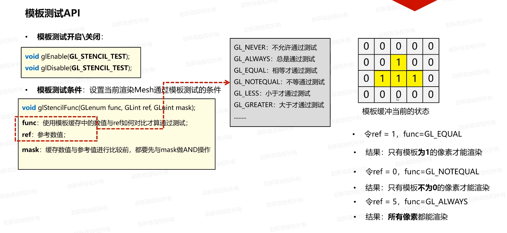

如果mask不是1


**只有模板才有 glStencilOp 这样的操作函数？**

**深度缓冲区只需要知道“是更近还是更远”并进行简单的替换，而模板缓冲区需要知道“如何根据不同的测试结果改变标记状态”，所以只有模板才有 glStencilOp 这样的操作函数。**

我的理解是：

glEnable(GL_STENCIL_TEST) -  开启模板测试

glStencilFunc - 测试条件

glStencilOp - 如何根据不同的测试结果改变标记状态

glStencilMask - 开启模板测试写入规则


##### 深度检测

深度检测(Depth Testing)，是指在渲染过程中，根据每个像素的深度值，判断它是否应该被绘制。深度值越大，说明该像素对应的物体离摄像机越远。如果像素的深度值小于等于当前深度缓冲区中的值，就会被绘制，否则就会被丢弃。

opengl在没有设置深度测试或者深度缓存时，就算后者的深度值更大，前者的深度值更小，后绘制的物体会遮挡先绘制的物体。

上面这种情况也被称为**画家画法(Painter's Algorithm)**

深度(Depth): 表示当前绘制的Fragment(片元)距离摄像机的远近的程度。

**深度**是从哪里来的呢？

1. 顶点首先经过MVP变化，到达剪裁空间坐标系
2. 顶点的剪裁空间坐标会经历透视除法，将其转换为归一化设备坐标(Normalized Device Coordinates, NDC)
3. NDC的坐标范围是[-1, 1]，将其映射到 **[0, 1]** 范围，就得到了最终的屏幕空间坐标。xy是指在屏幕上的像素坐标，**z就是深度值**。

**z=0表示近平面，z=1表示远平面**

每个顶点得到自己的深度值，会**插值**到所有的Fragment(片元)上。


###### 深度缓存

深度缓存(Depth Buffer)，分配一块与**颜色画布长宽一致(颜色缓存Color Buffer)**的第二块画布，里面记录了每个像素当前距离摄像机最近的深度值。

第一块颜色画布，按照我们设置填充成指定颜色
```C++
// 设置清除颜色
GL_CALL(glClearColor(0.2f, 0.3f, 0.3f, 1.0f));
```

第二块深度画布，默认都是远平面，也就是1

算法描述：

要绘制的三角形顶点数据经过了MVP，裁剪空间到了屏幕坐标系，也就是xyz[0-1]^3。用三角形每个片元像素的深度值与当前深度缓存中的深度值进行对比，如果当前像素的深度值小于当前深度缓存中的深度值，就通过测试，使用新像素的深度值覆盖当前深度缓存中深度值，**并且可以绘制到对应的颜色缓存中**。

**显然这种算法解决了乱序绘制的问题**


###### opengl开启深度测试


###### 深度数学讨论

**下图的核心就是：正交投影中，深度值和物体与摄像机的距离是线性的。而透视投影中，深度值得到过程和物体与摄像机的距离非线性，我们需要一个公式将深度值转换为真实距离。**	

下面这些图想说明：
1. 深度值不是线性的，距离远平面越近的物体，深度值越不精确，在计算机中存在精度丢失可能。
2. 因为硬件存储的 $\text{Depth}$ 值是非线性的，无法直接用于计算物体真实距离（比如 $0.5$ 的深度值并不意味着物体位于近远平面的中点）。
3. 基于以上两点，我们需要深度值到摄像机距离成正比的真实距离，所以推导出下面的公式。


###### Z-Fighting

Z-Fighting是指在渲染过程中，由于浮点数精度问题，导致物体之间的深度值非常接近，从而导致渲染结果出现错误的情况。


###### PolygonOffset

多边形偏移(Polygon Offset)是一种用于解决Z-Fighting问题的技术。它的基本思想是在渲染多边形时，通过偏移多边形的深度值，来避免深度值之间的冲突。


这个时候就需要**偏导数**


透视投影中，如果一个面片和摄像机平行，整个片区中片元与片元深度值差不多(取决于插值算法把，只能说很差不多，应该完全相同把)。

如果一个面片和摄像机不平行的话，比如放倒了：

1. 前面片区中，片元与片元距离和深度的偏导数较小

2. 后面片区中，片元与片元距离和深度的偏导数较大

这就是**深度斜率**


##### 混合

OpenGL中，混合(Blending)通常是实现物体透明度(Transparency)的一种技术。透明就是说一个物体（或者其中的一部分）不是纯色(Solid Color)的，它的颜色是物体本身的颜色和它背后其它物体的颜色的不同强度结合。一个有色玻璃窗是一个透明的物体，玻璃有它自己的颜色，但它最终的颜色还包含了玻璃之后所有物体的颜色。这也是混合这一名字的出处，我们混合(Blend)（不同物体的）多种颜色为一种颜色。所以透明度能让我们看穿物体。


通过在Fragment Shader中对采样的alpha值进行判断并剔除(discard)，可以实现"透明的地方不渲染"的效果：

```GLSL
#version 330 core
out vec4 FragColor;

in vec2 TexCoords;

uniform sampler2D texture1;

void main()
{             
    vec4 texColor = texture(texture1, TexCoords);
    if(texColor.a < 0.1)
        discard;
    FragColor = texColor;
}
```

虽然直接丢弃片段很好，但它不能让我们渲染半透明的图像。我们要么渲染一个片段，要么完全丢弃它。要想渲染有多个透明度级别的图像，我们需要启用混合(Blending)。

OpenGL中的混合是通过下面这个方程来实现的：

$$
\overline{C}_{result} = 
\overline{\color{green}C}_{source} * \color{green}F_{source} 
+ 
\overline{\color{red}C}_{destination} * \color{red}F_{destination}
$$

$\overline{\color{green}C}_{source}$：源颜色向量。这是源自纹理的颜色向量。

$\overline{\color{red}C}_{destination}$：目标颜色向量。这是当前储存在颜色缓冲中的颜色向量。

$\color{green}F_{source}$：源因子值。指定了alpha值对源颜色的影响。

$\color{red}F_{destination}$：目标因子值。指定了alpha值对目标颜色的影响。

片段着色器运行完成后，并且所有的测试都通过之后，这个混合方程(Blend Equation)才会应用到片段颜色输出与当前颜色缓冲中的值（当前片段之前储存的之前片段的颜色）上。源颜色和目标颜色将会由OpenGL自动设定，但源因子和目标因子的值可以由我们来决定。我们先来看一个简单的例子：

其中，0.6被称为源因子值，(1-0.6)被称为目标因子值

我们有两个方形，我们希望将这个半透明的绿色方形绘制在红色方形之上。红色的方形将会是目标颜色（所以它应该先在颜色缓冲中），我们将要在这个红色方形之上绘制这个绿色方形。


$$
\overline{C}_{result} = 
\begin{pmatrix}
\color{red} 0.0 \\
\color{green} 1.0 \\
\color{blue} 0.0 \\
\color{purple} 0.6
\end{pmatrix} \cdot \color{green} 0.6
+ 
\begin{pmatrix}
\color{red} 1.0 \\
\color{green} 0.0 \\
\color{blue} 0.0 \\
\color{purple} 1.0
\end{pmatrix} \cdot \color{red} (1 - 0.6)
$$

结果就是重叠方形的片段包含了一个60%绿色，40%红色的一种脏兮兮的颜色：


###### opengl开启混合

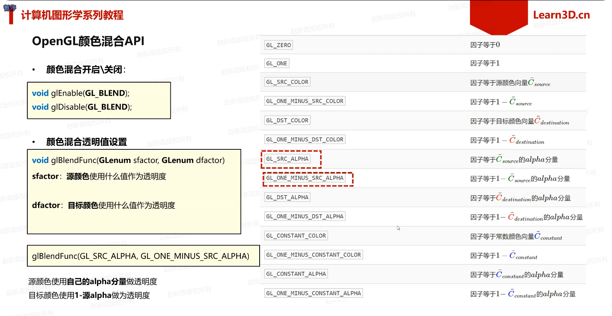


###### 颜色混合为什么需要关闭深度写入(不是深度测试)

A,B,C三个面片，深度依次增加，如果绘制顺序是C,B,A，这样子颜色混合没问题呢

但是，渲染是乱序的，如果先绘制A，画布上啥都没有，跟画布的清理颜色做了混合。

这个时候绘制B，B和A重合的地方，因为A在前面，重合的地方被深度检测扔掉了。

b就没法和A做混合了。

这个时候绘制C，道理是一样的，C与A和B重合的地方被深度检测扔掉了，

c就没法和A和B做混合了。

**就算把深度写入关闭，混合也会有问题，还是先画A，B就跟A做混合，C就跟A,B做混合，正常应该是先画C，再画B，最后画A，这样子的混合比较好**

**所以，要做混合的对象而言，开启深度测试，关闭深度写入。但是如果一个物体本来在它后面，乱序绘制，就回到它前面了，需要：**
1. **第一遍 (不透明物体)： 绘制所有不透明物体。开启深度测试，开启深度写入。**
2. **第二遍 (混合物体)：开启深度测试，关闭深度写入(自身模型乱序)，必须对所有混合对象进行排序，从最远的物体开始，到最近的物体结束（远到近）。**

下面这个图就说明这个情况

fs shader中全部给了0.3透明度


###### 透明度蒙版

**草坪绘制需要法线都设置为(0,0,1)，要不然会出现明暗交替的情况**

OpenGL/GLSL系统中RGBA的范围都是0.0f~1.0f，对于透明蒙版贴图而言，采样rgba人一个分量都行，一般采用r分量
```glsl
float alpha =  texture(opacityMask, uv).r;
```


##### 抖动

抖动(Dithering)，仅在颜色位数较低（如 16 位颜色）时，通过故意引入少量噪声来模拟更多的颜色。（修改颜色缓冲区）

##### 逻辑操作

逻辑操作(Logic Operation)，将新颜色和旧颜色进行位操作（如 XOR, OR）。（常用于旧版 OpenGL，在 GLES 中可能不支持或极少用）。（修改颜色缓冲区）

### GPU工作流程解析

图形渲染本质上，就是CPU端的C++程序控制GPU行为的过程，控制过程包括**数据传输**与**指令发送**


CPU对三角形数据处理，分为**顶点处理**与**片元处理**

顶点与片元处理，统一通过**着色器程序(Shader)**进行; 它是我们自己编写的运行在GPU端的程序。


### VBO

VBO(Vertex Buffer Object)，顶点缓冲对象，表示了在GPU显存上的一段存储空间对象。

VBO在C++中，表现为一个 unsigned int 类型变量，理解为GPU端内存对象的一个ID编号。


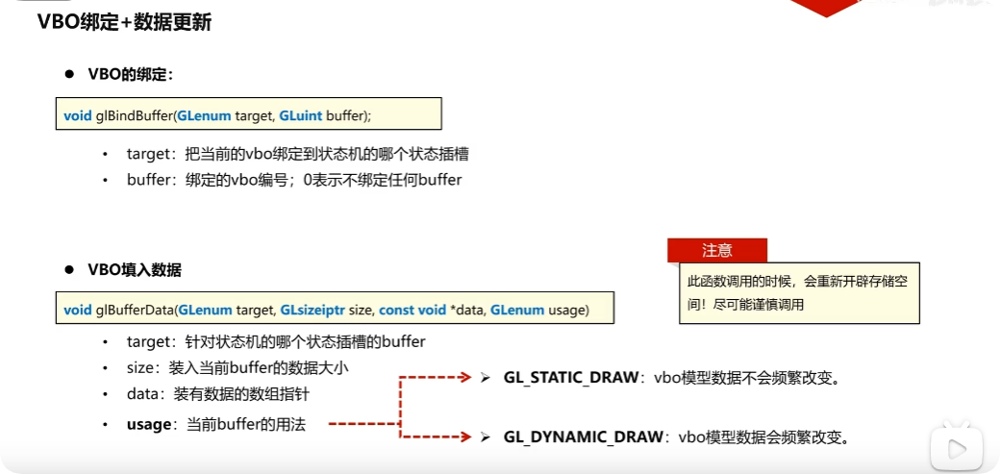


### VAO

VAO(Vertex Array Object)，顶点数组对象，用来存储一个Mesh网格所有的**顶点属性描述信息**。


### Shader

Shader(着色器程序)，一种运行在GPU端的程序，用来处理顶点数据以及决定像素片元最终着色。

Shader主要分为顶点着色器(vertex shader)和片元着色器(fragment shader)。


### GLSL语言

GLSL语言(Graphic Library Shader Language)，是OpenGL的着色器语言，用来编写顶点着色器和片元着色器。

1. GLSL程序本质是一种**输入转化为输出**的程序。
2. GLSL程序是一种非常独立的程序，彼此之间**无法通信**，只能通过**输入输出相互承接**。

#### Vertex Shader

下面是一个简单的顶点着色器示例，就是把输入的顶点坐标直接输出，交由图元装配(Primitive Assembly)阶段处理


#### Fragment Shader

下面是一个简单的片元着色器示例，直接将vec4(1.0f, 0.5f, 2.0f, 1.0f)，交由混合与测试(Blend and Test)阶段处理


#### Shader的编译与链接


#### VBO绘制流程


### EBO

EBO(Element/Index Buffer Object)，元素缓冲对象/索引缓冲对象，用来存储**顶点绘制顺序索引号**的GPU显存区域。


#### EBO的绘制流程


### FBO

FBO(Frame Buffer Object)，帧缓冲对象，OpenGL允许我们定义我们自己的帧缓冲，也就是说我们能够定义我们自己的颜色缓冲，甚至是深度缓冲和模板缓冲。

#### RBO

RBO(Render Buffer Object)，渲染缓冲对象附件，组成一帧缓冲中，颜色缓存、深度缓存、模板缓存，统称为帧缓冲中的附件。


#### 帧缓冲需求分析


#### 帧缓冲使用


#### 卷积操作

卷积(Convolution)，是一种图像处理操作，用于将图像与一个称为卷积核(Kernel)的小矩阵进行元素级乘法和累加，以生成新的图像。


### GLSL语法

#### 变量类型


#### 向量使用方式


#### 变量分类


#### uniform变量


### 纹理

纹理(Texture)，在绘制三角形的过程中，将图片贴到三角形上进行显示的过程，即纹理贴图的过程。


#### UV坐标

UV坐标是二维纹理映射坐标系，以U(水平)、V(垂直)轴定位图像像素并将其映射至三维模型表面，其坐标范围通常标准化为[0,1]。

我们通常在I**三角形的顶点**上规定uv坐标具体数值，作为**顶点属性**，通过**插值算法**到达每个片元像素。


#### 纹理单元


#### 纹理过滤

采样(Sampling)： 动作。是从纹理或场景中读取一个或多个点的数据的过程。

过滤(Filtering)： 方法/处理。是根据采样的点和预设的算法（如平均、插值）来计算出一个最终颜色的过程。


#### 纹理包裹


#### 纹理混合


黑白图中，每个像素的R,G,B分量数值相等，即灰度值，混合在一起永远是中性色（即灰色），不会产生任何色相。

当你看到一个物体从RGB(0,0,0)变化到RGB(255,255,255)，你看到的就是一个黑灰白的过程。

上图的意思就是说可以把噪声图(黑白图)中任意分量作为权重，来混合两种纹理。

### 多级渐远纹理

多级渐远纹理(Mipmap)，是一种**纹理优化技术**，用于在渲染过程中根据物体与相机的距离，自动选择不同级别的纹理进行渲染。

下图应该用的是**GL_LINEAR**过滤方式


#### 多级渐远纹理产生的原理


1. 产生同样大小图片的滤波图片
2. 采样成不同大小的图片

##### 滤波

均值滤波(Mean Filter)，通过计算一个像素周围邻域内(比如周围9个像素)所有像素的平均值，并将这个平均值作为该像素新的颜色或亮度值。

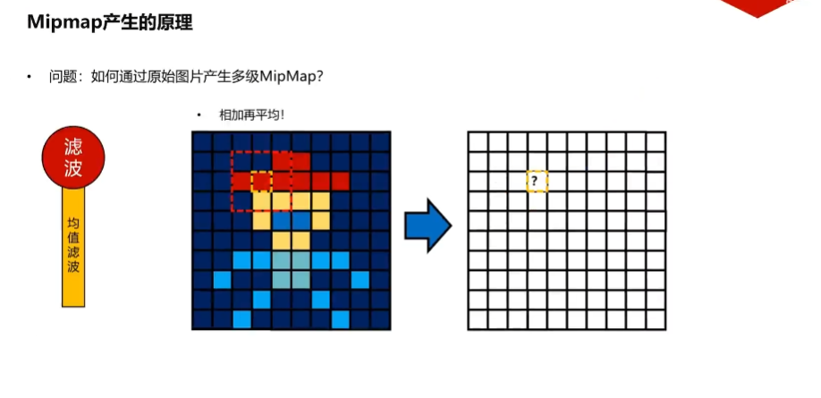

高斯滤波(Gaussian Filter)， 核心思想是用**正态分(Normal Distribution)**，即高斯函数，来定义一个加权平均的模板。它也被广泛称为**高斯模糊(Gaussian Blur)**。

中心权重最大： 距离中心像素越近的像素，在计算平均值时所占的权重越大。

边缘权重最小： 距离中心像素越远的像素，权重呈指数级衰减，对结果的影响越小。


##### 采样

二分下采样(Decimation by Two)，它的核心目的是减小图像或纹理的尺寸，通常用于生成Mipmap的下一级纹理。


计算统计值采样


#### OpenGL如何判定使用哪一级Mipmap?

通过GLSL中的**求偏导函数**计算变化量决定使用哪一级Mipmap。


我的理解：

现代GPU不是一次处理一个像素，而是将屏幕空间划分为2×2或4×4的块进行并行处理。

片段0：位于(x,y)

片段1：位于(x+1,y)（x方向相邻）

片段2：位于(x,y+1)（y方向相邻）

片段3：位于(x+1,y+1)

**上图中和左边图理解：**

**上图就是假设FS每次只处理2x2片元，片段0和片段1而言，只关注uv属性，片段0/片段1的uv肯定是x在[0,1]范围内的数值，y在[0,1]范围内的数值，并且两者y相同。记作Puv0Vec2和Puv1Vec2，求出对应到纹理坐标的uv值，记作Tuv0Vec2和Tuv1Vec2，同样两者y相同。片段0和片段2一样的道理。总结来说，就是当我们沿着屏幕x轴和y轴精确移动1个像素时，纹理坐标(uv)在u和v方向上移动了多少。这个值就是纹理在当前屏幕区域的拉伸或压缩程度变化率，也就是偏导数**

**上图中和右边图理解：**

**GPU使用偏导数来近似计算屏幕像素在纹理上覆盖的面积，并用这个面积来决定使用哪个Mipmap级别LOD(Level of Detail，细节级别)。**

**LOD ≈ log2​(max(∣dFdx(uv)∣,∣dFdy(uv)∣))**

**dFdx(test)=dFdx(uv×2.0)=dFdx(uv)×2.0，L≈log2​(2R)=log2​(2)+log2​(R)=1+log2​(R)，乘以2.0的目的就是校正Mipmap级别。它告诉GPU："这个纹理坐标已经人为地被缩放了2倍，请你将正常的Mipmap 级别再往上(更模糊)推一级(L→L+1)，才能成功地平滑(消除了)重复贴图所引入的额外高频细节，从而消除了远处纹理的闪烁和走样问题(摩尔纹)。"**

LOD(Level of Detail)和Mipmap是概念与实现的关系。LOD是一个概念或目标，而Mipmap是在纹理领域实现这个目标的一种具体技术。

下面这个图很少的说明了上图


 
```GLSL
// fragment shader

// vec2 - 包含2个float分量的向量
// textureWidth - 纹理宽度
// textureHeight - 纹理高度
// uv - 插值得到的纹理坐标[0,1]^2
// 计算得出
// location - 实际纹理坐标[x[0,textureWidth-1], y[0,textureHeight-1]]
vec2 location = uv * vec2(textureWidth, textureHeight);

// 以location当前像素为中心，向它的水平方向跨出一步(2x2片元)对应的像素location'，可以计算出location处的偏导数(变化率)
// 本质：在屏幕上水平移动1步，纹理上水平移动了多少步(偏导数，变化率，以纹理像素为单位)，它表示纹理坐标在u和v两个方向上同时发生的变化率。如果斜着贴纹理，u和v方向上的变化率都存在。
vec2 dx = dFdx(location);
// 同上
vec2 dy = dFdy(location);

// dot(dx,dx) - |dx|^2 = dx.x^2 + dx.y^2 - 向量到标量，为什么要dot呢，有可能同时有u和v两个方向上的变化率，点积目的把方向扔掉，只留大小
// dot(dy,dy) - |dy|^2 = dy.x^2 + dy.y^2 - 向量到标量，同上
// 找出最大
// 开方 - 得到最大的变化率
// 本质：当前屏幕像素移动1步(水平或垂直的方向)，在纹理空间(水平或者垂直的方向)中 覆盖的最长边有多长 (最大变化率，以纹理像素为单位)
float maxDelta = sqrt(max(dot(dx,dx), dot(dy,dy)));
// 取对数 - 得到LOD(Level of Detail)
float L = log2(maxDelta);

// maxDelta < 1 => L < 0，取LOD0 => 屏幕像素 > 纹理像素，纹理图片被放大，那就选择该纹理，GL_LINEAR滤波方式
// 1 < maxDelta < 2 => 0 < L < 1，L > 0.5，就取LOD1，L < 0.5，就取LOD0。
// 
// maxDelta = 2 => L = 1, 取LOD1 => 屏幕1x1像素2x2纹理像素，选择LOD1对应纹理
// ...
// maxDelta = 8 => L = 3，取LOD3 => 屏幕1x1像素8x8纹理像素，选择LOD3对应纹理
// 
// 就上面规范，L大于xxx.5, 就取xxx+1，否则就取xxx
int level = max(int(L+0.5), 0);
FragColor = textureLod(Sampler, uv, level);
```


#### 手动测试mipmap


```C++
Texture::Texture(const std::string& path, unsigned int unit) 
{
	m_unit = unit;

	int channels;
	// 反转y轴
	stbi_set_flip_vertically_on_load(true);
	unsigned char* data = stbi_load(path.c_str(), &m_width, &m_height, &channels, STBI_rgb_alpha);
	if (!data)
	{
		SDL_Log("stbi_load error,%s,%s", stbi_failure_reason(), path.c_str());
		return;
	}

	// 创建纹理对象
	glGenTextures(1, &m_texture);
	// 激活纹理单元
	glActiveTexture(GL_TEXTURE0 + m_unit);
	// 绑定纹理对象
	glBindTexture(GL_TEXTURE_2D, m_texture);
	// 纹理对象m_texture就被对应到了纹理单元GL_TEXTURE0+m_unit
	// 开辟显存，并上传数据
	// glTexImage2D(GL_TEXTURE_2D, 0, GL_RGBA, m_width, m_height, 0, GL_RGBA, GL_UNSIGNED_BYTE, data);

	int width = m_width, height = m_height;
	// 遍历每个mipmap的层级，为每个级别的mipmap填充图片数据
	for (int level = 0; true; ++level) 
	{
		// 1.将当前级别的mipmap对应的数据发往gpu端
		glTexImage2D(GL_TEXTURE_2D, level, GL_RGBA, width, height, 0, GL_RGBA, GL_UNSIGNED_BYTE, data);

		// 2.判断是否退出循环
		if (width == 1 && height == 1) 
		{
			break;
		}

		// 3.计算下一次循环的宽度/高度，除以2
		width = width > 1 ? width / 2 : 1;
		height = height > 1 ? height / 2 : 1;
	}

	// 释放数据
	stbi_image_free(data);

	// 设置纹理的过滤方式
	// 采样(Sampling)： 动作。是从纹理或场景中读取一个或多个点的数据的过程。
	// 过滤(Filtering)： 方法/处理。是根据采样的点和预设的算法（如平均、插值）来计算出一个最终颜色的过程。
	// 
	// GL_TEXTURE_MAG_FILTER (放大过滤)
	// 发生时机：屏幕像素 > 纹理像素 (纹理被拉伸)
	// 描述：屏幕上需要的像素比实际纹理对象像素多，采用线性过滤
	glTexParameteri(GL_TEXTURE_2D, GL_TEXTURE_MAG_FILTER, GL_LINEAR);
	// GL_TEXTURE_MIN_FILTER (缩小过滤)
	// 发生时机：屏幕像素 < 纹理像素 (纹理被压缩)
	// 描述：屏幕上需要的像素比实际纹理对象像素少，采用临近过滤
	// glTexParameteri(GL_TEXTURE_2D, GL_TEXTURE_MIN_FILTER, GL_NEAREST);
	// GL_LINEAR_MIPMAP_LINEAR: 在单个mipmap上采用线性采样，在两层mipmap LOD之间(比如L=1.3,L1,L2之间)采用线性过滤来获取纹理像素
	// GL_NEAREST_MIPMAP_NEAREST: 在单个mipmap上采用临近采样，在两层mipmap LOD之间(比如L=1.3,L1,L2之间)采用临近过滤来获取纹理像素
	// 还有其他的组合方式，比如GL_LINEAR_MIPMAP_NEAREST，GL_NEAREST_MIPMAP_LINEAR等
	// glTexParameteri(GL_TEXTURE_2D, GL_TEXTURE_MIN_FILTER, GL_LINEAR_MIPMAP_LINEAR);
	// 注释掉上面的目的是，我们将在fs中手动实现自动选择mipmap

	// 设置纹理的包裹方式
	// u纹理坐标超出[0,1]范围，采用重复模式
	glTexParameteri(GL_TEXTURE_2D, GL_TEXTURE_WRAP_S, GL_REPEAT);
	// v纹理坐标超出[0,1]范围，采用重复模式
	glTexParameteri(GL_TEXTURE_2D, GL_TEXTURE_WRAP_T, GL_REPEAT);

	m_initialized = true;
}
```

```GLSL
// fragment shader

#version 460 core
out vec4 FragColor;
in vec3 color;
in vec2 uv;
uniform sampler2D sampler;
uniform float width;
uniform float height;
void main()
{
	// vec2 - 包含2个float分量的向量
	// textureWidth - 纹理宽度
	// textureHeight - 纹理高度
	// uv - 插值得到的纹理坐标[0,1]^2
	// 计算得出
	// location - 实际纹理坐标[x[0,textureWidth-1], y[0,textureHeight-1]]
	vec2 location = uv * vec2(width, height);;

	// 以location当前像素为中心，向它的水平方向跨出一步(2x2片元)对应的像素location'，可以计算出location处的偏导数(变化率)
	// 本质：在屏幕上水平移动1步，纹理上水平移动了多少步(偏导数，变化率，以纹理像素为单位)，它表示纹理坐标在u和v两个方向上同时发生的变化率。如果斜着贴纹理，u和v方向上的变化率都存在。
	vec2 dx = dFdx(location);
	// 同上
	vec2 dy = dFdy(location);

	// dot(dx,dx) - |dx|^2 = dx.x^2 + dx.y^2 - 向量到标量，为什么要dot呢，有可能同时有u和v两个方向上的变化率，点积目的把方向扔掉，只留大小
	// dot(dy,dy) - |dy|^2 = dy.x^2 + dy.y^2 - 向量到标量，同上
	// 找出最大
	// 开方 - 得到最大的变化率
	// 本质：当前屏幕像素移动1步(水平或垂直的方向)，在纹理空间(水平或者垂直的方向)中 覆盖的最长边有多长 (最大变化率，以纹理像素为单位)
	float maxDelta = sqrt(max(dot(dx,dx), dot(dy,dy)));
	// 取对数 - 得到LOD(Level of Detail)
	float L = log2(maxDelta);

	// maxDelta < 1 => L < 0，取LOD0 => 屏幕像素 > 纹理像素，纹理图片被放大，那就选择该纹理，GL_LINEAR滤波方式
	// 1 < maxDelta < 2 => 0 < L < 1，L > 0.5，就取LOD1，L < 0.5，就取LOD0。
	// 
	// maxDelta = 2 => L = 1, 取LOD1 => 屏幕1x1像素2x2纹理像素，选择LOD1对应纹理
	// ...
	// maxDelta = 8 => L = 3，取LOD3 => 屏幕1x1像素8x8纹理像素，选择LOD3对应纹理
	// 
	// 就上面规范，L大于xxx.5, 就取xxx+1，否则就取xxx
	int level = max(int(L + 0.5), 0);
	FragColor = textureLod(sampler, uv, level);
}
```

#### OpenGL的Mipmap使用


### 轨迹球相机


### 视平线与地平线

[视平线与地平线是一条线吗？](https://www.bilibili.com/video/BV1kS4y1v7Sw)

地平线(Horizon)，就是在无限远处，天和地相接的那条线。平行线在远处看上去会相交于一点。

视平线(Eye Level)，与眼睛同高且平行于地面的一根线。在平时状态下，无论视平线多高，视平面与地平面在无限远的地方相交的一条线。

**在平视时，视平线与地平线重合；在仰视或俯视时，它们会分离。​**

**我觉得分离没啥问题，只是视平线以地平线分离没啥，比如俯视和仰视。如果出歪着头(ROLL)就会破坏视觉稳定性和直觉。**


Roll，导致地平线在屏幕上倾斜，歪着头看世界
Pitch，导致地平线在屏幕上上升或下降，抬头或低头看世界
Yaw，导致地平线在屏幕上左右移动，左右转头看世界

当你选择绕着相机自己的局部UP轴进行Yaw时(左右摇摆)，如果相机已经抬头或低头(Pitch)，就会引入歪着头(Roll)，画面发生倾斜，会破坏视觉稳定性和直觉，除非是做太空游戏或者飞行模拟。

FPS/TPS游戏、观察者视角等，保证视平线与地平线水平，符合人类直觉。

飞行模拟、太空游戏、编辑器自由视角，会导致视角倾斜(Roll)，用户体验差。

### 几何体

#### 球体


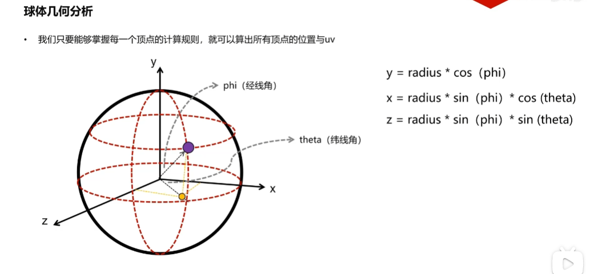


### 光源

#### 平行光

平行光(Parallel Light)，是一种光线方向平行且强度均匀分布的光源。平行光通常用于模拟太阳光，因为太阳光在地球表面上可以近似看作是平行的。

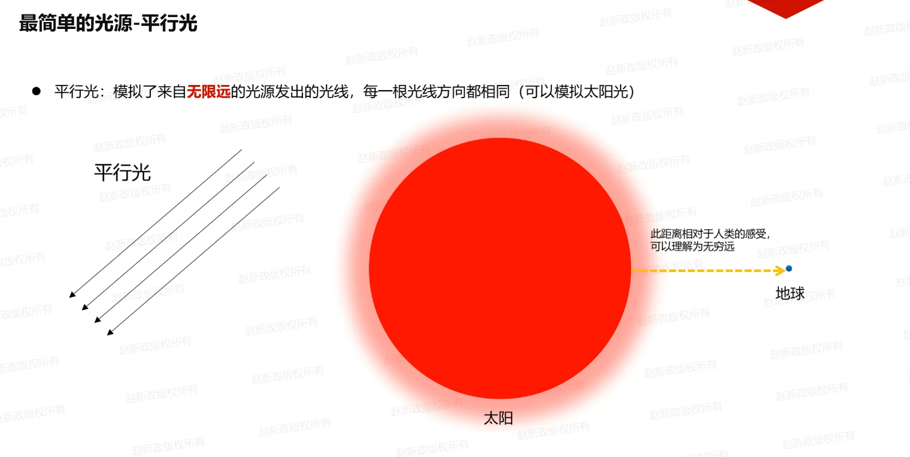

#### 环境光

环境光(Ambient Light)，是指在一个场景中，所有方向上均匀分布的光线。环境光不会产生阴影或高光，它只会为场景中的物体提供一个基础的亮度。


#### 漫反射

漫反射(Diffuse Reflection)，是指光线照射到物体表面后，光线被物体表面均匀地向各个方向散射的现象。漫反射使得物体在各个角度下都能被观察到，从而呈现出柔和的外观。


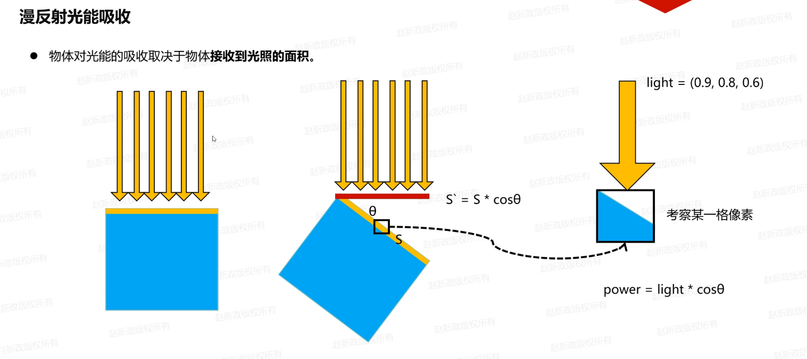


#### 高光反射

高光反射(Specular Reflection)，镜面反射，是指光线照射到物体表面后，光线按照一定的方向反射的现象。高光反射使得物体表面呈现出明亮的光斑，从而增强了物体的立体感和质感。


**通过对specular进行pow计算，可以控制光斑的大小。**


#### 法线矩阵

法线矩阵(Normal Matrix)，确保法线向量在模型经历非均匀缩放后，依然能够保持垂直于表面。

如果把modelMatrix应用到法线上面，对于缩放操作，是不行的，比如下图，仅仅对于X轴缩放，法线就会出现错误。

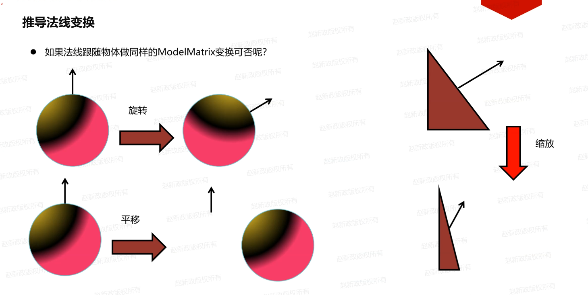


### 材质

材质(Material)，定义了物体表面对光线的反应特性，包括环境光反射、漫反射和高光反射等属性。


### 高光贴图蒙版

高光贴图蒙版(Specular Mask)，控制物体表面不同区域的“闪亮”程度和方式。下面这个图就和纹理混合一个道理，通过一张噪声图，控制物体表面不同区域的“闪亮”程度和方式。


### 点光源

点光源(Point Light)，是一种从一个点向所有方向均匀发射光线的光源。点光源通常用于模拟灯泡、火把等小型光源。


### 聚光灯

聚光灯(Spot Light)，是一种从一个点向一个方向发射光线的光源。就是一个锥形体，聚光灯通常用于模拟手电筒、聚光灯等大型光源。


### 场景

场景(Scene)，是指一个包含了所有物体、光源、环境等元素的虚拟环境。场景是渲染图形的基础，通过场景可以模拟真实的物理环境，为用户提供沉浸式的体验。


### Assimp

Assimp(AssimpImporter)，是一个开源的3D模型导入库，支持多种格式的3D模型文件导入，如OBJ、FBX、DAE等。Assimp可以将这些模型文件导入到OpenGL中进行渲染。


### 面剔除

面剔除(Face Culling)，是一种优化技术，用于提高渲染效率。通过剔除那些不可见的面(背面)，减少渲染负担，从而提升性能。

看不见的面会被FS之后的深度测试给剔除掉，希望在VS中剔除掉，减少渲染负担。


#### opengl开启面剔除


### 立方体贴图

立方体贴图(Cube Map)，是一种特殊的纹理映射，用于渲染环境贴图(Environment Map)。立方体贴图由6个面组成，每个面都是一个2D纹理，用于表示场景中不同方向的环境。

不要开启面剔除，特别是把里面的面剔除了，会导致环境贴图渲染错误。


1 * 1 * 1的立方体，包围盒子的模型变化矩阵就是跟随摄像机移动(直接设置成相机的位置，再生成模型变化矩阵即可)，再应用vp变化，保证了盒子一直包裹着摄像机， 随着摄像机的旋转看到不同的盒子面。 本来盒子在世界坐标系下的原点，通过过模型矩阵平移到了摄像机位置，在经过摄像机的vp矩阵，永远和相机位置一样。

这里需要注意的是，投影变化矩阵存在(压缩+)平移+缩放，天空盒子有可能不在NDC中了。我这个代码为啥没问题，原因是，透视投影矩阵，近平面0.1f距离，远平面1000.0f距离，所以天空盒子在NDC中。
正确的做法：
```GLSL
// vs
#version 460 core
layout (location = 0) in vec3 aPos;
// 直接用包围盒的aPos作为UVW，1*1*1的包围盒
// layout (location = 1) in vec2 aUV;
out vec3 uvw;
uniform mat4 modelMatrix;
uniform mat4 viewMatrix;
uniform mat4 projectionMatrix;
void main()
{
	vec4 transformPosition = vec4(aPos, 1.0);
	transformPosition = modelMatrix * transformPosition;
	// mvp后，剪裁坐标系下的顶点坐标
	gl_Position = projectionMatrix * viewMatrix * transformPosition;
	// 核心修改：深度欺骗 (Depth Hack)
	// 后面需要经历透视除法，这样子修改后，透视除法一直都是远平面，深度值一直是1！
	// 天空盒子是1X1X1,near是2.0f far是1000.0f,mvp就会被裁剪，这样做避免了剪裁，永远都在视野盒子中，
	// 并且一直在远平面
	gl_Position = gl_Position.xyww;
	// 完美地利用了 1 * 1 *1 立方体顶点坐标的符号，使它们恰好对应于 samplerCube 所需的六个方向
	uvw = aPos;
}
```

FS中使用`FragColor = texture(cubeSampler, uvw);`来对天空盒立方体纹理进行采样。
```GLSL
// fs
#version 460 core
out vec4 FragColor;
in vec3 uvw;
uniform samplerCube cubeSampler;
void main()
{
	// 片段着色器 (Fragment Shader) 的主要输出颜色 
	// 还要经历：模板测试，深度测试，颜色混合，最终写入颜色缓冲区，显示在屏幕
	FragColor = texture(cubeSampler, uvw);
}
```

** 这里还需要注意一点，	深度检测对应判断函数是GL_LESS， 在天空盒绘制时会出Z-FIGHTING情况，这是因为天空盒恒定为远平面，深度值一直是1，清除深度缓冲区的是填写的也是1，因为float类型，这两个值太近了，背景某片大或者天空盒大，就出现了Z-FIGHTING情况。正确设置为 GL_LEQUAL，小于等于就可以通过 **

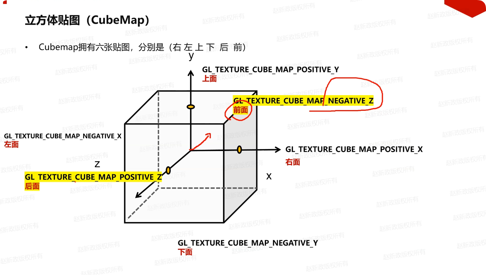

#### 立方体贴图实现环境光照

以前是固定环境光，有了天空盒，就可以根据摄像机视线方向，反射出天空盒的位置，采样天空盒的颜色，作为环境光。

摄像机视线方向(摄像机位置 - 顶点位置(FS中片元(插值出来的)) = 就是视线位置)，也知道FS中片元法线(插值出来的)，就类似镜面反射，使用reflect计算出摄像机视线反射向量，就可以知道采样天空盒的位置了，
说明这个点对顶点环境光影响最强。**视线方向 => 反射方向 => 采样天空盒哪一格像素。** 


### 球型投影贴图

球型投影贴图(Spherical Projection Mapping)，是一种将二维纹理映射到三维球体表面的技术。通过将纹理坐标转换为球面坐标，实现纹理在球体表面的正确显示。


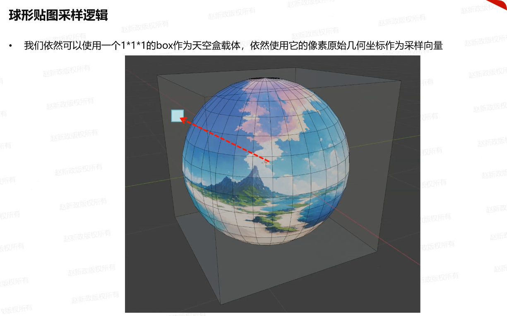


**先在xy平面画一个半圆，所以经线弧度范围[-Π/2, Π/2]，再绕着y轴旋转360度，就可以得到一个完整的球体。纬线弧度范围[-Π, Π]**


一直viewDir向量，归一化以后(单位球，坐标)，就可以知道经线弧度角和纬线弧度角，就可以求UV坐标了


### 实例绘制

实例绘制(Instanced Rendering)，是一种高效的渲染技术，用于在场景中绘制大量相似的物体。通过实例化技术，可以减少绘制调用次数，提高渲染性能。

存在问题：

1. 透明问题排序问题：

也会出现透明问题排序问题，以前解决透明问题实例化，咱们自己排序，由远及近画。前面是多次调用drawcall。

这里是调用一次drawcall，但是根据模型矩阵不同，画出来多个实例。所以排序问题还是得自己解决。

opengl在vs中绘制的时候是按照实例顺序去绘的，0~m_instanceCount取得m_instanceMatrices[i]。

让m_instanceMatrices数组进行排序，由远及近排序(摄像机坐标系下)即可。

2. 法线矩阵问题：

不是实力绘制的时候，每一个都是drawcall时候，可以在c++中计算法线矩阵，然后传递给vs。再到fs中使用，从而做光照相关计算。
```C++
auto normalMatrix = glm::mat3(glm::transpose(glm::inverse(mesh->GetModelMatrix())));
shader->SetUniformMatrix3x3("normalMatrix", normalMatrix);
```
但是实力绘制的话，一次drawcall或者多个实例，不仅仅是统一的模型变化矩阵，每个实例都有自己的模型变化矩阵，所以c++中不好做，最好在vs中做。


#### 实例绘制API

分为uniform和attribute两种方式：


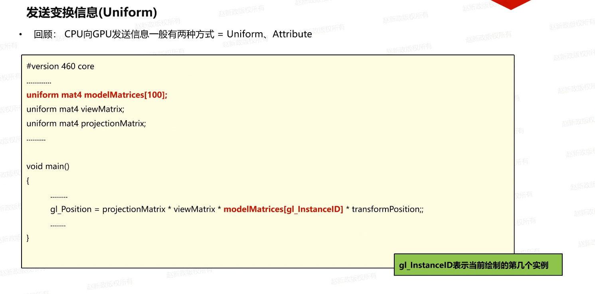


### 风吹动草原理

顶点颜色和风力结合在一起，最顶点r=1,g=0,b=0，其他顶点r=0,g=0,b=0，插值以后中间像素0~1，风力假设是10，插值出中间风力0~10。

下图反过来了


肯定是要搭配透明蒙版，自然法线都要一直朝上(0,0,1)，避免平行光阴影。


sin(time + 相位)，每个实例相位不同，实例随着时间，下面位置不变，上面就会随着风向和风力发生不同的变化。

下图就是把投影长度作为相位了


#### 整体贴图

每个草都贴一样的贴图，整体就会很乱，颜色也很杂，最好是一个草坪整体进行贴一张图。就是在vs中将物体世界坐标传给fs中，再在fs中根据世界坐标计算uv坐标，在进行采样贴图。

比如下面的代码：

```GLSL
//VS
...
out vec3 worldPosition;
...
void main()
{
	...
	worldPosition = transformPosition.xyz;
	...
}
...

// FS
...
in vec3 worldPosition;
// 草地贴图特性
uniform float uvScale;
...
void main()
{
	...
	// 草实例都在xz平面，每个随机在绕y轴旋转
	vec2 worldXZ = worldPosition.xz;
	// x为u，z为v。对的sampler对应的贴图越大，除于数字越大，uv自然越小。
	// 除数交给外部来调整
	vec2 worldUV = worldXZ / uvScale;
	// sampler对应的贴图中进行整体贴图
	vec3 objectColor  = texture(sampler, worldUV).xyz;
	...
}
```


### 高级数据

#### 向buffer当中进行定点数据拷贝

##### glBufferSubData


##### glMapBuffer


#### 不同的数据打包方式


#### 在不同的Buffer之间拷贝数据

##### glCopyBufferSubData


### 高级GLSL

#### gl_PointSize

gl_PointSize，FS，是一个内置变量，用于指定点的大小。默认值是1.0。


#### gl_VertexID

gl_VertexID，VS，获取当前正在执行的顶点的ID，如果使用glDrawElements，那么返回的就是当前顶点的index。如果是glDrawArrays，那么返回的就是当前顶点的数组排序序号。


#### gl_FragCoord

gl_FragCoord，FS，在屏幕坐标系(视口控件)坐标和当前片元的z深度。


#### gl_FrontFacing

gl_FrontFacing，FS，用于判断当前片元是正面片元还是背面片元。如果是正面片元，那么值为true，否则为false。


#### gl_FragDepth

gl_FragDepth，FS，表示某一个片元的深度值，在FS之后，会对此变量赋值。如果赋值，则会保持此深度值，否则会使用gl_FragCoord.z进行赋值。

现在大部分的GPU都提供一个叫做提前深度测试(Early Depth Testing)的硬件特性。提前深度测试允许深度测试在片段着色器之前运行。只要我们清楚一个片段永远不会是可见的（它在其他物体之后），我们就能提前丢弃这个片段。

我们在片段着色器中对gl_FragDepth进行写入，OpenGL就会禁用所有的提前深度测试(Early Depth Testing)。它被禁用的原因是，OpenGL无法在片段着色器运行之前得知片段将拥有的深度值，因为片段着色器可能会完全修改这个深度值。

然而，从OpenGL 4.2起，我们仍可以对两者进行一定的调和，在片段着色器的顶部使用深度条件(Depth Condition)重新声明gl_FragDepth变量：

```glsl
// FS
layout (depth_<condition>) out float gl_FragDepth;
```
condition可以为下面的值：
1. any，默认值。提前深度测试是禁用的，你会损失很多性能
2. greater，你只能让深度值比gl_FragCoord.z更大
3. less，你只能让深度值比gl_FragCoord.z更小
4. unchanged，如果你要写入gl_FragDepth，你将只能写入gl_FragCoord.z的值

#### 接口块

接口块(Interface Block)，是一种组织和传递数据的方式。通过接口块，可以将多个相关的变量打包在一起，方便在不同的着色器阶段之间传递数据。


#### UBO

Uniform缓冲对象(Uniform Buffer Object)，是一种用于存储和管理uniform变量的缓冲区对象。通过Uniform缓冲对象，可以将多个uniform变量打包在一起，方便在不同的着色器阶段之间传递数据。

```glsl
layout (std140) uniform ExampleBlock
{
                     // 基准对齐量       // 对齐偏移量
    float value;     // 4               // 0 
    vec3 vector;     // 16              // 16  (必须是16的倍数，所以 4->16)
    mat4 matrix;     // 16              // 32  (列 0)
                     // 16              // 48  (列 1)
                     // 16              // 64  (列 2)
                     // 16              // 80  (列 3)
    float values[3]; // 16              // 96  (values[0])
                     // 16              // 112 (values[1])
                     // 16              // 128 (values[2])
    bool boolean;    // 4               // 144
    int integer;     // 4               // 148
}; 
```

可以同过下面函数获取显存大小和每个元素占用大小。


UBO生成


在OpenGL上下文中，定义了一些绑定点(Binding Point)，我们可以将一个Uniform缓冲链接至它。在创建Uniform缓冲之后，我们将它绑定到其中一个绑定点上，并将着色器中的Uniform块绑定到相同的绑定点，把它们连接到一起。下面的这个图示展示了这个：


shader绑定UBO

```C++
// 将着色器程序A中的名为"Lights"的统一块，绑定到全局的绑定点2上
unsigned int lights_index = glGetUniformBlockIndex(shaderA.ID, "Lights");   
glUniformBlockBinding(shaderA.ID, lights_index, 2);
```

绑定Uniform缓冲对象到相同的绑定点上

```C++
glBindBufferBase(GL_UNIFORM_BUFFER, 2, uboExampleBlock); 
// 或
glBindBufferRange(GL_UNIFORM_BUFFER, 2, uboExampleBlock, 0, 152);
```

更新Uniform缓冲对象
```C++
glBindBuffer(GL_UNIFORM_BUFFER, uboExampleBlock);
int b = true; // GLSL中的bool是4字节的，所以我们将它存为一个integer
// 可以使用 glActiveUniformsiv 获取每个元素占有大小
glBufferSubData(GL_UNIFORM_BUFFER, 144, 4, &b); 
glBindBuffer(GL_UNIFORM_BUFFER, 0);
```

### 抗锯齿

模型边缘有锯齿的情况。这些锯齿边缘(Jagged Edges)的产生和光栅器将顶点数据转化为片段的方式有关。你能够清楚看见形成边缘的像素。这种现象被称之为走样(Aliasing)。有很多种抗锯齿（Anti-aliasing，也被称为反走样）的技术能够帮助我们缓解这种现象，从而产生更**平滑**的边缘。

#### 超采样抗锯齿

超采样抗锯齿(Super Sample Anti-aliasing, SSAA)的技术，它会使用比正常分辨率更高的分辨率（即超采样）来渲染场景，当图像输出在帧缓冲中更新时，分辨率会被下采样(Downsample)至正常的分辨率。这些额外的分辨率会被用来防止锯齿边缘的产生。虽然它确实能够解决走样的问题，但是由于这样比平时要绘制更多的片段，它也会带来很大的性能开销。所以这项技术只拥有了短暂的辉煌。

#### 多重采样抗锯齿

多重采样抗锯齿(Multisample Anti-aliasing, MSAA)。它借鉴了SSAA背后的理念，但却以更加高效的方式实现了抗锯齿。

光栅器会将一个图元的所有顶点作为输入，并将它转换为一系列的片段。顶点坐标理论上可以取任意值，但片段不行，因为它们受限于你窗口的分辨率。顶点坐标与片段之间几乎永远也不会有一对一的映射，所以光栅器必须以某种方式来决定每个顶点最终所在的片段/屏幕坐标。


这里我们可以看到一个屏幕像素的网格，每个像素的中心包含有一个采样点(Sample Point)，它会被用来决定这个三角形是否遮盖了某个像素。图中红色的采样点被三角形所遮盖，在每一个遮住的像素处都会生成一个片段。虽然三角形边缘的一些部分也遮住了某些屏幕像素，但是这些像素的采样点并没有被三角形内部所遮盖，所以它们不会受到片段着色器的影响。

你现在可能已经清楚走样的原因了。完整渲染后的三角形在屏幕上会是这样的：


由于屏幕像素总量的限制，有些边缘的像素能够被渲染出来，而有些则不会。结果就是我们使用了不光滑的边缘来渲染图元，导致之前讨论到的锯齿边缘。

多重采样所做的正是将单一的采样点变为多个采样点（这也是它名称的由来）。我们不再使用像素中心的单一采样点，取而代之的是以特定图案排列的4个子采样点(Subsample)。我们将用这些子采样点来决定像素的遮盖度。


上图的左侧展示了正常情况下判定三角形是否遮盖的方式。在例子中的这个像素上不会运行片段着色器（所以它会保持空白）。因为它的采样点并未被三角形所覆盖。上图的右侧展示的是实施多重采样之后的版本，每个像素包含有4个采样点。这里，只有两个采样点遮盖住了三角形。

采样点的数量可以是任意的，更多的采样点能带来更精确的遮盖率。

MSAA真正的工作方式是，无论三角形遮盖了多少个子采样点，（每个图元中）每个像素只运行一次片段着色器。片段着色器使用插值到像素中心的顶点数据，然后，MSAA使用更大的深度/模板缓冲区来确定子采样点的覆盖率。被覆盖的子采样点数量将决定了像素颜色对帧缓冲的影响程度。因为上图的4个采样点中只有2个被遮盖住了，所以三角形的颜色会有一半与帧缓冲区的颜色（在这里是无色）进行混合，最终形成一种淡蓝色。


简单来说，一个像素中如果有更多的采样点被三角形遮盖，那么这个像素的颜色就会更接近于三角形的颜色。如果我们给上面的三角形填充颜色，就能得到以下的效果：


##### opengl开启多重采样抗锯齿

如果我们想要在OpenGL中使用MSAA，我们必须要使用一个能在每个像素中存储大于1个颜色值的颜色缓冲（因为多重采样需要我们为每个采样点都储存一个颜色）。所以，我们需要一个新的缓冲类型，来存储特定数量的多重采样样本，它叫做多重采样缓冲(Multisample Buffer)。这也意味着所有缓冲的大小都增长了4倍。

```C++
// 开启多重采样缓冲区
SDL_GL_SetAttribute(SDL_GL_MULTISAMPLEBUFFERS, 1)
// 设置每像素的采样点数量
SDL_GL_SetAttribute(SDL_GL_MULTISAMPLESAMPLES, 4)
// 开启多重采样抗锯齿
glEnable(GL_MULTISAMPLE);
```

#### 离屏MSAA

创建多重采样缓冲，启用MSAA非常简单。然而，如果我们想要使用我们自己的帧缓冲来进行离屏渲染，那么我们就必须要自己动手生成多重采样缓冲了。现在，我们确实需要自己创建多重采样缓冲区。

有两种方式可以创建多重采样缓冲，将其作为帧缓冲的附件：纹理附件和渲染缓冲附件，这和在帧缓冲教程中所讨论的普通附件很相似。

##### 纹理附件

```C++
glBindTexture(GL_TEXTURE_2D_MULTISAMPLE, tex);
glTexImage2DMultisample(GL_TEXTURE_2D_MULTISAMPLE, samples, GL_RGB, width, height, GL_TRUE);
glBindTexture(GL_TEXTURE_2D_MULTISAMPLE, 0);

glFramebufferTexture2D(GL_FRAMEBUFFER, GL_COLOR_ATTACHMENT0, GL_TEXTURE_2D_MULTISAMPLE, tex, 0);
```

##### 渲染缓冲附件

```C++
glRenderbufferStorageMultisample(GL_RENDERBUFFER, 4, GL_DEPTH24_STENCIL8, width, height);
```

##### 渲染到多重采样帧缓冲

```C++
glBindFramebuffer(GL_READ_FRAMEBUFFER, multisampledFBO);
glBindFramebuffer(GL_DRAW_FRAMEBUFFER, 0);
glBlitFramebuffer(0, 0, width, height, 0, 0, width, height, GL_COLOR_BUFFER_BIT, GL_NEAREST);
```