- [欧拉数](#欧拉数)
    - [e为什么特殊](#e为什么特殊)
    - [生兔子比喻](#生兔子比喻)
- [一阶导数](#一阶导数)
- [偏导数](#偏导数)
- [链式法则](#链式法则)
    - [一元链式法则](#一元链式法则)
    - [多元复合函数链式法则](#多元复合函数链式法则)
- [一元函数微分](#一元函数微分)
- [全微分](#全微分)
    - [全微分与全增量的关系](#全微分与全增量的关系)
    - [可微的充分条件](#可微的充分条件)
    - [推广到多元函数](#推广到多元函数)
- [导数和微分的关系](#导数和微分的关系)
- [微分的几何意义](#微分的几何意义)
- [方向导数的几何意义](#方向导数的几何意义)
- [梯度](#梯度)
    - [补充偏导数](#补充偏导数)
    - [方向导数](#方向导数)
    - [什么是梯度](#什么是梯度)
    - [等高线图中的梯度](#等高线图中的梯度)
    - [梯度为0](#梯度为0)
- [鞍点Saddle-Point](#鞍点Saddle-Point)
- [误差曲面error surface](#误差曲面error-surface)
- [反函数](#反函数)
- [标准差](#标准差)
    - [如何计算标准差](#如何计算标准差)
    - [标准差数学公式](#标准差数学公式)
- [正态分布](#正态分布)

### 欧拉数

e(Euler's Number)欧拉数/自然常数，是一个无限不循环的常数，约等于 2.71828...。它和圆周率 π 一样，是数学中最重要的“基石”之一。

$$e = \lim_{n \to \infty} \left( 1 + \frac{1}{n} \right)^n$$

你有1块钱，年利率 100%

一年结算一次

一年后：1(本金) × (1(原来的100%) + 1(额外增长的100%)) = 2

一年结算两次，每次 +50%

一年后：1 × (1 + 1/2) = 1.5 => 1.5 × (1 + 1/2) = 2.25 => 1 × (1 + 1/2)^2 = 2.25

一年结算四次，每次 +25%

一年后：1 × (1 + 1/4)^4 = 2.4414

一直增加结算频率，(1 + 1/n)^n

当 n → ∞ 时，(1 + 1/n)^n 趋近于 e。e 是自然常数，约等于 2.71828...。

所以 e 的真正含义

**如果增长是“无限连续发生”的，最终增长倍率就是 e。**

#### e为什么特殊

它是唯一一个：

$f(x) = e^x$ 在任意一点的导数（变化速度），都完美地等于它当下的函数值本身

这个特性被表述为：$$\frac{d}{dx}(e^x) = e^x$$

当前值有多大 → 增长速度就有多大

#### 生兔子比喻

没有生育间隔的完美繁殖，假设我们有一种“量子兔子”，它们有一个极其生猛的超能力：一出生，不需要长大，零延迟，立刻就能以恒定的效率生小兔子。

假设有 $10$ 只兔子，它们在这一秒钟生小兔子的总速度是“每秒生 $10$ 只”。

第一秒：它们生出了小兔子。因为兔子变多了，变成了 $20$ 只。

第二秒：因为现场有 $20$ 只兔子都在同时生，所以这一秒钟生兔子的速度瞬间变成了“每秒生 $20$ 只”。

第三秒：兔子总量变成了 $50$ 只，那么这一秒钟生兔子的速度立刻飙升到“每秒生 $50$ 只”。发现规律了吗？兔子繁殖的“总速度”，完全取决于这一瞬间场地上“一共有多少只兔子”。 场地上兔子越多，生新兔子的速度就越恐怖。

发现规律了吗？兔子繁殖的“总速度”，完全取决于这一瞬间场地上“一共有多少只兔子”。 场地上兔子越多，生新兔子的速度就越恐怖。

### 一阶导数

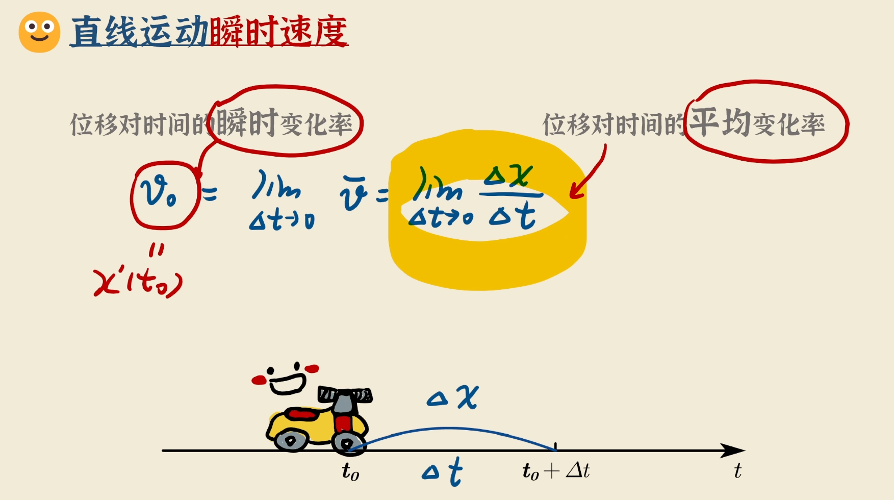

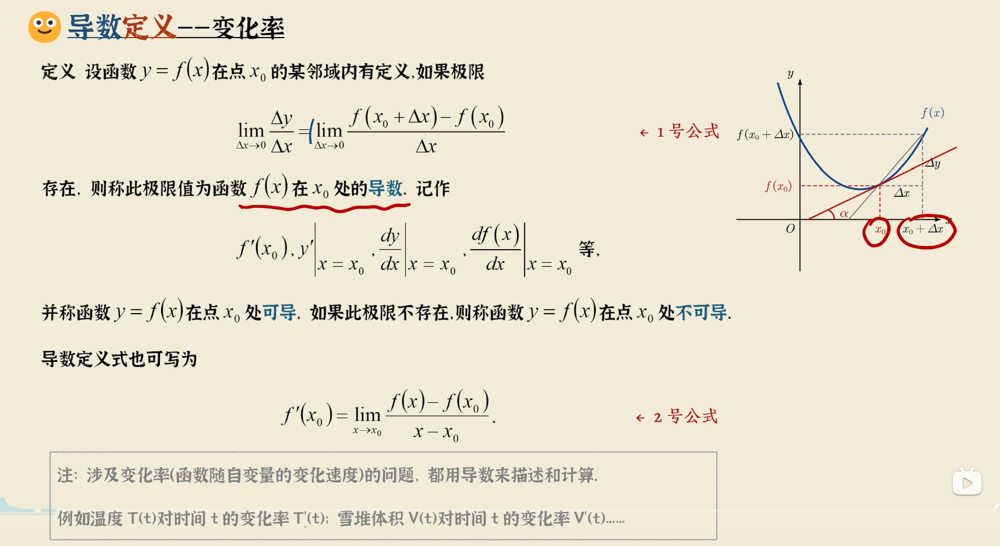

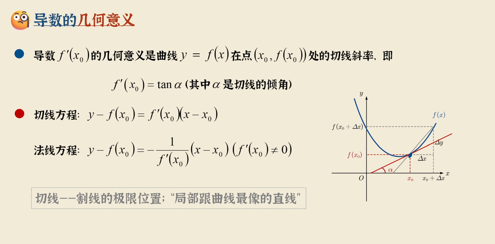

### 偏导数

**导数精确描述了函数变化率，变化率可理解为变量的变化“快慢”问题。**

[“偏导数”一课通！1h零基础上手！|高数下](https://www.bilibili.com/video/BV18x4y127m8)

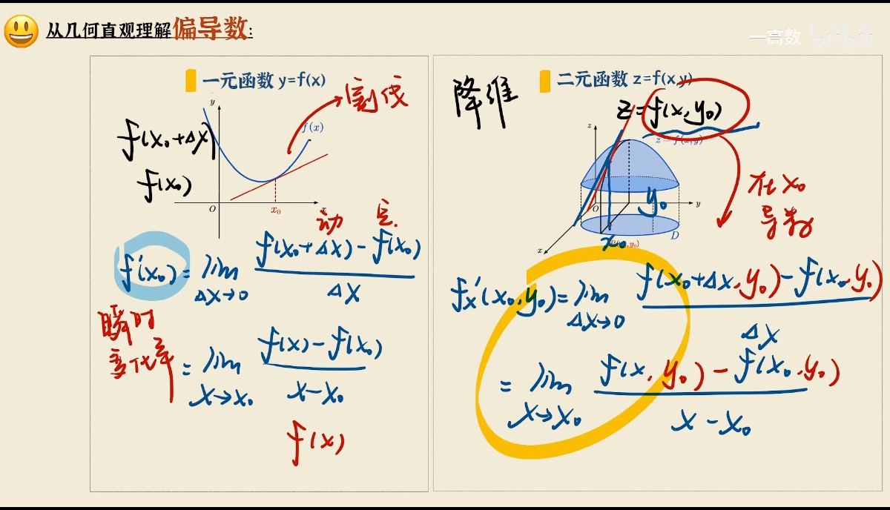

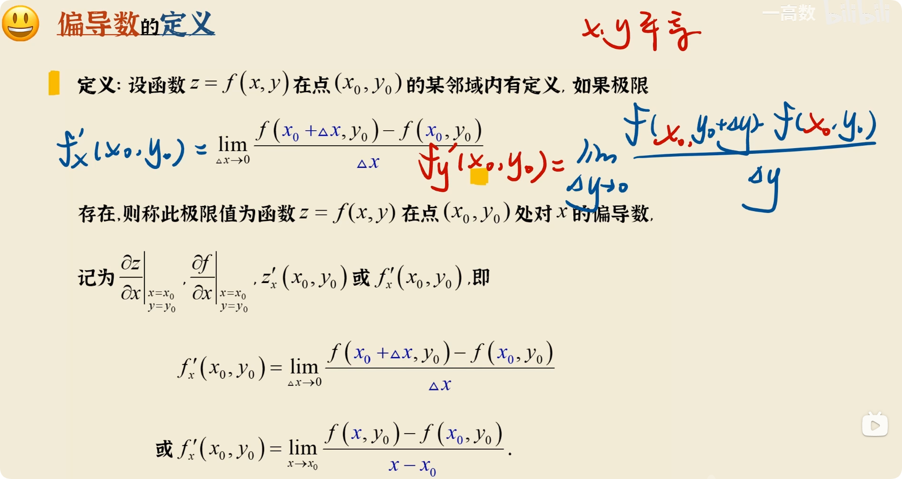

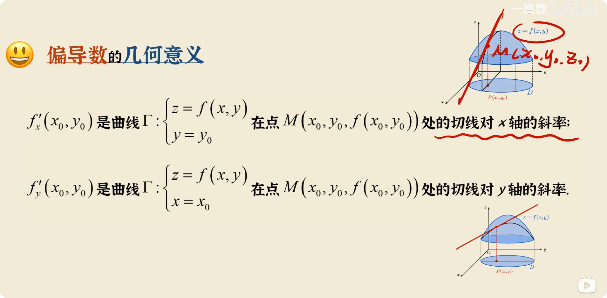

### 链式法则

#### 一元链式法则

链式法则是一个计算复合函数导数的公式：如果y是u的函数，而u又是x的函数，那么y对x的导数等于y对u的导数乘以u对x的导数。

公式表示

如果 $y = f(u)$，而 $u = g(x)$，那么：$$\frac{dy}{dx} = \frac{df}{du} \cdot \frac{du}{dx}$$

想象一条影响链：

1. x变化引起u变化
2. u变化又引起y变化
3. 链式法则告诉我们如何计算最终的变化率

货币汇率：如果1欧元=1.1美元，1美元=110日元，那么1欧元=121日元。这正是两个汇率相乘！

#### 多元复合函数链式法则

假设 $z = f(x, y)$，而 $x$ 和 $y$ 分别是 $t$ 的函数：$x = x(t), y = y(t)$。

那么 $z$ 最终是关于 $t$ 的一元函数，其导数为：

$$\frac{dz}{dt} = \frac{\partial z}{\partial x} \cdot \frac{dx}{dt} + \frac{\partial z}{\partial y} \cdot \frac{dy}{dt}$$

解读：

1. 因为 $z$ 的变化由两条路径传来（一条通过 $x$，一条通过 $y$），所以要相加。
2. 对 $x$ 的偏导，乘上 $x$ 对 $t$ 的导数；对 $y$ 同理。

偏导和全导要分清：当最终变量只有一个时（如 $t$），用 $\frac{d}{dt}$；当最终变量有多个时（如 $s, t$），用 $\frac{\partial}{\partial s}$。

想象你的幸福感 $z$ 取决于工资 $x$ 和健康 $y$。而工资和健康又都取决于时间 $t$（加班工资涨但健康降）。那么幸福感随时间的总变化率就是：

通过工资带来的变化 + 通过健康带来的变化。

这就是：

$$\frac{\partial z}{\partial x} \frac{dx}{dt} + \frac{\partial z}{\partial y} \frac{dy}{dt}$$

### 一元函数微分

研究对象：
1. 一条曲线 $y = f(x)$。

2. 几何意义： 你在曲线上某个点，用一把直尺（切线）去代替弯曲的线。这把直尺的斜率就是导数 $f'(x)$。

3. 微分 ($dy$) 指的是： 当你在水平方向 ($x$轴) 向前走了一小步 $dx$ 时，这把直尺（切线）在垂直方向上升了多少。

4. 公式： $dy = f'(x) \cdot dx$。

总结：一元微分只关心“水平方向”这一个维度的变化。

### 全微分

全微分(Total Differential)

全微分是多元函数微分学中的一个核心概念，它描述了当函数的所有自变量都发生微小变化时，函数值的总的、线性的近似改变量。与偏导数关注单一变量变化不同，全微分考虑的是所有变量同时变化对函数值的综合影响。

如果一个多元函数在某一点的变化量可以用一个关于自变量变化量的线性函数来很好地近似，我们就称这个函数在该点是可微的，这个线性函数就叫做函数在该点的全微分。

假设有一个二元函数 $z = f(x, y)$。

1. 函数的增量 (Total Increment)：

当自变量 $x$ 从 $x_0$ 变为 $x_0 + \Delta x$，$y$ 从 $y_0$ 变为 $y_0 + \Delta y$ 时，函数的全增量为：

$$\Delta z = f(x_0 + \Delta x, y_0 + \Delta y) - f(x_0, y_0)$$

2. 可微性 (Differentiability)：

如果函数 $f(x, y)$ 在点 $(x_0, y_0)$ 的**全增量 $\Delta z$** 可以表示为：

$$\Delta z = A\Delta x + B\Delta y + o(\rho)$$

其中 $A$ 和 $B$ 是只与点 $(x_0, y_0)$ 有关的常数，$\rho = \sqrt{(\Delta x)^2 + (\Delta y)^2}$ 是点 $(x_0 + \Delta x, y_0 + \Delta y)$ 与点 $(x_0, y_0)$ 之间的距离，而 $o(\rho)$ 是比 $\rho$ 更高阶的无穷小（即 $\lim_{\rho \to 0} \frac{o(\rho)}{\rho} = 0$），那么我们就称函数 $f(x, y)$ 在点 $(x_0, y_0)$ 可微。

3. 全微分 (Total Differential)：

如果函数 $f(x, y)$ 在点 $(x_0, y_0)$ 可微，那么其全增量 $\Delta z$ 的线性主部 $A\Delta x + B\Delta y$ 就称为函数 $f(x, y)$ 在点 $(x_0, y_0)$ 的全微分，记作 $dz$ 或 $df(x_0, y_0)$。

可以证明，如果 $f$ 可微，那么常数 $A$ 和 $B$ 恰好是函数在该点的偏导数：

$$A = \frac{\partial f}{\partial x}(x_0, y_0) \quad \text{and} \quad B = \frac{\partial f}{\partial y}(x_0, y_0)$$

因此，全微分的表达式为：

$$dz = \frac{\partial f}{\partial x}(x_0, y_0)dx + \frac{\partial f}{\partial y}(x_0, y_0)dy$$

这里，$dx$ 和 $dy$ 分别表示自变量 $x$ 和 $y$ 的微分（或微小改变量），即 $dx = \Delta x$ 和 $dy = \Delta y$。

#### 全微分与全增量的关系

全微分 $dz$ 是全增量 $\Delta z$ 的线性近似：

$$\Delta z \approx dz$$

当 $\Delta x$ 和 $\Delta y$ 都很小时，这个近似非常精确。

#### 可微的充分条件

1. 充分性：A → B（有A必有B）；
2. 非必要性：B ⇏ A（有B不一定有A，B可以通过其他方式实现，不需要A）。

一个常用的判断函数是否可微的充分（但非必要）条件是：

如果函数 $f(x, y)$ 的两个偏导数 $\frac{\partial f}{\partial x}$ 和 $\frac{\partial f}{\partial y}$ 在点 $(x_0, y_0)$ 的某个邻域内存在，并且在点 $(x_0, y_0)$ 连续，那么函数 $f(x, y)$ 在该点可微。

#### 推广到多元函数

对于 $n$ 元函数 $w = f(x_1, x_2, \dots, x_n)$，如果在某点可微，其全微分定义为：

$$dw = df = \frac{\partial f}{\partial x_1}dx_1 + \frac{\partial f}{\partial x_2}dx_2 + \dots + \frac{\partial f}{\partial x_n}dx_n$$

### 导数和微分的关系

1. 导数（Derivative）：斜率（速率）
    - 数学本质： 它是函数变化率的极限值，即 $\lim_{\Delta x \to 0} \frac{\Delta y}{\Delta x}$。
    - 通俗理解： 它描述的是“瞬间的快慢”或“陡峭程度”。
    - 总结： 导数是一个比例（比值）。它告诉你：如果 $x$ 动一点点，对应的 $y$ 会按什么比例变化。它不依赖于步长大小，只依赖于你在哪个位置。
    
2. 微分（Differential）：增量（实际改变量的近似）
    - 数学本质： 它是导数与微小增量的乘积，即 $dy = f'(x) \cdot dx$。
    - 通俗理解： 它描述的是“实际挪动了多远”。
    - 总结： 微分是一个绝对值（量）。它告诉你：因为 $x$ 动了 $dx$ 这么大的步长，导致 $y$ 发生了 $dy$ 这么大的变化。它直接取决于步长 $dx$。

### 微分的几何意义

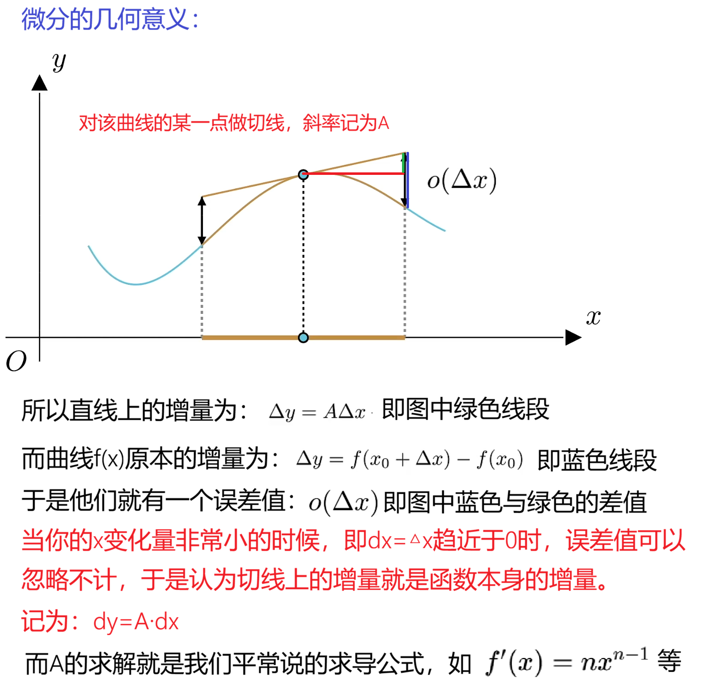

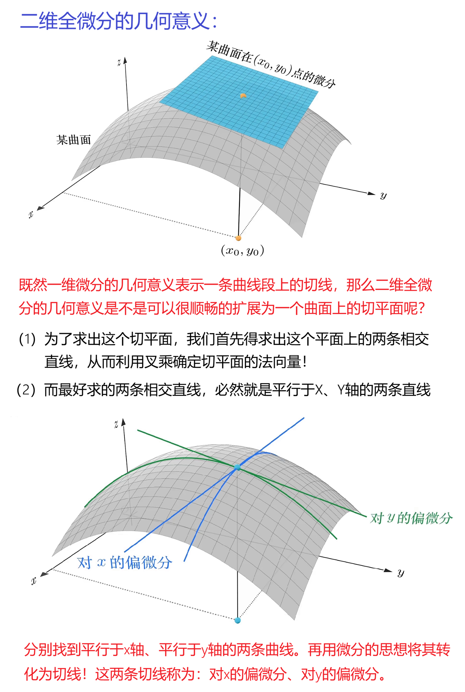

正确的数学术语

1. 这两条切线（图中蓝线和绿线）： 它们分别是函数在 $(x_0, y_0)$ 点，分别沿着平行于 $x$ 轴方向和 $y$ 轴方向的切线。

2. 它们的斜率： 分别称为函数在该点的 $x$ 的偏导数 ($\frac{\partial f}{\partial x}$) 和 $y$ 的偏导数 ($\frac{\partial f}{\partial y}$)。

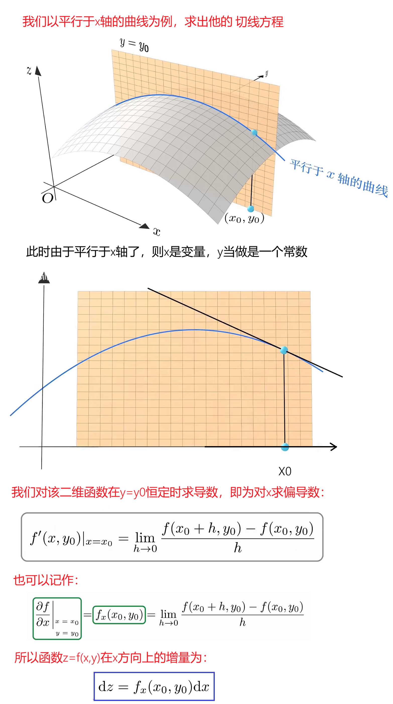

$(1, 0, f_x(x_0, y_0))$，可以这样理解：

“这是 $x$ 方向移动一个单位距离后，函数产生的微分值，这个值恰好等于该点的偏导数。”

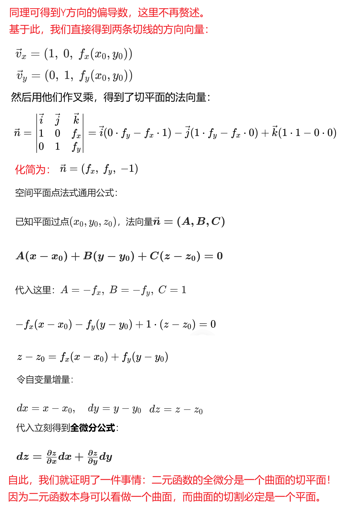

### 梯度

#### 补充偏导数

**导数是一元函数的变化率（斜率）**。导数也是函数，是函数的变化率与位置的关系。

如果是多元函数呢？则为**偏导数**。

**偏导数是多元函数“退化”成一元函数时的导数**，这里“退化”的意思是**固定其他变量的值，只保留一个变量**，依次保留每个变量，则$N$元函数有$N$个偏导数。

以二元函数为例，令$z = f(x, y)$，绘制在3维坐标系如下图所示，

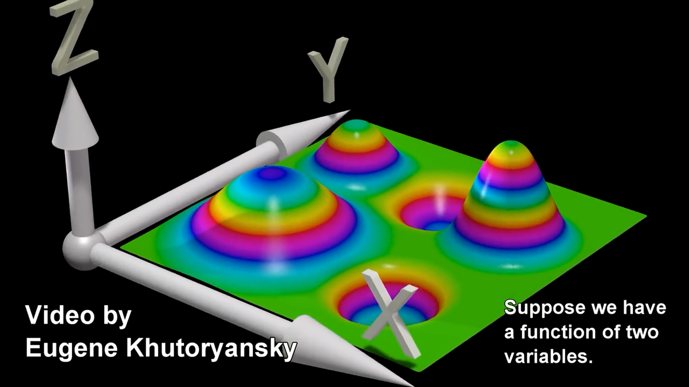

在分别固定$y$和$x$的取值后得到下图中的黑色曲线——“退化”为一元函数，二维坐标系中的曲线——则偏导数 $\frac{\partial z}{\partial x}$ 和 $\frac{\partial z}{\partial y}$ 分别为曲线的导数（切线斜率）。

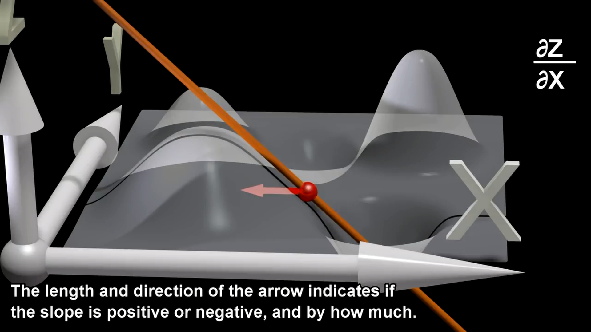

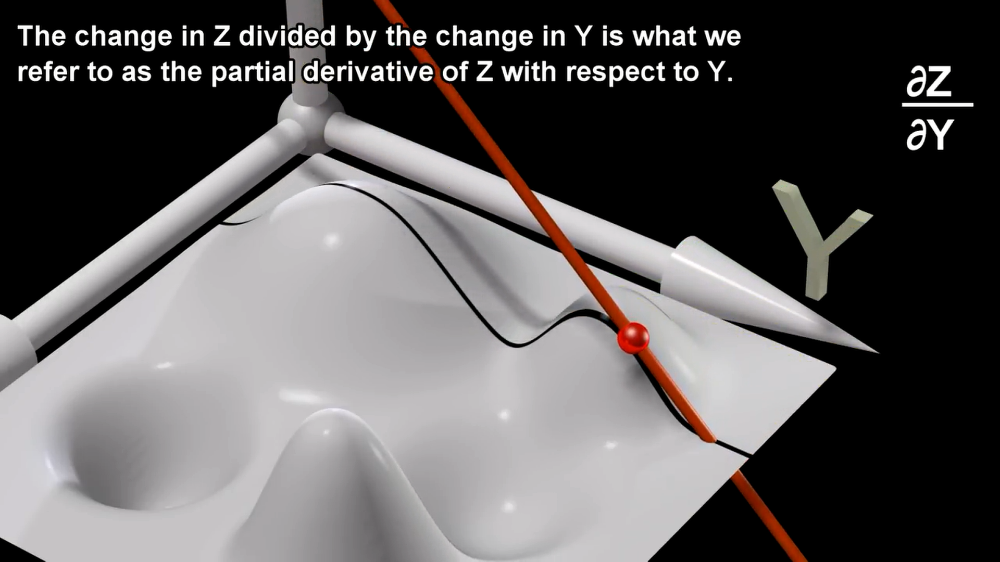

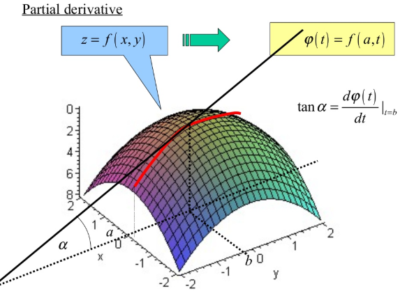

#### 方向导数

如果是方向不是沿着坐标轴方向，而是任意方向呢？则为**方向导数**。如下图所示，点P位置处红色箭头方向的方向导数为黑色切线的斜率，来自链接[Directional Derivative](https://www.geogebra.org/m/Bx8nFMNc)

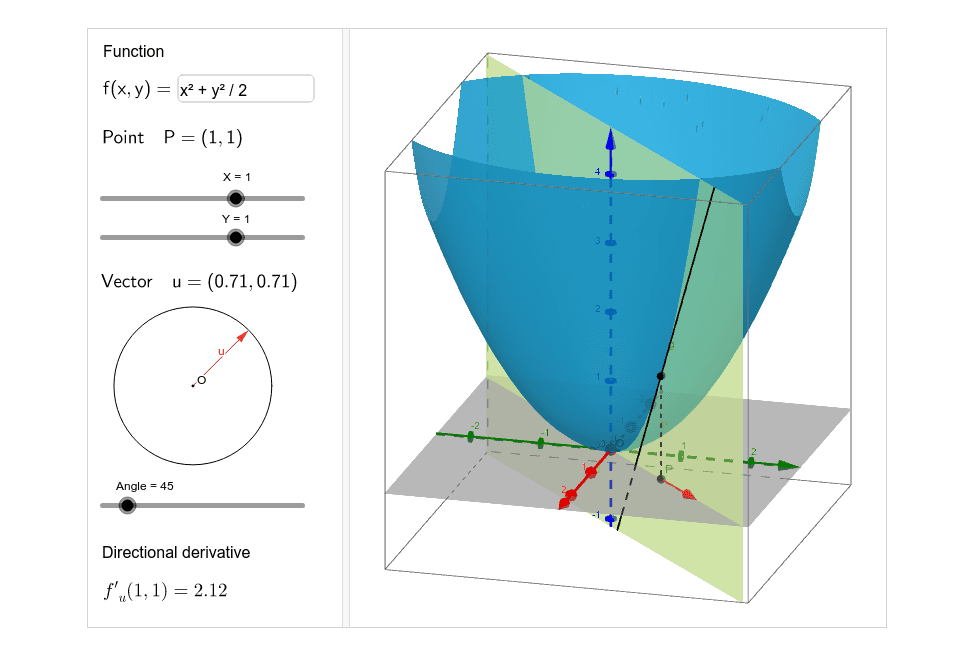

方向导数为函数在某一个方向上的导数。具体地，定义 $xy$ 平面上一点 $(a, b)$ 以及单位向量 $\vec{u} = (\cos \theta, \sin \theta)$。在曲面 $z = f(x, y)$ 上，从点 $(a, b, f(a, b))$ 出发，沿 $\vec{u} = (\cos \theta, \sin \theta)$ 方向走 $t$ 单位长度后，函数值为 $F(t) = f(a + t \cos \theta, b + t \sin \theta)$。则点 $(a, b)$ 处 $\vec{u} = (\cos \theta, \sin \theta)$ 方向的方向导数为：

$$
\begin{aligned}
& \frac{d}{dt} f(a + t \cos \theta, b + t \sin \theta) \big|_{t=0} \\
&= \lim_{t \to 0} \frac{f(a + t \cos \theta, b + t \sin \theta) - f(a,b)}{t} \\
&= \lim_{t \to 0} \frac{f(a + t \cos \theta, b + t \sin \theta) - f(a, b + t \sin \theta)}{t} + \lim_{t \to 0} \frac{f(a, b + t \sin \theta) - f(a,b)}{t} \\
&= \frac{\partial f}{\partial x}(a,b) \frac{dx}{dt} + \frac{\partial f}{\partial y}(a,b) \frac{dy}{dt} \\
&= f_x(a,b) \cos \theta + f_y(a,b) \sin \theta \\
&= (f_x(a,b), f_y(a,b)) \cdot (\cos \theta, \sin \theta)
\end{aligned}
$$

链式法则的体现：我们设：
1. $f = f(x, y)$
2. $x = x(t) = a + t \cos \theta$
3. $y = y(t) = b + t \sin \theta$

那么，根据多元函数链式法则：

$$
\frac{d}{dt} f(x(t), y(t)) \big|_{t=0} = \frac{\partial f}{\partial x} \cdot \frac{dx}{dt} + \frac{\partial f}{\partial y} \cdot \frac{dy}{dt}
$$

上面推导中使用了链式法则。其中，$f_x(a,b)$和$f_y(a,b)$分别为函数在$(a,b)$位置的偏导数。由上面的推导可知：

该位置处，任意方向的**方向导数为偏导数的线性组合，系数为该方向的单位向量**。当该方向与坐标轴正方向一致时，方向导数即偏导数，换句话说，**偏导数为坐标轴方向上的方向导数，其他方向的方向导数为偏导数的合成**。写成向量形式，**偏导数构成的向量为$\nabla f(a,b) = (f_x(a,b), f_y(a,b))$，称之为梯度**。

#### 什么是梯度

梯度，写作 $\nabla f$，二元时为 $(\frac{\partial z}{\partial x}, \frac{\partial z}{\partial y})$，多元时为 $(\frac{\partial z}{\partial x}, \frac{\partial z}{\partial y}, \dots)$。

我们继续上面方向导数的推导，$(a, b)$处 $\theta$ 方向上的方向导数为

$$(f_x(a, b), f_y(a, b)) \cdot (\cos \theta, \sin \theta)$$

$$= |(f_x(a, b), f_y(a, b))| \cdot |1| \cdot \cos \phi$$

$$= |\nabla f(a, b)| \cdot \cos \phi$$

其中，$\phi$ 为 $\nabla f(a, b)$ 与 $\vec{u}$ 的夹角，显然，当 $\phi = 0$ 即 $\vec{u}$ 与梯度 $\nabla f(a, b)$ **同向时，方向导数取得最大值，最大值为梯度的模** $|\nabla f(a, b)|$，当 $\phi = \pi$ 即 $\vec{u}$ 与梯度 $\nabla f(a, b)$ 反向时，**方向导数取得最小值，最小值为梯度模的相反数**。此外，根据上面方向导数的公式可知，在夹角 $\phi < \frac{\pi}{2}$ 时方向导数为正，表示 $\vec{u}$ 方向函数值上升，$\phi > \frac{\pi}{2}$ 时方向导数为负，表示该方向函数值下降。  

至此，方才有了**梯度的几何意义**：

1. 当前位置的梯度方向，为函数在该位置处**方向导数最大的方向**，也是函数值**上升最快的方向**，反方向为下降最快的方向；
2. 当前位置的 **梯度长度(模)** 为最大方向导数的值。

#### 等高线图中的梯度

在讲解各种优化算法时，我们经常看到目标函数的等高线图示意图，如下图所示，来自链接[Gradient and directional derivative on a mountain](https://mathinsight.org/applet/gradient_directional_derivative_mountain)

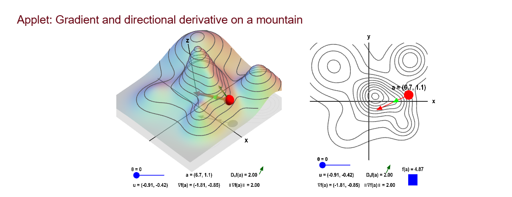

1. 红色向量 (The Red Vector)：梯度 $\nabla f(a)$这是全场最核心的向量，它存在于底部的 $xy$ 平面上。
    - 数学本质： 它是函数在 $a$ 点的梯度 $\nabla f(a) = (f_x, f_y)$。
    - 几何意义： 它是“爬坡最快”的方向。
    - 为什么垂直： 因为它是从等高线上直接“冲”出去的最短路线，所以它必定垂直于等高线（在二维投影面上）。

2. 亮绿色向量 (The Light Green Vector)：方向向量 $\mathbf{u}$这是通过你调节滑块（$\theta$）来控制的向量。
    - 数学本质： 这是一个单位向量 $\mathbf{u} = (\cos\theta, \sin\theta)$。
    - 几何意义： 这是你当前决定行走的“方向”。
    - 调节功能： 当你移动滑块时，这个向量会旋转，改变你相对于梯度（红色）的出发角度。

3. 深绿色向量 (The Dark Green Vector)：方向导数的几何投影这是最让你困惑的向量，它是“导数值”的几何化。
    - 数学本质： 这是一个三维向量，它的坐标是 $(u_1, u_2, D_{\mathbf{u}}f(a))$。
        - $u_1, u_2$ 是你的方向坐标。
        - $D_{\mathbf{u}}f(a)$ 是你计算出的方向导数数值（即坡度）。
    - 几何意义： 在切平面上，当你按照方向 $\mathbf{u}$ 迈出 $(dx, dy)$ 这一步时，你产生的垂直高度变化量 $dz$ 是多少。

梯度与等高线垂直。为什么呢？

等高线，顾名思义，即这条线上的点高度（函数值）相同，令某一条等高线为 $z = f(x, y) = C$，$C$ 为常数，两边同时全微分，如下所示：

$$dz = \frac{\partial f}{\partial x} dx + \frac{\partial f}{\partial y} dy$$

$$= \left(\frac{\partial f}{\partial x}, \frac{\partial f}{\partial y}\right) \cdot (dx, dy)$$

$$= dC = 0$$

这里，两边同时全微分的几何含义是，在当前等高线上挪动任意一个极小单元，等号两侧的变化量相同。$f(x, y)$ 的变化量有两个来源，一个由 $x$ 的变化带来，另一个由 $y$ 的变化带来，在一阶情况下，由 $x$ 带来的变化量为 $\frac{\partial f}{\partial x} dx$，由 $y$ 带来的变化量为 $\frac{\partial f}{\partial y} dy$，两者叠加为 $z$ 的总变化量，等号右侧为常数，因为我们指定在当前等高线上挪动一个极小单元，其变化量为 $0$，左侧等于右侧。进一步拆分成向量内积形式，$\left(\frac{\partial f}{\partial x}, \frac{\partial f}{\partial y}\right)$ 为梯度，$(dx, dy)$ 为该点指向任意方向的极小向量，因为两者内积为 $0$，所以两者垂直。自然不难得出梯度与等高线垂直的结论。

更进一步地，梯度方向指向函数上升最快的方向，在等高线图中，梯度指向高度更高的等高线。

#### 梯度为0

1. 局部极小值（Local Minimum）：碗底。周围全是上坡。

2. 局部极大值（Local Maximum）：山顶。周围全是下坡。

3. 鞍点（Saddle Point）：马鞍中心。向左走上坡，向右走下坡。

### 鞍点Saddle Point

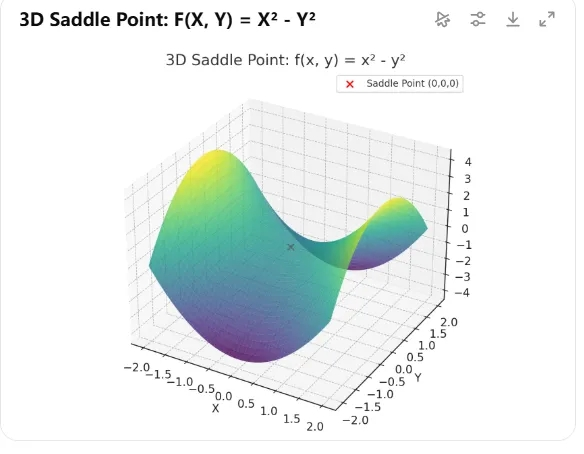

鞍点是地形上的“分水岭”

想象你站在一个马鞍的中心：

1. 从侧面看：马鞍的左右两边是翘起来的，你正站在两座小山包中间的凹陷处，你感觉自己正处于“低谷”。

2. 从前后看：马鞍的前后两边是延伸下去的，你正站在一个悬崖的边缘，从这个角度看，你正处于“山脊”。

所以，它是一个方向性的矛盾点。在某些方向它是谷底，在另一些方向它是山顶。

鞍点是一个点，在这个点上函数的一阶导数为0（梯度为0），但它既不是局部最小点也不是局部最大点。

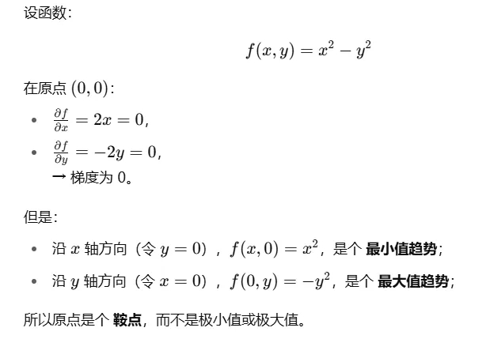

### 误差曲面error surface

也叫做loss surface（损失曲面）

指的是当讲模型的所有参数看作坐标轴，把模型在这些参数下的损失值看作高度，所形成的一个多维曲面。

通常来说，

横轴 → 模型的参数（比如权重 weight、偏置 bias）；

纵轴 → 损失函数的值（比如 MSE、交叉熵）。

我们优化的目标就是在error surface中寻找最低点，也就是损失最小的参数组合。

1. 把“训练”想象成“登山找谷”你现在的目标是把模型调教得最准，这就意味着要让Loss（损失值）越小越好。
    - 参数 ($w, b$) = 经纬度：你可以调整的权重和偏置，就是地图上的坐标。
    - Loss = 海拔高度：模型现在的准确度有多烂，就是海拔。
    - Error Surface（损失曲面） = 整张山地地图：由于参数有很多个，这个地图不是平面的，而是一个高维的复杂地形。
    - 优化目标 = 找谷底：寻找海拔最低的地方（Loss 最小），那就是最优的 $(w, b)$ 参数组合。
    
2. 为什么“难度”不同？地图的“地貌”决定了训练的难易程度：
    - 光滑的山谷：如果你面对的是一个平滑的碗状地形，梯度下降（Gradient Descent） 就像是一个小球，无论你怎么滚，都能直接滚到碗底，这叫“容易优化”。
    - 崎岖的地形：如果地图上到处是“坑”（局部极小值）和“马鞍”（鞍点），梯度下降这个小球就会很惨：
        - 它可能掉进一个小坑就以为到谷底了（被 Local Minima 卡住）。
        - 它可能停在马鞍的中间，因为坡度消失了而卡住（被 Saddle Point 卡住）。
        
3. 优化器的作用（复杂的“登山杖”）
    - 梯度下降（Gradient Descent）：就是那个最简单的球。它只看脚下的坡度，坡度往哪儿低就往哪儿滚。遇到鞍点或者复杂地形，它非常容易“迷路”。
    - 高级优化器（Adam, RMSProp）：它们不仅仅是“滚”，它们还带了“记忆”和“惯性”：
        - 动量（Momentum）：相当于给小球加了一个惯性。遇到那种浅浅的“局部小坑”，它利用惯性直接冲过去，不会掉进去。
        - 自适应学习率（Adaptive Learning Rate）：相当于在陡坡时跑快点，在平坦地形时仔细摸索。这使得它在复杂的“多维地形”中，比单纯的梯度下降更不容易被鞍点卡住。

### 反函数

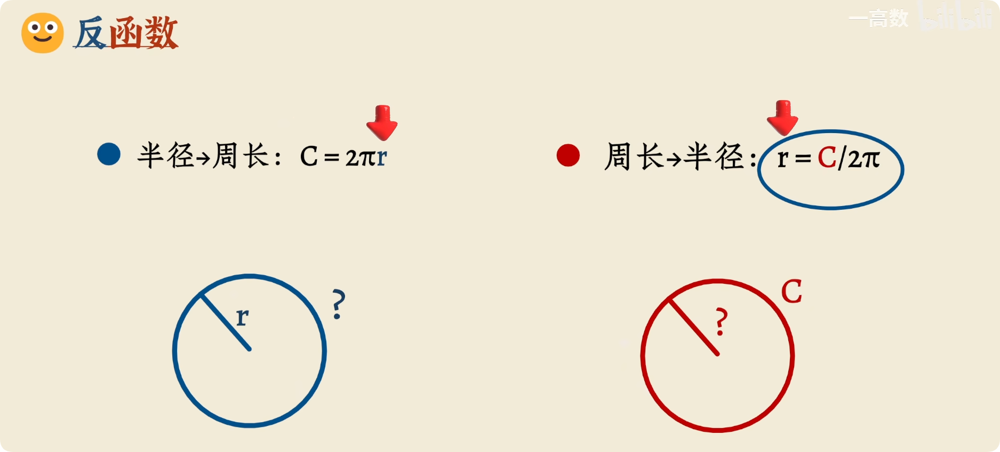

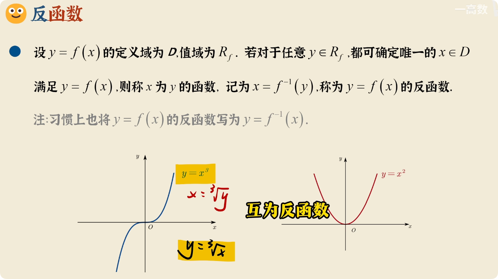

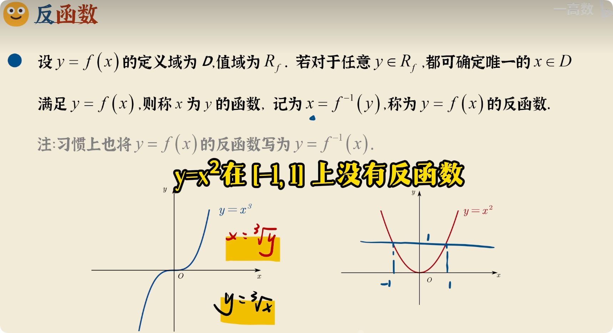

#### 反三角函数

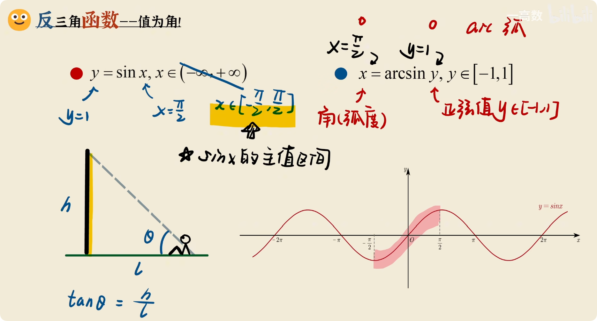

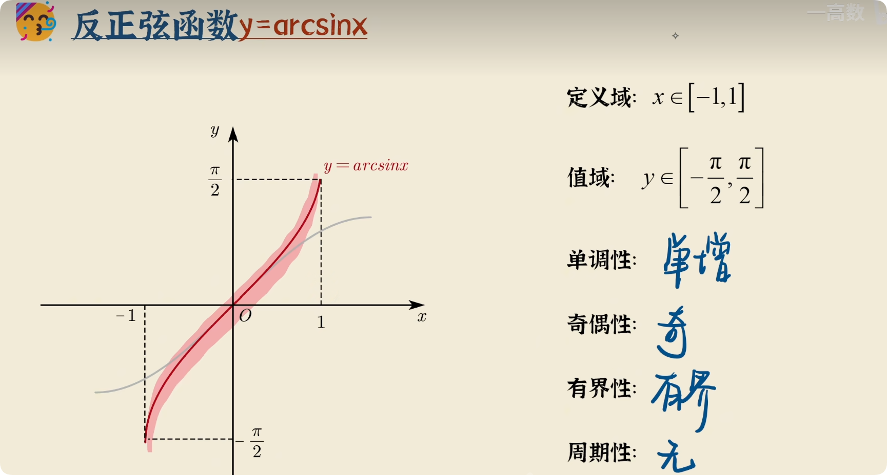

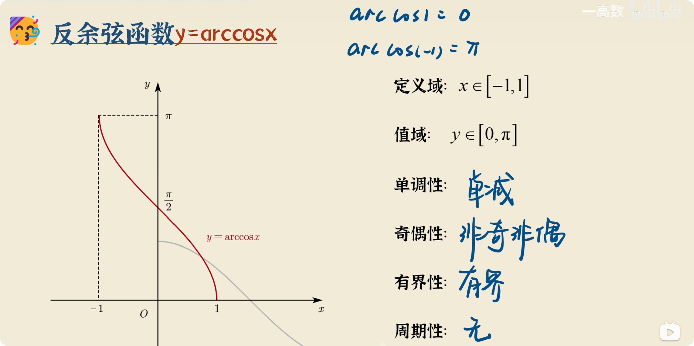

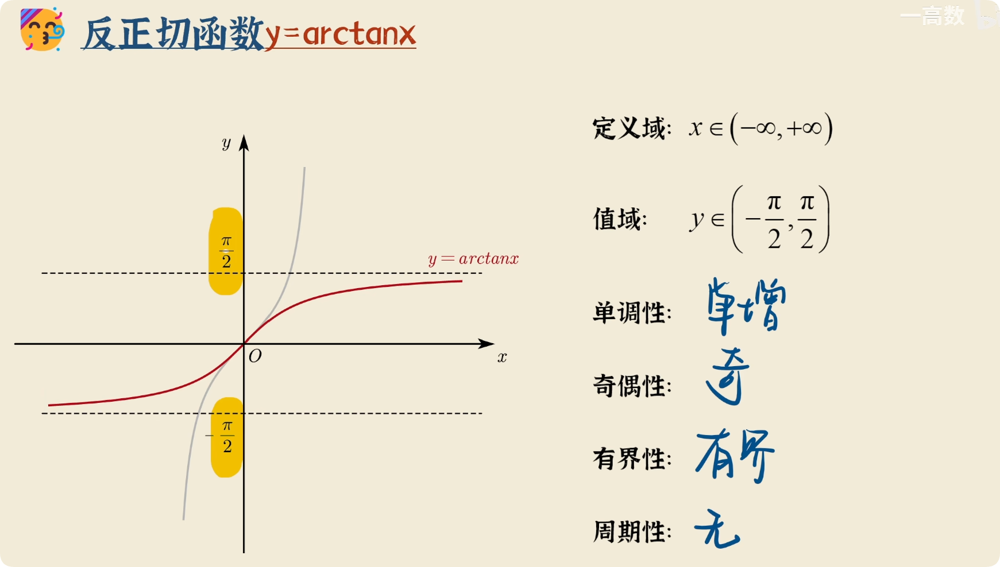

### 标准差

标准差(Standard Deviation/Sigma)，在数学中，标准差通常用希腊字母 $\sigma$（Sigma）表示。它描述的是一组数值相对于平均值的“散开”程度。

**离平均值有多分散，标准差越小，数据越集中；标准差越大，数据越分散。**

#### 如何计算标准差

标准差 ($\sigma$) 的计算过程本质上是求数据点到中心点（平均值）的平均距离。

五步计算法

假设我们有一组简单的数字：2, 4, 4, 4, 5, 5, 7, 9

**第一步计算平均值(Mean)**

把所有数字相加，除以数字的个数。

$$\mu = \frac{2+4+4+4+5+5+7+9}{8} = \frac{40}{8} = 5$$

**第二步计算离差(Deviations)**

算出每个数字与平均值的差（即每个点离中心有多远）：

$2 - 5 = -3$

$4 - 5 = -1$

$7 - 5 = 2$ ...以此类推。

**第三步平方离差(Squared Deviations)**

将上一步得到的差全部平方。为什么要平方？ 为了消除负号（我们只关心距离，不关心方向）。

$(-3)^2 = 9$

$(-1)^2 = 1$

$(2)^2 = 4$ ...

**第四步计算方差(Variance)**

将这些平方后的值加起来，再求平均值。这个结果叫方差 ($\sigma^2$)。

$$\sigma^2 = \frac{9 + 1 + 1 + 1 + 0 + 0 + 4 + 16}{8} = \frac{32}{8} = 4$$

**第五步开平方根(Standard Deviation)·**

对方差开平方根，回到原始单位。

$$\sigma = \sqrt{4} = 2$$

结论：这组数据的标准差是 2。

#### 标准差数学公式

如果你在书上看到这个公式，不要被它吓到，它就是上面五步的缩写：

$$\sigma = \sqrt{\frac{1}{N} \sum_{i=1}^{N} (x_i - \mu)^2}$$

$\sum$：求和符号（对应第三、四步）。

$x_i - \mu$：每个值减去平均值（对应第二步）。

$\sqrt{\quad}$：根号（对应第五步）。

### 正态分布