- [欧拉数](#欧拉数)
    - [e为什么特殊](#e为什么特殊)
    - [生兔子比喻](#生兔子比喻)
- [一阶导数](#一阶导数)
- [偏导数](#偏导数)
- [逻辑关系](#逻辑关系)
- [链式法则](#链式法则)
    - [一元链式法则](#一元链式法则)
    - [多元复合函数链式法则](#多元复合函数链式法则)
- [一元函数微分](#一元函数微分)
- [偏微分](#偏微分)
- [全微分](#全微分)
    - [全微分与全增量的关系](#全微分与全增量的关系)
    - [可微的充分条件](#可微的充分条件)
    - [推广到多元函数](#推广到多元函数)
- [导数和微分的关系](#导数和微分的关系)
- [微分的几何意义](#微分的几何意义)
- [方向导数的几何意义](#方向导数的几何意义)
- [梯度](#梯度)
    - [补充偏导数](#补充偏导数)
    - [方向导数](#方向导数)
    - [什么是梯度](#什么是梯度)
    - [等高线图中的梯度](#等高线图中的梯度)
    - [梯度为0](#梯度为0)
- [鞍点Saddle-Point](#鞍点Saddle-Point)
- [误差曲面error surface](#误差曲面error-surface)
- [反函数](#反函数)
- [标准差](#标准差)
    - [如何计算标准差](#如何计算标准差)
    - [标准差数学公式](#标准差数学公式)
    - [方差](#方差)
- [正态分布](#正态分布)
- [伯努利分布](#伯努利分布)
- [Hadamard积](#hadamard积)
- [L2 范数](#l2-范数)
- [二阶导数](#二阶导数)
- [导数家族](#导数家族)
- [实对称矩阵](#实对称矩阵)
- [二次型](#二次型)
- [矩阵的特征值和特征向量](#矩阵的特征值和特征向量)
- [积分](#积分)
    - [初步理解积分](#初步理解积分)
    - [初步理解微积分基本定理](#初步理解微积分基本定理)
        - [第一基本定理变上限积分求导定理](#第一基本定理变上限积分求导定理)
        - [第二基本定理牛顿-莱布尼茨公式](#第二基本定理牛顿-莱布尼茨公式)
    - [固定积分和变上限积分和不定积分](#固定积分和变上限积分和不定积分)
- [多项式](#多项式)
- [泰勒级数](#泰勒级数)
    - [余弦函数在$x=0$处如何用二次多项式近似](#余弦函数在$x=0$处如何用二次多项式近似)
    - [加3次幂项近似没用](#加3次幂项近似没用)
    - [加4次幂项近似有用](#加4次幂项近似有用)
    - [余弦函数的泰勒多项式](#余弦函数的泰勒多项式)
    - [任何函数的泰勒多项式](#任何函数的泰勒多项式)
    - [二阶泰勒展开](#二阶泰勒展开)
- [正定和负定和不定矩阵](#正定和负定和不定矩阵)

### 欧拉数

e(Euler's Number)欧拉数/自然常数，是一个无限不循环的常数，约等于 2.71828...。它和圆周率 π 一样，是数学中最重要的“基石”之一。

$$e = \lim_{n \to \infty} \left( 1 + \frac{1}{n} \right)^n$$

你有1块钱，年利率 100%

一年结算一次

一年后：1(本金) × (1(原来的100%) + 1(额外增长的100%)) = 2

一年结算两次，每次 +50%

一年后：1 × (1 + 1/2) = 1.5 => 1.5 × (1 + 1/2) = 2.25 => 1 × (1 + 1/2)^2 = 2.25

一年结算四次，每次 +25%

一年后：1 × (1 + 1/4)^4 = 2.4414

一直增加结算频率，(1 + 1/n)^n

当 n → ∞ 时，(1 + 1/n)^n 趋近于 e。e 是自然常数，约等于 2.71828...。

所以 e 的真正含义

**如果增长是“无限连续发生”的，最终增长倍率就是 e。**

#### e为什么特殊

它是唯一一个：

$f(x) = e^x$ 在任意一点的导数（变化速度），都完美地等于它当下的函数值本身

这个特性被表述为：$$\frac{d}{dx}(e^x) = e^x$$

当前值有多大 → 增长速度就有多大

#### 生兔子比喻

没有生育间隔的完美繁殖，假设我们有一种“量子兔子”，它们有一个极其生猛的超能力：一出生，不需要长大，零延迟，立刻就能以恒定的效率生小兔子。

假设有 $10$ 只兔子，它们在这一秒钟生小兔子的总速度是“每秒生 $10$ 只”。

第一秒：它们生出了小兔子。因为兔子变多了，变成了 $20$ 只。

第二秒：因为现场有 $20$ 只兔子都在同时生，所以这一秒钟生兔子的速度瞬间变成了“每秒生 $20$ 只”。

第三秒：兔子总量变成了 $50$ 只，那么这一秒钟生兔子的速度立刻飙升到“每秒生 $50$ 只”。发现规律了吗？兔子繁殖的“总速度”，完全取决于这一瞬间场地上“一共有多少只兔子”。 场地上兔子越多，生新兔子的速度就越恐怖。

发现规律了吗？兔子繁殖的“总速度”，完全取决于这一瞬间场地上“一共有多少只兔子”。 场地上兔子越多，生新兔子的速度就越恐怖。

### 一阶导数

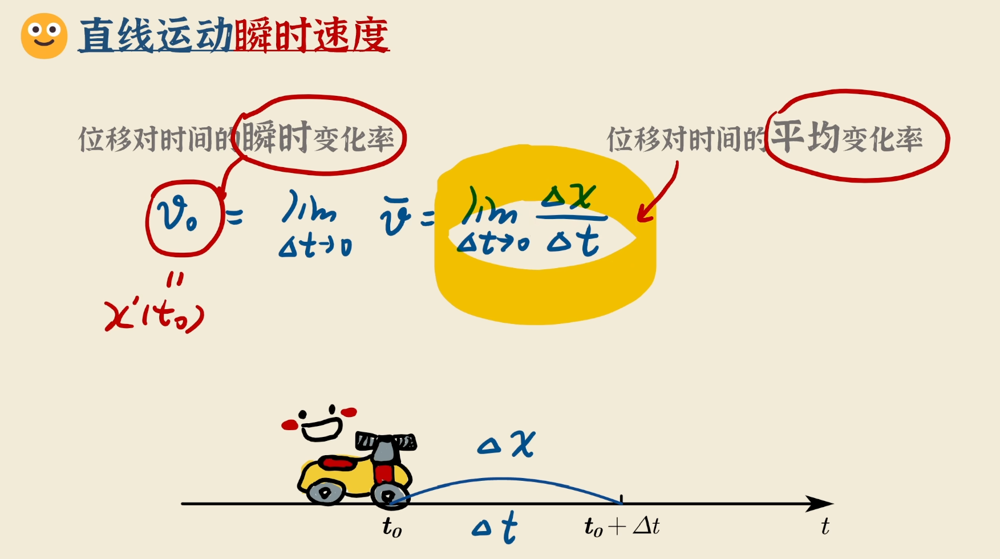

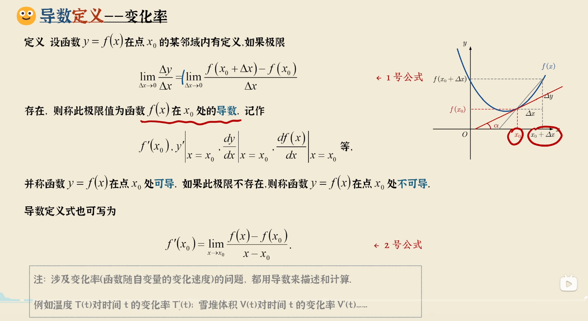

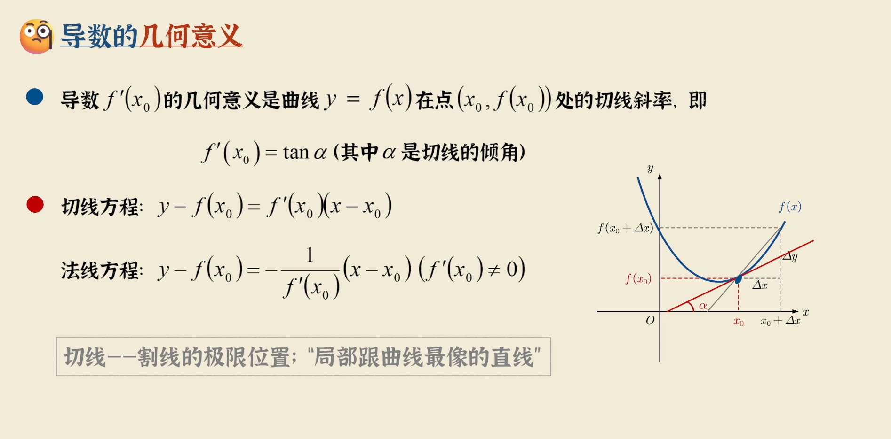

### 偏导数

**导数精确描述了函数变化率，变化率可理解为变量的变化“快慢”问题。**

[“偏导数”一课通！1h零基础上手！|高数下](https://www.bilibili.com/video/BV18x4y127m8)

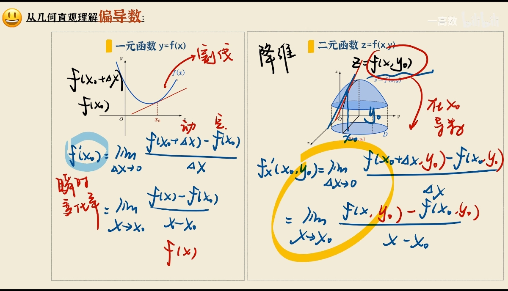

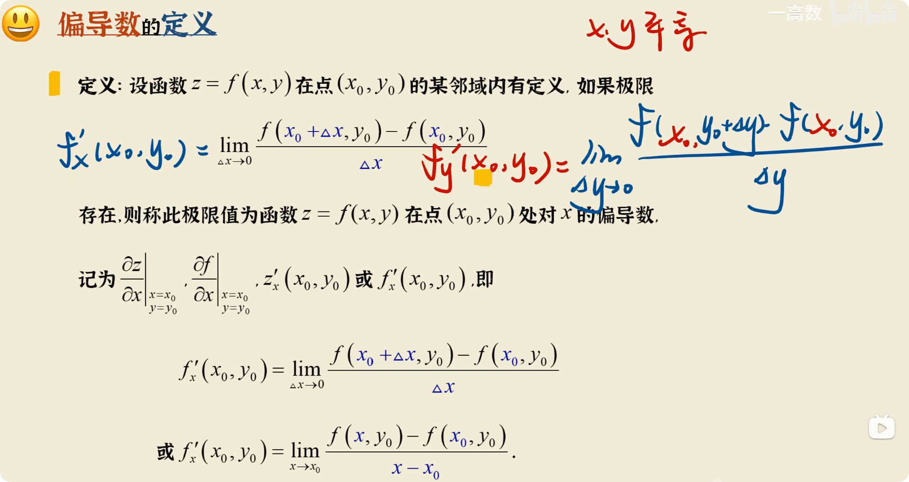

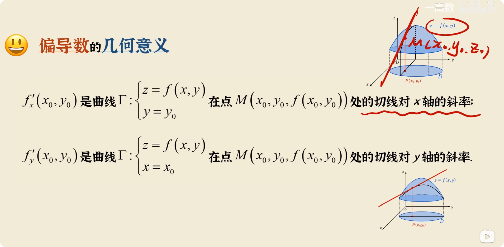

### 逻辑关系

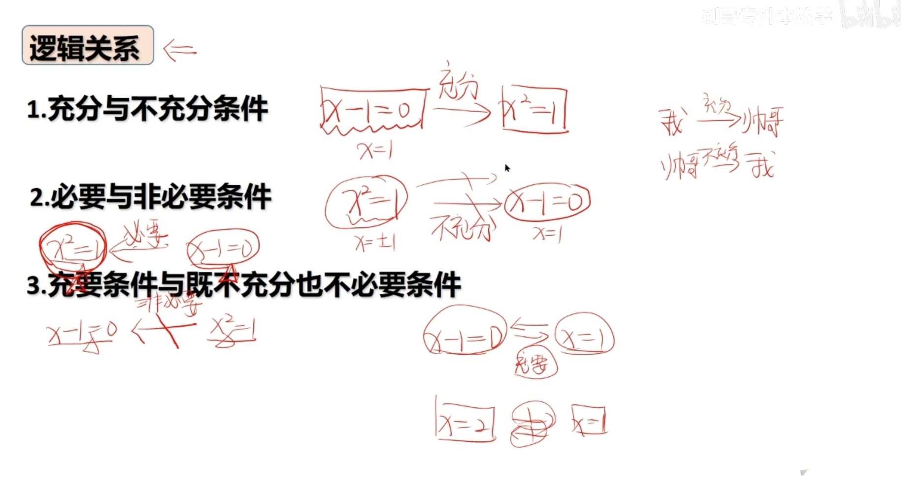

### 链式法则

#### 一元链式法则

链式法则是一个计算复合函数导数的公式：如果y是u的函数，而u又是x的函数，那么y对x的导数等于y对u的导数乘以u对x的导数。

公式表示

如果 $y = f(u)$，而 $u = g(x)$，那么：$$\frac{dy}{dx} = \frac{df}{du} \cdot \frac{du}{dx}$$

想象一条影响链：

1. x变化引起u变化
2. u变化又引起y变化
3. 链式法则告诉我们如何计算最终的变化率

货币汇率：如果1欧元=1.1美元，1美元=110日元，那么1欧元=121日元。这正是两个汇率相乘！

#### 多元复合函数链式法则

假设 $z = f(x, y)$，而 $x$ 和 $y$ 分别是 $t$ 的函数：$x = x(t), y = y(t)$。

那么 $z$ 最终是关于 $t$ 的一元函数，其导数为：

$$\frac{dz}{dt} = \frac{\partial z}{\partial x} \cdot \frac{dx}{dt} + \frac{\partial z}{\partial y} \cdot \frac{dy}{dt}$$

解读：

1. 因为 $z$ 的变化由两条路径传来（一条通过 $x$，一条通过 $y$），所以要相加。
2. 对 $x$ 的偏导，乘上 $x$ 对 $t$ 的导数；对 $y$ 同理。

偏导和全导要分清：
1. 当最终变量只有一个时（如 $t$），用 $\frac{d}{dt}$；
2. 当最终变量有多个时（如 $s, t$），用 $\frac{\partial}{\partial s}$。

举个例子：

想象你的幸福感 $z$ 取决于工资 $x$ 和健康 $y$。而工资和健康又都取决于时间 $t$（加班工资涨但健康降）。那么幸福感随时间的总变化率就是：

通过工资带来的变化 + 通过健康带来的变化。

这就是：

$$\frac{\partial z}{\partial x} \frac{dx}{dt} + \frac{\partial z}{\partial y} \frac{dy}{dt}$$

### 一元函数微分

研究对象：
1. 一条曲线 $y = f(x)$。

2. 几何意义： 你在曲线上某个点，用一把直尺（切线）去代替弯曲的线。这把直尺的斜率就是导数 $f'(x)$。

3. 微分 ($dy$) 指的是： 当你在水平方向 ($x$轴) 向前走了一小步 $dx$ 时，这把直尺（切线）在垂直方向上升了多少。

4. 公式： $dy = f'(x) \cdot dx$。

总结：一元微分只关心“水平方向”这一个维度的变化。

### 偏微分

偏微分 (Partial Differential)

是指多元函数在某一个自变量方向上的微小变化所引起的函数值的微小变化。

更具体地说：

如果函数 $f(x, y)$ 对 $x$ 的偏导数是 $\frac{\partial f}{\partial x}$，那么它的关于 $x$ 的偏微分就是：

$$\partial f = \frac{\partial f}{\partial x} dx$$

（这里假设只有 $x$ 变化，$y$ 固定）

对于一个二元函数 $f(x, y)$，当 $x$ 和 $y$ 都发生微小变化 $dx$ 和 $dy$ 时，函数的总变化量（近似）为：

$$df = \frac{\partial f}{\partial x} dx + \frac{\partial f}{\partial y} dy$$

这个 $df$ 叫做 全微分 (Total Differential)。而其中的每一项：

1. $\frac{\partial f}{\partial x} dx \rightarrow$ 是 关于 $x$ 的偏微分
2. $\frac{\partial f}{\partial y} dy \rightarrow$ 是 关于 $y$ 的偏微分

✅ 所以： 全微分 = 所有偏微分之和

### 全微分

全微分(Total Differential)

全微分是多元函数微分学中的一个核心概念，它描述了当函数的所有自变量都发生微小变化时，函数值的总的、线性的近似改变量。与偏导数关注单一变量变化不同，全微分考虑的是所有变量同时变化对函数值的综合影响。

如果一个多元函数在某一点的变化量可以用一个关于自变量变化量的线性函数来很好地近似，我们就称这个函数在该点是可微的，这个线性函数就叫做函数在该点的全微分。

假设有一个二元函数 $z = f(x, y)$。

1. 函数的增量 (Total Increment)：

当自变量 $x$ 从 $x_0$ 变为 $x_0 + \Delta x$，$y$ 从 $y_0$ 变为 $y_0 + \Delta y$ 时，函数的全增量为：

$$\Delta z = f(x_0 + \Delta x, y_0 + \Delta y) - f(x_0, y_0)$$

2. 可微性 (Differentiability)：

如果函数 $f(x, y)$ 在点 $(x_0, y_0)$ 的**全增量 $\Delta z$** 可以表示为：

$$\Delta z = A\Delta x + B\Delta y + o(\rho)$$

其中 $A$ 和 $B$ 是只与点 $(x_0, y_0)$ 有关的常数，$\rho = \sqrt{(\Delta x)^2 + (\Delta y)^2}$ 是点 $(x_0 + \Delta x, y_0 + \Delta y)$ 与点 $(x_0, y_0)$ 之间的距离，而 $o(\rho)$ 是比 $\rho$ 更高阶的无穷小（即 $\lim_{\rho \to 0} \frac{o(\rho)}{\rho} = 0$），那么我们就称函数 $f(x, y)$ 在点 $(x_0, y_0)$ 可微。

什么是“高阶”？

这个极限公式的核心在于 $o(\rho)$ 消失的速度比 $\rho$ 快得多。

想象你在微观世界中做实验，你改变了变量 $\rho$（比如距离），结果产生了两个后果：

1. 主要变化（$A\Delta x + B\Delta y$）：这是你预期的、线性的变化。
2. 误差项（$o(\rho)$）：这是因为曲面弯曲带来的多余偏差。

公式 $\lim_{\rho \to 0} \frac{o(\rho)}{\rho} = 0$ 实际上是在承诺：只要你离目标点足够近，误差项相对于你走过的距离来说，几乎可以忽略不计。

3. 全微分 (Total Differential)：

如果函数 $f(x, y)$ 在点 $(x_0, y_0)$ 可微，那么其全增量 $\Delta z$ 的线性主部 $A\Delta x + B\Delta y$ 就称为函数 $f(x, y)$ 在点 $(x_0, y_0)$ 的全微分，记作 $dz$ 或 $df(x_0, y_0)$。

可以证明，如果 $f$ 可微，那么常数 $A$ 和 $B$ 恰好是函数在该点的偏导数：

$$A = \frac{\partial f}{\partial x}(x_0, y_0) \quad \text{and} \quad B = \frac{\partial f}{\partial y}(x_0, y_0)$$

因此，全微分的表达式为：

$$dz = \frac{\partial f}{\partial x}(x_0, y_0)dx + \frac{\partial f}{\partial y}(x_0, y_0)dy$$

这里，$dx$ 和 $dy$ 分别表示自变量 $x$ 和 $y$ 的微分（或微小改变量），即 $dx = \Delta x$ 和 $dy = \Delta y$。

#### 全微分与全增量的关系

全微分 $dz$ 是全增量 $\Delta z$ 的线性近似：

$$\Delta z \approx dz$$

当 $\Delta x$ 和 $\Delta y$ 都很小时，这个近似非常精确。

举个例子：

f(x, y) = x^2 + y^2

在点 (1, 2)，让：

Δx = 0.1

Δy = 0.2

真实全增量：

Δz = (1.1)^2 + (2.2)^2 - (1^2 + 2^2)
   = 1.21 + 4.84 - 5
   = 1.05

全微分：

dz = 2x Δx + 2y Δy
   = 2 * 1 * 0.1 + 2 * 2 * 0.2
   = 0.2 + 0.8
   = 1.0

所以：

Δz = 1.05
dz = 1.00

dz 很接近 Δz，但不完全等于它。

区别：

全增量 Δz：真实变化量

全微分 dz：线性近似变化量

当自变量增量越小，全微分对全增量的近似越好。

#### 可微的充分条件

1. 充分性：A → B（有A必有B）；
2. 非必要性：B ⇏ A（有B不一定有A，B可以通过其他方式实现，不需要A）。

一个常用的判断函数是否可微的充分（但非必要）条件是：

如果函数 $f(x, y)$ 的两个偏导数 $\frac{\partial f}{\partial x}$ 和 $\frac{\partial f}{\partial y}$ 在点 $(x_0, y_0)$ 的某个邻域内存在，并且在点 $(x_0, y_0)$ 连续，那么函数 $f(x, y)$ 在该点可微。

#### 推广到多元函数

对于 $n$ 元函数 $w = f(x_1, x_2, \dots, x_n)$，如果在某点可微，其全微分定义为：

$$dw = df = \frac{\partial f}{\partial x_1}dx_1 + \frac{\partial f}{\partial x_2}dx_2 + \dots + \frac{\partial f}{\partial x_n}dx_n$$

### 导数和微分的关系

导数和微分的关系，可以用一句话概括：**导数是“变化率”，而微分是“变化量”**。

1. 几何上的直观理解，想象你在走一段山路，当前位置是 $x$：
    - 导数 ($f'(x)$)：是你当下所处位置的山坡陡峭程度。这只关乎这个点本身有多陡，无论你后面怎么走，这个数值固定不变。
    - 微分 ($dy$)：是你沿着“当前的坡度”向前迈出一步（$dx$）后，你预估自己垂直上升了多高。
        - 如果你迈出的步子大（$dx$ 大），$dy$ 就大；
        - 如果你迈出的步子小（$dx$ 小），$dy$ 就小。

2. 数学逻辑：线性近似，为什么我们把两者区分开？因为**微分是将复杂问题“线性化”的工具**。对于真实的函数增量 $\Delta y = f(x + \Delta x) - f(x)$，直接计算往往很麻烦（比如处理曲线的弯曲部分）。但通过微分，我们可以写出：

$$\Delta y \approx dy = f'(x) \cdot dx$$

导数 ($f'(x)$) 告诉我们线性变化的“斜率”。

微分 ($dy$) 是利用这个斜率，把“弯曲的真实路径”简化为“笔直的切线路径”。

只要 $dx$ 足够小，这条切线就几乎和真实的曲线重合。 这就是为什么在机器学习（例如深度学习的梯度下降）中，我们总是利用导数计算出的微分来更新模型权重，因为只要步长（学习率）够小，这种近似就是安全且高效的。

### 微分的几何意义

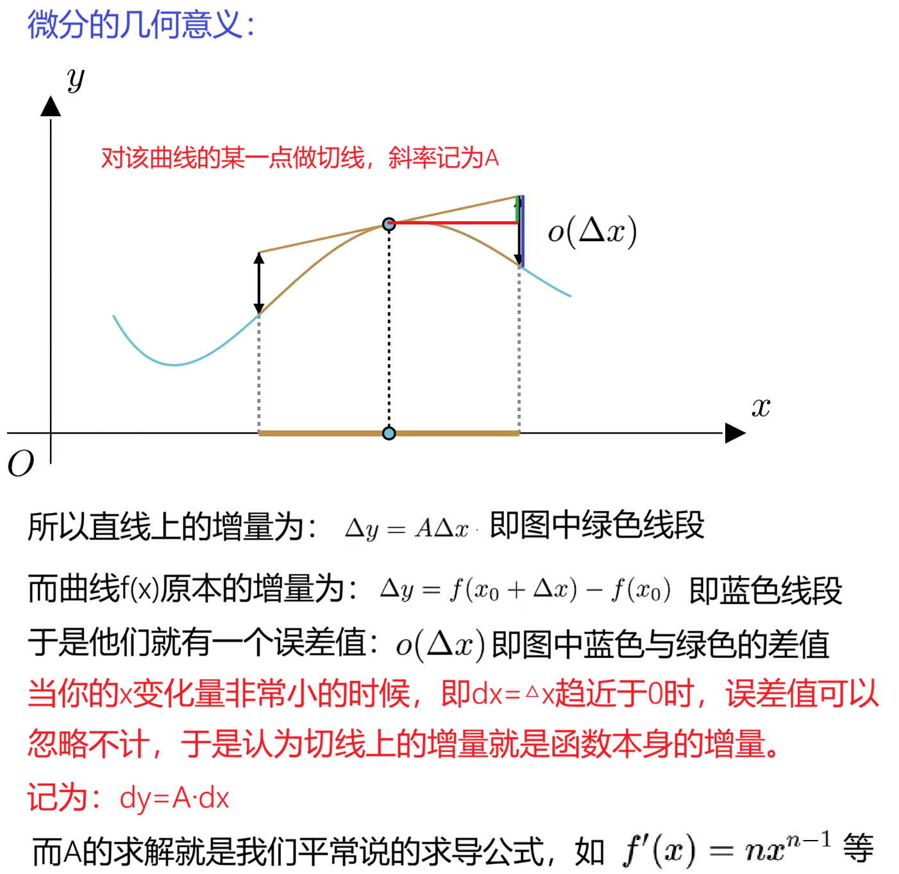

切线方程公式

假设曲线上有一个已知切点 $(x_0, y_0)$，其中 $y_0 = f(x_0)$：

1. 求斜率 $k$：计算切点处的导数 $k = f'(x_0)$。
2. 点斜式公式：$y - y_0 = k(x - x_0)$
3. 切线方程：$$y = f'(x_0)(x - x_0) + f(x_0)$$

这也叫函数在 $x_0$ 处的“一阶泰勒展开”或“局部线性近似”。

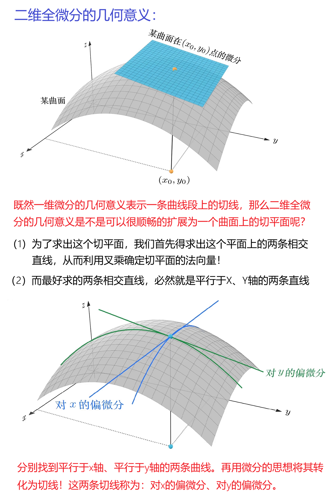

正确的数学术语

1. 这两条切线（图中蓝线和绿线）： 它们分别是函数在 $(x_0, y_0)$ 点，分别沿着平行于 $x$ 轴方向和 $y$ 轴方向的切线。

2. 它们的斜率： 分别称为函数在该点的 $x$ 的偏导数 ($\frac{\partial f}{\partial x}$) 和 $y$ 的偏导数 ($\frac{\partial f}{\partial y}$)。

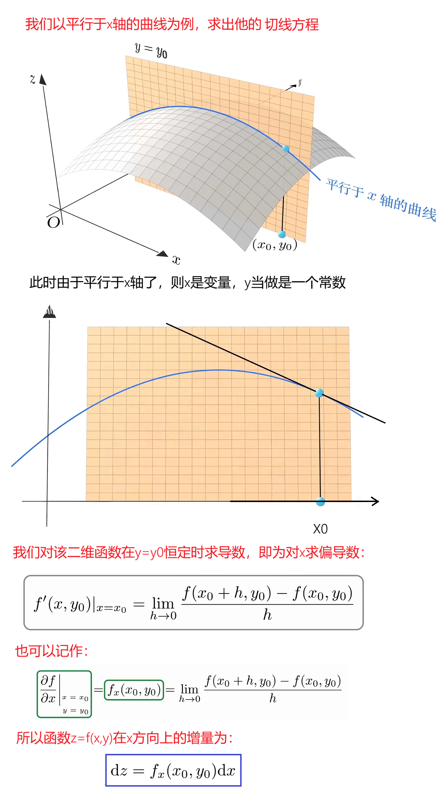

1. 确定起点： 我们在曲面 $z = f(x,y)$ 上选了一个点 $(x_0, y_0, z_0)$。
2. 锁定一个方向： 比如把 $y$ 锁定（比如固定 $y = y_0$），只让 $x$ 变化。
3. 计算高度变化： 沿着 $x$ 轴正方向迈出水平距离 $\Delta x = 1$ 步，高度 $z$ 在切线上跟着改变的量，就是偏导数 $f_x(x_0, y_0)$。
4. 拼出切向量：
    - $x$ 方向走了 $1$
    - $y$ 方向走了 $0$（因为固定了 $y$）
    - $z$ 方向改变了 $f_x(x_0, y_0)$
    - 把这三维的移动拼在一起，就得到了贴着曲面 $x$ 方向的切线向量：

$$\vec{v}_x = \big(1, \; 0, \; f_x(x_0, y_0)\big)$$

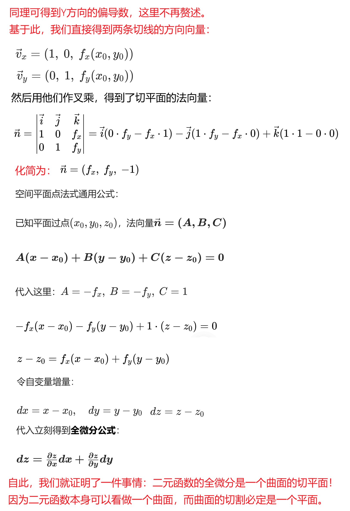

### 梯度

#### 补充偏导数

**导数是一元函数的变化率（斜率）**。导数也是函数，是函数的变化率与位置的关系。

如果是多元函数呢？则为**偏导数**。

**偏导数是多元函数“退化”成一元函数时的导数**，这里“退化”的意思是**固定其他变量的值，只保留一个变量**，依次保留每个变量，则$N$元函数有$N$个偏导数。

以二元函数为例，令$z = f(x, y)$，绘制在3维坐标系如下图所示，

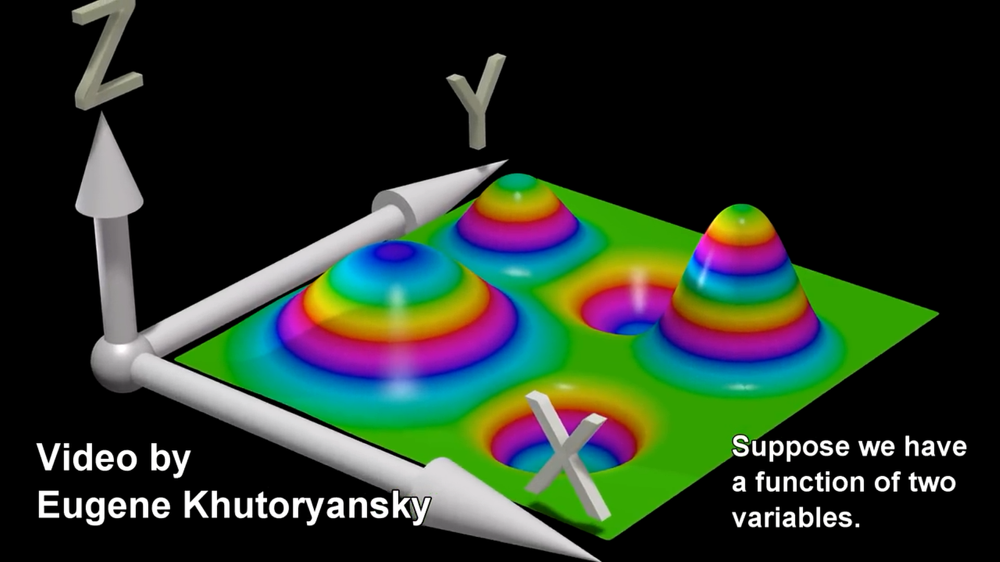

在分别固定$y$和$x$的取值后得到下图中的黑色曲线——“退化”为一元函数，二维坐标系中的曲线——则偏导数 $\frac{\partial z}{\partial x}$ 和 $\frac{\partial z}{\partial y}$ 分别为曲线的导数（切线斜率）。

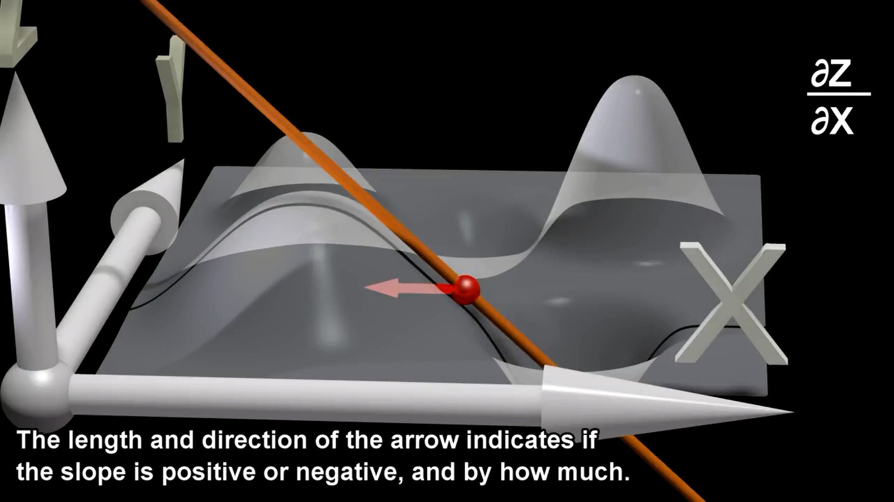

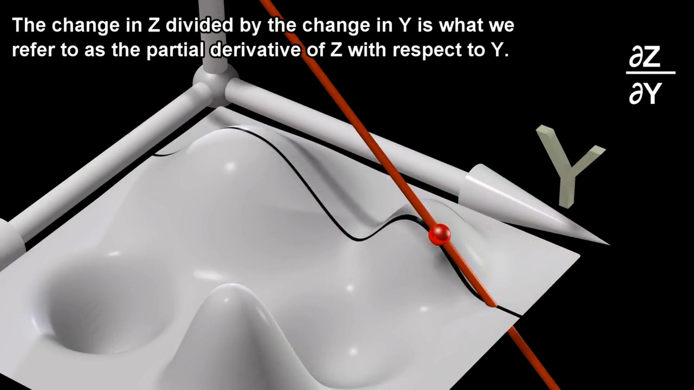

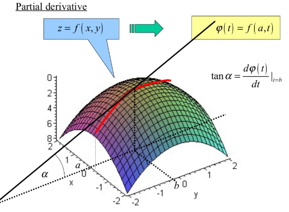

#### 方向导数

如果是方向不是沿着坐标轴方向，而是任意方向呢？则为**方向导数**。如下图所示，点P位置处红色箭头方向的方向导数为黑色切线的斜率，来自链接[Directional Derivative](https://www.geogebra.org/m/Bx8nFMNc)

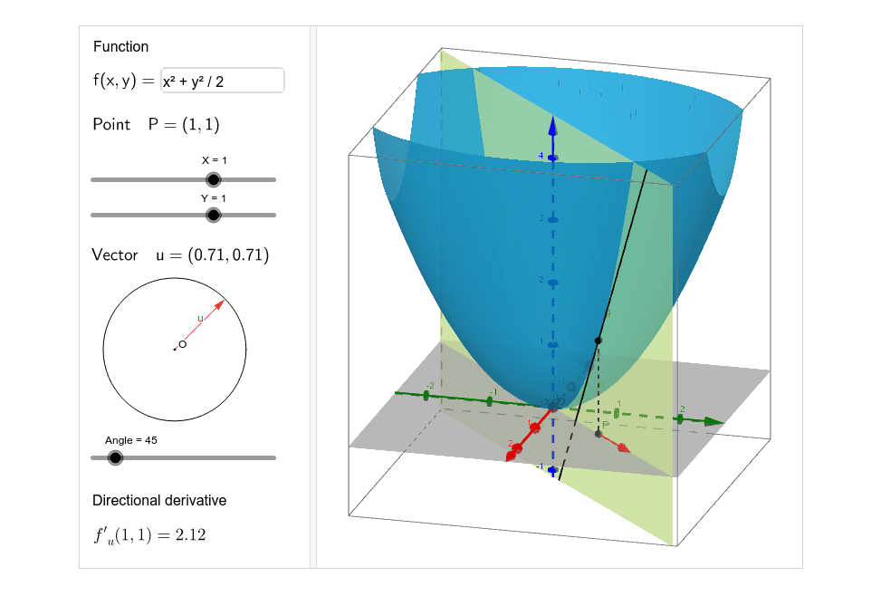

方向导数为函数在某一个方向上的导数。具体地，定义 $xy$ 平面上一点 $(a, b)$ 以及单位向量 $\vec{u} = (\cos \theta, \sin \theta)$。在曲面 $z = f(x, y)$ 上，从点 $(a, b, f(a, b))$ 出发，沿 $\vec{u} = (\cos \theta, \sin \theta)$ 方向走 $t$ 单位长度后，函数值为 $F(t) = f(a + t \cos \theta, b + t \sin \theta)$。则点 $(a, b)$ 处 $\vec{u} = (\cos \theta, \sin \theta)$ 方向的方向导数为：

$$
\begin{aligned}
& \frac{d}{dt} f(a + t \cos \theta, b + t \sin \theta) \big|_{t=0} \\
&= \lim_{t \to 0} \frac{f(a + t \cos \theta, b + t \sin \theta) - f(a,b)}{t} \\
&= \lim_{t \to 0} \frac{f(a + t \cos \theta, b + t \sin \theta) - f(a, b + t \sin \theta)}{t} + \lim_{t \to 0} \frac{f(a, b + t \sin \theta) - f(a,b)}{t} \\
&= \frac{\partial f}{\partial x}(a,b) \frac{dx}{dt} + \frac{\partial f}{\partial y}(a,b) \frac{dy}{dt} \\
&= f_x(a,b) \cos \theta + f_y(a,b) \sin \theta \\
&= (f_x(a,b), f_y(a,b)) \cdot (\cos \theta, \sin \theta)
\end{aligned}
$$

链式法则的体现：我们设：
1. $f = f(x, y)$
2. $x = x(t) = a + t \cos \theta$
3. $y = y(t) = b + t \sin \theta$

那么，根据多元函数链式法则：

$$
\frac{d}{dt} f(x(t), y(t)) \big|_{t=0} = \frac{\partial f}{\partial x} \cdot \frac{dx}{dt} + \frac{\partial f}{\partial y} \cdot \frac{dy}{dt}
$$

上面推导中使用了链式法则。其中，$f_x(a,b)$和$f_y(a,b)$分别为函数在$(a,b)$位置的偏导数。由上面的推导可知：

该位置处，任意方向的**方向导数为偏导数的线性组合，系数为该方向的单位向量**。当该方向与坐标轴正方向一致时，方向导数即偏导数，换句话说，**偏导数为坐标轴方向上的方向导数，其他方向的方向导数为偏导数的合成**。写成向量形式，**偏导数构成的向量为$\nabla f(a,b) = (f_x(a,b), f_y(a,b))$，称之为梯度**。

#### 什么是梯度

梯度，写作 $\nabla f$，二元时为 $(\frac{\partial z}{\partial x}, \frac{\partial z}{\partial y})$，多元时为 $(\frac{\partial z}{\partial x}, \frac{\partial z}{\partial y}, \dots)$。

我们继续上面方向导数的推导，$(a, b)$处 $\theta$ 方向上的方向导数为

$$(f_x(a, b), f_y(a, b)) \cdot (\cos \theta, \sin \theta)$$

$$= |(f_x(a, b), f_y(a, b))| \cdot |1| \cdot \cos \phi$$

$$= |\nabla f(a, b)| \cdot \cos \phi$$

其中，$\phi$ 为 $\nabla f(a, b)$ 与 $\vec{u}$ 的夹角，显然，当 $\phi = 0$ 即 $\vec{u}$ 与梯度 $\nabla f(a, b)$ **同向时，方向导数取得最大值，最大值为梯度的模** $|\nabla f(a, b)|$，当 $\phi = \pi$ 即 $\vec{u}$ 与梯度 $\nabla f(a, b)$ 反向时，**方向导数取得最小值，最小值为梯度模的相反数**。此外，根据上面方向导数的公式可知，在夹角 $\phi < \frac{\pi}{2}$ 时方向导数为正，表示 $\vec{u}$ 方向函数值上升，$\phi > \frac{\pi}{2}$ 时方向导数为负，表示该方向函数值下降。  

至此，方才有了**梯度的几何意义**：

1. 当前位置的梯度方向，为函数在该位置处**方向导数最大的方向**，也是函数值**上升最快的方向**，反方向为下降最快的方向；
2. 当前位置的 **梯度长度(模)** 为最大方向导数的值。

#### 等高线图中的梯度

在讲解各种优化算法时，我们经常看到目标函数的等高线图示意图，如下图所示，来自链接[Gradient and directional derivative on a mountain](https://mathinsight.org/applet/gradient_directional_derivative_mountain)

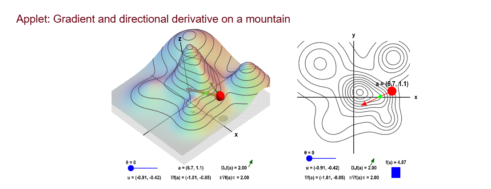

1. 红色向量 (The Red Vector)：梯度 $\nabla f(a)$这是全场最核心的向量，它存在于底部的 $xy$ 平面上。
    - 数学本质： 它是函数在 $a$ 点的梯度 $\nabla f(a) = (f_x, f_y)$。
    - 几何意义： 它是“爬坡最快”的方向。
    - 为什么垂直： 因为它是从等高线上直接“冲”出去的最短路线，所以它必定垂直于等高线（在二维投影面上）。

2. 亮绿色向量 (The Light Green Vector)：方向向量 $\mathbf{u}$这是通过你调节滑块（$\theta$）来控制的向量。
    - 数学本质： 这是一个单位向量 $\mathbf{u} = (\cos\theta, \sin\theta)$。
    - 几何意义： 这是你当前决定行走的“方向”。
    - 调节功能： 当你移动滑块时，这个向量会旋转，改变你相对于梯度（红色）的出发角度。

3. 深绿色向量 (The Dark Green Vector)：
    - 水平距离 $\Delta s$ 是多少？亮绿色向量 $\mathbf{u} = (u_1, u_2)$ 是一个单位向量。它的模长（在地面上走过的水平总距离）是：$$\Delta s = \Vert{}\mathbf{u}\Vert{} = \sqrt{u_1^2 + u_2^2} = 1$$
    - 高度变化量 $\Delta z$ 是多少？沿切线方向的高度变化等于 斜率（导数）$\times$ 水平距离：$$\Delta z = \text{导数} \times \Delta s = D_{\mathbf{u}}f(a) \times 1 = D_{\mathbf{u}}f(a)$$
    - 把水平移动距离控制为了 $1$ 个单位，所以 $\text{导数} \times 1$ 就直接等于了高度的变化量 $\Delta z$！
    
总结三维坐标 $(u_1, \; u_2, \; D_{\mathbf{u}}f(a))$ 的本质这个向量其实就是你在切平面上迈出的 “单位步长切线向量”

梯度与等高线垂直。为什么呢？

等高线，顾名思义，即这条线上的点高度（函数值）相同，令某一条等高线为 $z = f(x, y) = C$，$C$ 为常数，两边同时全微分，如下所示：

$$dz = \frac{\partial f}{\partial x} dx + \frac{\partial f}{\partial y} dy$$

$$= \left(\frac{\partial f}{\partial x}, \frac{\partial f}{\partial y}\right) \cdot (dx, dy)$$

$$= dC = 0$$

这里，两边同时全微分的几何含义是，在当前等高线上挪动任意一个极小单元，等号两侧的变化量相同。$f(x, y)$ 的变化量有两个来源，一个由 $x$ 的变化带来，另一个由 $y$ 的变化带来，在一阶情况下，由 $x$ 带来的变化量为 $\frac{\partial f}{\partial x} dx$，由 $y$ 带来的变化量为 $\frac{\partial f}{\partial y} dy$，两者叠加为 $z$ 的总变化量，等号右侧为常数，因为我们指定在当前等高线上挪动一个极小单元，其变化量为 $0$，左侧等于右侧。进一步拆分成向量内积形式，$\left(\frac{\partial f}{\partial x}, \frac{\partial f}{\partial y}\right)$ 为梯度，$(dx, dy)$ 为该点指向任意方向的极小向量，因为两者内积为 $0$，所以两者垂直。自然不难得出梯度与等高线垂直的结论。

更进一步地，梯度方向指向函数上升最快的方向，在等高线图中，梯度指向高度更高的等高线。

#### 梯度为0

1. 局部极小值（Local Minimum）：碗底。周围全是上坡。

2. 局部极大值（Local Maximum）：山顶。周围全是下坡。

3. 鞍点（Saddle Point）：马鞍中心。向左走上坡，向右走下坡。

### 鞍点Saddle Point

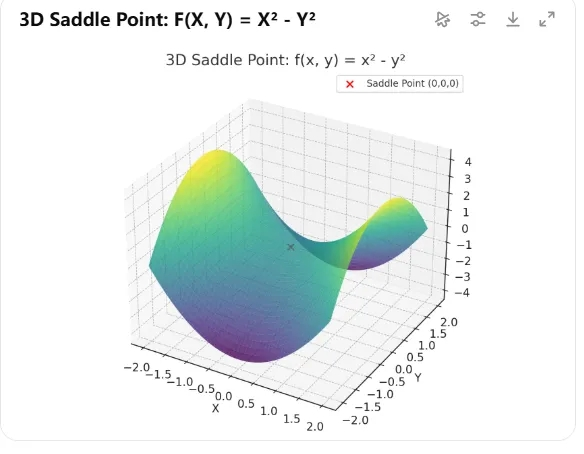

鞍点是地形上的“分水岭”

想象你站在一个马鞍的中心：

1. 从侧面看：马鞍的左右两边是翘起来的，你正站在两座小山包中间的凹陷处，你感觉自己正处于“低谷”。

2. 从前后看：马鞍的前后两边是延伸下去的，你正站在一个悬崖的边缘，从这个角度看，你正处于“山脊”。

所以，它是一个方向性的矛盾点。在某些方向它是谷底，在另一些方向它是山顶。

鞍点是一个点，在这个点上函数的一阶导数为0（梯度为0），但它既不是局部最小点也不是局部最大点。

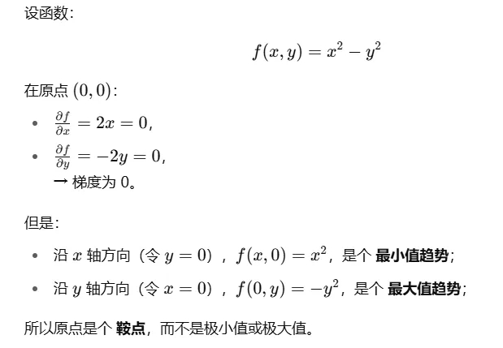

### 误差曲面error surface

也叫做loss surface（损失曲面）

指的是当讲模型的所有参数看作坐标轴，把模型在这些参数下的损失值看作高度，所形成的一个多维曲面。

通常来说，

横轴 → 模型的参数（比如权重 weight、偏置 bias）；

纵轴 → 损失函数的值（比如 MSE、交叉熵）。

我们优化的目标就是在error surface中寻找最低点，也就是损失最小的参数组合。

1. 把“训练”想象成“登山找谷”你现在的目标是把模型调教得最准，这就意味着要让Loss（损失值）越小越好。
    - 参数 ($w, b$) = 经纬度：你可以调整的权重和偏置，就是地图上的坐标。
    - Loss = 海拔高度：模型现在的准确度有多烂，就是海拔。
    - Error Surface（损失曲面） = 整张山地地图：由于参数有很多个，这个地图不是平面的，而是一个高维的复杂地形。
    - 优化目标 = 找谷底：寻找海拔最低的地方（Loss 最小），那就是最优的 $(w, b)$ 参数组合。
    
2. 为什么“难度”不同？地图的“地貌”决定了训练的难易程度：
    - 光滑的山谷：如果你面对的是一个平滑的碗状地形，梯度下降（Gradient Descent） 就像是一个小球，无论你怎么滚，都能直接滚到碗底，这叫“容易优化”。
    - 崎岖的地形：如果地图上到处是“坑”（局部极小值）和“马鞍”（鞍点），梯度下降这个小球就会很惨：
        - 它可能掉进一个小坑就以为到谷底了（被 Local Minima 卡住）。
        - 它可能停在马鞍的中间，因为坡度消失了而卡住（被 Saddle Point 卡住）。
        
3. 优化器的作用（复杂的“登山杖”）
    - 梯度下降（Gradient Descent）：就是那个最简单的球。它只看脚下的坡度，坡度往哪儿低就往哪儿滚。遇到鞍点或者复杂地形，它非常容易“迷路”。
    - 高级优化器（Adam, RMSProp）：它们不仅仅是“滚”，它们还带了“记忆”和“惯性”：
        - 动量（Momentum）：相当于给小球加了一个惯性。遇到那种浅浅的“局部小坑”，它利用惯性直接冲过去，不会掉进去。
        - 自适应学习率（Adaptive Learning Rate）：相当于在陡坡时跑快点，在平坦地形时仔细摸索。这使得它在复杂的“多维地形”中，比单纯的梯度下降更不容易被鞍点卡住。

总结：
1. 局部最小值是山谷，掉进去很难爬出来；
2. 马鞍点是平原上的十字路口，往左是上坡，往右是下坡，你只是刚好站在了平地上，走两步就能继续下山。

### 反函数

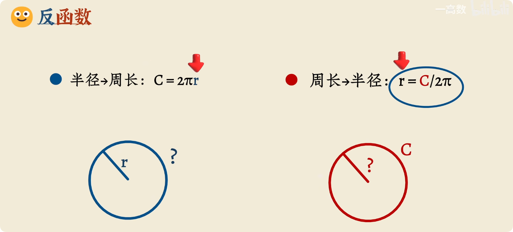

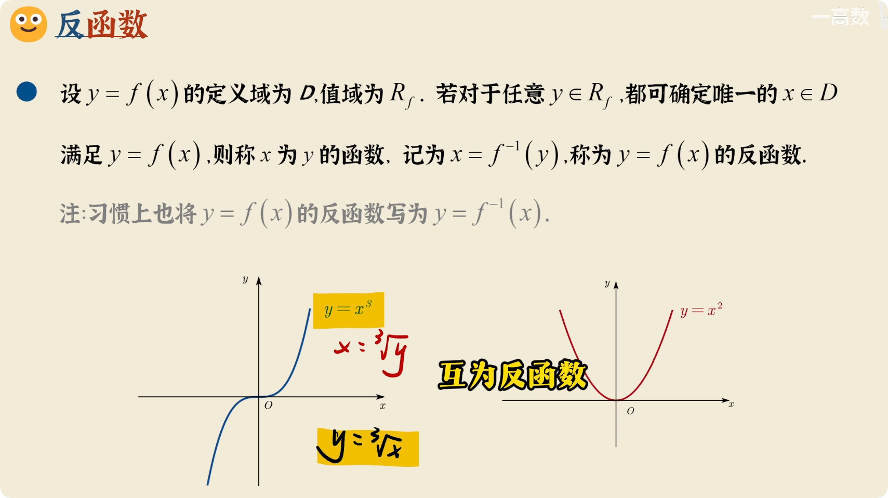

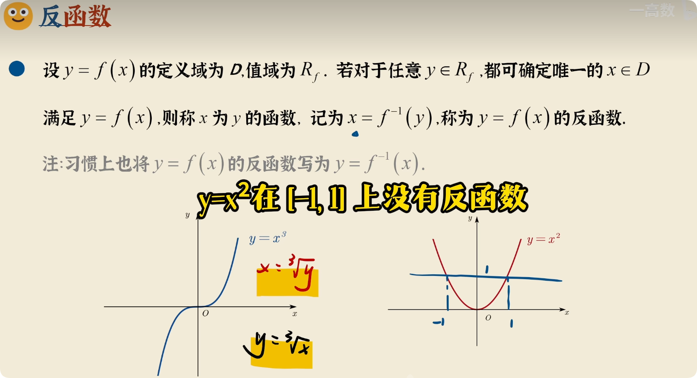

#### 反三角函数

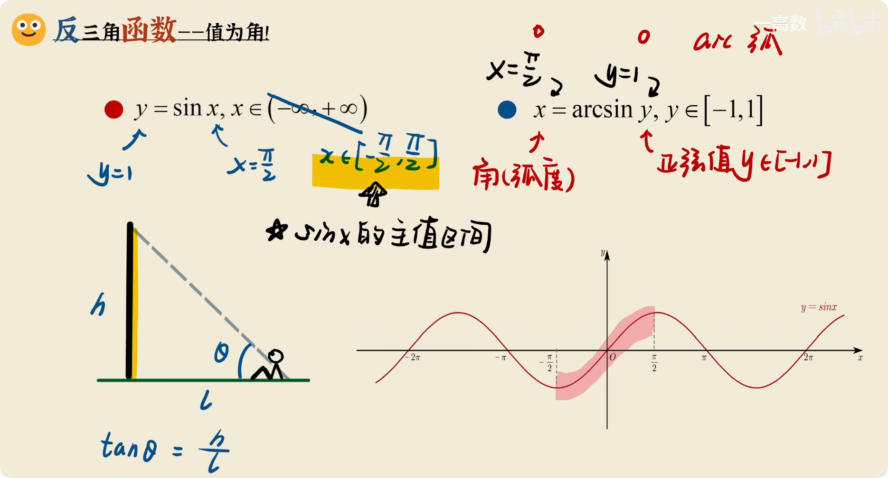

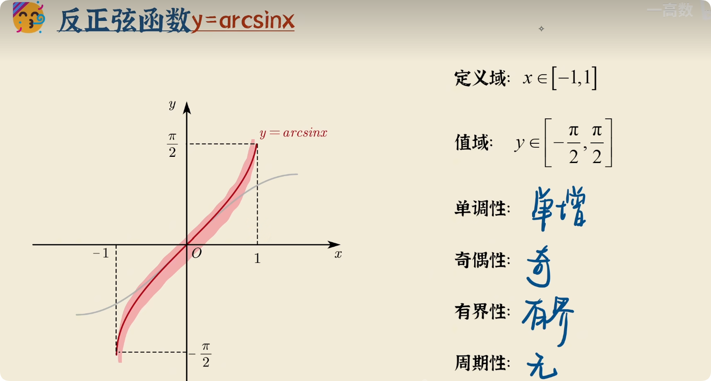

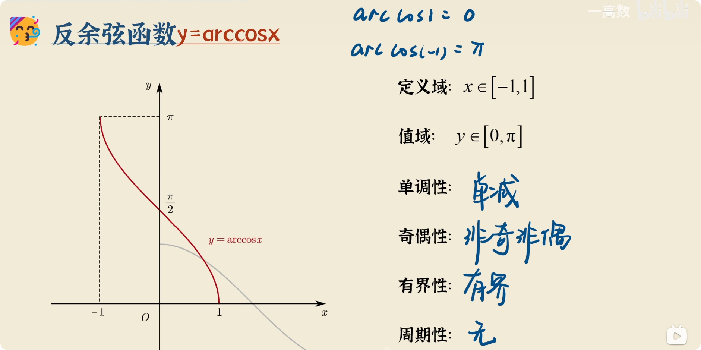

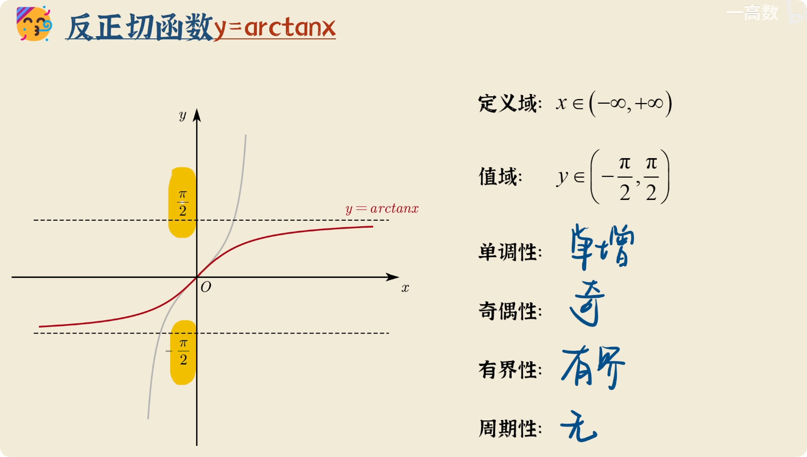

### 标准差

标准差(Standard Deviation/Sigma)，在数学中，标准差通常用希腊字母 $\sigma$（Sigma）表示。它描述的是一组数值相对于平均值的“散开”程度。

**离平均值有多分散，标准差越小，数据越集中；标准差越大，数据越分散。**

#### 如何计算标准差

标准差 ($\sigma$) 的计算过程本质上是求数据点到中心点（平均值）的平均距离。

五步计算法

假设我们有一组简单的数字：2, 4, 4, 4, 5, 5, 7, 9

**第一步计算平均值(Mean)**

把所有数字相加，除以数字的个数。

$$\mu = \frac{2+4+4+4+5+5+7+9}{8} = \frac{40}{8} = 5$$

**第二步计算离差(Deviations)**

算出每个数字与平均值的差（即每个点离中心有多远）：

$2 - 5 = -3$

$4 - 5 = -1$

$7 - 5 = 2$ ...以此类推。

**第三步平方离差(Squared Deviations)**

将上一步得到的差全部平方。为什么要平方？ 为了消除负号（我们只关心距离，不关心方向）。

$(-3)^2 = 9$

$(-1)^2 = 1$

$(2)^2 = 4$ ...

**第四步计算方差(Variance)**

将这些平方后的值加起来，再求平均值。这个结果叫方差 ($\sigma^2$)。

$$\sigma^2 = \frac{9 + 1 + 1 + 1 + 0 + 0 + 4 + 16}{8} = \frac{32}{8} = 4$$

**第五步开平方根(Standard Deviation)·**

对方差开平方根，回到原始单位。

$$\sigma = \sqrt{4} = 2$$

结论：这组数据的标准差是 2。

#### 标准差数学公式

如果你在书上看到这个公式，不要被它吓到，它就是上面五步的缩写：

$$\sigma = \sqrt{\frac{1}{N} \sum_{i=1}^{N} (x_i - \mu)^2}$$

$\sum$：求和符号（对应第三、四步）。

$x_i - \mu$：每个值减去平均值（对应第二步）。

$\sqrt{\quad}$：根号（对应第五步）。

#### 方差

方差（Variance）和标准差（Standard Deviation）都是统计学中用来衡量一组数据离散程度（即数据波动大小、偏离平均值的程度）的指标。

它们最核心的区别在于计算单位和应用场景。

1. 核心区别对比

| 比较维度 | 方差（Variance，σ² 或 S²） | 标准差（Standard Deviation，σ 或 S） |
| :--- | :--- | :--- |
| **定义** | 各数据与均值之差的平方和的平均数 | 方差的算术平方根 |
| **计算单位** | 原始单位的平方（如"人²"） | 与原始数据单位一致（如"人"） |
| **直观性** | 数值被平方放大，不直观 | 与原数据量纲相同，直观可解释 |
| **数学性质** | 可加性好，便于代数推导与运算 | 不可直接相加，但便于比较与解释 |
| **主要用途** | 理论推导、方差分析、PCA 等算法内部 | 业务评估、离散程度描述、误差分析 |

2. 用一个通俗的例子来理解假设某个班级，学生的身高平均值是 170 cm。
    - 计算方差：如果计算出的方差是 25，它的单位是 $cm^2$（平方厘米）。
        - 此时“身高的波动是 25 平方厘米”在直觉上很难理解，因为身高的单位是厘米，无法直接将“170 厘米”和“25 平方厘米”相加减。
    - 计算标准差：将方差开平方，得到标准差为 $\sqrt{25} = 5$ cm。此时单位恢复为 $cm$（厘米）。
        - 你可以非常直观地理解为：“学生的身高大部分在 $170 \pm 5$ cm（即 165 cm 到 175 cm）之间波动”。

3. 数学公式与关系假设有一组数据 $X = \{x_1, x_2, \dots, x_N\}$，均值为 $\mu$：
    - 方差公式：$$\sigma^2 = \frac{1}{N} \sum_{i=1}^{N} (x_i - \mu)^2$$
    - 标准差公式：$$\sigma = \sqrt{\sigma^2} = \sqrt{\frac{1}{N} \sum_{i=1}^{N} (x_i - \mu)^2}$$
    - 为什么公式里要先做“平方”？如果直接将每个数据与均值的差相加，正负偏差会互相抵消（总和始终为 0）。为了消除负号的影响，先进行平方，然后再取平均。这也导致了方差的单位变成了“单位的平方”。
    
4. 总结
    - 标准差是方差开根号的结果，两者表达的数据波动本质是一样的。
    - 做数学计算和算法建模时用“方差”（避免根号，计算方便）；
    - 向人解释数据和评估实际业务时用“标准差”（单位一致，含义直观）。

### 正态分布

### 伯努利分布

伯努利分布（Bernoulli distribution）其实就是概率论里最简单、最基础的“二选一”模型。

用最通俗的话说：它描述的就是“一次实验，只有两种可能结果”的情况。

核心定义

伯努利分布关注的是一个随机变量 $X$，它只有两个取值：1 和 0（或者叫“成功”和“失败”、“是”和“否”、“正面”和“反面”）。

- 发生“成功”（记为 1）的概率是 $p$。
- 发生“失败”（记为 0）的概率就是 $1 - p$。

伯努利分布的概率质量函数可以写成一个非常紧凑的公式：

$$P(X=k) = p^k (1-p)^{1-k} \quad (\text{其中 } k \in \{0, 1\})$$

- 当 $k=1$（成功）时：$P = p^1 (1-p)^0 = p$
- 当 $k=0$（失败）时：$P = p^0 (1-p)^1 = 1-p$

### Hadamard积

Hadamard 积（哈达玛积，Hadamard Product），通俗来说就是“按元素相乘”（Element-wise Multiplication）。

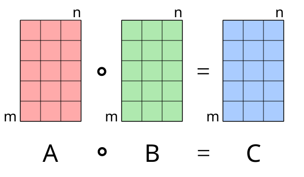

它是两个形状完全相同的矩阵或向量之间最直观、最简单的相乘方式：对应位置的数字直接相乘，不进行任何跨行或跨列的交叉相加。

一个直观的数值例子

假设有两个 $2 \times 2$ 的矩阵 $A$ 和 $B$：

$$A = \begin{bmatrix} 1 & 2 \\ 3 & 4 \end{bmatrix}, \quad B = \begin{bmatrix} 5 & 6 \\ 7 & 8 \end{bmatrix}$$

计算它们的 Hadamard 积 $A \odot B$：

$$A \odot B = \begin{bmatrix} 1 \times 5 & 2 \times 6 \\ 3 \times 7 & 4 \times 8 \end{bmatrix} = \begin{bmatrix} 5 & 12 \\ 21 & 32 \end{bmatrix}$$

数学符号通常写作 $\odot$ 或 $\circ$。

### L2 范数

L2 范数（L2 Norm），简单来说就是空间中向量的“欧几里得距离”（几何直线距离），或者说是向量中所有元素平方和的算术平方根。

它的数学定义公式为：

$$\vert{}\vert{}x\vert{}\vert{}_2 = \sqrt{\sum_{i=1}^{n} x_i^2} = \sqrt{x_1^2 + x_2^2 + \dots + x_n^2}$$

通俗理解（用几何来想）在一维空间（数轴上）：
1. 点 $x$ 到原点的距离就是 $\vert{}x\vert{}$（绝对值）。
2. 在二维空间（平面上）：点 $(x, y)$ 到原点 $(0,0)$ 的距离，根据勾股定理就是 $\sqrt{x^2 + y^2}$。
3. 在高维空间（机器学习模型中）：模型里有成千上万个参数（权重），把这些参数排成一个超高维向量 $w = [w_1, w_2, \dots, w_n]$，它的 L2 范数就是所有参数平方相加再开根号。

### 二阶偏导数

二阶偏导数，简单来说就是：对一个多变量函数，先求一次偏导数，再求一次偏导数。

如果说一阶偏导数衡量的是函数值变化的“速度”（斜率），那么二阶偏导数衡量的就是变化速度的变化率——也就是“加速度”或“曲面的弯曲程度（曲率）”。

我们可以用一个非常贴近生活的开车踏板例子和爬山的例子来彻底搞懂它们三者的关系：

开车踏板：
1. 原函数 $f(t)$：里程表上的数字（位置），假设你在开车，时间用 $t$（秒）表示，里程表上的读数用 $f(t)$（米）表示：
    - $t = 0$ 秒时，里程表显示 0 米。
    - $t = 10$ 秒时，里程表显示 100 米。
    - 原函数 $f(t)$ 记录的就是你某个时刻到底停在路的哪个位置。
2. 一阶导数 $f'(t)$：时速表上的指针（速度），现在你看一眼仪表盘上的时速表（速度计）：
    - 速度告诉你的是：你的位置 $f(t)$ 变化得有多快。
    - 如果速度是 $20\text{ m/s}$，意味着下一秒你的位置会增加 20 米。
    - 如果速度是 $0\text{ m/s}$，意味着你的位置保持不变，车停在原地。
    - 一阶导数 $f'(t)$ 就是速度：它只关心“位置”在这一瞬间变化的快慢。
3. 二阶导数 $f''(t)$：你脚踩踏板的力度（加速度），现在最关键的来了：速度本身也是会变化的！你脚下有两个踏板——油门和刹车：
    - 如果你深踩油门（加速度为正，二阶导数 $f''(t) > 0$）：
        - 时速表指针在往右转（速度从 20 $\to$ 40 $\to$ 60 飙升）。
        - 你的速度在变快。
    - 如果你踩下刹车（加速度为负，二阶导数 $f''(t) < 0$）：
        - 时速表指针在往左回落（速度从 60 $\to$ 40 $\to$ 20 剧降）。
        - 你的速度在变慢。
    - 如果你开着定速巡航（加速度为 0，二阶导数 $f''(t) = 0$）：
        - 时速表指针死死指在 60 一动不动。
        - 你的速度保持恒定（既不变快，也不变慢）。
    - 二阶导数 $f''(t)$ 就是加速度：它不关心你现在开得有多快（那是速度的事），它只关心你的速度是在变快（踩油门）、变慢（踩刹车），还是没变。

| 概念 | 代表什么 | 物理含义 | 对应你开车的动作/状态 |
| :--- | :--- | :--- | :--- |
| **原函数 $f(t)$** | 位置 | 你在哪里 | 里程表显示的公里数 |
| **一阶导数 $f'(t)$** | 速度（位置的变化率） | 走得有多快 | 时速表上的指针数字 |
| **二阶导数 $f''(t)$** | 加速度（速度的变化率） | 速度变化有多剧烈 | **踩油门 (>0)** 还是 **踩刹车 (<0)** |

爬山：

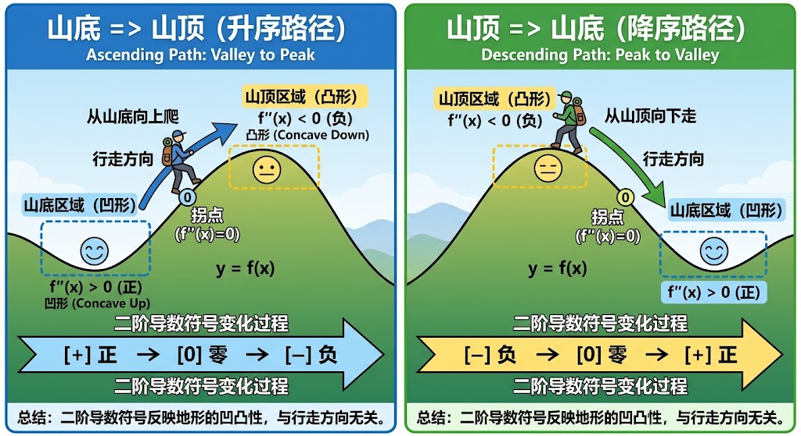

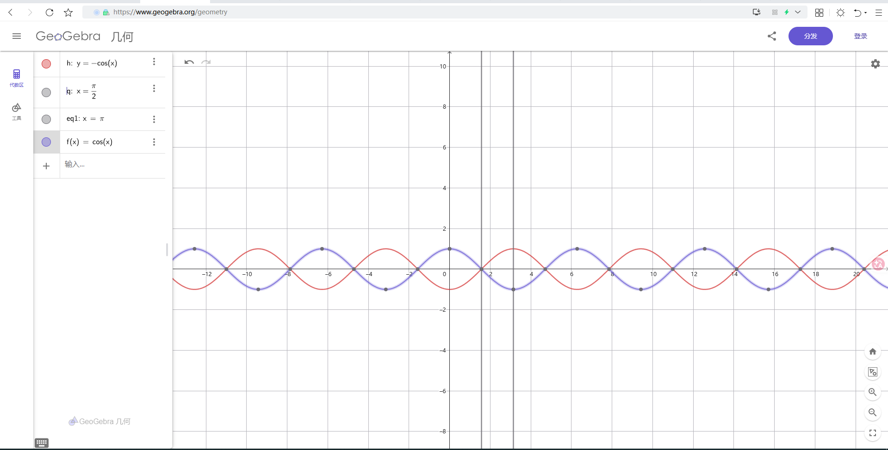

正弦或余弦函数（如 $y = \cos x$ 或 $y = -\cos x$）是这种“山”非常经典且符合的数学模型之一！

如果以余弦函数 $y = -\cos x$ 为例，它的几何性质和图中的形态完全吻合：

1. 为什么余弦/正弦函数非常匹配？我们可以对 $f(x) = -\cos x$ 求导，看看它的变化过程：
    - 原函数 $f(x) = -\cos x$：
        - 在 $x = 0$ 处，谷底最低点（山底凹形，$f''(0) = 1 > 0$）。
        - 在 $x = \frac{\pi}{2}$ 处，半山腰（拐点，$f''(\frac{\pi}{2}) = 0$）。
        - 在 $x = \pi$ 处，山顶最高点（山顶凸形，$f''(\pi) = -1 < 0$）。   
    - 一阶导数（斜率） $f'(x) = \sin x$：
        - 从谷底到山顶（$0$ 到 $\pi$）：斜率一直是正数（$f'(x) > 0$），代表一直在上坡。
        - 在半山腰 $x = \frac{\pi}{2}$ 处：$\sin(\frac{\pi}{2}) = 1$，斜率达到最大值，最陡峭。
    - 二阶导数（凹凸性） $f''(x) = \cos x$：
        - 从谷底到半山腰（$0$ 到 $\frac{\pi}{2}$）：$f''(x) > 0$，凹形，越爬越陡。
        - 半山腰处（$x = \frac{\pi}{2}$）：$f''(x) = 0$，拐点。
        - 从半山腰到山顶（$\frac{\pi}{2}$ 到 $\pi$）：$f''(x) < 0$，凸形，越爬越缓。   
    - 在二阶导数视角（加速度）：二阶导数衡量的是“速度的变化率”（速度是在变快，还是在变慢？）。
        - 在 $x < \frac{\pi}{2}$ 时，车子一直在加速（坡度越来越陡，二阶导数 $> 0$）。 
        - 到了 $x = \frac{\pi}{2}$ 这瞬间，速度达到最高点（速度变化暂时停止，加速度等于 0）！   
        - 过了 $x > \frac{\pi}{2}$ 之后，车子开始减速（坡度开始变缓，二阶导数 $< 0$）。   
        - 速度最快的那一刻（一阶导数最大），加速度（二阶导数）刚好就是 0！

### 导数家族

从纯几何图像（画线条）的角度，来把 0 阶到高阶导数形象化：

1. 0 阶 $f(x)$【点的位置】
    - 几何画法：笔尖落在纸上的那个点的高度 $y$。
    - 直观含义：决定了曲线从哪里出发。
2. 1 阶 $f'(x)$【斜率 / 倾斜方向】
    - 几何画法：笔尖画线时，直尺倾斜的角度。
    - 直观含义：决定了曲线是往右上爬升（$f'>0$）还是往右下俯冲（$f'<0$）。
3. 2 阶 $f''(x)$【弯曲方向与剧烈程度】
    - 几何画法：你手腕旋转直尺、把线转弯的幅度。
    - 直观含义：决定了线条是像碗一样向上凹（$f''>0$），还是像山峰一样向下凸（$f''<0$）。
    - $f''$ 绝对值越大，这个“碗”或“山峰”就越窄、弧度弯得越急。
4. 3 阶 $f'''(x)$【弯曲弧度的变化率 / 是否对称】
    - 几何画法：你在画线时，转动手腕的动作是在变快还是变慢。
    - 直观含义：决定了弧线是不是左右对称的抛物线。
        - 如果 $f''' = 0$：弧度变化是均匀的（比如完美的抛物线 $y=x^2$），左右形状完全对称。
        - 如果 $f''' \neq 0$：弧线一边弯得急，另一边弯得平缓（比如 $y=x^3$），抛物线的对称性被打破了，一头被“拧歪”了。
        - 三阶导数：控制图像从山峰变成碗变得有多快（动态的扭转变化率）。
    - 如何理解，曲线：$y = x^3$，求导：$f'(x) = 3x^2$ $\rightarrow$ $f''(x) = 6x$ $\rightarrow$ $f'''(x) = 6$
        - 在 $x = -1$ 处：
            - 二阶导数 $f''(-1) = -6$（向下凸得很厉害，像个陡峭的山坡）。
        - 当 $x$ 向右移动到 $0$（$\Delta x = 1$）：
            - 因为三阶导数是 $+6$，它给二阶导数加上了 $6$！
            - 二阶导数变成了 $-6 + 6 = \mathbf{0}$（弯曲度消失，变成了平整的拐点）。
        - 当 $x$ 继续向右移动到 $1$（$\Delta x = 1$）：
            - 三阶导数继续输出 $+6$，再给二阶导数加上 $6$！
            - 二阶导数变成了 $0 + 6 = \mathbf{+6}$（扭转成了向上凹的碗状）。
    - 如果改变三阶导数的大小，图像会发生什么变化
        - 函数一：$y = x^3$
            - 三阶导数 $f'''(x) = \mathbf{6}$。
            - 从向下凸转变为向上凹，变化得比较温和、平缓。
        - 函数二：$y = 10x^3$
            - 三阶导数 $f'''(x) = \mathbf{60}$（三阶导数变大了 10 倍！）。
            - 图像变化：它的二阶导数是 $f''(x) = 60x$。只要稍微离开 $x=0$ 一点点（比如 $x=0.1$），二阶导数瞬间就暴涨到了 $6$，曲线会在极短的距离内急剧扭转、陡然变陡！

### 实对称矩阵

实对称矩阵（Real Symmetric Matrix）由两个词组成：
1. 实（Real）：矩阵里的每一个元素都是实数（没有复数 $i$）。
2. 对称（Symmetric）：矩阵关于主对角线（从左上到右下的线）呈镜像对称。

用数学语言表达：矩阵 $A$ 的转置等于它自己，即 $A^T = A$（或者说 $A_{ij} = A_{ji}$）。

直观对比是实对称矩阵：$$A = \begin{bmatrix} \mathbf{1} & \color{red}{2} & \color{blue}{3} \\ \color{red}{2} & \mathbf{4} & \color{green}{5} \\ \color{blue}{3} & \color{green}{5} & \mathbf{6} \end{bmatrix}$$
1. 主对角线是 $1, 4, 6$。
2. 第 1 行 2 列是 $\color{red}{2}$，第 2 行 1 列也是 $\color{red}{2}$。
3. 第 1 行 3 列是 $\color{blue}{3}$，第 3 行 1 列也是 $\color{blue}{3}$。
4. 沿对角线折叠，数字完全重合。

### 二次型

二次型（Quadratic Form） 本质上就是一个只包含二次项的多元二次齐次多项式。
- 没有一次项（没有 $v_1$、$v_2$ 这种单独出现的项）
- 没有常数项（没有不带变量的数字）
- 没有三次或更高次项
- 每一项都是两个变量相乘（可以是同一个变量自己乘自己）
- “齐次”= 每一项的次数都一样高（这里都是 2 次），整齐划一，所以叫“齐次”。

从代数结构上理解，假如有 $n$ 个自变量 $x_1, x_2, \dots, x_n$，二次型就是形如以下格式的代数式：$$f(x_1, x_2, \dots, x_n) = \sum_{i=1}^{n} \sum_{j=1}^{n} a_{ij} x_i x_j$$
    
示例：

- 二元二次型：$f(x_1, x_2) = 2x_1^2 + 4x_1 x_2 + 5x_2^2$
- 三元二次型：$f(x_1, x_2, x_3) = x_1^2 - 3x_2^2 + 2x_3^2 + 6x_1 x_2 - 4x_2 x_3$    
    
为什么写成矩阵形式 $x^T A x$？

在代数运算中，直接展开的多项式很不方便进行旋转、坐标变换和求极值。借助矩阵，我们可以把任意二次型写成统一且紧凑的矩阵乘法结构：

$$f(x) = x^T A x$$

其中：
1. $x = \begin{bmatrix} x_1 \\ x_2 \\ \vdots \\ x_n \end{bmatrix}$ 是自变量构成的列向量。
2. $A$ 是一个 $n \times n$ 的实对称矩阵（$A^T = A$），称为二次型矩阵。

如何将多项式转化为矩阵？

对于 $f(x_1, x_2) = 2x_1^2 + 4x_1 x_2 + 5x_2^2$：

1. 平方项系数（$x_1^2$ 和 $x_2^2$ 的系数 $2$ 和 $5$）直接填在矩阵的主对角线上。
2. 交叉项系数（$x_1 x_2$ 的系数 $4$）平分给非对角线上的元素（各分 $2$），保证矩阵的对称性。

转化后的矩阵表示为：

$$f(x_1, x_2) = \begin{bmatrix} x_1 & x_2 \end{bmatrix} \begin{bmatrix} 2 & 2 \\ 2 & 5 \end{bmatrix} \begin{bmatrix} x_1 \\ x_2 \end{bmatrix}$$

计算过程验证：

$$\begin{bmatrix} 2 & 2 \\ 2 & 5 \end{bmatrix} \begin{bmatrix} x_1 \\ x_2 \end{bmatrix} = \begin{bmatrix} 2x_1 + 2x_2 \\ 2x_1 + 5x_2 \end{bmatrix}$$

$$\begin{bmatrix} x_1 & x_2 \end{bmatrix} \begin{bmatrix} 2x_1 + 2x_2 \\ 2x_1 + 5x_2 \end{bmatrix} = x_1(2x_1 + 2x_2) + x_2(2x_1 + 5x_2) = 2x_1^2 + 4x_1x_2 + 5x_2^2$$

### 矩阵的特征值和特征向量

特征向量，就是矩阵这个线性变换在空间里找到的 **“固定轴线”**（不动方向）。

特征值 $\lambda$，就是空间在这个“固定轴线”方向上被拉伸（或压缩）的倍数。

$\lambda_i$ 表示矩阵的第 $i$ 个特征值（Eigenvalue），下标 $i$ 用来区分矩阵拥有的多个不同特征值（例如一个 $n \times n$ 的方阵最多有 $n$ 个特征值，分别记为 $\lambda_1, \lambda_2, \dots, \lambda_n$）。

核心含义（什么是特征值）

对于一个方阵 $A$，如果存在一个非零向量 $\boldsymbol{x}$ 和一个标量 $\lambda$，使得：

$$A\boldsymbol{x} = \lambda\boldsymbol{x}$$

那么 $\lambda$ 就是矩阵 $A$ 的特征值，$\boldsymbol{x}$ 就是对应的特征向量。

几何直观：矩阵 $A$ 代表一种线性变换。通常情况下，向量经过 $A$ 变换后方向和长度都会改变；但对于特征向量 $\boldsymbol{x}$，经过 $A$ 变换后方向保持不变（或反向），仅仅在长度上拉伸或缩放了 $\lambda$ 倍。

拿具体的数值来看

对于矩阵 $A = \begin{bmatrix} 2 & 2 \\ 2 & 5 \end{bmatrix}$，我们可以算出它的两个特征值和对应的特征向量：

1. 第一个特征方向：$\boldsymbol{x}_1 = \begin{bmatrix} 1 \\ 2 \end{bmatrix}$，对应的特征值 $\lambda_1 = 6$
2. 第二个特征方向：$\boldsymbol{x}_2 = \begin{bmatrix} -2 \\ 1 \end{bmatrix}$，对应的特征值 $\lambda_2 = 1$

我们分别验证一下：

沿特征方向 1：

把向量 $\begin{bmatrix} 1 \\ 2 \end{bmatrix}$ 放入矩阵：

$$\begin{bmatrix} 2 & 2 \\ 2 & 5 \end{bmatrix} \begin{bmatrix} 1 \\ 2 \end{bmatrix} = \begin{bmatrix} 2(1) + 2(2) \\ 2(1) + 5(2) \end{bmatrix} = \begin{bmatrix} 6 \\ 12 \end{bmatrix} = 6 \times \begin{bmatrix} 1 \\ 2 \end{bmatrix}$$

1. 变换前：起点 $(0,0)$ 指向 $(1,2)$，斜率是 $2$。
2. 变换后：起点 $(0,0)$ 指向 $(6,12)$，斜率还是 $\frac{12}{6} = 2$！
3. 几何意义：方向完全没变，只是长度变成了原来的 6 倍 ($\lambda_1 = 6$)。

沿特征方向 2：

把向量 $\begin{bmatrix} -2 \\ 1 \end{bmatrix}$ 放入矩阵：

$$\begin{bmatrix} 2 & 2 \\ 2 & 5 \end{bmatrix} \begin{bmatrix} -2 \\ 1 \end{bmatrix} = \begin{bmatrix} 2(-2) + 2(1) \\ 2(-2) + 5(1) \end{bmatrix} = \begin{bmatrix} -2 \\ 1 \end{bmatrix} = 1 \times \begin{bmatrix} -2 \\ 1 \end{bmatrix}$$

几何意义：方向完全没变，长度放大了 1 倍（即保持原样，$\lambda_2 = 1$）。
 
### 积分

#### 初步理解积分

“微分是无限小的微小变化量（碎片），积分就是把这些微小变化量全都加起来（重新拼合）。”

如果用公式表达，这就是：

$$\text{总量 } y = \int dy = \int f'(x) \, dx$$

为什么说“积分就是把微分加在一起”？我们从符号和实际例子来拆解：
1. $dy$：代表一个极微小的纵向变化量。
2. 符号 $\int$：历史上这个符号其实就是字母 S（Sum，求和）拉长写成的形式。组合起来 
3. $\int dy$：意思就是 $\text{Sum}(dy)$，即“把所有的微小变化量 $dy$ 全部累加起来”。

#### 固定积分和变上限积分和不定积分

设 $f(t) = \frac{t^3}{3}$，其导数为 $f'(t) = t^2$. 

**定积分（固定积分）**

$$\int_0^2 f'(t)\,\mathrm{d}t = \left[ f(t) \right]_0^2 = f(2)-f(0) = \frac{8}{3}-0 = \frac{8}{3}$$

1. “定”的是啥：固定的是积分区间 $[0, 2]$（下限 $0$ 固定，上限 $2$ 固定）。
2. 结果是什么：是一个具体的数值（代表确定的累积总量/面积）。

**变上限积分**

$$\int_a^x f'(t)\,\mathrm{d}t = \left[ f(t) \right]_a^x = f(x)-f(a) = \frac{x^3}{3} - \frac{a^3}{3}$$

1. “变”的是啥：变的是积分区间的上限（下限 $a$ 固定，上限是变量 $x$）。
2. 结果是什么：是一个关于 $x$ 的确定的函数（代表累积总量随终点 $x$ 变化的规律）。

**不定积分**

$$\int f'(t)\,\mathrm{d}t = f(t)+C = \frac{t^3}{3}+C$$

1. “不定”的是啥：没有上下限，不确定的是常数 $C$。
2. 结果是什么：是一个带 $+C$ 的函数族（代表所有导数为 $t^2$ 的原函数）。

#### 初步理解微积分基本定理

这两个性质统称为微积分基本定理（Fundamental Theorem of Calculus），本质上揭示了微分（求导）与积分是一对互逆运算。

##### 第一基本定理变上限积分求导定理

微积分第一基本定理（First Fundamental Theorem of Calculus，也常称为变上限积分求导定理）揭示了微分与积分是互逆运算的关系。

简单来说，它的核心思想是：如果对一个连续函数求积分得到累积量，再对这个累积量求导，就会变回原来的函数。

**正向：先积分，再求导 $\rightarrow$ 变回原函数**

数学表达 

若 $f$ 在 $[a,b]$ 上连续，定义变上限积分函数：

$$G(x) = \int_a^x f(t) \, dt \quad (x \in [a,b])$$

则 $G(x)$ 在 $[a,b]$ 上可导，且其导数为：

$$G'(x) = \frac{d}{dx} \left( \int_a^x f(t) \, dt \right) = f(x)$$

核心数学本质： 先积分，再求导 $\rightarrow$ 还原为被积函数 $f(x)$ 本身。

证明了连续函数必定存在原函数，且变上限积分本身就是一个原函数。

##### 第二基本定理牛顿-莱布尼茨公式

微积分第二基本定理（Second Fundamental Theorem of Calculus，也常称为牛顿-莱布尼茨公式）揭示了微分与积分是互逆运算的关系。

简单来说，它的核心思想是：如果对一个函数先求导得到变化率，再对这个变化率求积分，就会变回原函数在起点和终点之间的总增量。

**反向：先求导，再积分 $\rightarrow$ 变回原函数的增量**

数学表达 

若 $f$ 在 $[a,b]$ 上连续，$F$ 是 $f$ 在 $[a,b]$ 上的任意一个原函数（即满足 $F'(x) = f(x)$），则：

$$\int_a^b f(x) \, dx = F(b) - F(a)$$

核心数学本质： 先求导，再积分 $\rightarrow$ 还原为原函数 $F(x)$ 的端点增量。

建立了定积分（无穷项和的极限）与不定积分（原函数）之间的代数运算桥梁。

### 多项式

多项式 = 由常数、变量（如 $x$）和正整数次幂，用加减乘组合起来的式子。

标准形式
$$a_n x^n + a_{n-1} x^{n-1} + \dots + a_1 x + a_0$$

其中：
1. $a_n, a_{n-1}, \dots, a_0$：系数（常数，如 2、-3、0.5）
2. $x$：变量
3. $n$：次数（最高次幂）
4. $a_n \neq 0$

求导和积分极度顺滑：
1. 对多项式求导：$\frac{d}{dx}(x^n) = n x^{n-1}$（次方往下落，次数减 1）。
2. 对多项式积分：$\int x^n dx = \frac{1}{n+1} x^{n+1} + C$（次数加 1，除以新次数）。

### 二次多项式

二次多项式 $P_2(x) = c_0 + c_1 x + c_2 x^2$

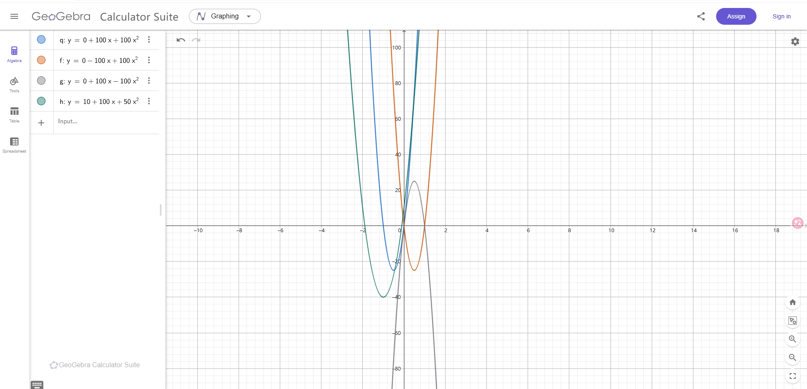

1. $c_0$：管“起点高度”（高度/零阶）
    - 求导/代入：当 $x=0$ 时，$P(0) = c_0$。   
    - 几何含义：图像与 $Y$ 轴的交点高度（纵截距）。
    - 作用效果：
        - 改变 $c_0$ 的大小，抛物线的形状和开口方向完全不变，只是在垂直方向上整体向上或向下平移。
2. $c_1$：管“中心倾斜度”（斜率/一阶）求导/代入：
    - 求一阶导数得 $P'(x) = c_1 + 2c_2 x$，在 $x=0$ 处一阶导数 $P'(0) = c_1$。   
    - 几何含义：曲线在 $x=0$ 点（$Y$ 轴交点处）的切线斜率。   
    - 作用效果：
        - $c_1 = 0$：顶点刚好就在 $Y$ 轴上（极值点在 $x=0$，顶部或底部是平的）。   
        - $c_1 > 0$：经过 $Y$ 轴时，曲线正在往右上攀升。
        - $c_1 < 0$：经过 $Y$ 轴时，曲线正在往右下俯冲。
        - $c_1$ 还会和 $c_2$ 共同决定抛物线的顶点左右位置，顶点横坐标为 $x = -\frac{c_1}{2c_2}$。
3. $c_2$：管“开口方向与弯曲剧烈程度”（弯曲度/二阶）
    - 求导/代入：求二阶导数得 $P''(x) = 2c_2$。   
    - 几何含义：抛物线的开口朝向与张口宽窄（弯曲剧烈程度）。
    - 作用效果：
        - $c_2 > 0$：二阶导数大于 0，开口向上，像个“碗”（凹函数）。
        - $c_2 < 0$：二阶导数小于 0，开口向下，像个“山峰”。
        - $\vert{}c_2\vert{}$ 越大：开口越窄，弯曲得越急剧陡峭；
        - $\vert{}c_2\vert{}$ 越小，开口越宽，弯曲得越平缓。

### 三阶多项式

$$P_3(x) = c_0 + c_1 x + c_2 x^2 + c_3 x^3$$

1. $c_0, c_1, c_2$：锁死中心点 $x=0$ 处的局部状态
    - $c_0$（零阶，高度）：
        - $P_3(0) = c_0$   
        - 管什么：图像在 $x=0$ 点的垂直高度（整体上下平移）。
    - $c_1$（一阶，斜率）：
        - $P_3'(0) = c_1$   
        - 管什么：曲线穿过 $Y$ 轴时的倾斜角度（往右上爬还是往右下冲）。   
    - $c_2$（二阶，弯曲度）：
        - $P_3''(x)=2c_2+6c_3x$
        - $P_3''(0) = 2c_2$   
        - 管什么：曲线在 $x=0$ 点这一瞬间的弯曲弧度。   
            - $c_2 > 0$ 说明在 $x=0$ 处是个向上凹的“碗弧”；
            - $c_2 < 0$ 说明在 $x=0$ 处是个向下凸的“山峰弧”。   
    - $c_3$（三阶，弯曲度的变化率 / 拐点主导者）：
        - $P_3'''(x)=6c_3$
        - $P_3'''(0) = 6c_3$
        - 管什么：
            - 极远处（大范围）的最终走向：当 $\vert{}x\vert{}$ 足够大时，$x^3$ 项占据绝对主导权。$c_3 > 0$ 时，曲线呈现经典的“左下到右上”（S 型）延伸；$c_3 < 0$ 时，呈现“左上到右下”延伸。
            - 二阶弯曲度的变化速度：$c_2$ 只决定了 $x=0$ 这一瞬间的弯曲状态，而 $c_3$ 决定了这个弯曲弧度沿 $x$ 轴移动时改变得有多快（即二阶导数 $P_3''(x) = 2c_2 + 6c_3x$ 的斜率）。
            - 控制拐点（Inflection Point）的位置：拐点发生在二阶导数为零处（$P_3''(x) = 0$），解得：
            - $$x_{\text{拐}} = -\frac{c_2}{3c_3}$$
            - 这说明 $c_3$ 直接拉动拐点脱离原点。若 $c_3 = 0$，函数退化为抛物线（没有拐点）；一旦 $c_3 \neq 0$，曲线必然会在 $x = -\frac{c_2}{3c_3}$ 处完成“凹凸性”的转变（从“碗”变成“山峰”，或反之）。

### 泰勒级数

[微积分的本质 - 10 - 泰勒级数](https://www.bilibili.com/video/BV1Gx411Y7cz)

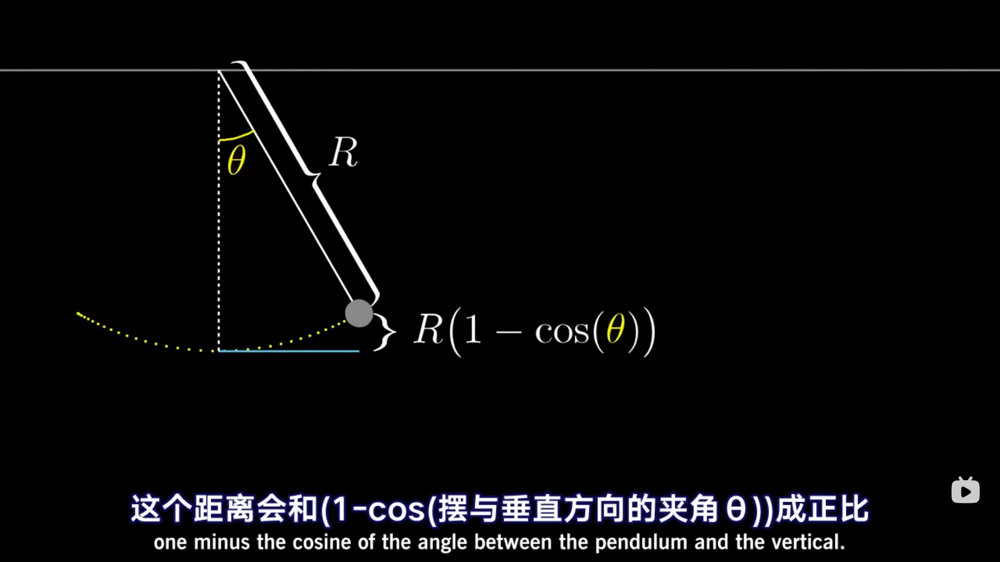

摆球离开最低点（平衡位置）的垂直高度表达式为：$$h(\theta) = R(1 - \cos\theta)$$

推导与说明

1. 悬挂点到最低点的距离：摆线全长为 $R$，当摆球在最低点时，距悬挂点的垂直距离为 $R$。
2. 悬挂点到当前位置的垂直距离：当摆角为 $\theta$ 时，摆球在垂直方向上的投影长度为 $R\cos\theta$。
3. 抬高的高度：两者的差值即为摆球相对于最低点抬高的高度 $h$：$$h = R - R\cos\theta = R(1 - \cos\theta)$$

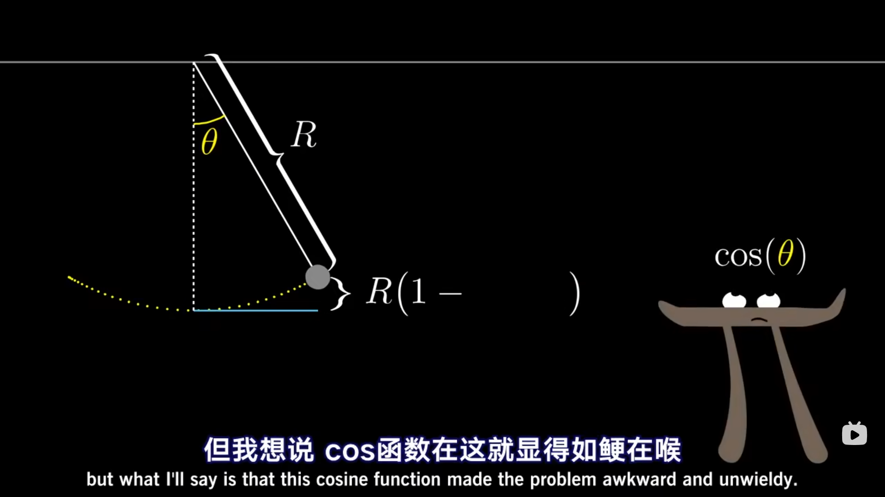

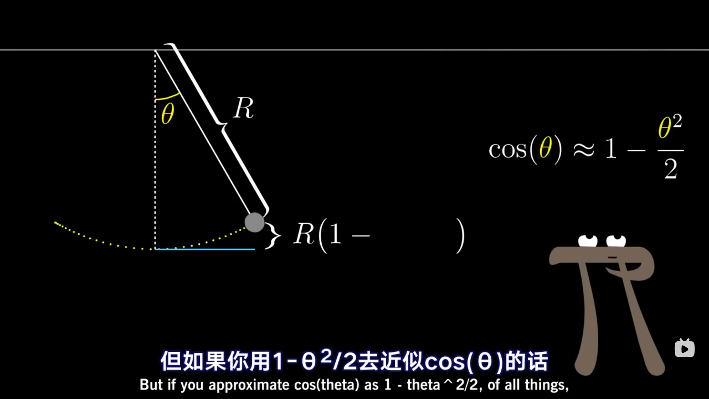

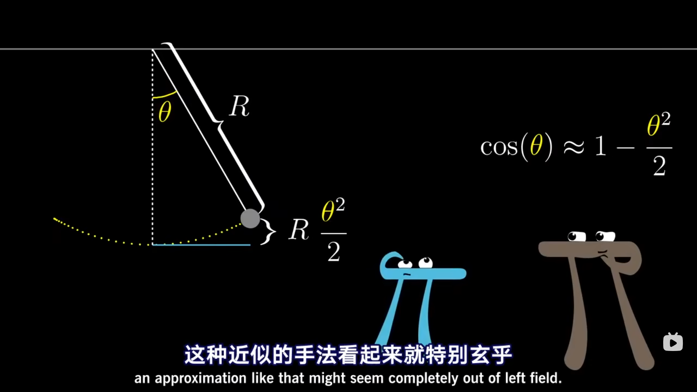

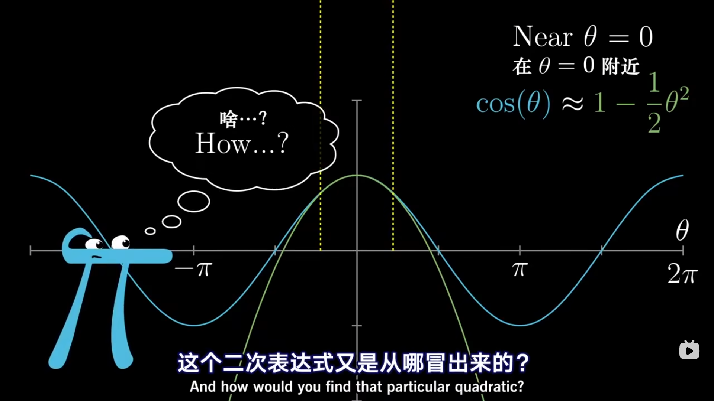

我们学习泰勒级数很大程度上就是为了在某个点附近，用多项式函数去近似其他函数。

个中缘由就在于多项式可比别的函数要友好得多。

它又好计算，又好求导，还好积分。

求导和积分极度顺滑：
1. 对多项式求导：$\frac{d}{dx}(x^n) = n x^{n-1}$（次方往下落，次数减 1）。
2. 对多项式积分：$\int x^n dx = \frac{1}{n+1} x^{n+1} + C$（次数加 1，除以新次数）。

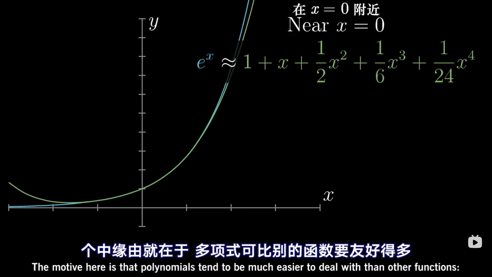

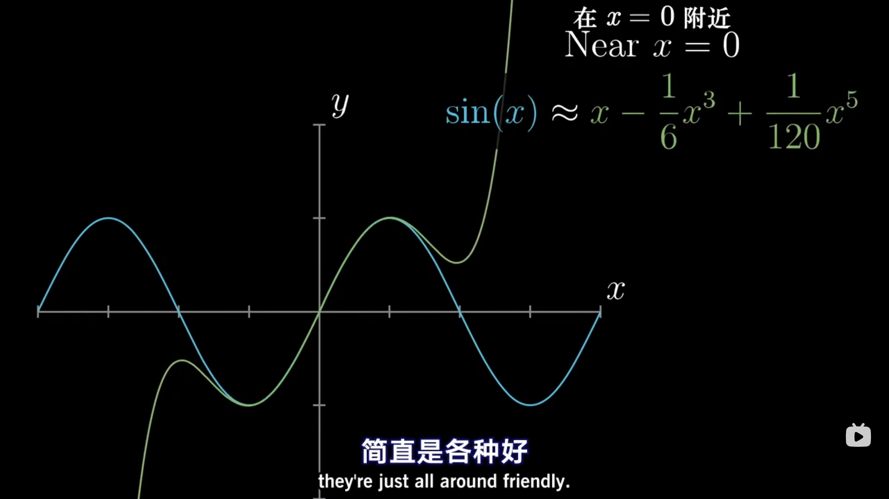

#### 余弦函数在$x=0$处如何用二次多项式近似

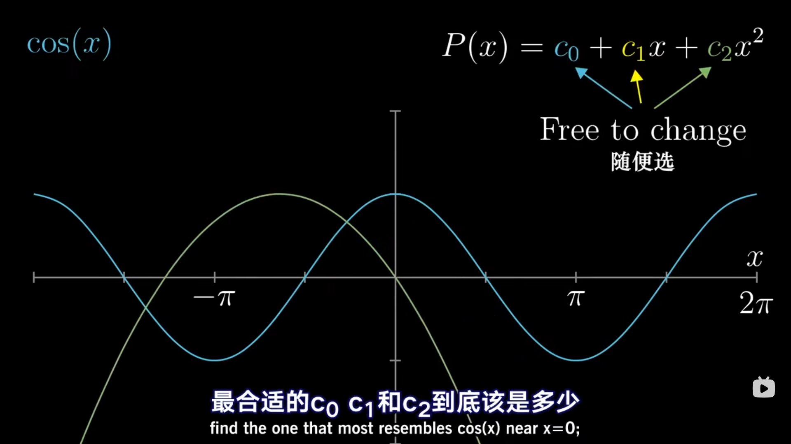

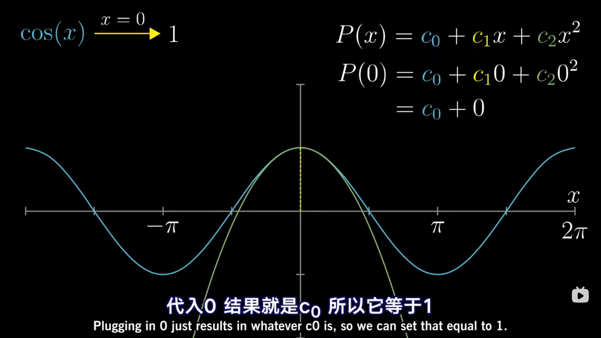

在$x$等于0时，如果我们让函数的切线斜率也能和$cos(x)$相等，那岂不美哉。

不这样做，近似函数的值在离$x = 0$处很近的地方就会有明显偏差了。

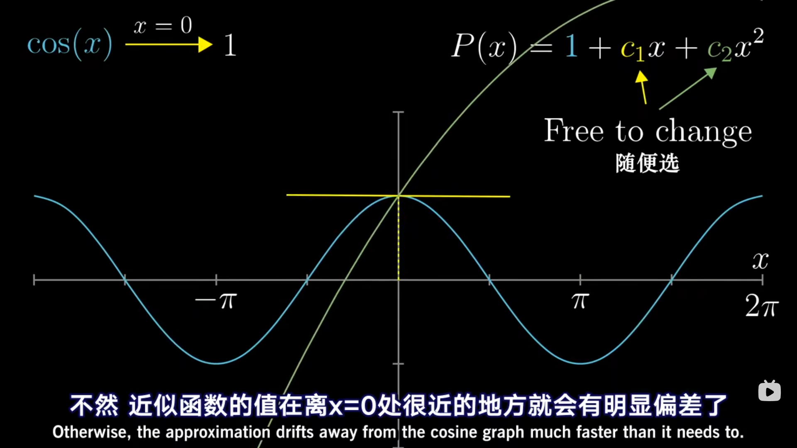

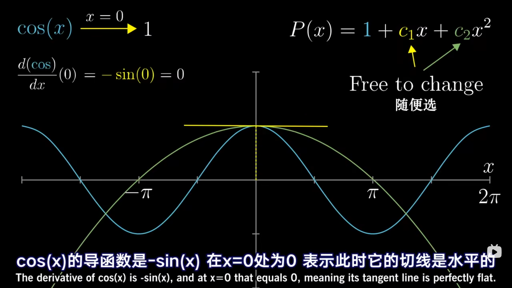

我们近似函数的导数则为$c1 + 2c2x$，再代入$x = 0$，得到$c1$，即常数$c1$掌控着我们在$x = 0$处对导数的近似。

让$c1=0$，我们的近似函数的导数就也变成了0。

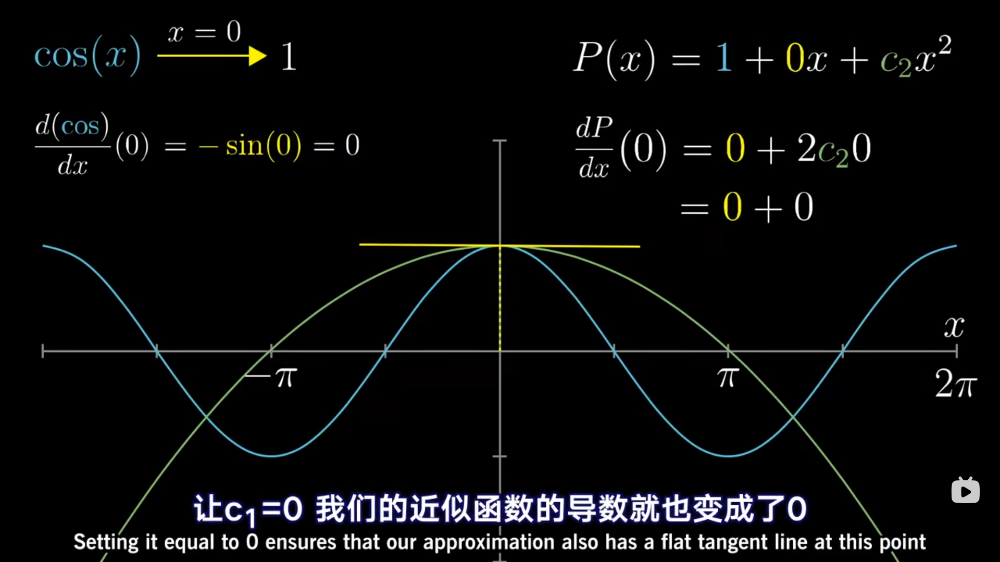

这个时候就剩下$c2$了。

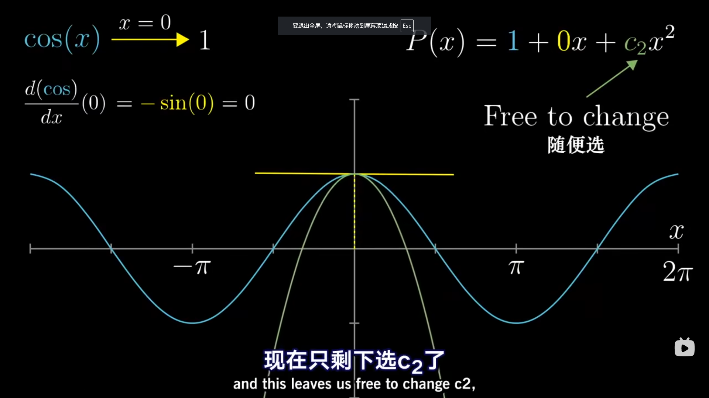

由于它在$x=0$处的函数值和斜率都已经给定死了。

对 $P(x) = 1 + c_2 x^2$ 算二次求导：

$$P''(x) = 2c_2$$

二阶导数 $P''(x) = 2c_2$ 告诉我们：抛物线在任何位置的二阶导数（弯曲程度）都是一个常数，且完全由 $c_2$ 控制（因为 $2$ 是正常数，不会改变符号大小）。

因为 $c_2$ 与二阶导数 $P''$ 同号，所以 $c_2$ 的正负和数值大小，就直接代表了函数的凹凸性（开口方向）和弯曲剧烈程度：

1. $c_2 > 0$ $\implies P'' > 0$ $\implies$ 函数向上凹（开口向上，像个碗）。

2. $c_2 < 0$ $\implies P'' < 0$ $\implies$ 函数向下凸（开口向下，像个山峰）。

3. $\vert{}c_2\vert{}$ 越大 $\implies \vert{}P''\vert{}$ 越大 $\implies$ 抛物线开口越窄、弯曲得越剧烈；$\vert{}c_2\vert{}$ 越小，抛物线就越平缓。

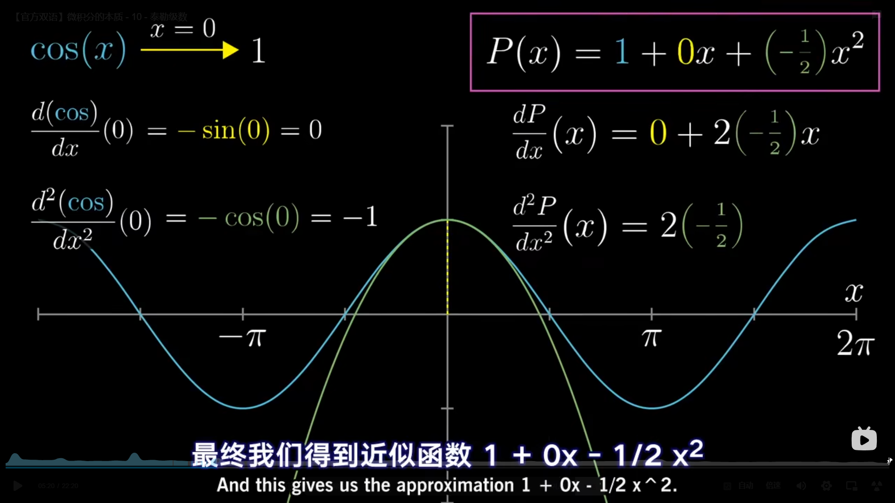

$\cos(x)$ 函数在 $x=0$ 处的二阶导数计算出来是：

$$\frac{d^2(\cos)}{dx^2}(0) = -\cos(0) = -1$$

代表 $\cos(x)$ 在顶点的向下弯曲程度是 $-1$。 

二次多项式 $P(x)$ 两次求导后得到 $2c_2$。当把 $c_2 = -\frac{1}{2}$ 代入后，计算结果是：

$$\frac{d^2 P}{dx^2}(x) = 2 \left(-\frac{1}{2}\right) = -1$$

代表多项式 $P(x)$ 的弯曲程度也被调成了 $-1$。

最终我们得到近似函数 $1 + 0x - 1/2 x^2$

$$\cos(x) \approx 1 - \frac{1}{2}x^2 \quad (\text{在 } x=0 \text{ 附近})$$

#### 加3次幂项近似没用

为什么用多项式去逼近 $\cos(x)$ 时，加了三次项 $x^3$ 却没有带来任何改变。

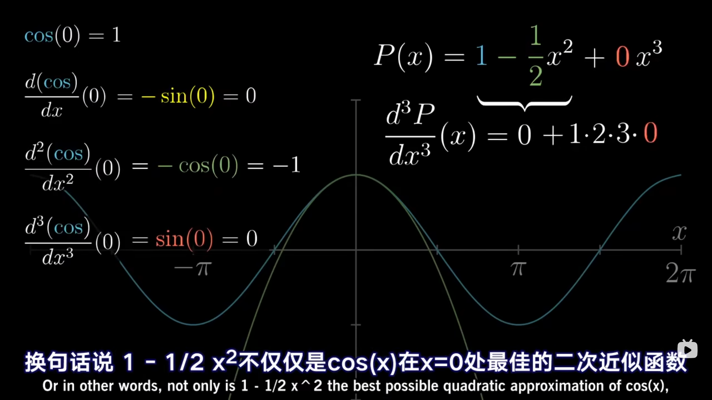

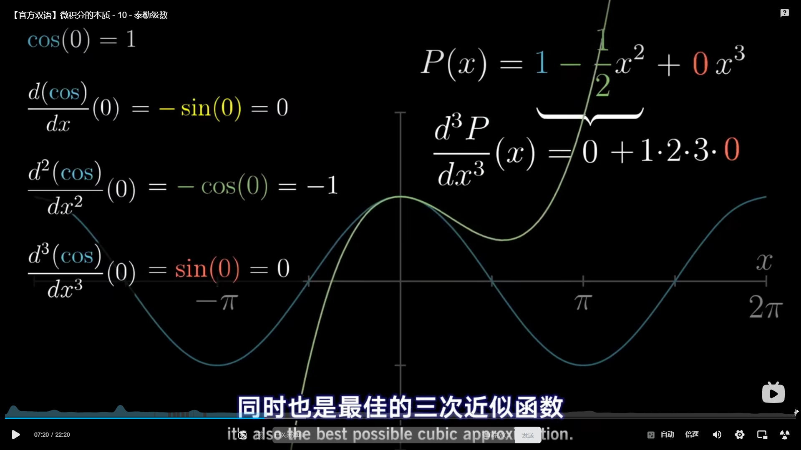

1. 左侧：$\cos(x)$ 在 $x=0$ 处的“基因信息”（求导），为了用多项式匹配 $\cos(x)$ 在 $x=0$ 附近的形状，我们需要让多项式在 $x=0$ 处的各阶导数与 $\cos(x)$ 完全一致：
    - 0阶（函数值/高度）：$\cos(0) = 1$   
    - 1阶（斜率）：$\left.\frac{d\cos}{dx}\right\vert{}_{x=0} = -\sin(0) = 0$（波峰处是平的）   
    - 2阶（弯曲度/凹凸性）：$\left.\frac{d^2\cos}{dx^2}\right\vert{}_{x=0} = -\cos(0) = -1$（开口向下的“山峰弧”）   
    - 3阶（弯曲度改变速率）：$\left.\frac{d^3\cos}{dx^3}\right\vert{}_{x=0} = \sin(0) = 0$（对称点没有三阶扭曲量）   

2. 右侧：三次多项式 $P(x)$ 的系数匹配，假设我们构建一个三次逼近多项式 $P(x) = c_0 + c_1 x + c_2 x^2 + c_3 x^3$：   
    - 匹配 0 阶得 $c_0 = 1$   
    - 匹配 1 阶得 $c_1 = 0$   
    - 匹配 2 阶得 $c_2 = -\frac{1}{2}$（因为二次导数求导会拉出一个 $2!$，即 $2c_2 = -1 \Rightarrow c_2 = -\frac{1}{2}$）   
    - 匹配 3 阶：$P(x)$ 对 $x$ 求三次导数后得到 $\frac{d^3 P}{dx^3} = 1 \cdot 2 \cdot 3 \cdot c_3 = 6c_3$。为了让它等于 $\cos(x)$ 的三阶导数 $0$，解得 $c_3 = 0$。

3. 结论与延伸这就是图中字幕所说的：“$1 - \frac{1}{2}x^2$ 不仅仅是 $\cos(x)$ 在 $x=0$ 处最佳的二次近似函数，它同时也是最佳的三次近似函数。”   

#### 加4次幂项近似有用

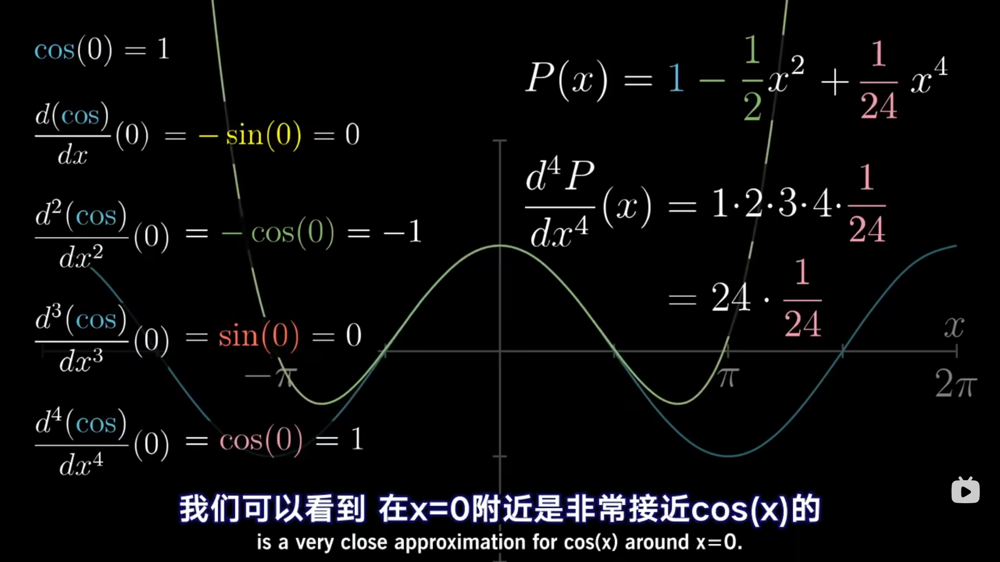

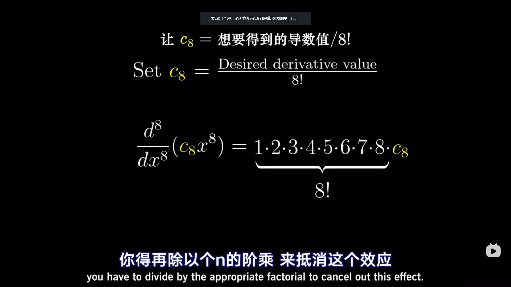

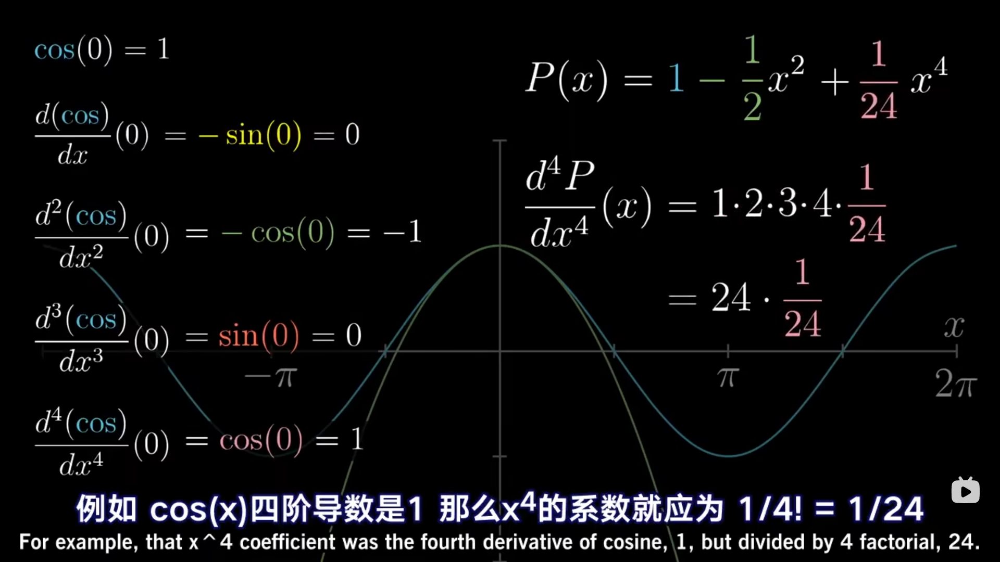

**“高次项的引入，绝不会破坏已经调好的低阶导数”（即高次项不影响低次项）**。

这是因为我们代入的是$x=0$，那么三次及以上的项的二阶导数中，因为带有$x$，所以最后都会变成0。

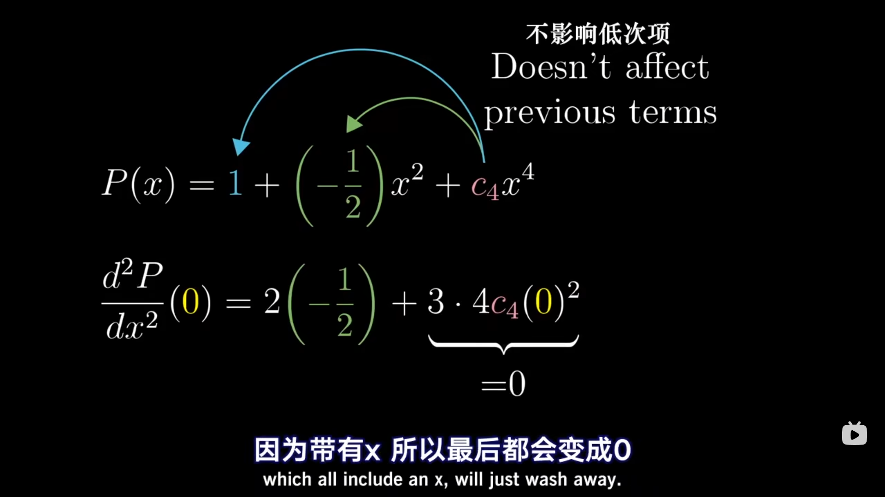

**如果我们想以任意点（例如 $x=\pi$）为中心来精准逼近函数，该怎么做**

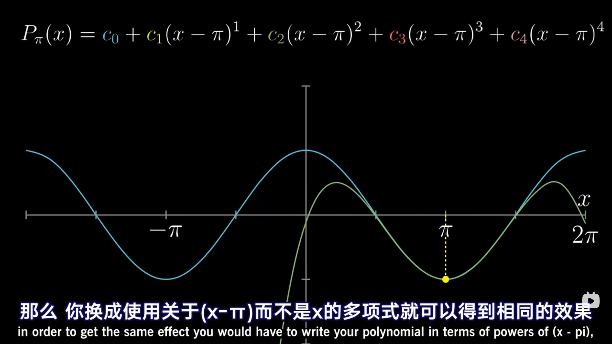

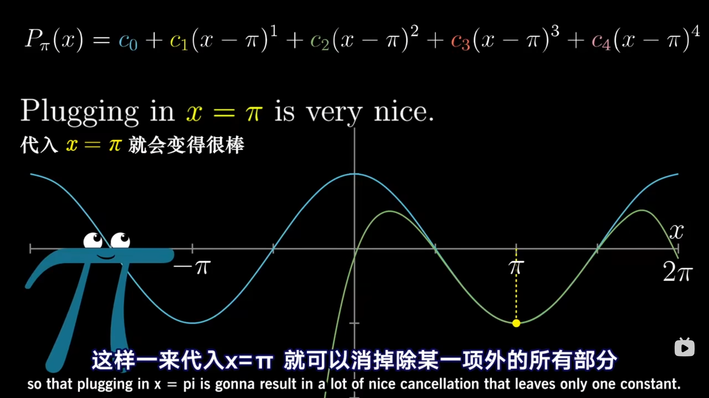

#### 余弦函数的泰勒多项式

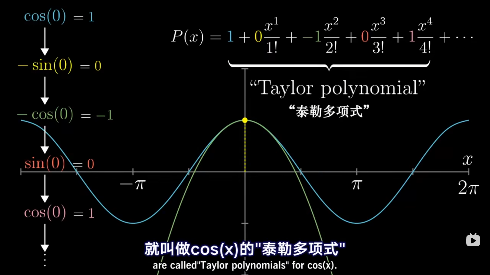

#### 任何函数的泰勒多项式

这个公式就是数学中最著名的 泰勒级数（Taylor Series），或者叫 麦克劳林级数（Maclaurin Series）（当展开点在 $x=0$ 时，泰勒级数特称为麦克劳林级数）。

$$P(x) = f(0) + \frac{df}{dx}(0)\frac{x^1}{1!} + \frac{d^2f}{dx^2}(0)\frac{x^2}{2!} + \frac{d^3f}{dx^3}(0)\frac{x^3}{3!} + \dots$$

每一个系数 $c_n$ 都不再是随意凑出来的，而是严格满足：

$$c_n = \frac{f^{(n)}(0)}{n!}$$

从几何图像上看，这就像给多项式装上了无数个极度精确的“几何控制开关”：

1. $f(0)$（0阶）：锁定黄点在 $Y$ 轴上的位置（高度）。   
2. $\frac{df}{dx}(0)$（1阶）：锁定曲线经过黄点时的倾斜角度（斜率）。   
3. $\frac{d^2f}{dx^2}(0)$（2阶）：锁定曲线在黄点处的弯曲方向与剧烈程度（碗状还是山峰状）。   
4. $\frac{d^3f}{dx^3}(0)$（3阶）：锁定曲线在黄点处的S形扭转速度与左右不对称性。   
5. 高阶导数 $\frac{d^nf}{dx^n}(0)$：控制更深层、更复杂的多重波峰波谷弯曲形态。

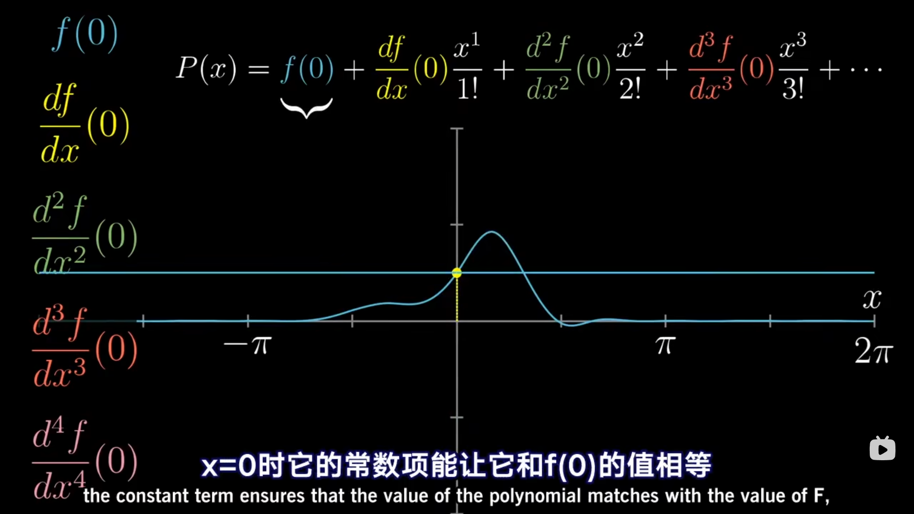

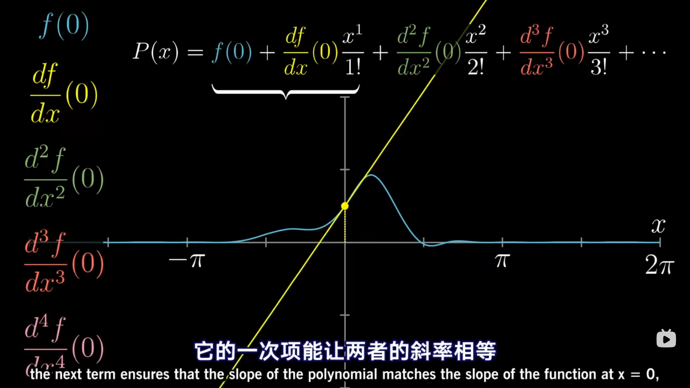

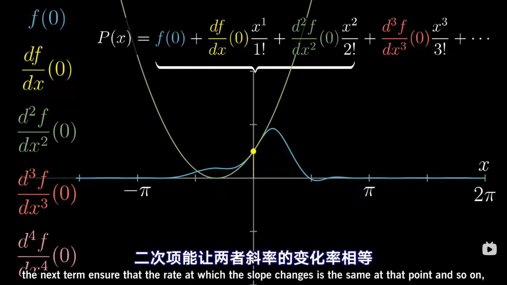

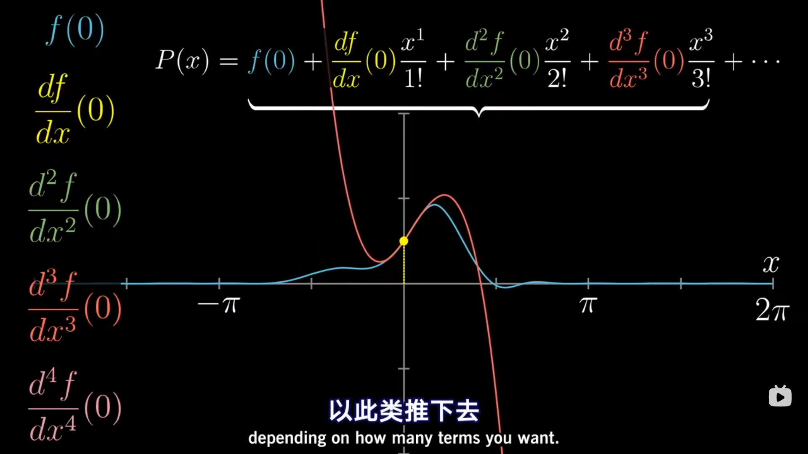

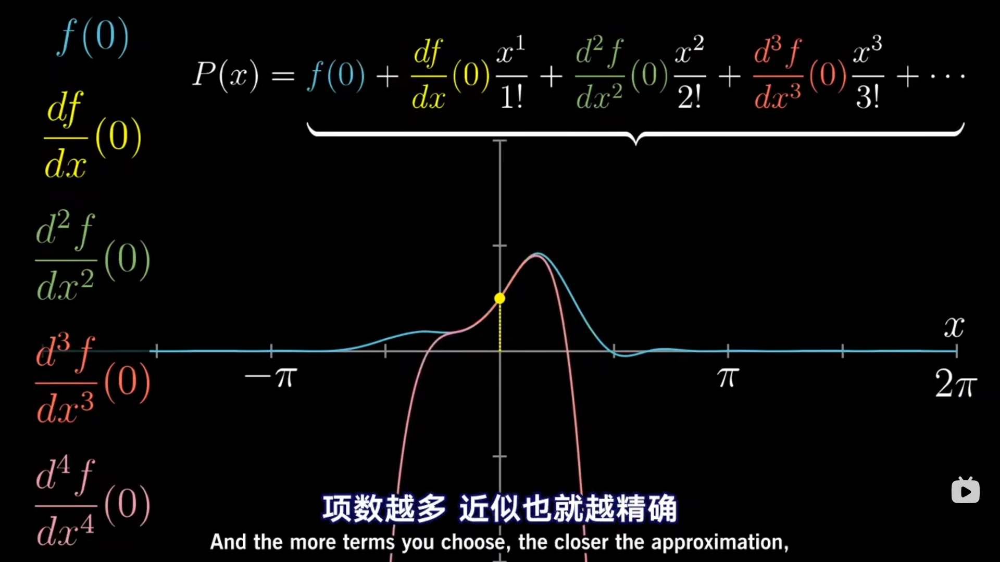

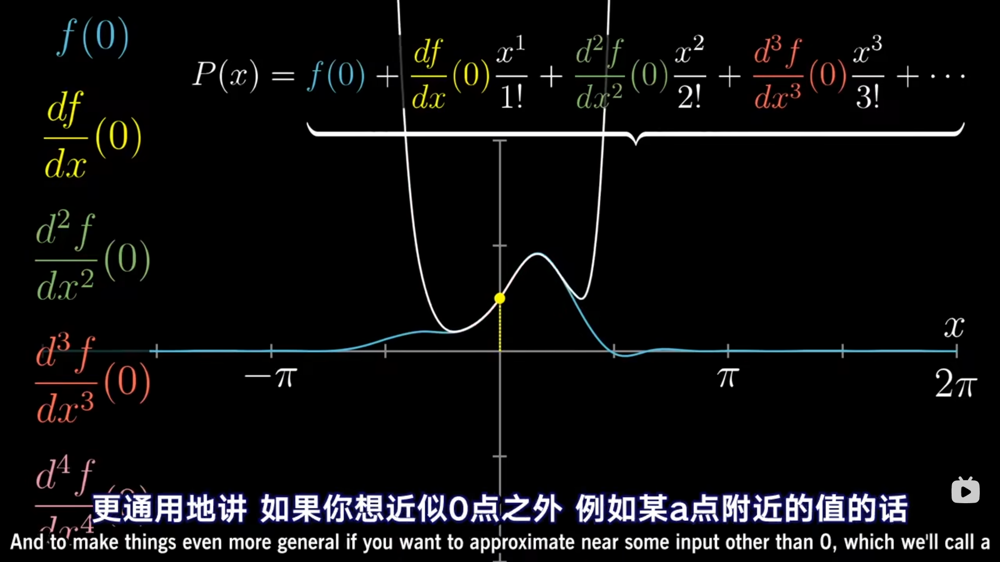

#### 二阶泰勒展开

为什么不直接算 $f(x)$，非要用泰勒展开？

核心一句话：“能直接算 $f(x)$”本身就是一个奢侈的错觉——绝大多数真实场景里，你要么根本拿不到 $f$ 的完整公式，要么直接算成本极高，而泰勒展开是唯一能用“少量局部信息”撬动附近近似值的方法。

如果定义 $f_{\text{area}}(x)$ 为曲线下从起点到 $x$ 的累积面积：

1. 基础面积（蓝色大块）：$f_{\text{area}}(a)$
    - 这是自变量为 $a$ 时已经算好的基准面积。
2. 矩形部分（黄色长条）：$\frac{d f_{\text{area}}}{dx}(a)(x - a)$
    - 高度是曲线在 $a$ 点的值 $f(a)$（即面积变化率 $\frac{d f_{\text{area}}}{dx}$）。
    - 宽度是变化量 $(x - a)$。
    - 面积就是经典的“长方形”近以：$\text{高} \times \text{底}$。
3. 小三角形部分（粉色顶角）：$\frac{1}{2}\frac{d^2 f_{\text{area}}}{dx^2}(a)(x - a)^2$
    - 因为曲线有弯曲（存在二阶导数/变化率的变化），长条顶端不是平的，多出了一个近似三角形的小角。
    - 底（Base）：$\Delta x = (x - a)$
    - 高（Height）：变化率变化量 $= \frac{d^2 f_{\text{area}}}{dx^2}(a) \cdot (x - a)$
        - $\text{高（斜率增加总量）} = \underbrace{\frac{d^2 f}{dx^2}(a)}_{\text{每走 1 单位距离，斜率增加多少}} \quad \times \quad \underbrace{(x - a)}_{\text{一共走了多少单位距离}}$
    - 三角形面积公式：$\frac{1}{2} \times \text{底} \times \text{高} = \frac{1}{2} \frac{d^2 f_{\text{area}}}{dx^2}(a) (x - a)^2$

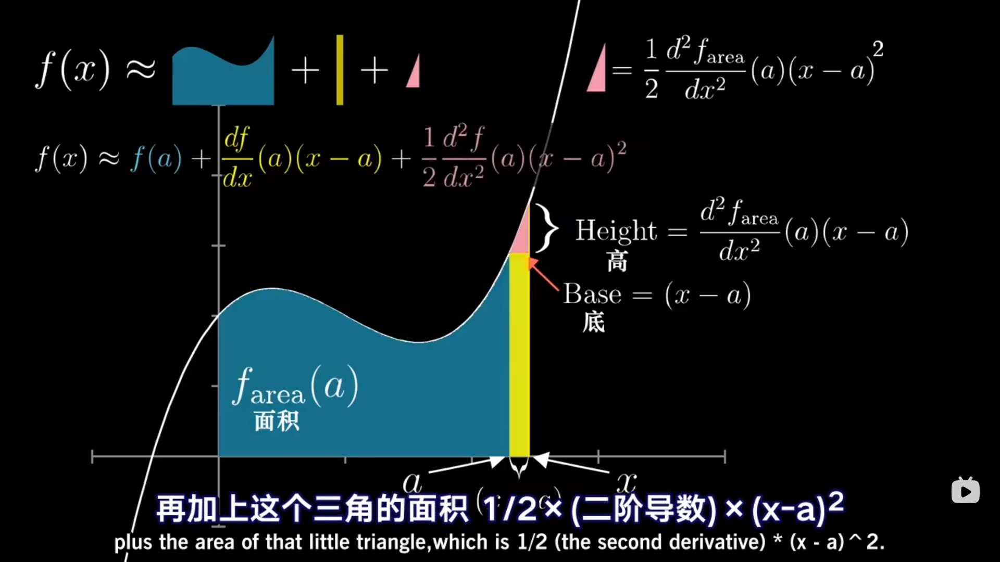

二阶泰勒展开式（在展开点 $x=a$ 处）就是只保留到二次项：

$$f(x)\approx P_2(x)=f(a)+f'(a)(x-a)+\frac{f''(a)}{2!}(x-a)^2$$

其中 $2!=2$，所以写成：

$$\boxed{f(x)\approx f(a)+f'(a)(x-a)+\frac{1}{2}f''(a)(x-a)^2}$$

### 正定和负定和不定矩阵

要透彻理解正定矩阵（Positive Definite）、负定矩阵（Negative Definite） 和 不定矩阵（Indefinite），最好的方式就是把它们跟高数里的“曲面凹凸性”和“多元函数的极值”结合起来。

其实你刚讨论完的“一阶/二阶导数与函数凹凸性”，就是理解定性矩阵的完美钥匙！

一、 核心直觉：多元函数的“二阶导数”

在一维函数 $y = f(x)$ 中：

1. 二阶导数 $f''(x) > 0$（正）$\to$ 图形是凹形（谷底），开口向上，有极小值。
2. 二阶导数 $f''(x) < 0$（负）$\to$ 图形是凸形（山顶），开口向下，有极大值。

当扩展到多元函数 $z = f(x, y)$（三维曲面）时，只凭一个标量 $f''(x)$ 已经不够用了，我们用一个对称矩阵（Hessian Matrix）来代表“所有方向上的二阶导数”。

而正定、负定、不定，本质上就是**这个“二阶导数矩阵”在告诉你：在这个点朝各个方向走，曲面到底是向上弯、向下弯，还是乱弯？**

对于多元函数 $z = f(x,y)$，只看某一个方向（比如对 $x$ 或对 $y$）的一元二阶偏导数 $f_{xx}$ 或 $f_{yy}$，确实“啥也无法确定”！必须把所有偏导数（$f_{xx}, f_{yy}$）和交叉偏导数（$f_{xy}$）组合成二次型矩阵 $\vec{x}^T A \vec{x}$，才能判断整个曲面的真实形状。

用下面函数来举例，可以在[geogebra](https://www.geogebra.org/calculator) 中输入`If(-2 <= x <= 2 && -2 <= y <= 2, x^2 - y^2)`，可视化：

$$f(x,y) = x^2 - y^2 \quad \text{定义域限制在 } [-2,2] \times [-2,2]$$

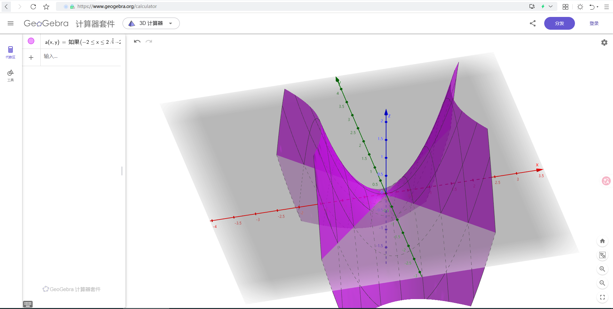

对于 $f(x,y) = x^2 - y^2$：

1. 只沿着 $X$ 轴切一刀（看 $y=0$）：
    - 截面方程是 $z = x^2$，二阶导 $f_{xx} = 2 > 0$。这告诉你：沿着正东-正西方向走，曲面是向上弯曲（凹）的。
2. 只沿着 $Y$ 轴切一刀（看 $x=0$）：
    - 截面方程是 $z = -y^2$，二阶导 $f_{yy} = -2 < 0$。这告诉你：沿着正南-正北方向走，曲面是向下弯曲（凸）的。
    
如果只看 $X$ 轴和 $Y$ 轴，你确实已经发现了它“一上一下”的马鞍趋势。

但是！如果曲面被旋转了一个角度呢？

想象我们把这个马鞍面沿 $z$ 轴顺时针旋转 45 度，得到一个新的函数 $g(x,y) = 2xy$：

下图中的z1和g是同一个函数，后者使用了`geogebra`自身的旋转功能。

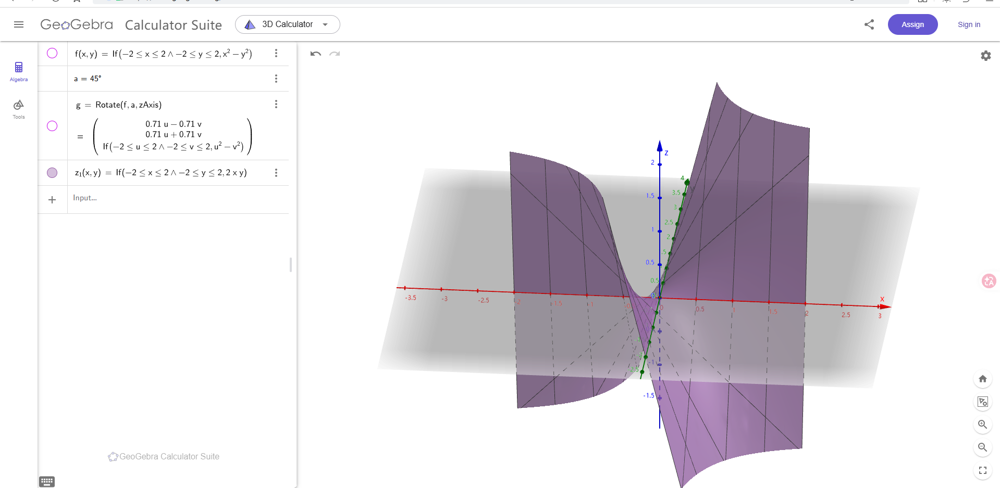

只看 $g_{xx}$ 和 $g_{yy}$：

1. 如果你只测 $g_{xx} = \frac{\partial^2}{\partial x^2}(2xy) = 0$
2. 如果你只测 $g_{yy} = \frac{\partial^2}{\partial y^2}(2xy) = 0$

$g_{xx} = 0$ 和 $g_{yy} = 0$ 只能说明“在正东-正西、正南-正北这两个特定方向上，斜率没有变化”，仅此而已，它绝对无法说明整个曲面是平的，也无法判断它是什么形状。

如果只看这两个数据，你甚至连这到底是一个平平无奇的“平面”，还是一个剧烈扭曲的“马鞍面”，都分不出来。

