- [OpenGL](#opengl)
- [OpenGL ES](#opengl-es)
- [EGL](#egl)
- [ANGLE](#angle)
- [GLFW](#glfw)
- [标准化设备坐标系](#标准化设备坐标系)
- [坐标系](#坐标系)
  - [笛卡尔坐标系](#笛卡尔坐标系)
  - [齐次坐标](#齐次坐标)
  - [概述](#概述)
    - [局部坐标系/物体坐标系](#局部坐标系物体坐标系)
    - [世界坐标系](#世界坐标系)
    - [观察坐标系/视觉坐标系](#观察坐标系视觉坐标系)
    - [裁剪坐标系](#裁剪坐标系)
    - [屏幕坐标系](#屏幕坐标系)
- [网格(Mesh)](#网格mesh)
- [摄像机](#摄像机)
- [视图变换矩阵](#视图变换矩阵)
- [投影](#投影)
  - [正交投影](#正交投影)
  - [正交投影矩阵](#正交投影矩阵)
  - [透视投影](#透视投影)
  - [透视投影矩阵](#透视投影矩阵)

### OpenGL 

​​`Khronos Group​​`制定和维护`OpenGL`​( ​​Open Graphics Library​​)​规范​​(Specification)，严格定义每个函数的输入、输出和行为。理论上任何人都可以按照这些规范实现一套`OpenGL`库，就像标准`C`库有很多不同的实现一样，比如`SwiftShader`就是一个基于`CPU`的纯软件的`OpenGL`实现。如果要想使用`GPU`硬件，一般是`GPU`设备制造商(NVIDIA, AMD, Intel)来实现这些`API`，这些库也被称为GPU驱动。

`OpenGL`只负责**绘图**，不负责创建程序窗口，不负责处理键盘/鼠标等交互事件，不负责应用应该如何初始化OpenGL上下文。

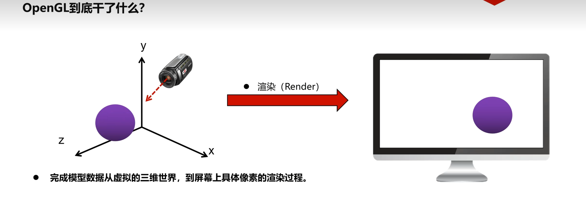

### OpenGL ES

`OpenGL ES`(OpenGL for Embedded Systems)是三维图形应用程序接口`OpenGL`的**子集**，针对手机、PDA和游戏主机等嵌入式设备而设计。该`API`由​​`Khronos Group​​`制定和维护。

### EGL

`EGL`(Embedded-System Graphics Library)是`​​Khronos Group​`制定和维护，能够统一不同平台`OpenGL ES`的初始化以及将`OpenGL ES`和所在平台的`UI`框架用统一的方式对接起来。这样你就可以在不同平台使用相同的`API`去初始化及使用`OpenGL ES`。

### ANGLE

`ANGLE`的目标是让多个操作系统上的用户能够无缝运行`WebGL`及其他基于`OpenGL ES`的内容，其方式是将`OpenGL ES API`调用转换为该平台硬件所支持的某个底层图形`API`。

`ANGLE`提供了`EGL 1.5`规范的实现。

[懒人win包](https://medium.com/@lag945/egl-angle-windows-3d%E5%BB%BA%E7%BD%AE%E9%96%8B%E7%99%BC%E7%B4%80%E9%8C%84-eb447de17504)

### GLFW

`GLFW`是一个开源的、跨平台库，用于在桌面平台上进行`OpenGL`、`OpenGL ES`和`Vulkan`开发。它提供了一个简单的`API`，用于创建窗口、上下文和表面，以及接收输入和事件。

### 标准化设备坐标系

用户使用的显示器的分辨率未知，所有了标准化设备坐标系(Normalized Device Coordinates, NDC)，用[-1, 1]表示顶点的坐标。本质上就是比例。

**NDC坐标系是三维**的，因为它需要保留深度信息(Z轴)。OpenGL中XYZ轴坐标范围都是[-1, 1]。

**OpenGL是右手坐标系**，但是OpenGL对应的**NDC坐标系是左手坐标系**。

观察坐标系​​，是一个​​右手坐标系​​。摄像机朝向​​-Z轴方向​​观看。离相机越近的物体，其Z值越大(例如，-1 > -10)。如果是正数，说明物体在相机的前面。但是经过投影以后，越是靠近1越代表远离相机，越靠近-1越代表靠近相机。所以说**OpenGL是右手坐标系**，**NDC坐标系是左手坐标系**

### 坐标系

#### 笛卡尔坐标系

坐标系分为两种，一种是左手坐标系，一种是右手坐标系。如下图所示：

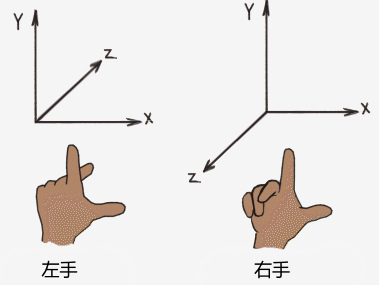

左右手坐标系的核心差异：

**这两种坐标系的唯一区别在于：当你确定了 X 轴和 Y 轴的方向后，Z 轴的方向在哪里。**

**OpenGL是右手坐标系**

#### 齐次坐标

[齐次坐标(homogeneous coordinates)视频1](https://www.bilibili.com/video/BV1vi421Y7nP)

[齐次坐标(homogeneous coordinates)视频2](https://www.bilibili.com/video/BV1b34y1y7nF)

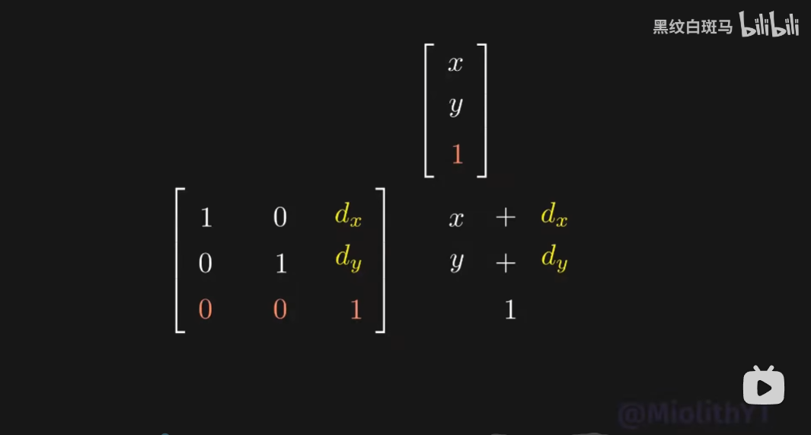

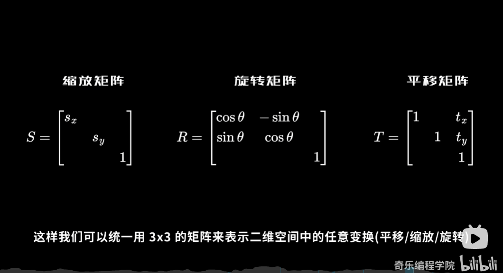

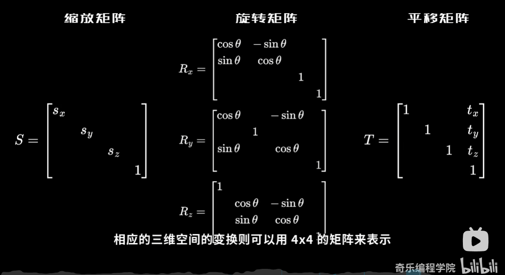

#### 概述

1. 模型变化矩阵(Model Matrix)解决了 "物体放在世界的哪个位置"
2. 视图变化矩阵(View Matrix)解决了 "我们从世界的哪个角度和位置观察它"
3. 投影变化矩阵(Projection Matrix)解决了 "将3D空间中的物体投影到2D屏幕上"

##### 局部坐标系/物体坐标系

局部坐标系(Local Coordinate System)，也叫物体坐标系(Object Coordinate System)，是一个以特定物体自身为参考基准的坐标系统。模型的所有顶点都是在局部空间中，它们相对于你的物体来说都是局部的。坐标系的​​原点​​和​​坐标轴方向​​会随着物体的移动、旋转或缩放而**同步变化**。当物体在世界中移动、旋转或变大时，它的局部坐标系也随之整体平移、旋转和缩放。

我的理解：

**物体坐标系中物体的所有顶点坐标都是相对于物体坐标系，在初始默认状态下，其​​原点(0,0,0)和坐标轴方向(X,Y,Z轴的正方向)与世界坐标系原点(0,0,0)和坐标轴方向(X,Y,Z轴的正方向)完全重合的，经过模型矩阵(平移缩放旋转)以后，物体的所有顶点坐标都是相对于世界坐标系了。**

**模型变化矩阵(Model Matrix)解决了 "物体放在世界的哪个位置"**

##### 世界坐标系

世界坐标系(World Coordinate System)是一个全局的坐标系统，用于描述整个场景中的所有物体和点。

##### 观察坐标系/视觉坐标系

观察坐标系(View Coordinate System)，也叫视觉坐标系(Eye Coordinate System)，其实就是摄像机局部坐标系(Camera Local Coordinate System)。摄像机局部坐标系初始状态下，其​​原点(0,0,0)和坐标轴方向(X,Y,Z轴的正方向)与世界坐标系原点(0,0,0)和坐标轴方向(X,Y,Z轴的正方向)完全重合的，摄像机观察方向是-Z轴方向。经过一系列的位移和旋转变化，也就是摄相机模型变换矩阵，而这个矩阵的逆就是观察变化矩阵，作用是，将物体和点的坐标从世界坐标系(World Coordinate System)转换到摄像机局部坐标系(Camera Local Coordinate System)。

**视图变化矩阵(View Matrix)解决了 "我们从世界的哪个角度和位置观察它"** 

##### 裁剪坐标系

无论是正交投影还是透视投影，我们都将观测空间转换成了一个规范立方体(NDC)，同时将转换矩阵应用到空间中的所有物体中。

之后，我们就可以通过规范立方体对空间进行裁剪，只保留规范立方体内的物体，如下所示。很显然，只有在规范立方体中的部分才是我们可以看见的部分。

**投影变化矩阵(Projection Matrix)解决了 "将3D空间中的物体投影到2D屏幕上"**

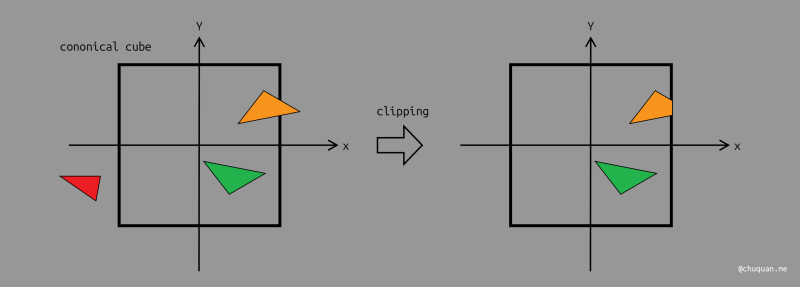

##### 屏幕坐标系

视口(Viewport)本质上就是我们所说的 2D 画布，即屏幕。我们知道屏幕有各种各样的分辨率，宽高比。为了处理这种情况，我们将 2D 画布抽象成一个[-1, 1]^2的规范平面。然后通过视口变换将它映射到真正的视口中。假设真实视口的宽度是 width ，高度是 height，那么视口变换就是将 [-1, 1]^2 的平面转换成 [0, width] X [0, height] 的平面

### 网格(Mesh)

网格(Mesh): 存储一个模型的几何形状数据。

### 摄像机

[什么是视图变换矩阵？什么是摄像机？](https://www.bilibili.com/video/BV162421P7Mt)

在渲染技术中，如果世界坐标系确定以及物体都已经摆放完毕的情况下，需要确定一台摄像机(Camera)来观察场景中的物体。

摄像机参数：

1. 摄像机在世界坐标系中的位置(Eye Position)
2. 摄像机所注视的目标在世界坐标系中的位置(Look At Position)，normalized(EyeVector - LookAtVector)用来定义摄像机局部坐标系的-Z轴方向
3. 摄像机在世界坐标系中穹顶向量(Up Vector)，就是用来定义摄像机局部坐标系的+Y轴的方向，normalized(cross((EyeVector - LookAtVector), UpVector))用来定义摄像机局部坐标系的+X轴方向

我的理解：

**摄像机初始状态下，其​​原点(0,0,0)和坐标轴方向(X,Y,Z轴的正方向)是与世界坐标系原点(0,0,0)和坐标轴方向(X,Y,Z轴的正方向)完全重合的，摄像机观察方向是-Z轴方向。世界坐标系中某个点P的坐标为(0, 0, 10)，摄像机是观察不到P点**

### 视图变换矩阵

视图矩阵(View Matrix)，作用是将物体和点的坐标从世界坐标系(World Coordinate System)转换到摄像机局部坐标系(Camera Local Coordinate System)，这里的摄像机局部坐标系就是观察坐标系(View Coordinate System)。

摄像机的变化，可以拆分为**旋转**和**平移**。

$
M = T \cdot R
$

$
\mathbf{M}^{-1} = (T \cdot R)^{-1} = R^{-1} \cdot T^{-1}
$

$\mathbf{M}^{-1}$ 叫做视图变换矩阵(View Matrix)

**​​视图矩阵是摄相机模型变换矩阵的逆**，如果理解？

摄像机不做任何旋转和平移，保证了摄像机局部坐标系和世界坐标系原点和各个轴方向完全相同，摄像机观察方向是-Z轴方向，世界坐标系中的所有物体和点做相反的操作，这和移动摄像机是一个道理。所以世界坐标系中的所有物体和点，都可以通过视图变换矩阵，转换到摄像机局部坐标系中。

### 投影

投影(Projection): 三维场景中的物体们，想让我们看到，就必须投影到一块幕布上，显示出来。

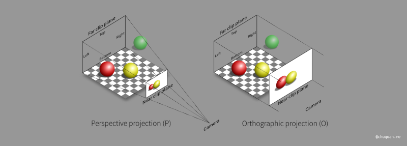

无论是正交投影还是透视投影，我们都将观测空间转换成了一个规范立方体(NDC)，同时将转换矩阵应用到空间中的所有物体中。

之后，我们就可以通过规范立方体对空间进行裁剪，只保留规范立方体内的物体，如下所示。很显然，只有在规范立方体中的部分才是我们可以看见的部分。

投影关键字：

1. 近平面near: 观测空间近平面和摄像机的**距离**，正值
2. 远平面far: 观测空间远平面和摄像机的**距离**，正值
3. 近平面left: 观测空间近平面最左边的**X坐标**，可正可负
4. 近平面right: 观测空间近平面最右边的**X坐标**，可正可负
5. 近平面top: 观测空间近平面最上面的**Y坐标**，可正可负
6. 近平面bottom: 观测空间近平面最下面的**Y坐标**，可正可负

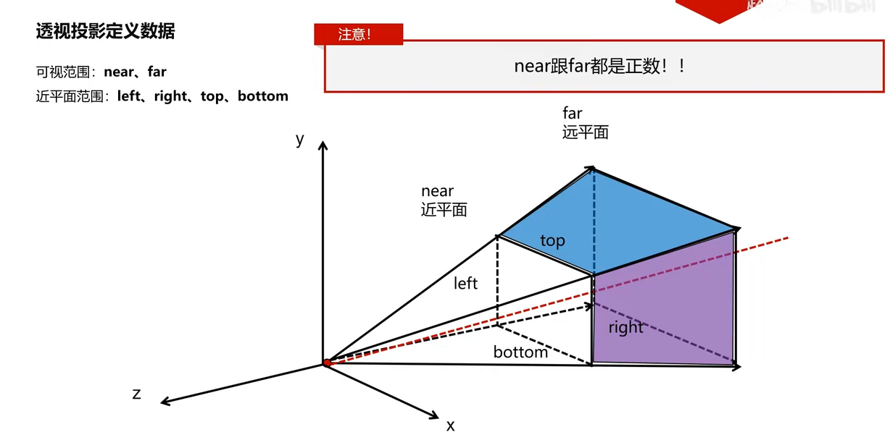

#### 正交投影

正交投影(Orthographic Projection): 

#### 正交投影矩阵

正交投影矩阵，将**摄像机局部坐标系(观察坐标系)** 中定义一个长方体**观测空间(View Volumne)**，并将该区域进行平移缩放成**2x2x2 NDC标准系下的立方体**。最终将这个立方体的近平面(Near Plane)经过**裁剪**和**视口变化**绘制到了显示器上。

正交投影矩阵是如何得到？

在将观测空间转换成规范立方体的过程中，我们计算得到了正交投影矩阵。根据相对不变性原理，我们要使用该矩阵对空间中所有物体进行同样的变换。

盒子内的顶点，经过正交投影矩阵变换，会在 2x2x2 NDC标准系下的立方体盒子中。

盒子外的顶点，经过正交投影矩阵变换，不会在 2x2x2 NDC标准系下的立方体盒子中。

为什么要平移？

立方体盒子的中心和观察坐标系的原点一般来说都没有重合，如果不经过平移，仅仅是缩放，立方体中的所有物体和点都会向着观察坐标系的原点进行缩放，最终没法把立方体缩放到[-1, 1]的范围。所以需要平移，将立方体盒子的中心平移到观察坐标系的原点，然后缩放。

正交投影矩阵 = 缩放矩阵 * 平移矩阵

$$
\mathbf{M}_{\text{ortho}} = \mathbf{S}_{\text{ortho}} \mathbf{T}_{\text{ortho}}
=
\begin{pmatrix}
\frac{2}{r-l} & 0 & 0 & 0 \\
0 & \frac{2}{t-b} & 0 & 0 \\
0 & 0 & \frac{2}{f-n} & 0 \\
0 & 0 & 0 & 1
\end{pmatrix}
\cdot
\begin{pmatrix}
1 & 0 & 0 & -\frac{r+l}{2} \\
0 & 1 & 0 & -\frac{t+b}{2} \\
0 & 0 & 1 & -\frac{n+f}{2} \\
0 & 0 & 0 & 1
\end{pmatrix}
=
\begin{pmatrix}
\frac{2}{r-l} & 0 & 0 & -\frac{r+l}{r-l} \\
0 & \frac{2}{t-b} & 0 & -\frac{t+b}{t-b} \\
0 & 0 & \frac{2}{n-f} & -\frac{n+f}{f-n} \\
0 & 0 & 0 & 1
\end{pmatrix}
$$

#### 透视投影

透视投影(Perspective Projection): 

#### 透视投影矩阵

透视投影借鉴了正交投影的做法，只不过相对而言，它多了一步压缩过程，也就是说，透视投影 = 压缩 + 正交投影。即：

1. 将​​视锥体(Frustum)​​"压缩"成一个​​长方体(Cuboid）)​​
2. 将这个长方体经过平移缩放到​​归一化设备坐标(NDC)的标准立方体中

什么是压缩？

**要把视锥体转化成长方体**，其实就是把远平面(x,y,z)转成(x',y',z)，利用的就是相似三角平行原理。从下面图中推导出计算公式，可以看出压缩之后的y'坐标与距离(-z)成反比关系。x'也是一样的道理。这也从直观上解释了为什么透视投影中，距离越远，物体看起来越小。

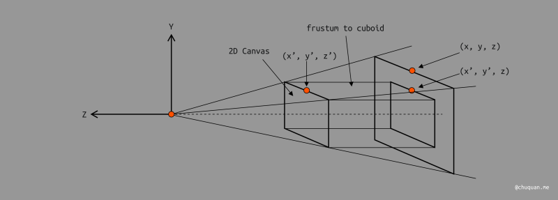

透视投影矩阵，将**摄像机局部坐标系(观察坐标系)** 中定义一个视锥体**观测空间(View Volumne)**，并将该区域进行**压缩**平移缩放成**2x2x2 NDC标准系下的立方体**。最终将这个立方体的近平面(Near Plane)经过**裁剪**和**视口变化**绘制到了显示器上。

透视投影矩阵是如何得到？

在将观测空间转换成规范立方体的过程中，我们计算得到了正交投影矩阵。根据相对不变性原理，我们要使用该矩阵对空间中所有物体进行同样的变换。

[透视投影矩阵的推导](https://www.bilibili.com/video/BV11m411k7ga)

[探秘三维透视投影 - 齐次坐标的妙用](https://www.bilibili.com/video/BV1LS4y1b7xZ)

[计算机图形学基础（3）——观测变换](http://chuquan.me/2024/03/23/foundation-of-computer-graphic-03/#%E5%B1%8F%E5%B9%95%E6%98%A0%E5%B0%84)

**下方计算出的矩阵，本质是压缩矩阵，就是将视锥体压缩成长方体。再将正交投影矩阵作用到其上以后的矩阵就是透视投影矩阵。**

**下面"-"号的原因，n而言是距离，抵消掉z的负数**

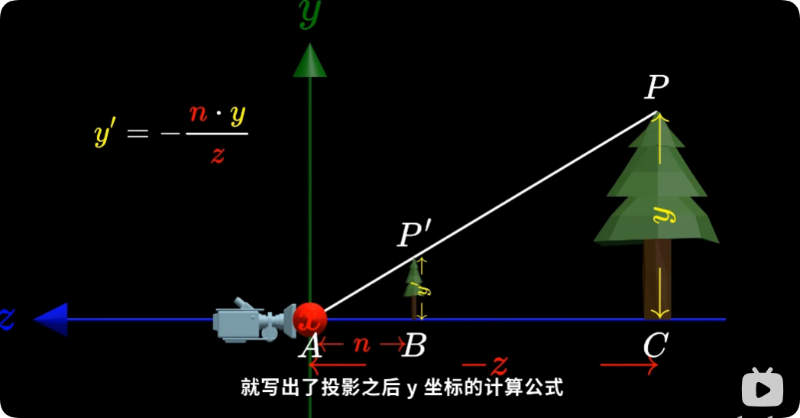

**我们知道矩阵做的是对应元素相乘再相加，而这里需要用到除法，所以使用齐次矩阵**

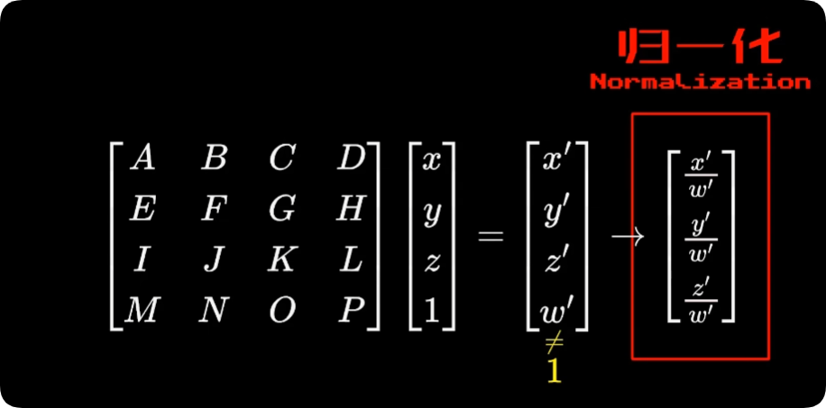

**将矩阵计算之后的坐标表示成之前得出的投影公式**

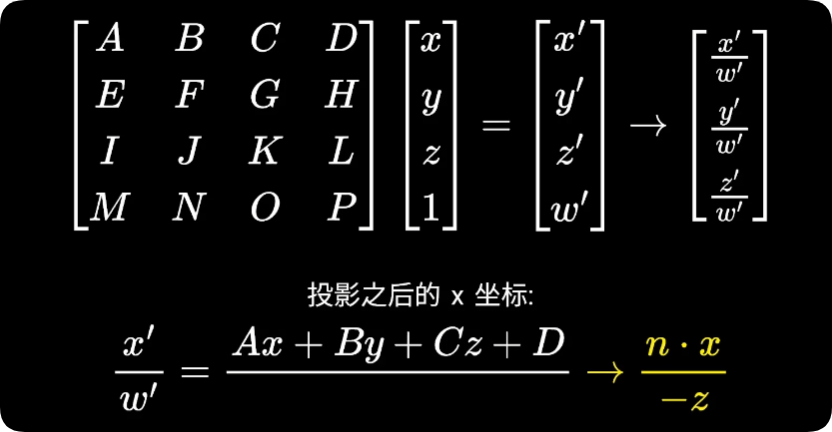

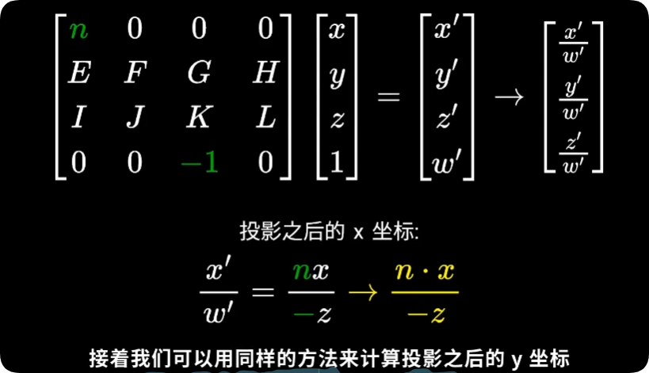

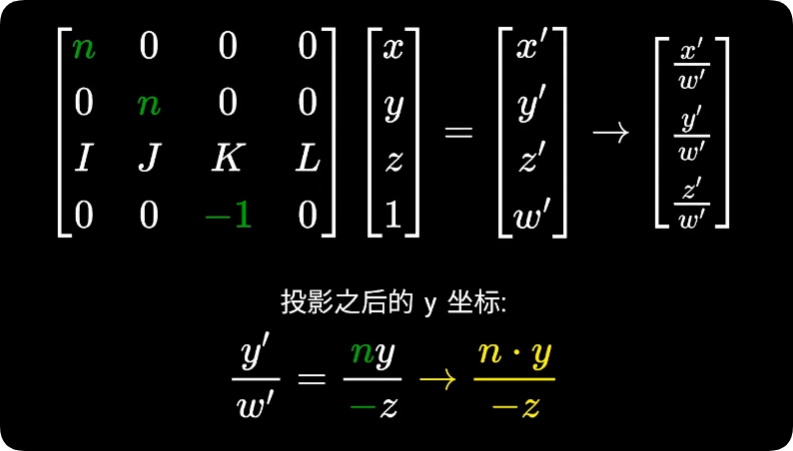

最后，我们来求解第三行的值。我们基于两个以下两个依据：

1. 近平面上的点的 Z 坐标不会变化，即 2D 画布上的值不变。
2. 远平面上的点 Z 坐标不会变化。

$
\frac{Z'}{ω​'} = \frac{0X + 0Y + KZ + L}{-Z}
$

近平面:

$
\frac{K(-n) + L}{-(-n)} = -n
$

远平面:

$
\frac{K(-f) + L}{-(-f)} = -f
$

求解上述方程，得到：

$
K = n + f
$

$
L = nf
$

最终得到"压缩矩阵"，目的是把视锥体观察区域转成长方体观察区域:

$
\mathbf{M}_{\text{persp->ortho}} =
\begin{pmatrix}
n & 0 & 0 & 0 \\
0 & n & 0 & 0 \\
0 & 0 & n+f & nf \\
0 & 0 & -1 & 0
\end{pmatrix}
$

让我们计算出最终的透视投影矩阵：

$$
\mathbf{M}_{\text{ortho}} = \mathbf{S}_{\text{ortho}} \mathbf{T}_{\text{ortho}}
=
\begin{pmatrix}
\frac{2}{r-l} & 0 & 0 & 0 \\
0 & \frac{2}{t-b} & 0 & 0 \\
0 & 0 & \frac{2}{f-n} & 0 \\
0 & 0 & 0 & 1
\end{pmatrix}
\cdot
\begin{pmatrix}
1 & 0 & 0 & -\frac{r+l}{2} \\
0 & 1 & 0 & -\frac{t+b}{2} \\
0 & 0 & 1 & -\frac{n+f}{2} \\
0 & 0 & 0 & 1
\end{pmatrix}
=
\begin{pmatrix}
\frac{2}{r-l} & 0 & 0 & -\frac{r+l}{r-l} \\
0 & \frac{2}{t-b} & 0 & -\frac{t+b}{t-b} \\
0 & 0 & \frac{2}{n-f} & -\frac{n+f}{f-n} \\
0 & 0 & 0 & 1
\end{pmatrix}
$$

$$
\mathbf{M}_{\text{persp}} = \mathbf{M}_{\text{ortho}} \mathbf{M}_{\text{persp->ortho}}
=
\begin{pmatrix}
\frac{2}{r-l} & 0 & 0 & -\frac{r+l}{r-l} \\
0 & \frac{2}{t-b} & 0 & -\frac{t+b}{t-b} \\
0 & 0 & \frac{2}{n-f} & -\frac{n+f}{f-n} \\
0 & 0 & 0 & 1
\end{pmatrix}
\cdot
\begin{pmatrix}
n & 0 & 0 & 0 \\
0 & n & 0 & 0 \\
0 & 0 & n+f & nf \\
0 & 0 & -1 & 0
\end{pmatrix}
= 
\begin{pmatrix}
\frac{2n}{r-l} & 0 & \frac{r+l}{r-l} & 0 \\
0 & \frac{2n}{t-b} & \frac{t+b}{t-b} & 0 \\
0 & 0 & -\frac{f+n}{f-n} & -\frac{2fn}{f-n} \\
0 & 0 & -1 & 0
\end{pmatrix}
$$