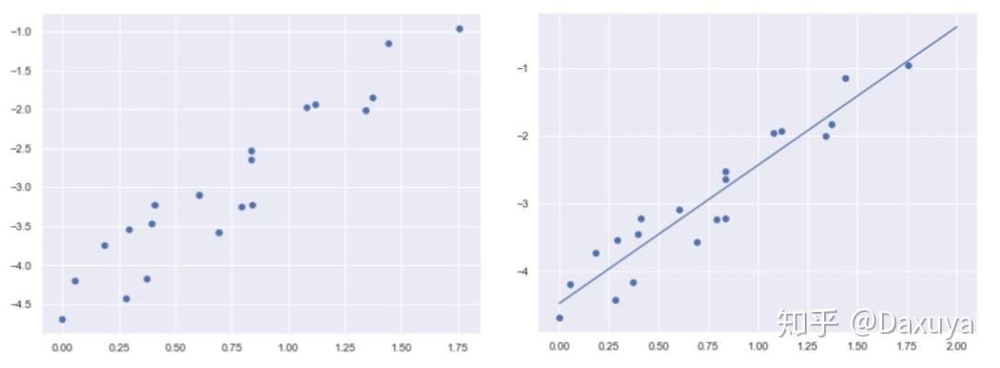

## 回归

回归的全称是，“Regression towards the mean”。直接翻译过来就是向着中间值回归。直白点说，就是在图像上给你一堆点，你来找一条线，然后让这条线尽可能的在所有点的中间。这个找直线的过程，就是在做回归了。如下图所示。

进一步思考：为什么非要找这么一条尽可能的在所有点的中间的直线？

我们面对的是一堆散乱的点，看不出具体的相关关系，而线能够体现趋势。所以，我们就是想办法来找一条尽可能在所有点的中间的直线，代表一个数据的整体趋势，让数据的整体关系更加清晰可见，这样就方便我们预判未来的情况。

总结：

回归的目的：通过找到的线来**预测未来**。

回归之所以能预测，是因为它的底层逻辑是：通过历史数据，摸透了“套路”，然后通过这个套路来预测未来的结果。

注意：在回归中，我们要预测的target是连续型数据(降雨量,房价,长度,密度这些)