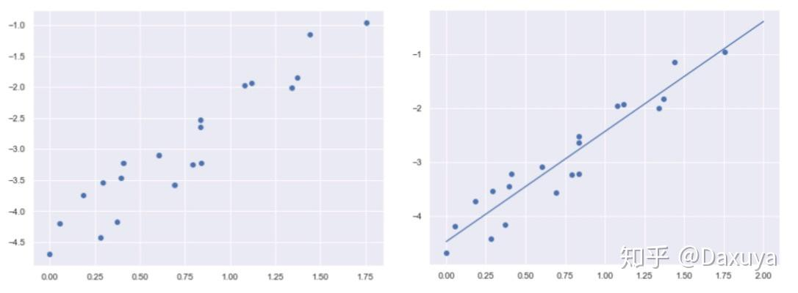

- [回归](#回归)
- [皮尔逊相关系数](#皮尔逊相关系数)
- [协方差](#协方差)

## 回归

回归的全称是，“Regression towards the mean”。直接翻译过来就是向着中间值回归。直白点说，就是在图像上给你一堆点，你来找一条线，然后让这条线尽可能的在所有点的中间。这个找直线的过程，就是在做回归了。如下图所示。

进一步思考：为什么非要找这么一条尽可能的在所有点的中间的直线？

我们面对的是一堆散乱的点，看不出具体的相关关系，而线能够体现趋势。所以，我们就是想办法来找一条尽可能在所有点的中间的直线，代表一个数据的整体趋势，让数据的整体关系更加清晰可见，这样就方便我们预判未来的情况。

总结：

回归的目的：通过找到的线来**预测未来**。

回归之所以能预测，是因为它的底层逻辑是：通过历史数据，摸透了“套路”，然后通过这个套路来预测未来的结果。

注意：在回归中，我们要预测的target是连续型数据(降雨量,房价,长度,密度这些)

## 皮尔逊相关系数

皮尔逊相关系数（Pearson Correlation Coefficient，通常用字母 $r$ 表示）是统计学中用来衡量两个变量之间“线性关系”强弱和方向的一个指标。简单来说，它回答了一个问题：当变量 A 发生变化时，变量 B 是否也倾向于按照“一条直线”的方向跟着变化？

1. 它的取值范围和含义，皮尔逊相关系数的取值范围恒在 -1 到 +1 之间（包括 -1 和 +1）。根据 $r$ 的取值，我们可以判断变量之间的关系：
    - $r > 0$（正相关）： 两个变量同向变化。即 A 越高，B 往往也越高。
        - 例如： 身高和体重（通常越长越高，体重也越重）。
    - $r < 0$（负相关）： 两个变量反向变化。即 A 越高，B 往往越低。
        - 例如： 汽车的行驶速度和到达目的地所需的时间（开得越快，用时越少）。
    - $r = 0$（无线性相关）： 两个变量之间没有明显的直线关系（但不代表没有其他非线性关系，比如二次函数关系）。

2. 相关程度的大小判断，数值的绝对值越接近 1，说明线性关系越紧密、越显著；越接近 0，说明线性关系越弱：

| 相关系数数值范围（\|r\|） | 关联强度 |
| :--- | :--- |
| 0.8 – 1.0 | 极强相关 |
| 0.6 – 0.8 | 强相关 |
| 0.4 – 0.6 | 中等程度相关 |
| 0.2 – 0.4 | 弱相关 |
| 0.0 – 0.2 | 极弱相关或不相关 |

3. 使用皮尔逊相关系数的重要前提（注意事项），在使用或解释皮尔逊相关系数时，有几个非常关键的陷阱需要注意：
    - 只能捕捉“线性关系”：
        - 如果两个变量的关系呈曲线形（例如抛物线 $Y = X^2$），虽然它们有强烈的对应关系，但计算出来的皮尔逊相关系数可能接近甚至等于 0。
    - 相关性不等于因果关系：
        - 即使两个变量的相关系数很接近 1，也不能证明是 A 导致了 B 的发生。
            - 经典例子： 冰淇淋的销量和溺水人数的相关系数很高（正相关），但并不是吃冰淇淋导致了溺水，而是“天气热”这个第三因素同时导致了这两件事的增加。
    - 容易受异常值（极值）影响：由于公式计算涉及均值和方差，数据中的一个极端异常点可能会大幅拉高或拉低相关系数。

4. 数学公式（供参考），对于两个变量 $X$ 和 $Y$，样本皮尔逊相关系数 $r$ 的计算公式为 $X$ 和 $Y$ 的协方差除以各自标准差的乘积：

$$r = \frac{\sum (X_i - \bar{X})(Y_i - \bar{Y})}{\sqrt{\sum (X_i - \bar{X})^2} \sqrt{\sum (Y_i - \bar{Y})^2}}$$

（其中 $\bar{X}$ 和 $\bar{Y}$ 分别为样本的平均值）

## 协方差

协方差（Covariance）是统计学中用来衡量两个变量总体误差/协同变动趋势的指标。

简单来说，皮尔逊相关系数就是“标准化之后”的协方差。

我们可以从以下几个层面来理解协方差：

1. 通俗理解：协方差在衡量什么？如果我们有两个变量 $X$ 和 $Y$：
    - 如果 $X$ 变大时，$Y$ 也倾向于变大（两者同向变化）：协方差就是 正数（$>0$）。
    - 如果 $X$ 变大时，$Y$ 倾向于变小（两者反向变化）：协方差就是 负数（$<0$）。
    - 如果 $X$ 的变化和 $Y$ 的变化毫无规律、互不影响：协方差就接近 零（$=0$）。
    - 形象对比：方差 vs 
    
| 概念 | 衡量对象 | 含义 |
| :--- | :--- | :--- |
| **方差（Variance）** | 单个变量 X | 衡量变量 X 偏离自身平均值的波动程度 |
| **协方差（Covariance）** | 两个变量 X 和 Y | 衡量二者偏离各自平均值时是否同向波动 |
    
2. 协方差的计算公式与几何直觉，样本协方差的计算公式为：$$\text{Cov}(X, Y) = \frac{\sum (X_i - \bar{X})(Y_i - \bar{Y})}{N - 1}$$其中：
    - $X_i - \bar{X}$ 表示第 $i$ 个数据点偏离 $X$ 均值的程度。
    - $Y_i - \bar{Y}$ 表示第 $i$ 个数据点偏离 $Y$ 均值的程度。
    - 直觉理解乘积项：
        - 我们可以把数据点在平面直角坐标系中画出来，以均值 $(\bar{X}, \bar{Y})$ 作为新坐标原点：
            - 第一象限（$X > \bar{X}$ 且 $Y > \bar{Y}$）： $(X_i - \bar{X})$ 为正，$(Y_i - \bar{Y})$ 为正，乘积为正。
            - 第三象限（$X < \bar{X}$ 且 $Y < \bar{Y}$）： $(X_i - \bar{X})$ 为负，$(Y_i - \bar{Y})$ 为负，乘积依然为正！
            - 第二、四象限： 一正一负，乘积为负。
                - 如果大多数数据点落在 第一、三象限（同增同减），累加起来的分子就是大正数，协方差为正。
                - 如果大多数数据点落在 第二、四象限（一增一减），累加起来分子就是大负数，协方差为负。

3. 协方差的致命缺点：
    - 量纲（单位）依赖，既然协方差已经能看出来是同向还是反向了，为什么我们还需要“皮尔逊相关系数”呢？
    - 因为协方差的大小受变量单位（量纲）的影响极大，无法用来比较不同变量间的相关强度。
    - 举个例子，假设我们要衡量“身高”和“体重”的关系：
        - 情形 A： 身高单位用 米（m），体重单位用 千克（kg）。算出来的协方差可能是 $0.05$。
        - 情形 B： 身高单位改用 毫米（mm），体重单位用 克（g）。数值扩大了 $1000 \times 1000$ 倍，算出来的协方差会暴涨到 $50,000$！
    - 明明是同一群人的身高体重关系，仅仅改了单位，协方差数值就从 $0.05$ 变成了 $50,000$。你根本无法根据“协方差等于 50000”来断定它们的相关程度比“协方差等于 0.05”更强。

4. 协方差与皮尔逊相关系数的关系，为了消除单位（量纲）的影响，统计学家做了一步“标准化（Normalization）”，把协方差除以两个变量各自的标准差（用来抵消单位的影响）：$$\text{皮尔逊相关系数 } r = \frac{\text{Cov}(X, Y)}{\sigma_X \cdot \sigma_Y}$$
    - 协方差（Covariance）： 有单位，只能告诉你“是同向变（$>0$）还是反向变（$<0$）”，但不能告诉你“关联有多紧密”。
    - 皮尔逊相关系数（Pearson Correlation）： 消除了单位（无量纲），把数值死死固定在 [-1, 1] 之间，既能看方向，又能看关联强弱。
    
5. 总结
    - 协方差是用来衡量两个变量是否“同进退”的原始指标。
    - 协方差 $> 0$ 表示正相关，$< 0$ 表示负相关，$= 0$ 表示无线性关联。
    - 协方差的数值受单位影响太大，因此在机器学习和数据分析中，我们通常把协方差除以各自的标准差，转化成 [-1, 1] 之间的皮尔逊相关系数来使用。